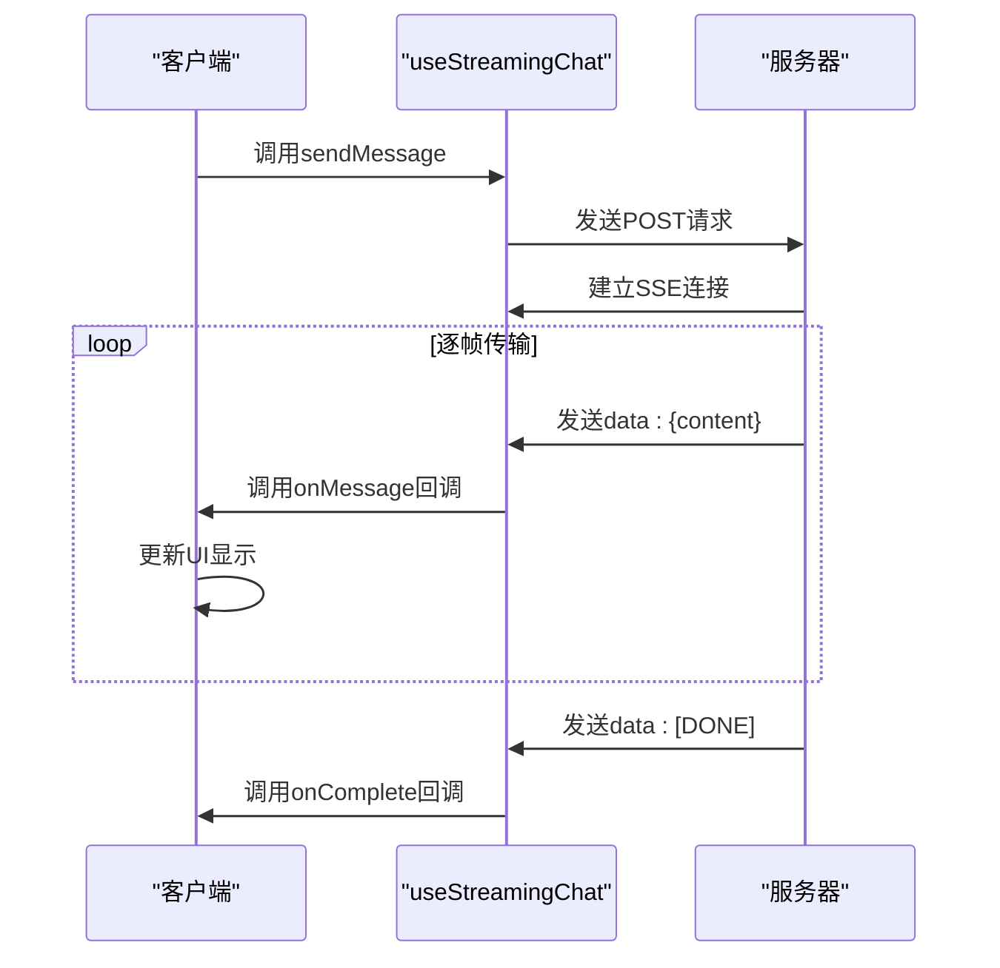

# API集成

<cite>
**本文档引用的文件**
- [apiSlice.ts](file://src/store/slices/apiSlice.ts)
- [useStreamingChat.ts](file://src/hooks/useStreamingChat.ts)
- [MainContent.tsx](file://src/components/layout/MainContent.tsx)
</cite>

## 目录
1. [流式聊天接口](#流式聊天接口)
2. [RESTful端点说明](#restful端点说明)
3. [流式响应处理](#流式响应处理)
4. [错误处理策略](#错误处理策略)
5. [调试与优化](#调试与优化)

## 流式聊天接口

`/api/chat/stream` 接口采用SSE（Server-Sent Events）协议实现流式聊天功能，允许服务器向客户端持续推送数据片段，实现类似打字机效果的实时响应。

### 请求头格式
- **Content-Type**: `application/json`
- **Accept**: `text/event-stream`
- **Cache-Control**: `no-cache`

### 请求体结构
```json
{
  "content": "用户输入内容",
  "assistantId": "助手ID（可选）",
  "topicId": "话题ID（可选）",
  "stream": true
}
```

### 消息编码方式
服务器以SSE格式发送数据，每条消息遵循以下格式：
```
data: {"choices":[{"delta":{"content":"新内容片段"}}]}
```
当流式传输完成时，服务器发送结束标志：
```
data: [DONE]
```

### 客户端解析逻辑
客户端通过`fetch` API建立连接，使用`ReadableStream`的`getReader()`方法逐块读取响应数据。通过`TextDecoder`解码二进制流，按换行符分割数据行，提取以`data: `开头的有效数据，解析JSON内容并累积到消息内容中。

**Section sources**
- [useStreamingChat.ts](file://src/hooks/useStreamingChat.ts#L0-L239)

## RESTful端点说明

基于`apiSlice.ts`中的RTK Query定义，系统提供以下RESTful端点：

### 助手管理接口
| 端点 | HTTP方法 | 请求参数 | 响应结构 |
|------|---------|---------|---------|
| `/assistants` | GET | 无 | `ApiResponse<Assistant[]>` |
| `/assistants/{id}` | GET | id: string | `ApiResponse<Assistant>` |
| `/assistants` | POST | Assistant对象 | `ApiResponse<Assistant>` |
| `/assistants/{id}` | PUT | id: string, Assistant对象 | `ApiResponse<Assistant>` |
| `/assistants/{id}` | DELETE | id: string | `ApiResponse<void>` |

### 话题管理接口
| 端点 | HTTP方法 | 请求参数 | 响应结构 |
|------|---------|---------|---------|
| `/topics` | GET | assistantId?: string, page?: number, pageSize?: number | `ApiResponse<Topic[]>` |
| `/topics/{id}` | GET | id: string | `ApiResponse<Topic>` |
| `/topics` | POST | title: string, assistantId: string | `ApiResponse<Topic>` |
| `/topics/{id}` | PUT | id: string, Topic对象 | `ApiResponse<Topic>` |
| `/topics/{id}` | DELETE | id: string | `ApiResponse<void>` |

### 知识库管理接口
| 端点 | HTTP方法 | 请求参数 | 响应结构 |
|------|---------|---------|---------|
| `/knowledge-bases` | GET | 无 | `ApiResponse<KnowledgeBase[]>` |
| `/knowledge-bases/{id}` | GET | id: string | `ApiResponse<KnowledgeBase>` |
| `/knowledge-bases` | POST | KnowledgeBase对象 | `ApiResponse<KnowledgeBase>` |
| `/knowledge-bases/{id}` | PUT | id: string, KnowledgeBase对象 | `ApiResponse<KnowledgeBase>` |
| `/knowledge-bases/{id}` | DELETE | id: string | `ApiResponse<void>` |

**Section sources**
- [apiSlice.ts](file://src/store/slices/apiSlice.ts#L0-L304)

## 流式响应处理

`useStreamingChat` Hook负责处理流式响应的逐帧更新，其核心处理流程如下：

1. 创建`AbortController`用于控制请求生命周期
2. 通过`fetch`发起POST请求到`/api/chat/stream`
3. 获取响应体的`reader`并使用`TextDecoder`解码数据流
4. 实时解析SSE数据，提取内容片段并累积
5. 通过`onMessage`回调函数逐帧更新UI
6. 遇到`[DONE]`标志或连接关闭时完成流式传输

在组件中，通过`handleStreamMessage`回调处理流式消息更新，检查消息ID是否存在，若存在则更新现有消息，否则添加新消息到消息列表。



**Diagram sources**
- [useStreamingChat.ts](file://src/hooks/useStreamingChat.ts#L0-L239)
- [MainContent.tsx](file://src/components/layout/MainContent.tsx#L370-L418)

**Section sources**
- [useStreamingChat.ts](file://src/hooks/useStreamingChat.ts#L0-L239)
- [MainContent.tsx](file://src/components/layout/MainContent.tsx#L370-L418)

## 错误处理策略

系统采用统一的错误处理策略，涵盖以下常见错误码：

### 认证相关错误
- **401 未授权**: 用户认证令牌无效或过期，客户端应重定向到登录页面
- **403 禁止访问**: 用户权限不足，应显示相应提示

### 服务相关错误
- **503 服务不可用**: 后端服务暂时不可用，客户端应显示维护提示并提供重试机制
- **500 服务器内部错误**: 服务器遇到意外情况，应记录错误日志并提示用户稍后重试

### 客户端处理
在`useStreamingChat`中，通过`onError`回调处理错误，设置错误状态并通知用户。所有API请求通过RTK Query的`queryFn`机制统一处理HTTP错误，将错误信息封装在`ApiResponse`的`error`字段中返回。

**Section sources**
- [useStreamingChat.ts](file://src/hooks/useStreamingChat.ts#L0-L239)
- [apiSlice.ts](file://src/store/slices/apiSlice.ts#L0-L304)

## 调试与优化

### 调试建议
1. 使用浏览器开发者工具的Network面板监控SSE连接
2. 检查请求头中的`Content-Type`和`Accept`是否正确
3. 验证SSE数据格式是否符合`data: `前缀规范
4. 监控`onMessage`和`onError`回调的触发情况

### 性能优化技巧
- **请求节流**: 对频繁的用户输入进行节流处理，避免过度请求
- **连接复用**: 保持SSE连接持久化，避免频繁建立新连接
- **错误重试**: 对临时性错误实现指数退避重试机制
- **资源清理**: 使用`AbortController`及时中断不再需要的请求

### 安全性考虑
- **Token传递**: 在`prepareHeaders`中添加认证token，确保所有请求都经过身份验证
- **输入验证**: 对用户输入进行严格验证，防止注入攻击
- **CORS配置**: 正确配置跨域资源共享策略，限制可访问的源
- **敏感信息保护**: 避免在客户端存储敏感信息，使用安全的传输协议

**Section sources**
- [apiSlice.ts](file://src/store/slices/apiSlice.ts#L0-L304)
- [useStreamingChat.ts](file://src/hooks/useStreamingChat.ts#L0-L239)