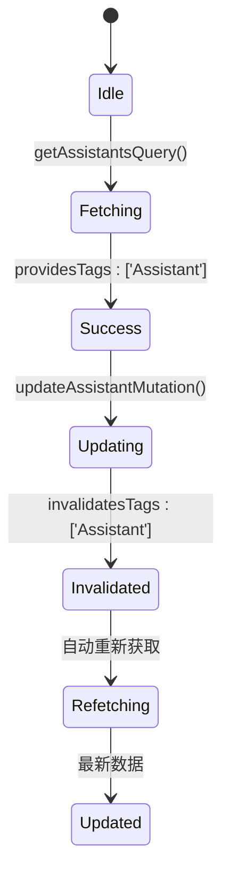
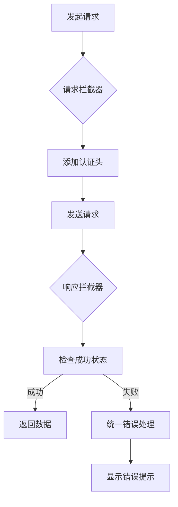

# RESTful管理APIs

<cite>
**本文档引用文件**  
- [apiSlice.ts](file://src/store/slices/apiSlice.ts)
- [index.ts](file://src/types/index.ts)
- [KnowledgeBase.tsx](file://src/components/pages/KnowledgeBase.tsx)
- [uiSlice.ts](file://src/store/slices/uiSlice.ts)
- [chatSlice.ts](file://src/store/slices/chatSlice.ts)
- [assistantSlice.ts](file://src/store/slices/assistantSlice.ts)
- [index.ts](file://src/store/index.ts)
</cite>

## 目录
1. [简介](#简介)
2. [核心端点概述](#核心端点概述)
3. [助手资源管理](#助手资源管理)
4. [话题资源管理](#话题资源管理)
5. [知识库资源管理](#知识库资源管理)
6. [RTK Query缓存与状态管理](#rtk-query缓存与状态管理)
7. [身份验证与权限控制](#身份验证与权限控制)
8. [错误处理与语义化响应](#错误处理与语义化响应)
9. [前端统一拦截器设计](#前端统一拦截器设计)
10. [实际调用示例](#实际调用示例)

## 简介
本文档详细描述了基于RTK Query构建的RESTful管理接口，涵盖`/api/assistants`、`/api/topics`、`/api/knowledge-bases`三个核心端点。文档基于`apiSlice.ts`中定义的服务，全面说明了各资源的CRUD操作、请求响应结构、状态映射关系及前端集成方案。

**Section sources**
- [apiSlice.ts](file://src/store/slices/apiSlice.ts#L0-L304)

## 核心端点概述
系统提供三个主要管理端点，分别用于管理助手、话题和知识库资源。所有API均通过RTK Query封装，自动处理缓存、错误和状态更新。

```mermaid
graph TB
A[前端组件] --> B[RTK Query Hooks]
B --> C{API Endpoint}
C --> D[/api/assistants]
C --> E[/api/topics]
C --> F[/api/knowledge-bases]
D --> G[助手资源]
E --> H[话题资源]
F --> I[知识库资源]
```

**Diagram sources**
- [apiSlice.ts](file://src/store/slices/apiSlice.ts#L87-L227)

**Section sources**
- [apiSlice.ts](file://src/store/slices/apiSlice.ts#L87-L227)

## 助手资源管理

### HTTP方法与端点
| 方法 | 端点 | 描述 |
|------|------|------|
| GET | `/api/assistants` | 获取所有助手列表 |
| GET | `/api/assistants/{id}` | 获取指定助手详情 |
| POST | `/api/assistants` | 创建新助手 |
| PUT | `/api/assistants/{id}` | 更新助手配置 |
| DELETE | `/api/assistants/{id}` | 删除助手 |

### 请求体结构
```json
{
  "name": "助手名称",
  "description": "助手描述",
  "avatar": "头像URL",
  "model": "模型标识",
  "prompt": "系统提示词",
  "isDefault": false
}
```

### 响应格式
```json
{
  "success": true,
  "data": {
    "id": "assistant-123",
    "name": "写作助手",
    "description": "专业写作辅助",
    "model": "gpt-4",
    "prompt": "你是一位专业写作助手...",
    "isDefault": false,
    "createdAt": "2024-01-01T00:00:00Z",
    "updatedAt": "2024-01-01T00:00:00Z"
  }
}
```

**Section sources**
- [apiSlice.ts](file://src/store/slices/apiSlice.ts#L87-L123)
- [index.ts](file://src/types/index.ts#L13-L23)

## 话题资源管理

### HTTP方法与端点
| 方法 | 端点 | 描述 |
|------|------|------|
| GET | `/api/topics` | 获取话题列表（支持分页） |
| GET | `/api/topics/{id}` | 获取指定话题详情 |
| POST | `/api/topics` | 创建新话题 |
| PUT | `/api/topics/{id}` | 更新话题信息 |
| DELETE | `/api/topics/{id}` | 删除话题 |

### URL参数
- `assistantId`：过滤特定助手的话题
- `page`：页码（默认1）
- `pageSize`：每页数量（默认20）

### 请求体结构
```json
{
  "title": "话题标题",
  "assistantId": "assistant-123"
}
```

### 响应格式
```json
{
  "success": true,
  "data": {
    "id": "topic-456",
    "title": "写作技巧讨论",
    "assistantId": "assistant-123",
    "messageCount": 5,
    "lastMessage": "关于写作框架的建议",
    "createdAt": "2024-01-01T00:00:00Z",
    "updatedAt": "2024-01-01T00:00:00Z"
  }
}
```

**Section sources**
- [apiSlice.ts](file://src/store/slices/apiSlice.ts#L125-L159)
- [index.ts](file://src/types/index.ts#L25-L33)

## 知识库资源管理

### HTTP方法与端点
| 方法 | 端点 | 描述 |
|------|------|------|
| GET | `/api/knowledge-bases` | 获取所有知识库 |
| GET | `/api/knowledge-bases/{id}` | 获取指定知识库详情 |
| POST | `/api/knowledge-bases` | 创建新知识库 |
| PUT | `/api/knowledge-bases/{id}` | 更新知识库信息 |
| DELETE | `/api/knowledge-bases/{id}` | 删除知识库 |

### 文件上传
支持通过`/api/knowledge-bases/{kbId}/documents`端点上传文件，使用`multipart/form-data`格式。

### 请求体结构
```json
{
  "name": "知识库名称",
  "description": "知识库描述"
}
```

### 响应格式
```json
{
  "success": true,
  "data": {
    "id": "kb-789",
    "name": "写作素材库",
    "description": "收集的写作参考资料",
    "documents": [
      {
        "id": "doc-1",
        "name": "写作指南.docx",
        "type": "document",
        "size": 10240,
        "uploadedAt": "2024-01-01T00:00:00Z"
      }
    ],
    "createdAt": "2024-01-01T00:00:00Z",
    "updatedAt": "2024-01-01T00:00:00Z"
  }
}
```

**Section sources**
- [apiSlice.ts](file://src/store/slices/apiSlice.ts#L196-L227)
- [index.ts](file://src/types/index.ts#L55-L62)
- [KnowledgeBase.tsx](file://src/components/pages/KnowledgeBase.tsx#L355-L676)

## RTK Query缓存与状态管理

### 缓存标签机制
RTK Query使用`tagTypes`实现智能缓存管理：



### 自动重新获取策略
- `providesTags`：查询操作标记缓存
- `invalidatesTags`：变更操作使缓存失效
- 系统自动触发相关查询的重新获取

### Redux状态映射
```mermaid
erDiagram
API::api ||--o{ ASSISTANT : "助手"
API::api ||--o{ TOPIC : "话题"
API::api ||--o{ KNOWLEDGEBASE : "知识库"
ASSISTANT {
string id PK
string name
string description
string model
string prompt
boolean isDefault
datetime createdAt
datetime updatedAt
}
TOPIC {
string id PK
string title
string assistantId FK
number messageCount
string lastMessage
datetime createdAt
datetime updatedAt
}
KNOWLEDGEBASE {
string id PK
string name
string description
datetime createdAt
datetime updatedAt
}
```

**Diagram sources**
- [apiSlice.ts](file://src/store/slices/apiSlice.ts#L87-L227)
- [index.ts](file://src/store/index.ts#L0-L26)

**Section sources**
- [apiSlice.ts](file://src/store/slices/apiSlice.ts#L87-L227)
- [index.ts](file://src/store/index.ts#L0-L26)

## 身份验证与权限控制
系统通过请求头进行身份验证，所有API请求需包含认证信息：

```typescript
const baseQuery = fetchBaseQuery({
  baseUrl: '/api',
  prepareHeaders: (headers, { getState }) => {
    headers.set('Content-Type', 'application/json');
    // 此处可添加认证token
    return headers;
  },
});
```

权限控制基于用户角色，不同角色对资源的CRUD操作权限不同。

**Section sources**
- [apiSlice.ts](file://src/store/slices/apiSlice.ts#L80-L85)

## 错误处理与语义化响应
统一的响应格式确保错误处理的一致性：

```json
{
  "success": false,
  "data": null,
  "error": "资源不存在",
  "message": "未找到指定的助手"
}
```

### 常见错误码
- `404 Not Found`：请求的资源不存在
- `409 Conflict`：操作冲突（如重复创建）
- `400 Bad Request`：请求参数无效
- `500 Internal Server Error`：服务器内部错误

**Section sources**
- [index.ts](file://src/types/index.ts#L91-L96)

## 前端统一拦截器设计
通过RTK Query中间件实现统一的请求响应拦截：



**Section sources**
- [apiSlice.ts](file://src/store/slices/apiSlice.ts#L80-L85)

## 实际调用示例

### 创建新话题
```typescript
const [createTopic] = useCreateTopicMutation();

const handleCreateTopic = async () => {
  const result = await createTopic({
    title: '新的写作项目',
    assistantId: 'assistant-123'
  });
  
  if ('data' in result) {
    console.log('话题创建成功:', result.data.data);
  }
};
```

### 更新助手配置
```typescript
const [updateAssistant] = useUpdateAssistantMutation();

const handleUpdateAssistant = async () => {
  const result = await updateAssistant({
    id: 'assistant-123',
    assistant: {
      name: '更新后的助手名称',
      description: '更新后的描述'
    }
  });
  
  if ('data' in result) {
    console.log('助手更新成功:', result.data.data);
  }
};
```

**Section sources**
- [apiSlice.ts](file://src/store/slices/apiSlice.ts#L272-L304)
- [assistantSlice.ts](file://src/store/slices/assistantSlice.ts#L0-L41)
- [chatSlice.ts](file://src/store/slices/chatSlice.ts#L0-L41)