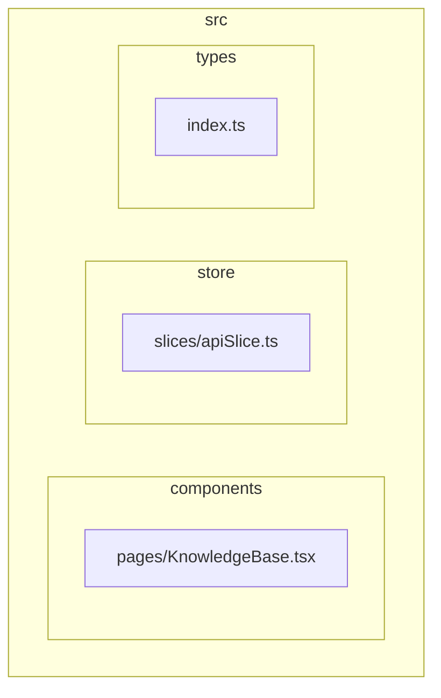
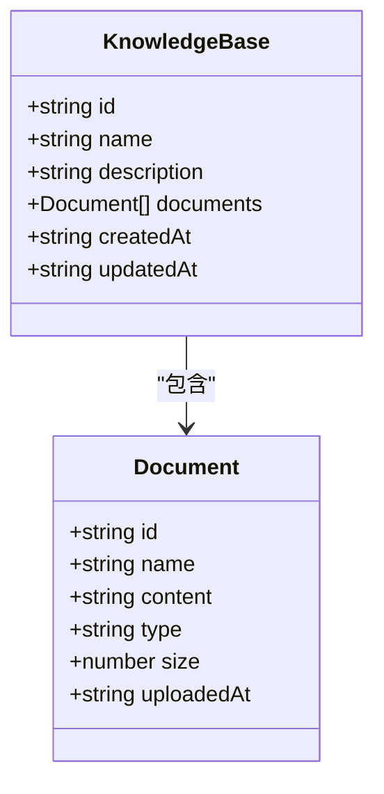
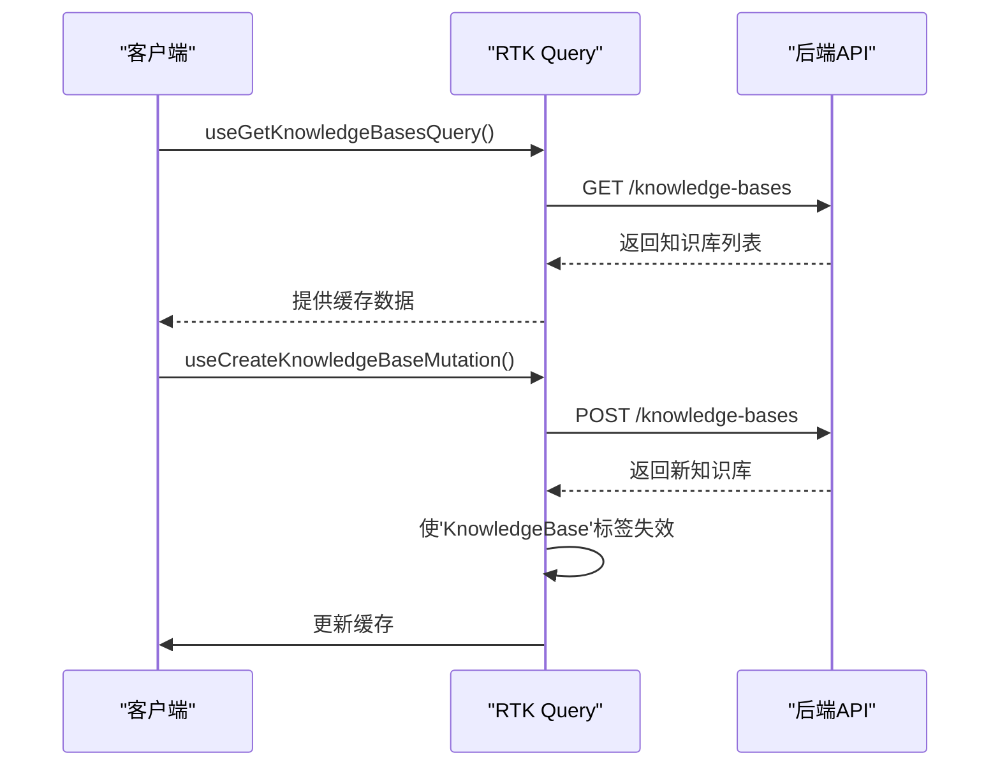
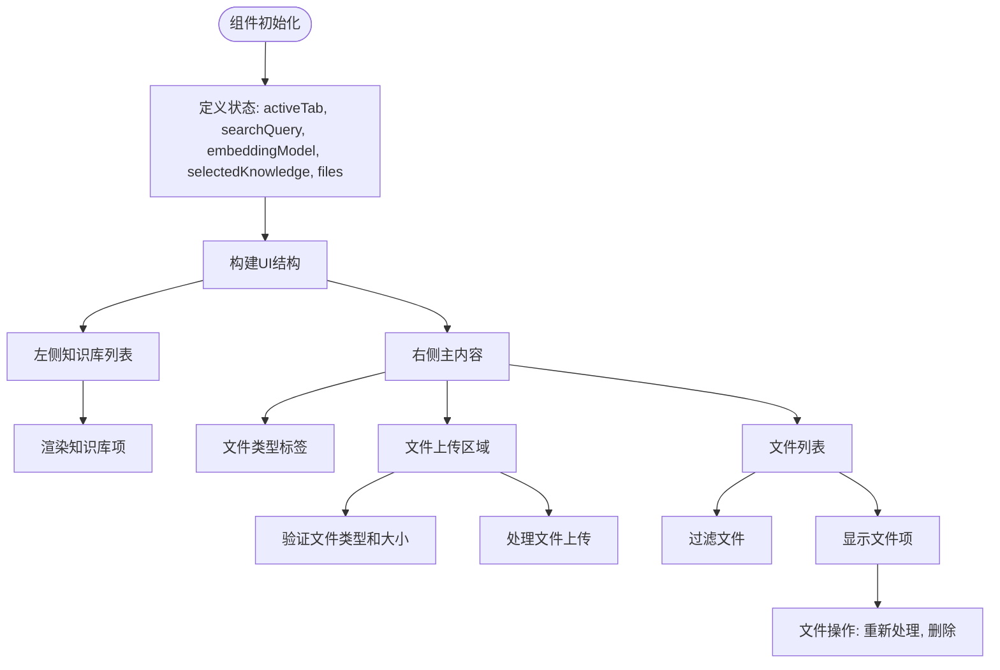
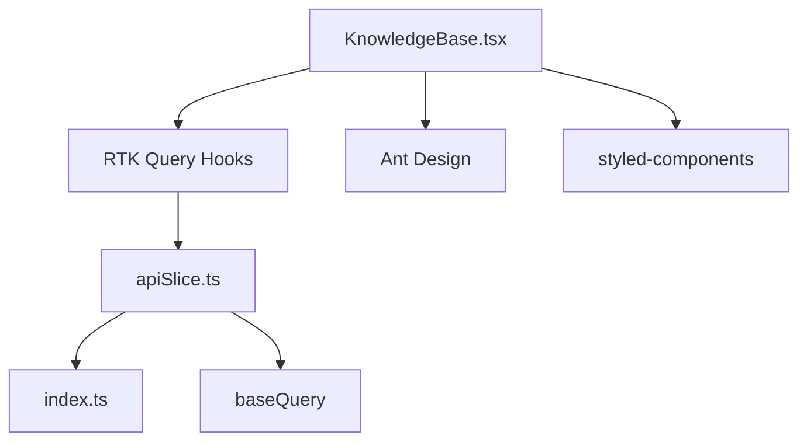

# 知识库管理API

<cite>
**本文档引用的文件**  
- [apiSlice.ts](file://src/store/slices/apiSlice.ts)
- [index.ts](file://src/types/index.ts)
- [KnowledgeBase.tsx](file://src/components/pages/KnowledgeBase.tsx)
</cite>

## 目录
1. [项目结构](#项目结构)
2. [核心组件](#核心组件)
3. [架构概述](#架构概述)
4. [详细组件分析](#详细组件分析)
5. [依赖分析](#依赖分析)
6. [性能考虑](#性能考虑)
7. [故障排除指南](#故障排除指南)
8. [结论](#结论)

## 项目结构

项目结构遵循功能模块化设计，主要包含组件、钩子、存储和类型定义等核心目录。知识库管理功能主要集中在`src/components/pages/KnowledgeBase.tsx`中实现，API接口定义在`src/store/slices/apiSlice.ts`中，类型定义在`src/types/index.ts`中。



**图表来源**  
- [apiSlice.ts](file://src/store/slices/apiSlice.ts)
- [index.ts](file://src/types/index.ts)
- [KnowledgeBase.tsx](file://src/components/pages/KnowledgeBase.tsx)

**章节来源**  
- [apiSlice.ts](file://src/store/slices/apiSlice.ts)
- [index.ts](file://src/types/index.ts)
- [KnowledgeBase.tsx](file://src/components/pages/KnowledgeBase.tsx)

## 核心组件

知识库管理API的核心组件包括知识库和文档的CRUD操作，基于RTK Query实现。`KnowledgeBase`接口定义了知识库的基本属性，包括ID、名称、描述、文档列表和时间戳。`Document`接口定义了文档的属性，包括ID、名称、内容、类型、大小和上传时间。



**图表来源**  
- [index.ts](file://src/types/index.ts#L55-L62)
- [index.ts](file://src/types/index.ts#L64-L71)

**章节来源**  
- [index.ts](file://src/types/index.ts#L55-L71)

## 架构概述

知识库管理API采用Redux Toolkit Query作为数据获取和缓存管理的核心。API端点定义在`apiSlice.ts`中，通过`createApi`配置基础查询和标签类型。知识库相关的端点包括获取、创建、更新和删除知识库，以及上传和删除文档。



**图表来源**  
- [apiSlice.ts](file://src/store/slices/apiSlice.ts#L196-L227)
- [apiSlice.ts](file://src/store/slices/apiSlice.ts#L272-L304)

**章节来源**  
- [apiSlice.ts](file://src/store/slices/apiSlice.ts#L87-L304)

## 详细组件分析

### 知识库API分析

知识库API提供了一组完整的CRUD操作，使用RTK Query的`builder.query`和`builder.mutation`方法定义。所有知识库相关的端点都使用`KnowledgeBase`标签进行缓存管理。

#### 知识库查询端点
```mermaid
classDiagram
class GetKnowledgeBases {
+query : () => '/knowledge-bases'
+providesTags : ['KnowledgeBase']
}
class GetKnowledgeBase {
+query : (id) => `/knowledge-bases/${id}`
+providesTags : (_result, _error, id) => [{ type : 'KnowledgeBase', id }]
}
GetKnowledgeBases --> KnowledgeBase : "提供标签"
GetKnowledgeBase --> KnowledgeBase : "提供标签"
```

**图表来源**  
- [apiSlice.ts](file://src/store/slices/apiSlice.ts#L196-L201)

#### 知识库变更端点
```mermaid
classDiagram
class CreateKnowledgeBase {
+query : (kb) => ({ url : '/knowledge-bases', method : 'POST', body : kb })
+invalidatesTags : ['KnowledgeBase']
}
class UpdateKnowledgeBase {
+query : ({ id, kb }) => ({ url : `/knowledge-bases/${id}`, method : 'PUT', body : kb })
+invalidatesTags : (_result, _error, { id }) => [{ type : 'KnowledgeBase', id }]
}
class DeleteKnowledgeBase {
+query : (id) => ({ url : `/knowledge-bases/${id}`, method : 'DELETE' })
+invalidatesTags : ['KnowledgeBase']
}
CreateKnowledgeBase --> KnowledgeBase : "使标签失效"
UpdateKnowledgeBase --> KnowledgeBase : "使标签失效"
DeleteKnowledgeBase --> KnowledgeBase : "使标签失效"
```

**图表来源**  
- [apiSlice.ts](file://src/store/slices/apiSlice.ts#L202-L227)

### 文档API分析

文档API专注于文件操作，包括上传和删除文档。这些操作会触发相关知识库的缓存更新。

#### 文档操作端点
```mermaid
classDiagram
class UploadDocument {
+query : ({ kbId, file }) => { formData.append('file', file); return { url : `/knowledge-bases/${kbId}/documents`, method : 'POST', body : formData } }
+invalidatesTags : (_result, _error, { kbId }) => [{ type : 'KnowledgeBase', id : kbId }]
}
class DeleteDocument {
+query : ({ kbId, docId }) => ({ url : `/knowledge-bases/${kbId}/documents/${docId}`, method : 'DELETE' })
+invalidatesTags : (_result, _error, { kbId }) => [{ type : 'KnowledgeBase', id : kbId }]
}
UploadDocument --> KnowledgeBase : "使标签失效"
DeleteDocument --> KnowledgeBase : "使标签失效"
```

**图表来源**  
- [apiSlice.ts](file://src/store/slices/apiSlice.ts#L229-L252)

### 知识库组件分析

`KnowledgeBase.tsx`组件实现了知识库管理的用户界面，包括知识库列表、文件上传区域和文件列表。



**图表来源**  
- [KnowledgeBase.tsx](file://src/components/pages/KnowledgeBase.tsx#L355-L678)

**章节来源**  
- [KnowledgeBase.tsx](file://src/components/pages/KnowledgeBase.tsx#L355-L678)

## 依赖分析

知识库管理功能依赖于多个核心模块，包括RTK Query、Ant Design组件库和styled-components。



**图表来源**  
- [apiSlice.ts](file://src/store/slices/apiSlice.ts)
- [KnowledgeBase.tsx](file://src/components/pages/KnowledgeBase.tsx)

**章节来源**  
- [apiSlice.ts](file://src/store/slices/apiSlice.ts)
- [KnowledgeBase.tsx](file://src/components/pages/KnowledgeBase.tsx)

## 性能考虑

知识库管理API在设计时考虑了性能优化，特别是在文件上传和缓存管理方面。

- **大文件上传**: 限制文件大小不超过50MB，支持的文件类型包括TXT, MD, HTML, PDF, DOCX, PPTX, XLSX, EPUB等
- **缓存策略**: 使用RTK Query的标签系统进行智能缓存管理，当知识库或文档发生变化时自动使相关缓存失效
- **错误处理**: 在文件上传前进行类型和大小验证，提供用户友好的错误提示

**章节来源**  
- [KnowledgeBase.tsx](file://src/components/pages/KnowledgeBase.tsx#L443-L475)

## 故障排除指南

### 常见问题

1. **文件上传失败**: 检查文件类型是否支持，文件大小是否超过50MB限制
2. **缓存未更新**: 确认API端点正确设置了`invalidatesTags`，确保相关知识库的缓存被正确失效
3. **接口调用失败**: 检查网络连接，确认后端API服务正常运行

### 调试建议

- 使用浏览器开发者工具检查网络请求和响应
- 查看控制台日志获取错误信息
- 确认RTK Query的缓存状态和标签管理是否正常工作

**章节来源**  
- [KnowledgeBase.tsx](file://src/components/pages/KnowledgeBase.tsx#L472-L521)
- [apiSlice.ts](file://src/store/slices/apiSlice.ts)

## 结论

知识库管理API提供了一套完整的知识库和文档管理功能，基于RTK Query实现了高效的数据获取和缓存管理。通过合理的架构设计和性能优化，确保了良好的用户体验和系统性能。API设计遵循RESTful原则，使用清晰的端点命名和一致的响应格式，便于前端集成和维护。