# 话题管理API

<cite>
**本文档引用的文件**
- [apiSlice.ts](file://src/store/slices/apiSlice.ts)
- [SidePanel.tsx](file://src/components/layout/SidePanel.tsx)
- [chatSlice.ts](file://src/store/slices/chatSlice.ts)
- [uiSlice.ts](file://src/store/slices/uiSlice.ts)
- [index.ts](file://src/types/index.ts)
</cite>

## 目录
1. [介绍](#介绍)
2. [核心API端点](#核心api端点)
3. [数据结构定义](#数据结构定义)
4. [缓存管理机制](#缓存管理机制)
5. [前端实现示例](#前端实现示例)
6. [性能优化建议](#性能优化建议)
7. [异常处理方案](#异常处理方案)

## 介绍

话题管理API是AI写作助手前端应用的核心功能之一，提供了一套完整的RESTful接口用于管理用户与AI助手的对话话题。该API基于Redux Toolkit Query（RTK Query）实现，提供了高效的数据获取、缓存管理和状态同步功能。通过这套API，用户可以创建、读取、更新和删除对话话题，并与特定的AI助手建立关联关系。

本API的设计充分考虑了用户体验和性能优化，实现了自动缓存、智能更新和错误处理等高级功能。通过使用RTK Query的标签系统，API能够精确地管理缓存状态，在数据发生变化时自动更新相关视图，确保用户界面始终显示最新的数据。

**Section sources**
- [apiSlice.ts](file://src/store/slices/apiSlice.ts#L87-L194)
- [index.ts](file://src/types/index.ts#L0-L80)

## 核心API端点

话题管理API提供了五个核心端点，分别对应话题的增删改查操作。这些端点通过`/api/topics`路径暴露，支持分页和过滤功能，满足不同场景下的数据获取需求。

### 获取话题列表 (getTopics)

`getTopics`端点用于获取话题列表，支持分页和按助手ID过滤。该端点是话题管理的基础，为用户界面提供数据支持。

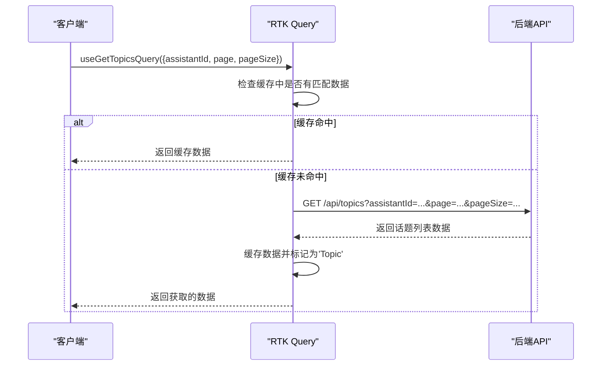

**Diagram sources**
- [apiSlice.ts](file://src/store/slices/apiSlice.ts#L125-L132)

**Section sources**
- [apiSlice.ts](file://src/store/slices/apiSlice.ts#L125-L132)

### 获取单个话题 (getTopic)

`getTopic`端点用于获取指定ID的单个话题详情。与列表端点不同，该端点为每个话题创建独立的缓存标签，实现更精细的缓存管理。

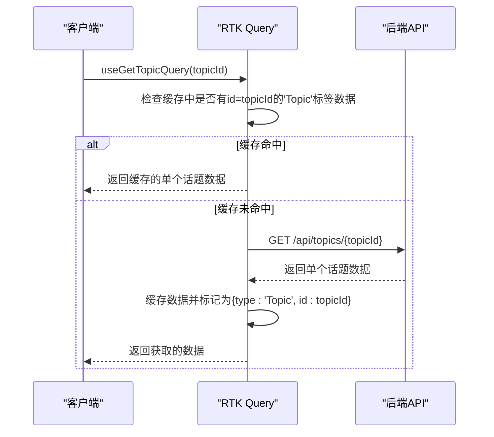

**Diagram sources**
- [apiSlice.ts](file://src/store/slices/apiSlice.ts#L133-L137)

**Section sources**
- [apiSlice.ts](file://src/store/slices/apiSlice.ts#L133-L137)

### 创建话题 (createTopic)

`createTopic`端点用于创建新的话题。该操作会触发相关缓存的自动更新，确保用户界面及时反映数据变化。

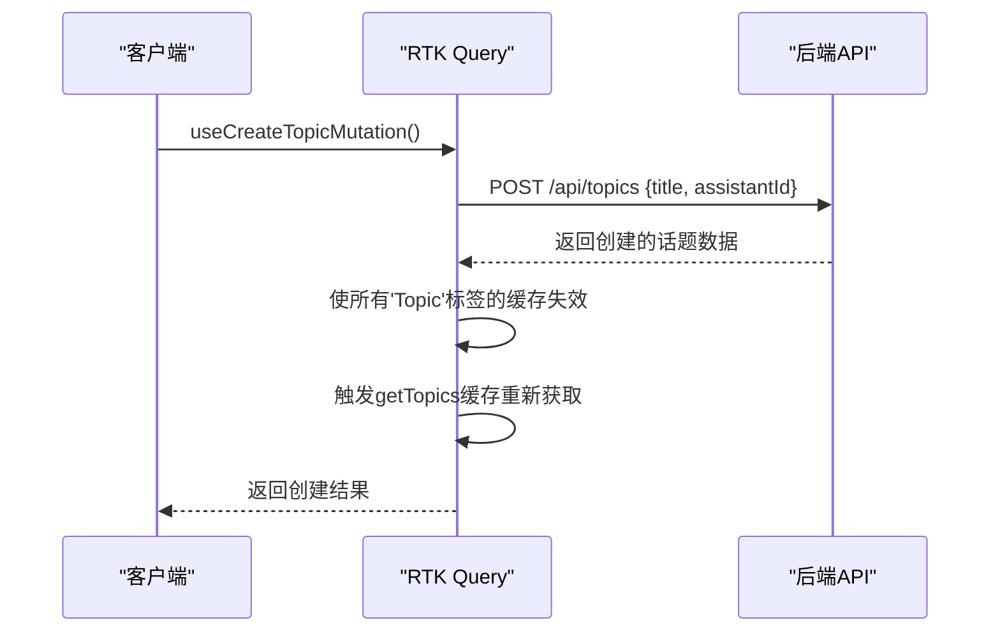

**Diagram sources**
- [apiSlice.ts](file://src/store/slices/apiSlice.ts#L138-L143)

**Section sources**
- [apiSlice.ts](file://src/store/slices/apiSlice.ts#L138-L143)

### 更新话题 (updateTopic)

`updateTopic`端点用于更新指定ID的话题信息。该操作会精确地使相关缓存失效，实现高效的局部更新。

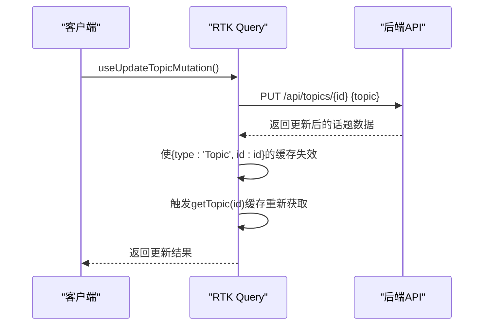

**Diagram sources**
- [apiSlice.ts](file://src/store/slices/apiSlice.ts#L144-L149)

**Section sources**
- [apiSlice.ts](file://src/store/slices/apiSlice.ts#L144-L149)

### 删除话题 (deleteTopic)

`deleteTopic`端点用于删除指定ID的话题。该操作会触发全局话题缓存的更新，确保列表视图的实时性。

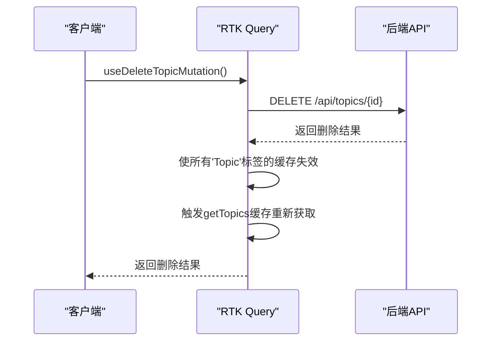

**Diagram sources**
- [apiSlice.ts](file://src/store/slices/apiSlice.ts#L150-L155)

**Section sources**
- [apiSlice.ts](file://src/store/slices/apiSlice.ts#L150-L155)

## 数据结构定义

话题管理API涉及多个核心数据结构，这些结构定义了话题与助手之间的关联关系和数据模型。

### Topic数据结构

`Topic`接口定义了话题的核心属性，包括标识信息、元数据和统计信息。

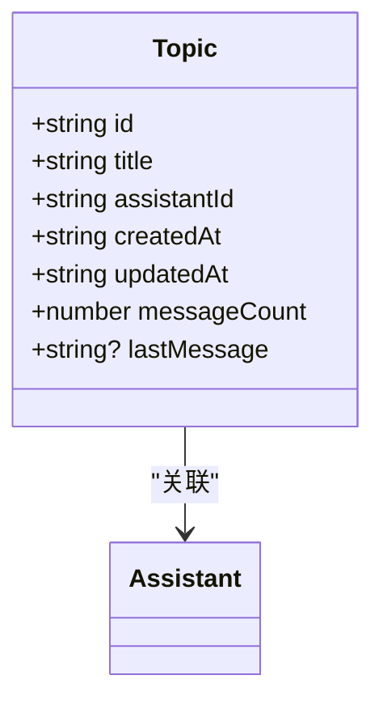

**Diagram sources**
- [index.ts](file://src/types/index.ts#L30-L37)

**Section sources**
- [index.ts](file://src/types/index.ts#L30-L37)

### Assistant数据结构

`Assistant`接口定义了AI助手的属性，话题通过`assistantId`字段与特定助手建立关联。

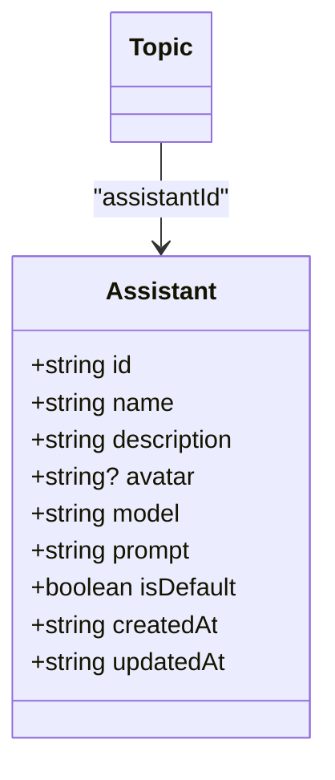

**Diagram sources**
- [index.ts](file://src/types/index.ts#L18-L28)

**Section sources**
- [index.ts](file://src/types/index.ts#L18-L28)

### 分页参数

话题列表端点支持分页参数，允许客户端控制数据获取的范围和数量。

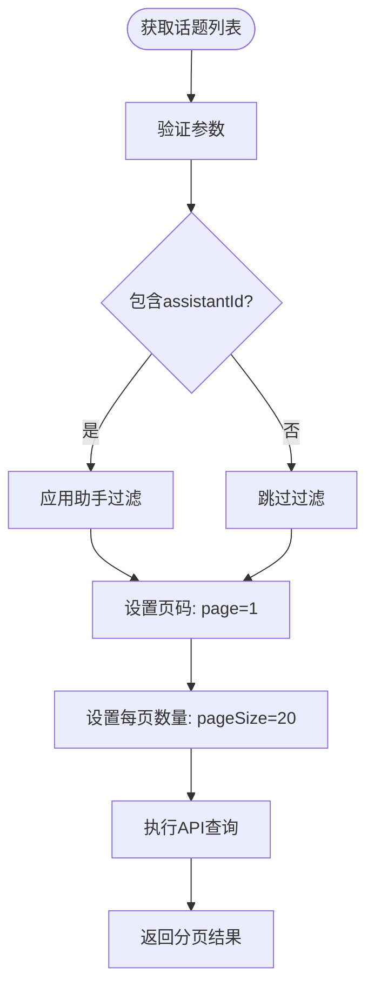

**Diagram sources**
- [apiSlice.ts](file://src/store/slices/apiSlice.ts#L125-L132)

**Section sources**
- [apiSlice.ts](file://src/store/slices/apiSlice.ts#L125-L132)

## 缓存管理机制

话题管理API采用RTK Query的标签系统进行高效的缓存管理，通过`providesTags`和`invalidatesTags`实现智能的缓存更新策略。

### 缓存标签策略

API定义了两种缓存标签策略：全局标签和精确标签。全局标签用于管理整个话题列表的缓存，精确标签用于管理单个话题的缓存。

```mermaid
erDiagram
TAG ||--o{ CACHE : "包含"
TAG {
string type PK
string? id
}
CACHE {
string key PK
any data
timestamp createdAt
timestamp? expiresAt
}
TAG ||--o{ "全局缓存" : "type='Topic'"
TAG ||--o{ "精确缓存" : "type='Topic', id={topicId}"
```

**Diagram sources**
- [apiSlice.ts](file://src/store/slices/apiSlice.ts#L87-L87)

**Section sources**
- [apiSlice.ts](file://src/store/slices/apiSlice.ts#L87-L87)

### 缓存失效规则

不同的API操作触发不同的缓存失效规则，确保数据的一致性和实时性。

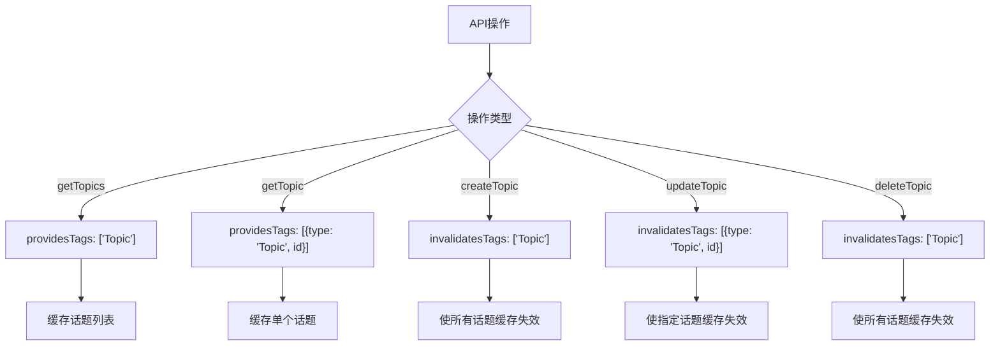

**Diagram sources**
- [apiSlice.ts](file://src/store/slices/apiSlice.ts#L125-L159)

**Section sources**
- [apiSlice.ts](file://src/store/slices/apiSlice.ts#L125-L159)

## 前端实现示例

以下示例展示了如何在前端组件中使用话题管理API的Hook，实现话题列表加载和创建新话题的功能。

### 话题列表加载

使用`useGetTopicsQuery` Hook加载话题列表，支持分页和过滤功能。

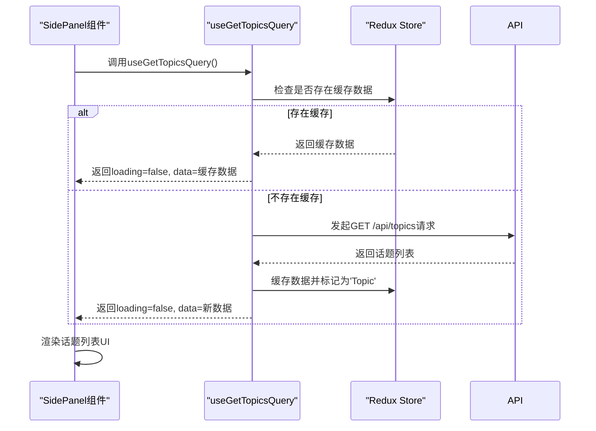

**Diagram sources**
- [SidePanel.tsx](file://src/components/layout/SidePanel.tsx#L762-L797)
- [apiSlice.ts](file://src/store/slices/apiSlice.ts#L125-L132)

**Section sources**
- [SidePanel.tsx](file://src/components/layout/SidePanel.tsx#L762-L797)

### 创建新话题

使用`useCreateTopicMutation` Hook创建新话题，并通过Redux状态管理更新UI。

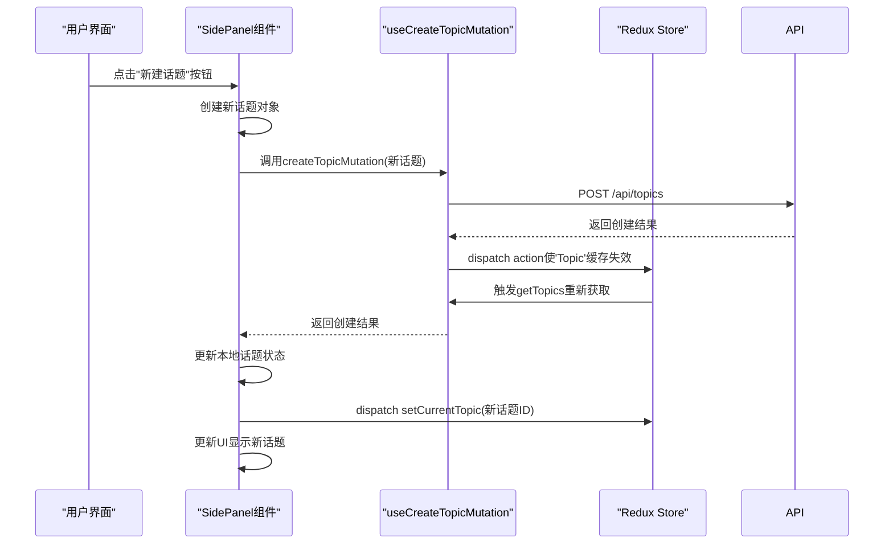

**Diagram sources**
- [SidePanel.tsx](file://src/components/layout/SidePanel.tsx#L851-L902)
- [apiSlice.ts](file://src/store/slices/apiSlice.ts#L138-L143)
- [uiSlice.ts](file://src/store/slices/uiSlice.ts#L136-L136)

**Section sources**
- [SidePanel.tsx](file://src/components/layout/SidePanel.tsx#L851-L902)

## 性能优化建议

为确保话题管理API的高性能运行，建议采用以下优化策略：

### 合理使用分页

避免一次性获取大量数据，使用分页参数控制数据量。

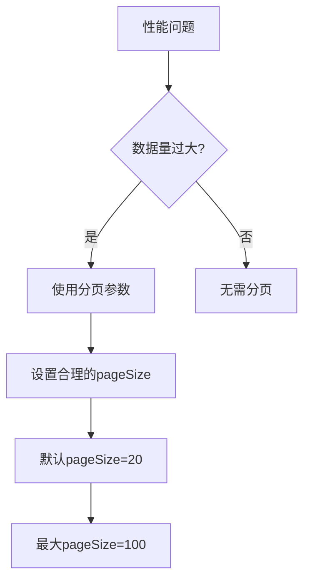

**Section sources**
- [apiSlice.ts](file://src/store/slices/apiSlice.ts#L125-L132)

### 缓存策略优化

根据使用场景选择合适的缓存策略，平衡数据实时性和性能。

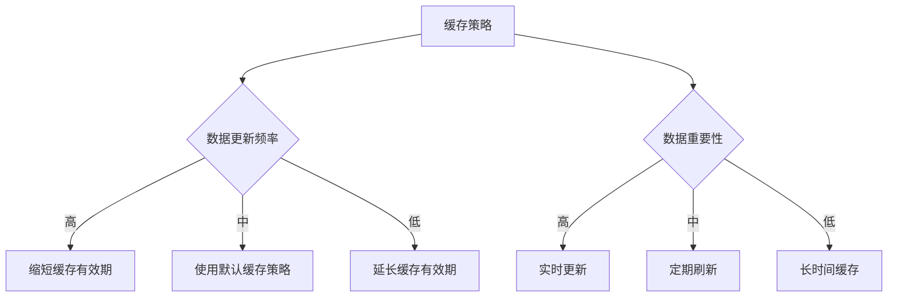

**Section sources**
- [apiSlice.ts](file://src/store/slices/apiSlice.ts#L125-L159)

### 减少不必要的渲染

使用React.memo和useCallback优化组件渲染性能。

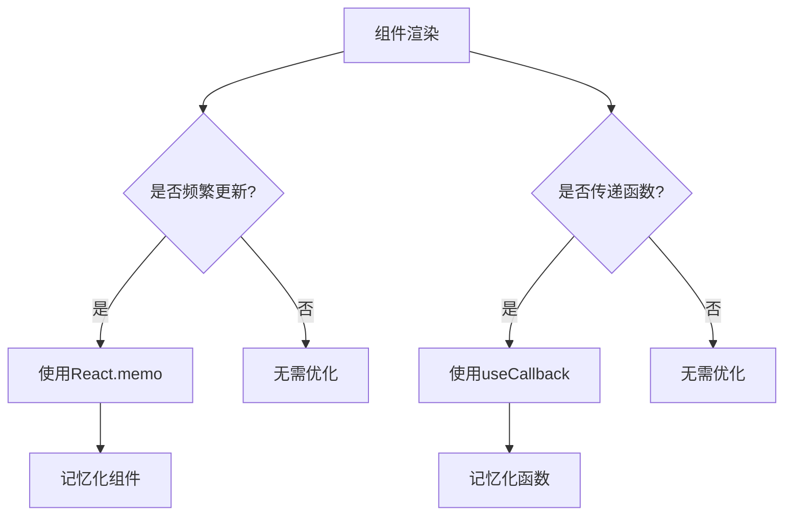

**Section sources**
- [SidePanel.tsx](file://src/components/layout/SidePanel.tsx#L393-L459)

## 异常处理方案

话题管理API内置了完善的异常处理机制，确保在各种异常情况下仍能提供良好的用户体验。

### 网络错误处理

当网络请求失败时，API会返回错误信息，前端需要妥善处理。

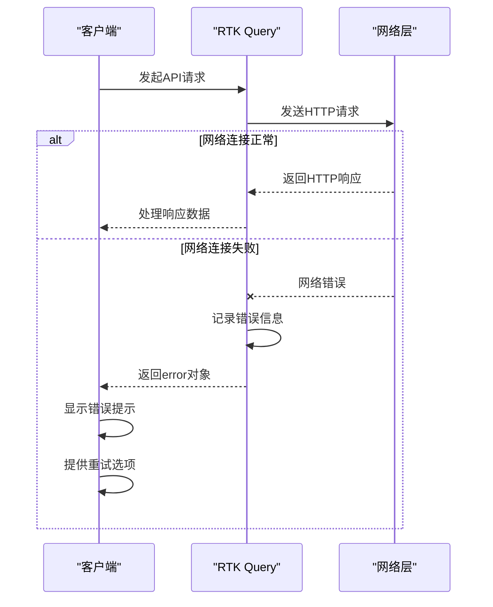

**Section sources**
- [apiSlice.ts](file://src/store/slices/apiSlice.ts#L125-L159)

### 数据验证错误

当请求数据不符合预期格式时，后端会返回验证错误，前端需要进行相应处理。

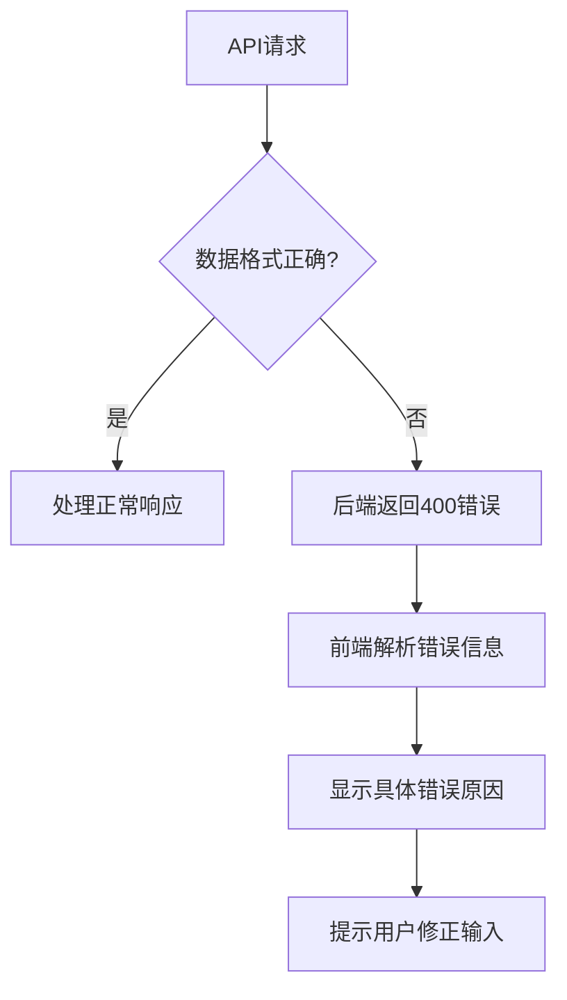

**Section sources**
- [apiSlice.ts](file://src/store/slices/apiSlice.ts#L138-L143)

### 并发操作处理

当多个用户同时操作同一话题时，需要处理并发冲突。

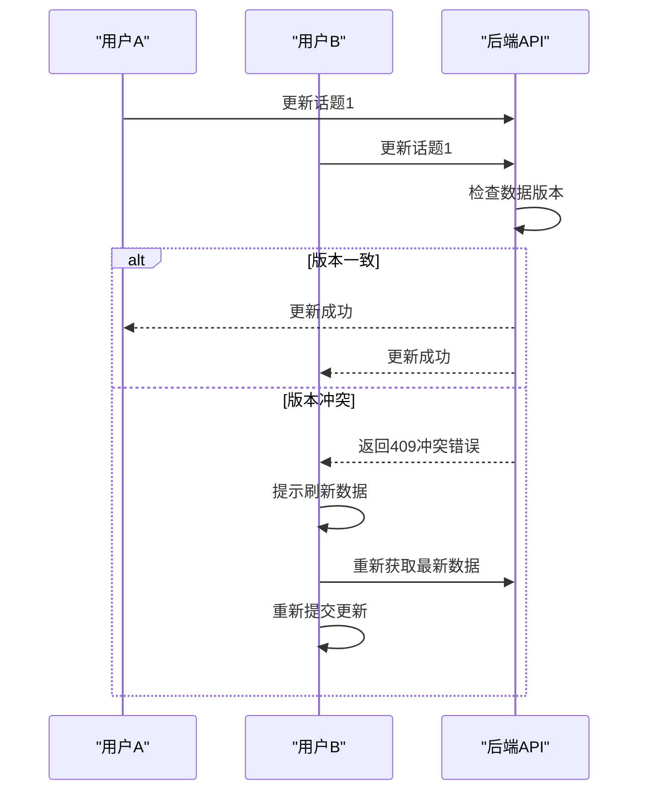

**Section sources**
- [apiSlice.ts](file://src/store/slices/apiSlice.ts#L144-L149)