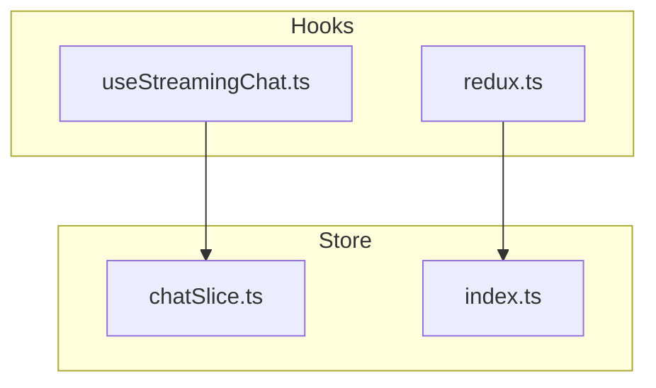
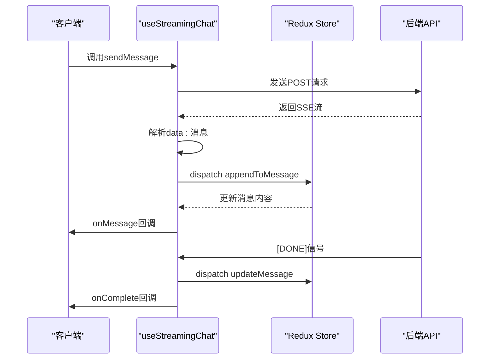
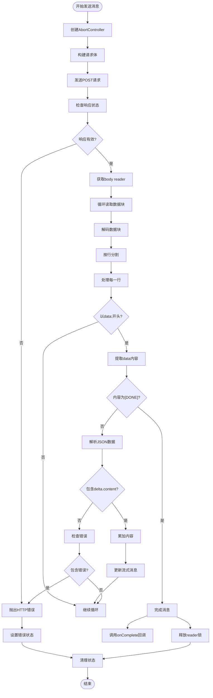
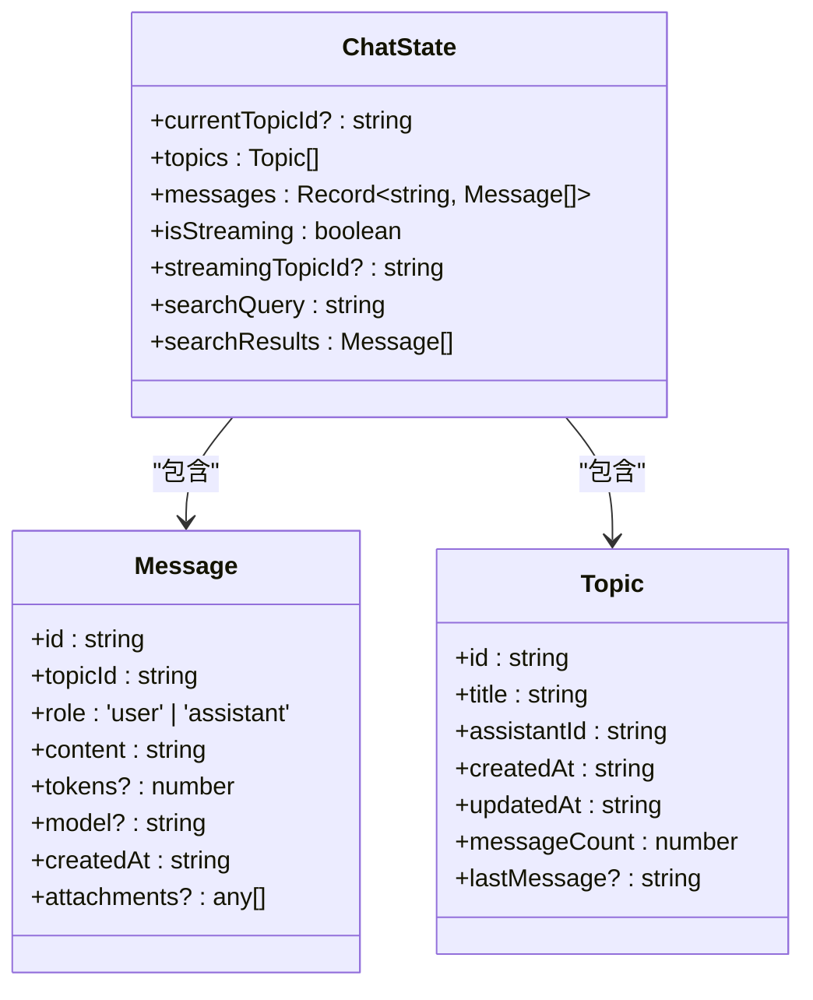
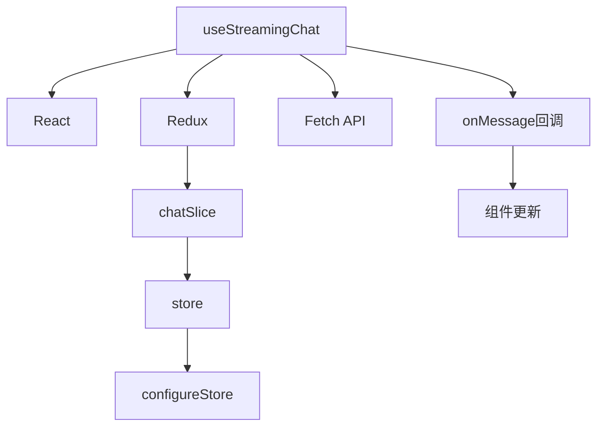

# 流式聊天API (/api/chat/stream)

<cite>
**本文档引用的文件**
- [useStreamingChat.ts](file://src/hooks/useStreamingChat.ts)
- [chatSlice.ts](file://src/store/slices/chatSlice.ts)
- [index.ts](file://src/store/index.ts)
- [redux.ts](file://src/hooks/redux.ts)
</cite>

## 目录
1. [简介](#简介)
2. [项目结构](#项目结构)
3. [核心组件](#核心组件)
4. [架构概述](#架构概述)
5. [详细组件分析](#详细组件分析)
6. [依赖分析](#依赖分析)
7. [性能考虑](#性能考虑)
8. [故障排除指南](#故障排除指南)
9. [结论](#结论)

## 简介
本文档详细说明了流式聊天API的实现机制，重点介绍基于SSE（Server-Sent Events）协议的实时消息传输。文档涵盖客户端如何通过`useStreamingChat` Hook发起流式请求、处理分块响应、实时更新聊天状态，以及相关的错误处理、性能优化和安全实践。

## 项目结构
项目采用典型的React + Redux架构，主要分为组件、Hook、状态管理三大模块。流式聊天功能的核心逻辑位于`src/hooks/useStreamingChat.ts`，状态管理通过Redux Toolkit在`src/store/slices/chatSlice.ts`中实现。

**图示来源**
- [useStreamingChat.ts](file://src/hooks/useStreamingChat.ts#L1-L240)
- [chatSlice.ts](file://src/store/slices/chatSlice.ts#L1-L152)

**本节来源**
- [useStreamingChat.ts](file://src/hooks/useStreamingChat.ts#L1-L240)
- [chatSlice.ts](file://src/store/slices/chatSlice.ts#L1-L152)

## 核心组件
`useStreamingChat` Hook是流式聊天功能的核心，负责处理SSE连接、数据流解析和状态更新。该Hook通过`fetch` API与后端`/api/chat/stream`端点通信，支持流式消息的实时接收和处理。

**本节来源**
- [useStreamingChat.ts](file://src/hooks/useStreamingChat.ts#L1-L240)

## 架构概述
系统采用React Hooks + Redux状态管理模式，`useStreamingChat`负责与后端API通信并解析SSE流，`chatSlice`负责管理聊天消息的状态。两者通过回调函数和Redux action进行交互。

**图示来源**
- [useStreamingChat.ts](file://src/hooks/useStreamingChat.ts#L51-L91)
- [chatSlice.ts](file://src/store/slices/chatSlice.ts#L1-L152)

## 详细组件分析

### useStreamingChat 分析
`useStreamingChat` Hook实现了完整的SSE客户端逻辑，包括连接管理、流式数据处理和错误处理。

#### 实现机制

**图示来源**
- [useStreamingChat.ts](file://src/hooks/useStreamingChat.ts#L89-L130)

**本节来源**
- [useStreamingChat.ts](file://src/hooks/useStreamingChat.ts#L1-L240)

### chatSlice 分析
`chatSlice`负责管理聊天相关的状态，包括消息列表、话题和流式状态。

#### 状态结构

**图示来源**
- [chatSlice.ts](file://src/store/slices/chatSlice.ts#L1-L152)

**本节来源**
- [chatSlice.ts](file://src/store/slices/chatSlice.ts#L1-L152)

## 依赖分析
流式聊天功能依赖于多个核心模块，包括React Hooks、Redux状态管理和Fetch API。

**图示来源**
- [useStreamingChat.ts](file://src/hooks/useStreamingChat.ts#L1-L240)
- [chatSlice.ts](file://src/store/slices/chatSlice.ts#L1-L152)
- [index.ts](file://src/store/index.ts#L1-L27)

**本节来源**
- [useStreamingChat.ts](file://src/hooks/useStreamingChat.ts#L1-L240)
- [chatSlice.ts](file://src/store/slices/chatSlice.ts#L1-L152)
- [index.ts](file://src/store/index.ts#L1-L27)

## 性能考虑
流式聊天功能在性能方面有以下考虑：

1. **流控机制**：通过`AbortController`实现请求中断，避免不必要的资源消耗
2. **内存管理**：及时释放`reader`锁，防止内存泄漏
3. **错误处理**：捕获并处理解析错误，避免因单个数据块问题导致整个流中断
4. **状态更新优化**：通过累加内容后一次性更新状态，减少不必要的渲染

**本节来源**
- [useStreamingChat.ts](file://src/hooks/useStreamingChat.ts#L1-L240)

## 故障排除指南
### 常见问题及解决方案

| 问题现象 | 可能原因 | 解决方案 |
|---------|--------|--------|
| 无法建立SSE连接 | 网络问题或CORS配置 | 检查网络连接，确认后端CORS配置 |
| 消息接收不完整 | 数据块解析错误 | 检查SSE格式是否符合规范，确保每行以\n结尾 |
| 流式更新卡顿 | 频繁状态更新 | 优化状态更新逻辑，考虑防抖处理 |
| 连接意外中断 | 服务端超时 | 检查服务端超时设置，实现重连机制 |

### 调试技巧
1. 使用浏览器开发者工具的Network面板查看SSE连接
2. 检查Response Headers中的`Content-Type`是否为`text/event-stream`
3. 监控Console中的错误信息
4. 使用`onError`回调捕获和记录错误

**本节来源**
- [useStreamingChat.ts](file://src/hooks/useStreamingChat.ts#L1-L240)

## 结论
流式聊天API通过SSE协议实现了高效的实时消息传输，结合React Hooks和Redux提供了良好的状态管理。该实现具有良好的错误处理机制和性能优化，能够为用户提供流畅的聊天体验。