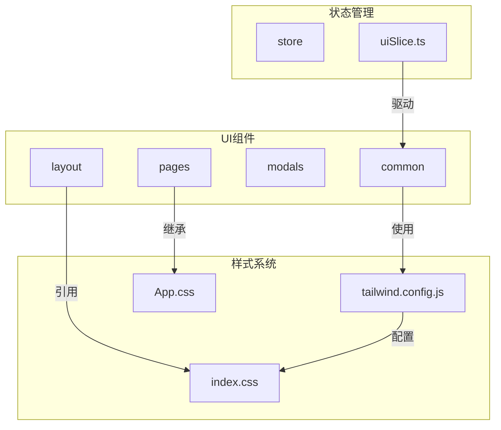
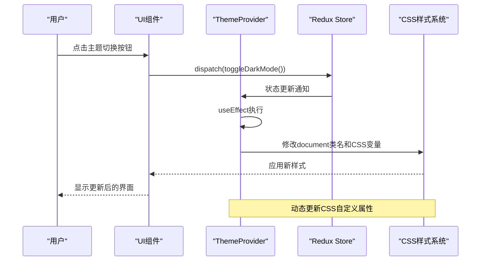
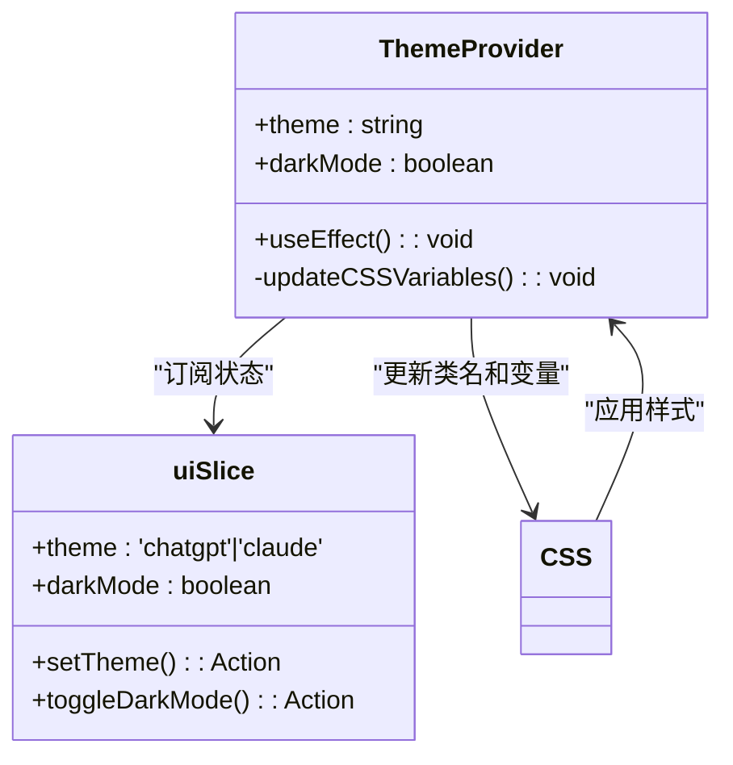
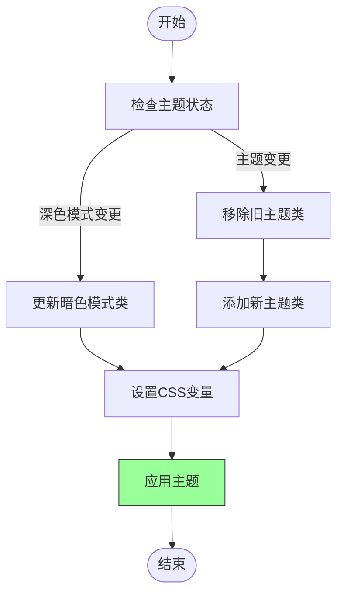
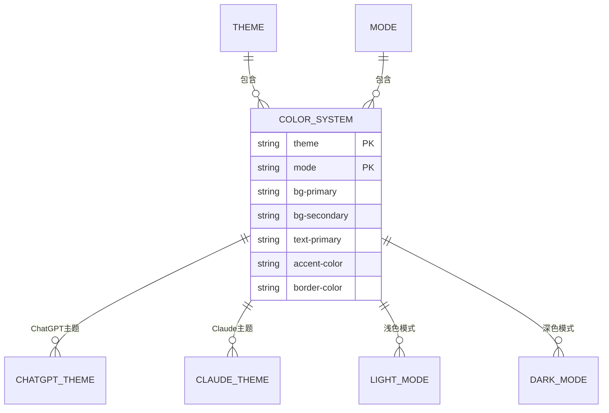
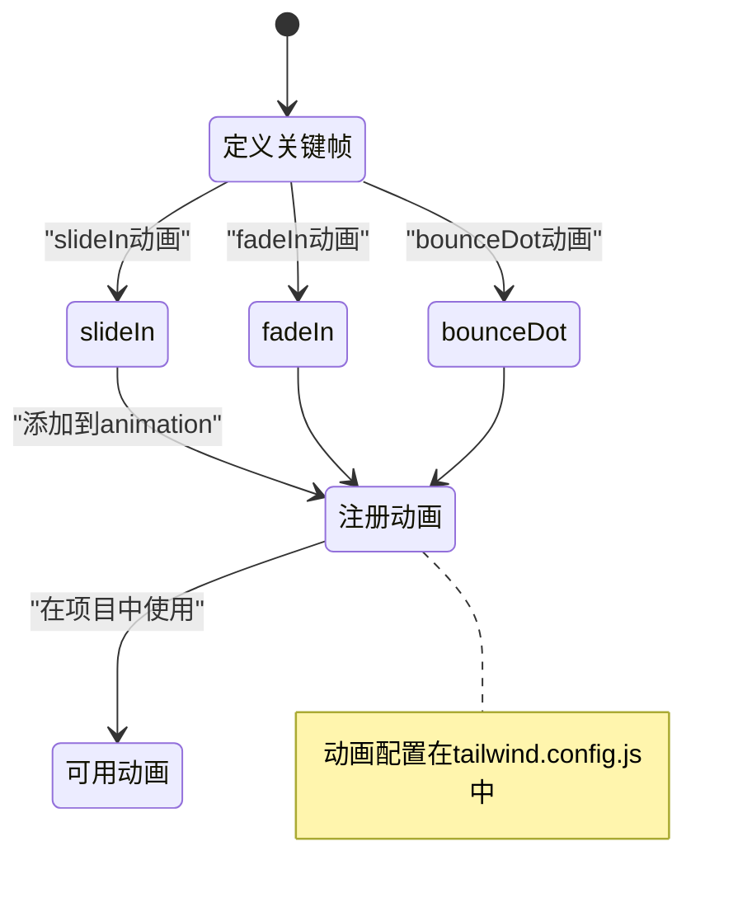
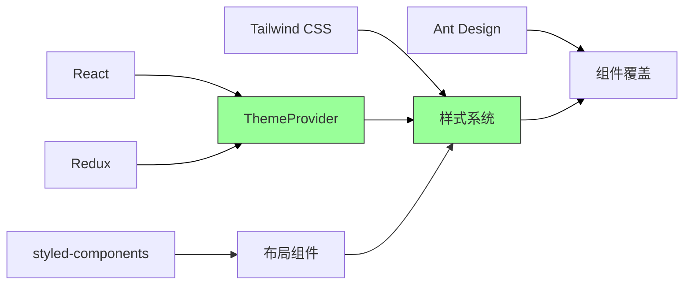

# UI组件与样式

<cite>
**本文档中引用的文件**   
- [ThemeProvider.tsx](file://src/components/common/ThemeProvider.tsx)
- [tailwind.config.js](file://tailwind.config.js)
- [index.css](file://src/index.css)
- [App.css](file://src/App.css)
- [uiSlice.ts](file://src/store/slices/uiSlice.ts)
- [App.tsx](file://src/App.tsx)
</cite>

## 目录
1. [简介](#简介)
2. [项目结构](#项目结构)
3. [核心组件](#核心组件)
4. [架构概述](#架构概述)
5. [详细组件分析](#详细组件分析)
6. [依赖分析](#依赖分析)
7. [性能考虑](#性能考虑)
8. [故障排除指南](#故障排除指南)
9. [结论](#结论)
10. [附录](#附录) (如有必要)

## 简介
本文档详细记录了前端项目中UI组件与样式系统的实现机制。重点说明了ThemeProvider如何通过React Context提供主题切换能力，支持深色/浅色模式的动态变更。分析了Tailwind CSS在项目中的应用策略，包括自定义配置中的扩展颜色、字体和插件。解释了全局样式文件的作用范围及优先级处理机制。展示了如何通过类名组合实现响应式布局与交互动效，并提供了组件样式覆盖与主题定制的扩展方法。同时强调了可访问性（a11y）和跨浏览器兼容性的实现考量。

## 项目结构
项目采用模块化结构，将UI组件、样式文件和状态管理分离。核心UI组件位于`src/components`目录下，分为common、layout、modals和pages等子目录。样式系统由Tailwind CSS和CSS自定义变量共同构成，全局样式定义在`src/index.css`中，而应用级样式则在`src/App.css`中配置。主题状态通过Redux管理，存储在`src/store/slices/uiSlice.ts`中。



**图示来源**
- [ThemeProvider.tsx](file://src/components/common/ThemeProvider.tsx)
- [tailwind.config.js](file://tailwind.config.js)
- [index.css](file://src/index.css)

**本节来源**
- [src/components/common/ThemeProvider.tsx](file://src/components/common/ThemeProvider.tsx)
- [tailwind.config.js](file://tailwind.config.js)
- [src/index.css](file://src/index.css)

## 核心组件
核心UI组件系统围绕ThemeProvider构建，通过React Context和Redux状态管理实现主题的动态切换。组件使用CSS自定义属性（CSS Variables）和Tailwind CSS类名组合来实现灵活的样式控制。全局样式文件定义了基础的排版、布局和滚动条样式，确保跨浏览器的一致性体验。

**本节来源**
- [ThemeProvider.tsx](file://src/components/common/ThemeProvider.tsx)
- [index.css](file://src/index.css)
- [App.css](file://src/App.css)

## 架构概述
系统采用分层架构，上层为React组件层，中层为样式系统层，底层为状态管理层。ThemeProvider作为核心桥梁，连接Redux状态与CSS样式系统。当用户切换主题或深色模式时，uiSlice中的状态变化会触发ThemeProvider更新document元素的CSS类和自定义属性，从而实现全局样式变更。



**图示来源**
- [ThemeProvider.tsx](file://src/components/common/ThemeProvider.tsx)
- [uiSlice.ts](file://src/store/slices/uiSlice.ts)
- [index.css](file://src/index.css)

## 详细组件分析
### ThemeProvider分析
ThemeProvider组件是整个样式系统的核心，负责将Redux中的主题状态同步到CSS层面。它通过useEffect监听主题和深色模式的变化，动态更新document元素的类名和CSS自定义属性。

#### 实现机制


**图示来源**
- [ThemeProvider.tsx](file://src/components/common/ThemeProvider.tsx)
- [uiSlice.ts](file://src/store/slices/uiSlice.ts)

#### 主题切换流程


**图示来源**
- [ThemeProvider.tsx](file://src/components/common/ThemeProvider.tsx#L27-L85)

**本节来源**
- [ThemeProvider.tsx](file://src/components/common/ThemeProvider.tsx)
- [uiSlice.ts](file://src/store/slices/uiSlice.ts)

### Tailwind CSS配置分析
Tailwind CSS配置文件定义了项目的扩展样式系统，包括自定义颜色、间距和动画效果。

#### 颜色系统设计


**图示来源**
- [tailwind.config.js](file://tailwind.config.js#L10-L40)
- [ThemeProvider.tsx](file://src/components/common/ThemeProvider.tsx)

#### 动画系统配置


**图示来源**
- [tailwind.config.js](file://tailwind.config.js#L50-L65)

**本节来源**
- [tailwind.config.js](file://tailwind.config.js)
- [index.css](file://src/index.css)

### 全局样式系统分析
全局样式系统由多个层次构成，确保样式的优先级和可维护性。

#### 样式优先级处理
```mermaid
graph TD
A[Tailwind基础样式] --> B[自定义CSS变量]
B --> C[Tailwind组件样式]
C --> D[项目特定样式]
D --> E[组件内联样式]
E --> F[!important覆盖]
style A fill:#f9f,stroke:#333
style B fill:#9f9,stroke:#333
style C fill:#9f9,stroke:#333
style D fill:#9f9,stroke:#333
style E fill:#ff9,stroke:#333
style F fill:#f99,stroke:#333
note right of B
CSS变量定义在:root中
end note
note right of D
App.css中的特定样式
end note
```

**图示来源**
- [index.css](file://src/index.css#L1-L10)
- [App.css](file://src/App.css)

#### 滚动条样式定制
```mermaid
classDiagram
class Scrollbar {
+width : 8px
+track : 背景透明
+thumb : 圆角4px
+hover : 颜色加深
}
class DarkScrollbar {
+track : 白色半透明
+thumb : 白色较深
+hover : 白色更深
}
Scrollbar <|-- DarkScrollbar : "深色模式扩展"
note right of Scrollbar
定义在index.css中
end note
```

**图示来源**
- [index.css](file://src/index.css#L20-L50)

**本节来源**
- [index.css](file://src/index.css)
- [App.css](file://src/App.css)

## 依赖分析
样式系统与多个核心依赖紧密集成，形成完整的UI解决方案。



**图示来源**
- [App.tsx](file://src/App.tsx)
- [tailwind.config.js](file://tailwind.config.js)
- [index.css](file://src/index.css)

**本节来源**
- [App.tsx](file://src/App.tsx)
- [tailwind.config.js](file://tailwind.config.js)
- [index.css](file://src/index.css)

## 性能考虑
主题切换采用批量DOM操作，通过一次性更新CSS变量和类名来最小化重排重绘。CSS变量的使用避免了频繁的样式计算，而Tailwind的原子化CSS确保了样式的高效应用。全局样式精简，避免了不必要的样式继承和计算。

## 故障排除指南
当主题切换失效时，首先检查Redux状态是否正确更新，然后验证ThemeProvider的useEffect是否执行。若样式未应用，检查CSS变量名是否拼写正确，以及document元素是否获得了正确的类名。对于Tailwind类名不生效的情况，确认tailwind.config.js中的content路径配置是否包含相关文件。

**本节来源**
- [ThemeProvider.tsx](file://src/components/common/ThemeProvider.tsx#L15-L85)
- [uiSlice.ts](file://src/store/slices/uiSlice.ts)
- [tailwind.config.js](file://tailwind.config.js)

## 结论
该项目的UI组件与样式系统设计合理，通过ThemeProvider实现了灵活的主题切换能力。CSS变量与Tailwind CSS的结合使用，既保证了样式的可维护性，又提供了足够的灵活性。全局样式文件的分层设计确保了样式的优先级和一致性，为构建高质量的用户界面提供了坚实基础。