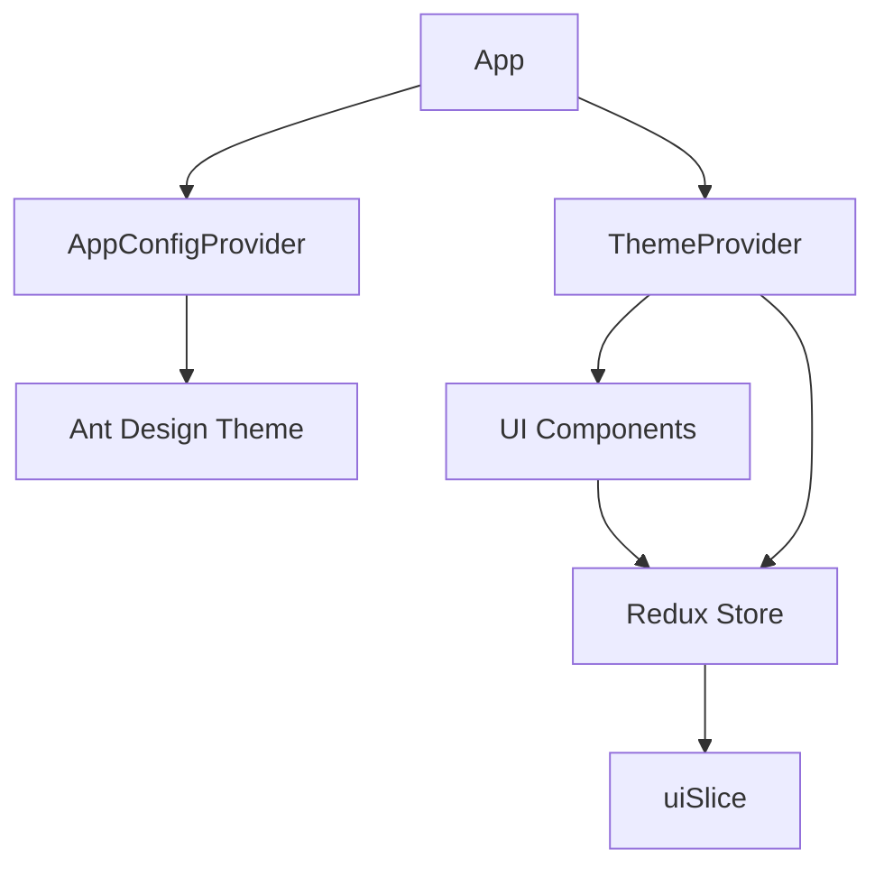
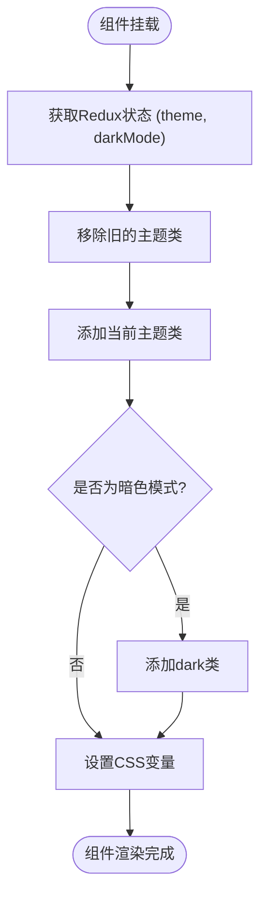
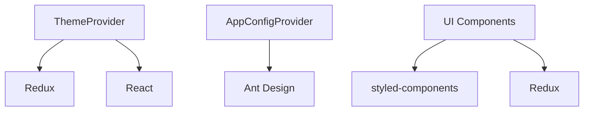

# 主题系统

<cite>
**本文档引用的文件**   
- [ThemeProvider.tsx](file://src/components/common/ThemeProvider.tsx)
- [uiSlice.ts](file://src/store/slices/uiSlice.ts)
- [App.tsx](file://src/App.tsx)
- [TopNavigation.tsx](file://src/components/layout/TopNavigation.tsx)
- [index.ts](file://src/store/index.ts)
- [redux.ts](file://src/hooks/redux.ts)
</cite>

## 目录
1. [简介](#简介)
2. [项目结构](#项目结构)
3. [核心组件](#核心组件)
4. [架构概述](#架构概述)
5. [详细组件分析](#详细组件分析)
6. [依赖分析](#依赖分析)
7. [性能考虑](#性能考虑)
8. [故障排除指南](#故障排除指南)
9. [结论](#结论)

## 简介
本文档深入解析了`ThemeProvider`组件的实现机制，说明其如何利用React Context API实现全局主题状态管理。详细描述了深色/浅色模式的切换逻辑，包括CSS类名注入、localStorage持久化存储以及动态class应用策略。解释了组件如何与UI库（Ant Design）协同工作以确保视觉一致性，并提供自定义主题扩展的开发指南。结合代码示例展示在新组件中消费主题上下文的方法，同时涵盖服务端渲染兼容性处理和性能优化建议。列出常见问题如主题未生效、闪烁现象的排查步骤。

## 项目结构
项目采用模块化结构，将组件、状态管理、样式和工具函数分离。主题系统主要由`ThemeProvider`组件、Redux状态管理、UI组件和样式系统组成。`ThemeProvider`位于`src/components/common/`目录下，负责管理全局主题状态。状态管理通过Redux实现，相关代码位于`src/store/slices/uiSlice.ts`。UI组件如`TopNavigation`使用主题状态进行渲染。

**Section sources**
- [ThemeProvider.tsx](file://src/components/common/ThemeProvider.tsx)
- [uiSlice.ts](file://src/store/slices/uiSlice.ts)
- [App.tsx](file://src/App.tsx)

## 核心组件
`ThemeProvider`是主题系统的核心组件，负责管理全局主题状态。它通过Redux获取当前主题和暗色模式状态，并在`useEffect`中更新DOM的CSS类和CSS变量。当主题或暗色模式状态改变时，`ThemeProvider`会重新渲染并更新全局样式。

**Section sources**
- [ThemeProvider.tsx](file://src/components/common/ThemeProvider.tsx#L1-L85)
- [uiSlice.ts](file://src/store/slices/uiSlice.ts#L1-L148)

## 架构概述
主题系统采用Redux进行状态管理，`ThemeProvider`组件订阅Redux状态并更新DOM。`App`组件通过`AppConfigProvider`配置Ant Design的主题算法。`TopNavigation`等UI组件通过`useAppSelector`获取主题状态并相应地渲染。

**Diagram sources**
- [App.tsx](file://src/App.tsx#L1-L60)
- [ThemeProvider.tsx](file://src/components/common/ThemeProvider.tsx#L1-L85)
- [uiSlice.ts](file://src/store/slices/uiSlice.ts#L1-L148)

## 详细组件分析

### ThemeProvider 分析
`ThemeProvider`组件通过`useAppSelector`从Redux store中获取`theme`和`darkMode`状态。在`useEffect`中，它根据这些状态更新`document.documentElement`的CSS类和CSS变量。当主题或暗色模式状态改变时，`useEffect`会重新执行，确保全局样式同步更新。

**Diagram sources**
- [ThemeProvider.tsx](file://src/components/common/ThemeProvider.tsx#L1-L85)

**Section sources**
- [ThemeProvider.tsx](file://src/components/common/ThemeProvider.tsx#L1-L85)

### 深色/浅色模式切换逻辑
深色/浅色模式的切换通过`toggleDarkMode` action实现。`TopNavigation`组件中的按钮调用`dispatch(toggleDarkMode())`来切换模式。`ThemeProvider`监听`darkMode`状态的变化，并相应地添加或移除`dark`类，同时更新CSS变量。

**Section sources**
- [uiSlice.ts](file://src/store/slices/uiSlice.ts#L54-L90)
- [TopNavigation.tsx](file://src/components/layout/TopNavigation.tsx#L1-L329)

### CSS类名注入与动态class应用
`ThemeProvider`通过操作`document.documentElement.classList`来注入CSS类名。它首先移除所有可能的主题类，然后根据当前主题添加相应的类（如`theme-chatgpt`），如果处于暗色模式则添加`dark`类。这些类名与CSS文件中的样式规则对应，实现主题切换。

**Section sources**
- [ThemeProvider.tsx](file://src/components/common/ThemeProvider.tsx#L15-L25)

### localStorage持久化存储
虽然当前代码中未直接实现localStorage持久化，但可以通过在`uiSlice`的`initialState`中读取localStorage的值来实现。例如，在`initialState`中添加`darkMode: localStorage.getItem('darkMode') === 'true'`，并在`setDarkMode` action中将值保存到localStorage。

**Section sources**
- [uiSlice.ts](file://src/store/slices/uiSlice.ts#L1-L52)

### 与Ant Design协同工作
`AppConfigProvider`组件使用Ant Design的`ConfigProvider`来配置主题。它根据`darkMode`状态选择`theme.darkAlgorithm`或`theme.defaultAlgorithm`，确保Ant Design组件的样式与全局主题一致。同时，它还配置了全局的token和组件样式。

**Section sources**
- [App.tsx](file://src/App.tsx#L1-L60)

### 自定义主题扩展
要扩展自定义主题，可以在`uiSlice.ts`中添加新的主题类型，并在`ThemeProvider.tsx`中添加相应的CSS变量设置。例如，添加`theme-custom`类型，并在`useEffect`中为该主题设置独特的CSS变量。

**Section sources**
- [uiSlice.ts](file://src/store/slices/uiSlice.ts#L1-L52)
- [ThemeProvider.tsx](file://src/components/common/ThemeProvider.tsx#L1-L85)

### 在新组件中消费主题上下文
新组件可以通过`useAppSelector` hook消费主题上下文。例如，`const { theme, darkMode } = useAppSelector(state => state.ui);`。这使得组件可以根据当前主题和模式状态进行条件渲染或样式调整。

**Section sources**
- [redux.ts](file://src/hooks/redux.ts#L1-L6)
- [TopNavigation.tsx](file://src/components/layout/TopNavigation.tsx#L1-L329)

### 服务端渲染兼容性处理
当前实现主要针对客户端渲染。对于服务端渲染，需要在服务器端预渲染时确定主题状态，并将相应的CSS类和变量注入初始HTML。这可以通过在服务器端读取请求头或用户偏好来实现。

**Section sources**
- [App.tsx](file://src/App.tsx#L1-L60)
- [ThemeProvider.tsx](file://src/components/common/ThemeProvider.tsx#L1-L85)

### 性能优化建议
1. 避免在`useEffect`中进行不必要的DOM操作。
2. 使用CSS变量而不是内联样式，以提高渲染性能。
3. 将主题相关的样式提取到单独的CSS文件中，以便浏览器缓存。
4. 考虑使用CSS-in-JS库来更好地管理主题样式。

**Section sources**
- [ThemeProvider.tsx](file://src/components/common/ThemeProvider.tsx#L1-L85)

## 依赖分析
主题系统依赖于React、Redux、Ant Design和styled-components。`ThemeProvider`依赖于Redux store中的`ui` slice，`AppConfigProvider`依赖于Ant Design的`ConfigProvider`，UI组件依赖于`useAppSelector`来获取主题状态。

**Diagram sources**
- [store/index.ts](file://src/store/index.ts#L1-L26)
- [App.tsx](file://src/App.tsx#L1-L60)

**Section sources**
- [store/index.ts](file://src/store/index.ts#L1-L26)
- [package-lock.json](file://package-lock.json#L5143-L5185)

## 故障排除指南
### 主题未生效
1. 检查`ThemeProvider`是否正确包裹了应用。
2. 确认Redux store中的`theme`和`darkMode`状态是否正确更新。
3. 检查CSS类是否正确添加到`document.documentElement`。
4. 验证CSS变量是否正确设置。

### 闪烁现象
1. 检查服务端渲染时是否正确注入了初始主题状态。
2. 确认CSS文件加载顺序，确保主题样式在组件样式之前加载。
3. 考虑在应用加载时显示一个加载状态，直到主题完全应用。

**Section sources**
- [ThemeProvider.tsx](file://src/components/common/ThemeProvider.tsx#L1-L85)
- [App.tsx](file://src/App.tsx#L1-L60)

## 结论
`ThemeProvider`组件通过结合Redux状态管理和DOM操作，实现了灵活且可扩展的主题系统。它与Ant Design无缝集成，确保了UI的一致性。通过合理的架构设计和性能优化，该系统能够高效地管理全局主题状态，为用户提供一致的视觉体验。