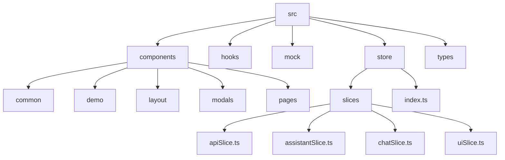
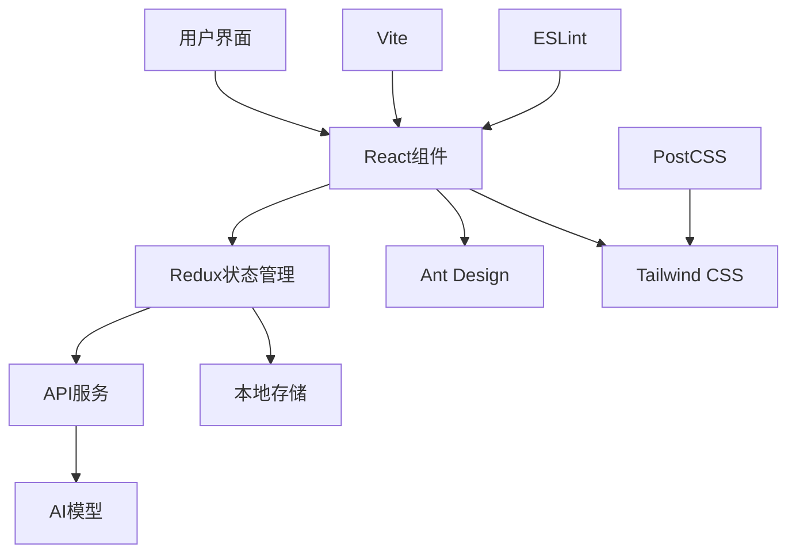
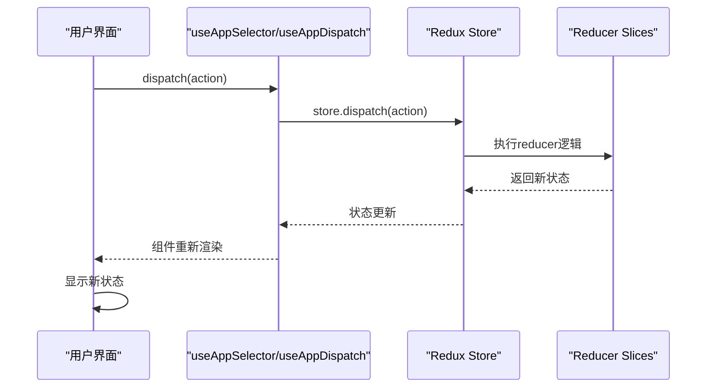
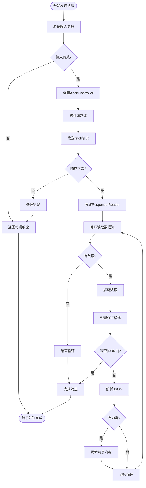
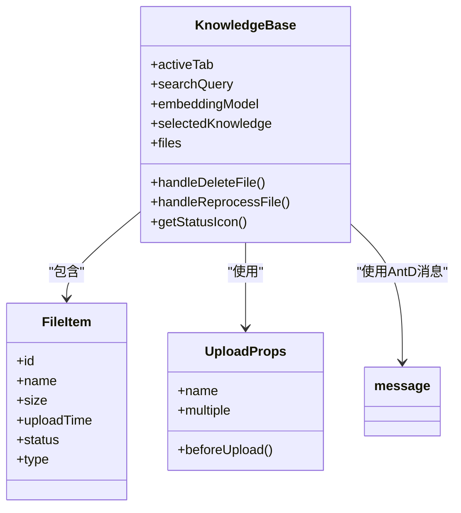

# 开发指南

<cite>
**本文档中引用的文件**  
- [eslint.config.js](file://eslint.config.js)
- [postcss.config.js](file://postcss.config.js)
- [vite.config.ts](file://vite.config.ts)
- [main.tsx](file://src/main.tsx)
- [App.tsx](file://src/App.tsx)
- [index.ts](file://src/store/index.ts)
- [redux.ts](file://src/hooks/redux.ts)
- [chatSlice.ts](file://src/store/slices/chatSlice.ts)
- [useStreamingChat.ts](file://src/hooks/useStreamingChat.ts)
- [KnowledgeBase.tsx](file://src/components/pages/KnowledgeBase.tsx)
- [AppLayout.tsx](file://src/components/layout/AppLayout.tsx)
- [SidePanel.tsx](file://src/components/layout/SidePanel.tsx)
- [TopNavigation.tsx](file://src/components/layout/TopNavigation.tsx)
</cite>

## 目录
1. [简介](#简介)
2. [项目结构](#项目结构)
3. [核心组件](#核心组件)
4. [架构概述](#架构概述)
5. [详细组件分析](#详细组件分析)
6. [依赖分析](#依赖分析)
7. [性能考虑](#性能考虑)
8. [故障排除指南](#故障排除指南)
9. [结论](#结论)

## 简介
本开发指南旨在为贡献者提供全面的开发指导，涵盖代码规范、调试技巧、扩展方法以及测试建议。文档详细说明了项目遵循的ESLint规则和PostCSS处理流程，指导如何启动开发服务器、调试Redux状态变化、编写新组件或Hook。同时介绍了如何添加新页面、集成额外的AI模型提供商或扩展知识库处理能力，并强调了提交前的代码检查、格式化和Git提交规范。

## 项目结构



**图示来源**
- [AppLayout.tsx](file://src/components/layout/AppLayout.tsx#L1-L130)
- [SidePanel.tsx](file://src/components/layout/SidePanel.tsx#L1-L1659)

**本节来源**
- [AppLayout.tsx](file://src/components/layout/AppLayout.tsx#L1-L130)
- [SidePanel.tsx](file://src/components/layout/SidePanel.tsx#L1-L1659)

## 核心组件

本项目采用React + TypeScript + Redux Toolkit技术栈，结合Ant Design UI组件库和Tailwind CSS进行样式管理。核心组件包括布局系统、状态管理、流式聊天功能和知识库管理。

**本节来源**
- [App.tsx](file://src/App.tsx#L1-L62)
- [index.ts](file://src/store/index.ts#L1-L27)
- [useStreamingChat.ts](file://src/hooks/useStreamingChat.ts#L1-L240)

## 架构概述



**图示来源**
- [main.tsx](file://src/main.tsx#L1-L11)
- [App.tsx](file://src/App.tsx#L1-L62)
- [vite.config.ts](file://vite.config.ts#L1-L38)

## 详细组件分析

### 布局系统分析

#### 组件关系图
```mermaid
classDiagram
class AppLayout {
+render()
}
class TopNavigation {
+handleTabChange()
+handleTabEdit()
}
class SidePanel {
+handleAssistantClick()
+handleTopicClick()
+handleCreateNewTopic()
}
class AppLayout --> TopNavigation : "包含"
AppLayout --> SidePanel : "包含"
AppLayout --> MainContent : "包含"
TopNavigation --> Tabs : "使用"
SidePanel --> Assistants : "管理"
SidePanel --> Topics : "管理"
SidePanel --> Settings : "管理"
```

**图示来源**
- [AppLayout.tsx](file://src/components/layout/AppLayout.tsx#L1-L130)
- [TopNavigation.tsx](file://src/components/layout/TopNavigation.tsx#L1-L330)
- [SidePanel.tsx](file://src/components/layout/SidePanel.tsx#L1-L1659)

**本节来源**
- [AppLayout.tsx](file://src/components/layout/AppLayout.tsx#L1-L130)
- [TopNavigation.tsx](file://src/components/layout/TopNavigation.tsx#L1-L330)
- [SidePanel.tsx](file://src/components/layout/SidePanel.tsx#L1-L1659)

### 状态管理分析

#### Redux状态流图


**图示来源**
- [redux.ts](file://src/hooks/redux.ts#L1-L7)
- [index.ts](file://src/store/index.ts#L1-L27)
- [chatSlice.ts](file://src/store/slices/chatSlice.ts#L1-L152)

**本节来源**
- [redux.ts](file://src/hooks/redux.ts#L1-L7)
- [index.ts](file://src/store/index.ts#L1-L27)
- [chatSlice.ts](file://src/store/slices/chatSlice.ts#L1-L152)

### 流式聊天功能分析

#### 流式聊天流程图


**图示来源**
- [useStreamingChat.ts](file://src/hooks/useStreamingChat.ts#L1-L240)

**本节来源**
- [useStreamingChat.ts](file://src/hooks/useStreamingChat.ts#L1-L240)

### 知识库组件分析

#### 知识库功能结构


**图示来源**
- [KnowledgeBase.tsx](file://src/components/pages/KnowledgeBase.tsx#L1-L679)

**本节来源**
- [KnowledgeBase.tsx](file://src/components/pages/KnowledgeBase.tsx#L1-L679)

## 依赖分析

```mermaid
graph TD
A[eslint.config.js] --> B[@eslint/js]
A --> C[globals]
A --> D[eslint-plugin-react-hooks]
A --> E[eslint-plugin-react-refresh]
A --> F[typescript-eslint]
G[postcss.config.js] --> H[@tailwindcss/postcss]
G --> I[autoprefixer]
J[vite.config.ts] --> K[@vitejs/plugin-react]
J --> L[path]
M[package.json] --> N[react]
M --> O[react-dom]
M --> P[antd]
M --> Q[@reduxjs/toolkit]
M --> R[react-redux]
```

**图示来源**
- [eslint.config.js](file://eslint.config.js#L1-L24)
- [postcss.config.js](file://postcss.config.js#L1-L6)
- [vite.config.ts](file://vite.config.ts#L1-L38)
- [package.json](file://package.json)

**本节来源**
- [eslint.config.js](file://eslint.config.js#L1-L24)
- [postcss.config.js](file://postcss.config.js#L1-L6)
- [vite.config.ts](file://vite.config.ts#L1-L38)

## 性能考虑

项目在性能方面进行了多项优化：
1. 使用Vite作为构建工具，提供快速的开发服务器启动和热模块替换
2. 配置了代码分割，将vendor、antd和redux等库分离到不同的chunk中
3. 启用了source map以方便开发调试
4. 使用Redux Toolkit进行状态管理，避免不必要的重新渲染
5. 实现了流式聊天功能，通过SSE逐步接收AI响应，提升用户体验

## 故障排除指南

### 常见问题及解决方案

| 问题现象 | 可能原因 | 解决方案 |
|---------|---------|---------|
| 开发服务器无法启动 | 端口被占用 | 修改vite.config.ts中的端口号 |
| ESLint报错 | 代码不符合规范 | 运行`npm run lint`检查并修复 |
| 样式不生效 | Tailwind CSS未正确处理 | 检查postcss.config.js配置 |
| 状态更新不及时 | Redux选择器问题 | 检查useAppSelector的使用方式 |
| 流式聊天中断 | 网络问题或API错误 | 检查网络连接和API端点 |

**本节来源**
- [vite.config.ts](file://vite.config.ts#L1-L38)
- [eslint.config.js](file://eslint.config.js#L1-L24)
- [postcss.config.js](file://postcss.config.js#L1-L6)
- [useStreamingChat.ts](file://src/hooks/useStreamingChat.ts#L1-L240)

## 结论

本项目构建了一个功能完整的AI写作助手前端应用，采用了现代化的前端技术栈和架构模式。通过详细的开发指南，贡献者可以快速上手项目开发，遵循统一的代码规范，高效地进行功能扩展和维护。建议在开发过程中充分利用ESLint和Prettier等工具确保代码质量，并遵循Git提交规范保持代码库的整洁。