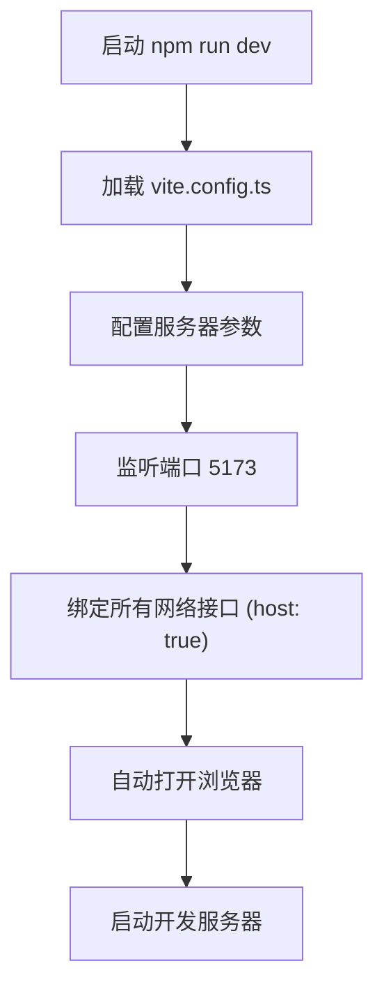
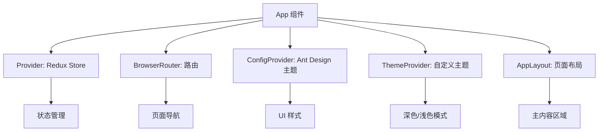
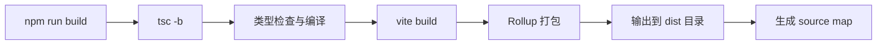

# 快速开始

<cite>
**本文档中引用的文件**  
- [README.md](file://README.md)
- [package.json](file://package.json)
- [vite.config.ts](file://vite.config.ts)
- [main.tsx](file://src/main.tsx)
- [App.tsx](file://src/App.tsx)
</cite>

## 目录
1. [简介](#简介)
2. [项目结构](#项目结构)
3. [安装与运行](#安装与运行)
4. [开发服务器配置](#开发服务器配置)
5. [入口文件与初始化流程](#入口文件与初始化流程)
6. [构建流程](#构建流程)
7. [常见问题排查](#常见问题排查)
8. [总结](#总结)

## 简介
本指南旨在帮助零基础开发者快速上手 `ai-writer-frontend` 项目。通过逐步说明，您将学会如何克隆项目、安装依赖、启动开发服务器以及构建生产版本。本文档基于项目中的 `README.md` 和关键配置文件，确保每一步都清晰易懂。

## 项目结构
以下是 `ai-writer-frontend` 项目的主要目录结构：

```
.
├── src
│   ├── components       # UI 组件
│   ├── hooks            # 自定义 Hook
│   ├── mock             # 模拟数据
│   ├── store            # Redux 状态管理
│   ├── types            # TypeScript 类型定义
│   ├── App.tsx          # 根组件
│   ├── main.tsx         # 应用入口
│   └── vite-env.d.ts    # Vite 环境类型声明
├── public               # 静态资源
├── index.html           # 主 HTML 文件
├── vite.config.ts       # Vite 配置文件
├── tsconfig.json        # TypeScript 配置
├── package.json         # 项目依赖和脚本
└── README.md            # 项目说明文档
```

**Section sources**  
- [README.md](file://README.md#L0-L69)

## 安装与运行
要本地运行 `ai-writer-frontend` 项目，请按照以下步骤操作：

### 1. 克隆项目
```bash
git clone https://github.com/your-repo/ai-writer-frontend.git
cd ai-writer-frontend
```

### 2. 安装依赖
使用 npm 安装项目所需的所有依赖包：
```bash
npm install
```

### 3. 启动开发服务器
运行以下命令启动开发服务器：
```bash
npm run dev
```
该命令会启动 Vite 开发服务器，并自动打开浏览器访问 `http://localhost:5173`。

### 4. 构建生产版本
构建用于部署的生产版本：
```bash
npm run build
```
构建后的文件将输出到 `dist` 目录。

**Section sources**  
- [package.json](file://package.json#L5-L10)

## 开发服务器配置
开发服务器的配置由 `vite.config.ts` 文件定义，主要包含端口、主机绑定和自动打开浏览器等设置。



**Diagram sources**  
- [vite.config.ts](file://vite.config.ts#L10-L18)

**Section sources**  
- [vite.config.ts](file://vite.config.ts#L10-L18)

## 入口文件与初始化流程
`src/main.tsx` 是应用的入口文件，负责渲染根组件 `App.tsx`。

### main.tsx 的作用
```typescript
import { StrictMode } from 'react'
import { createRoot } from 'react-dom/client'
import './index.css'
import App from './App.tsx'

createRoot(document.getElementById('root')!).render(
  <StrictMode>
    <App />
  </StrictMode>,
)
```
该文件通过 `createRoot` 将 `App` 组件挂载到 DOM 中的 `#root` 元素上，并启用 React 严格模式以帮助发现潜在问题。

### App.tsx 的初始化过程
`App.tsx` 是应用的根组件，负责整合 Redux、路由、主题等全局配置。



**Diagram sources**  
- [main.tsx](file://src/main.tsx#L1-L10)
- [App.tsx](file://src/App.tsx#L1-L60)

**Section sources**  
- [main.tsx](file://src/main.tsx#L1-L10)
- [App.tsx](file://src/App.tsx#L1-L60)

## 构建流程
构建流程由 `package.json` 中的 `build` 脚本定义：

```json
"scripts": {
  "build": "tsc -b && vite build"
}
```

该命令首先使用 TypeScript 编译器（`tsc -b`）进行类型检查和编译，然后调用 `vite build` 执行打包操作。构建输出目录为 `dist`，并生成 source map 以便调试。



**Diagram sources**  
- [vite.config.ts](file://vite.config.ts#L19-L28)
- [package.json](file://package.json#L8-L8)

**Section sources**  
- [vite.config.ts](file://vite.config.ts#L19-L28)
- [package.json](file://package.json#L8-L8)

## 常见问题排查
在运行项目时可能会遇到一些常见问题，以下是解决方案：

### 端口占用
如果端口 `5173` 已被占用，可在 `vite.config.ts` 中修改端口号：
```ts
server: {
  port: 5174, // 修改为其他端口
  host: true,
  open: true,
}
```

### 依赖冲突
若出现依赖版本冲突，可尝试清除缓存并重新安装：
```bash
rm -rf node_modules package-lock.json
npm cache clean --force
npm install
```

### 环境变量缺失
项目可能依赖 `.env` 文件中的环境变量。请检查是否存在 `.env` 文件，并确保包含必要的配置项，如 API 地址：
```
VITE_API_URL=http://localhost:3000/api
```

### TypeScript 类型错误
若构建时报类型错误，请检查 `tsconfig.app.json` 是否正确配置路径别名：
```json
"paths": {
  "@/*": ["src/*"]
}
```

**Section sources**  
- [vite.config.ts](file://vite.config.ts#L10-L18)
- [tsconfig.app.json](file://tsconfig.app.json#L20-L22)

## 总结
通过本指南，您已掌握了如何从零开始运行 `ai-writer-frontend` 项目。包括安装依赖、启动开发服务器、理解入口文件和构建流程。同时提供了常见问题的解决方案，确保即使是没有经验的开发者也能顺利上手。

**Section sources**  
- [README.md](file://README.md#L0-L69)
- [package.json](file://package.json#L5-L10)