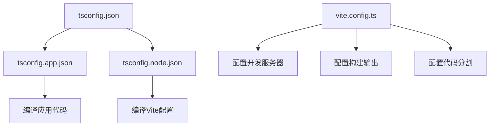
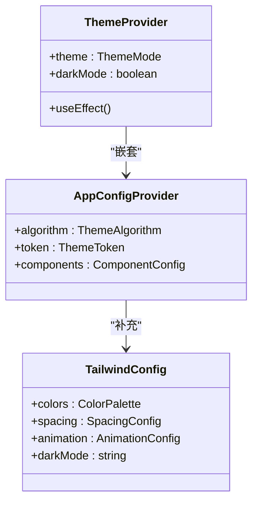

# 技术栈与依赖

<cite>
**本文档引用的文件**   
- [package.json](file://package.json)
- [tsconfig.json](file://tsconfig.json)
- [tsconfig.app.json](file://tsconfig.app.json)
- [tsconfig.node.json](file://tsconfig.node.json)
- [vite.config.ts](file://vite.config.ts)
- [tailwind.config.js](file://tailwind.config.js)
- [App.tsx](file://src/App.tsx)
- [store/index.ts](file://src/store/index.ts)
- [store/slices/uiSlice.ts](file://src/store/slices/uiSlice.ts)
- [components/common/ThemeProvider.tsx](file://src/components/common/ThemeProvider.tsx)
- [components/layout/AppLayout.tsx](file://src/components/layout/AppLayout.tsx)
- [components/layout/TopNavigation.tsx](file://src/components/layout/TopNavigation.tsx)
- [components/layout/SidePanel.tsx](file://src/components/layout/SidePanel.tsx)
</cite>

## 目录
1. [技术栈概览](#技术栈概览)
2. [TypeScript类型安全](#typescript类型安全)
3. [React 19组件模型](#react-19组件模型)
4. [Redux Toolkit状态管理](#redux-toolkit状态管理)
5. [Vite构建工具](#vite构建工具)
6. [编译与构建配置](#编译与构建配置)
7. [UI组件库集成](#ui组件库集成)
8. [环境搭建与依赖管理](#环境搭建与依赖管理)

## 技术栈概览

本项目采用现代化前端技术栈，以TypeScript为核心语言，React 19为UI框架，Redux Toolkit进行状态管理，Vite作为构建工具，并集成Ant Design UI组件库。项目通过Tailwind CSS实现原子化样式设计，结合styled-components进行组件样式定制。这种技术组合提供了类型安全、高性能开发体验和现代化的UI设计能力。

**Section sources**
- [package.json](file://package.json#L1-L42)

## TypeScript类型安全

项目通过TypeScript实现了全面的类型安全。在`tsconfig.app.json`中配置了严格的编译选项，包括`strict`、`noUnusedLocals`和`noUnusedParameters`，确保代码的类型安全性和质量。项目使用模块化配置，通过`tsconfig.json`引用`tsconfig.app.json`和`tsconfig.node.json`，分别处理应用代码和Node.js环境代码的编译。

类型系统在项目中得到广泛应用，如在`uiSlice.ts`中定义了精确的UI状态类型，包括主题模式、侧边栏状态和标签管理等。这种强类型设计减少了运行时错误，提高了代码可维护性，并为开发者提供了更好的代码提示和自动补全体验。

**Section sources**
- [tsconfig.json](file://tsconfig.json#L1-L7)
- [tsconfig.app.json](file://tsconfig.app.json#L1-L33)
- [tsconfig.node.json](file://tsconfig.node.json#L1-L25)
- [store/slices/uiSlice.ts](file://src/store/slices/uiSlice.ts#L1-L148)

## React 19组件模型

项目采用React 19的组件模型设计，充分利用函数组件和Hooks的优势。组件结构清晰，分为common、layout、modals和pages等目录，实现了关注点分离。`AppLayout.tsx`作为主布局组件，通过组合`TopNavigation`、`SidePanel`和`MainContent`等子组件构建应用界面。

组件间通过props和Redux状态进行通信，实现了良好的解耦。`ThemeProvider.tsx`作为高阶组件，负责主题管理，通过`useAppSelector` Hook订阅Redux状态，实现了主题的动态切换。这种组件化设计提高了代码复用性，便于维护和测试。

**Section sources**
- [App.tsx](file://src/App.tsx#L1-L61)
- [components/common/ThemeProvider.tsx](file://src/components/common/ThemeProvider.tsx#L1-L85)
- [components/layout/AppLayout.tsx](file://src/components/layout/AppLayout.tsx#L1-L129)

## Redux Toolkit状态管理

项目使用Redux Toolkit进行全局状态管理，通过`configureStore`创建store，并整合多个slice。`store/index.ts`中定义了`uiSlice`、`chatSlice`、`assistantSlice`和`apiSlice`，分别管理UI状态、聊天数据、助手信息和API请求。

`uiSlice.ts`展示了Redux Toolkit的典型用法，通过`createSlice`自动生成action和reducer，简化了状态管理代码。slice中定义了丰富的reducer函数，如`toggleSidebar`、`setTheme`和`addTab`，实现了对UI状态的细粒度控制。这种集中式状态管理确保了应用状态的一致性和可预测性。

**Section sources**
- [store/index.ts](file://src/store/index.ts#L1-L26)
- [store/slices/uiSlice.ts](file://src/store/slices/uiSlice.ts#L1-L148)

## Vite构建工具

项目采用Vite作为构建工具，提供了卓越的开发体验。`vite.config.ts`中配置了React插件、路径别名和服务器选项。Vite的ES模块原生支持实现了快速的冷启动和热模块替换（HMR），显著提升了开发效率。

构建配置中定义了代码分割策略，通过`manualChunks`将vendor、antd和redux等依赖分离，优化了生产环境的加载性能。服务器配置设置了开发端口、主机访问和自动打开浏览器，为开发者提供了便捷的开发环境。

**Section sources**
- [vite.config.ts](file://vite.config.ts#L1-L37)
- [package.json](file://package.json#L6-L9)

## 编译与构建配置

### TypeScript编译配置

项目采用多层TypeScript配置体系。`tsconfig.json`作为根配置文件，通过`references`引入`tsconfig.app.json`和`tsconfig.node.json`。应用配置`tsconfig.app.json`设置了目标为ES2022，启用了`verbatimModuleSyntax`和`moduleResolution: bundler`，与Vite构建系统完美集成。

编译选项中`baseUrl`和`paths`配置了`@/*`路径别名，指向`src`目录，简化了模块导入。严格模式选项确保了代码质量，而`skipLibCheck`则提高了编译速度。

### Vite构建配置

`vite.config.ts`中的配置体现了现代前端工程化最佳实践。路径别名`@`指向`src`目录，与TypeScript配置保持一致。构建输出配置了sourcemap，便于生产环境调试。`define`选项注入了`__DEV__`全局常量，支持开发环境特性。

**Diagram sources**
- [tsconfig.json](file://tsconfig.json#L1-L7)
- [tsconfig.app.json](file://tsconfig.app.json#L1-L33)
- [tsconfig.node.json](file://tsconfig.node.json#L1-L25)
- [vite.config.ts](file://vite.config.ts#L1-L37)

**Section sources**
- [tsconfig.json](file://tsconfig.json#L1-L7)
- [tsconfig.app.json](file://tsconfig.app.json#L1-L33)
- [tsconfig.node.json](file://tsconfig.node.json#L1-L25)
- [vite.config.ts](file://vite.config.ts#L1-L37)

## UI组件库集成

### Tailwind CSS配置

`tailwind.config.js`中定义了丰富的主题配置，包括多种色彩系统（primary、chatgpt、claude、dark）和自定义间距、动画。通过`content`配置指定了需要扫描的文件范围，确保生成的CSS类完整。

主题配置支持深色模式切换，通过`darkMode: 'class'`实现基于CSS类的深色模式控制。自定义动画如`slide-in`和`fade-in`为UI交互提供了流畅的视觉效果。

### Ant Design集成

项目通过`ConfigProvider`集成Ant Design，在`App.tsx`中统一配置主题。配置包括算法选择（根据深色模式切换）、主色调、圆角半径和字体族。组件特定配置如Button、Input和Card的样式也被统一设置，确保UI一致性。

**Diagram sources**
- [tailwind.config.js](file://tailwind.config.js#L1-L69)
- [App.tsx](file://src/App.tsx#L1-L61)
- [components/common/ThemeProvider.tsx](file://src/components/common/ThemeProvider.tsx#L1-L85)

**Section sources**
- [tailwind.config.js](file://tailwind.config.js#L1-L69)
- [App.tsx](file://src/App.tsx#L1-L61)
- [components/common/ThemeProvider.tsx](file://src/components/common/ThemeProvider.tsx#L1-L85)

## 环境搭建与依赖管理

### 依赖管理策略

`package.json`中明确区分了dependencies和devDependencies。生产依赖包括React、Redux Toolkit、Ant Design等核心库，而开发依赖包含TypeScript、ESLint和Vite相关工具。这种分离确保了生产环境的轻量化。

版本管理采用`^`符号，允许向后兼容的更新，平衡了稳定性与新特性获取。TypeScript版本锁定为`~5.8.3`，确保类型系统的一致性。

### 开发环境配置

项目提供了完整的开发脚本：`dev`启动开发服务器，`build`执行类型检查和生产构建，`lint`进行代码质量检查，`preview`预览生产构建结果。这种标准化的脚本配置降低了新开发者的学习成本。

最佳实践建议包括：使用路径别名简化导入、遵循TypeScript严格模式、利用Redux Toolkit的现代化API、通过Vite插件扩展功能，以及采用Tailwind CSS的原子化设计原则。

**Section sources**
- [package.json](file://package.json#L1-L42)
- [vite.config.ts](file://vite.config.ts#L1-L37)
- [eslint.config.js](file://eslint.config.js#L1-L10)
- [postcss.config.js](file://postcss.config.js#L1-L5)