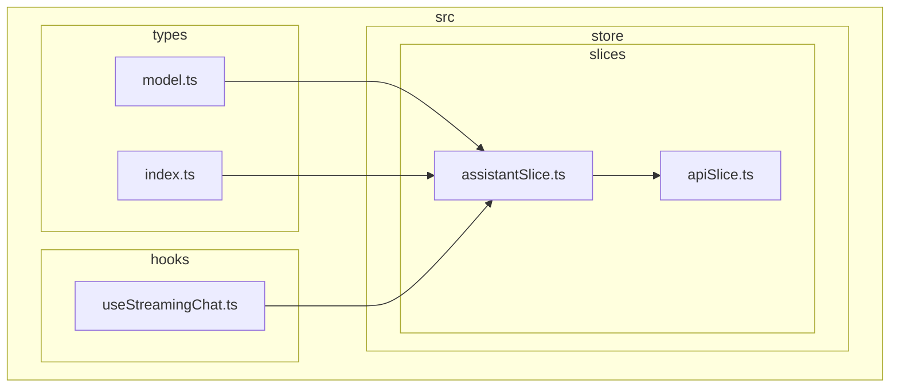
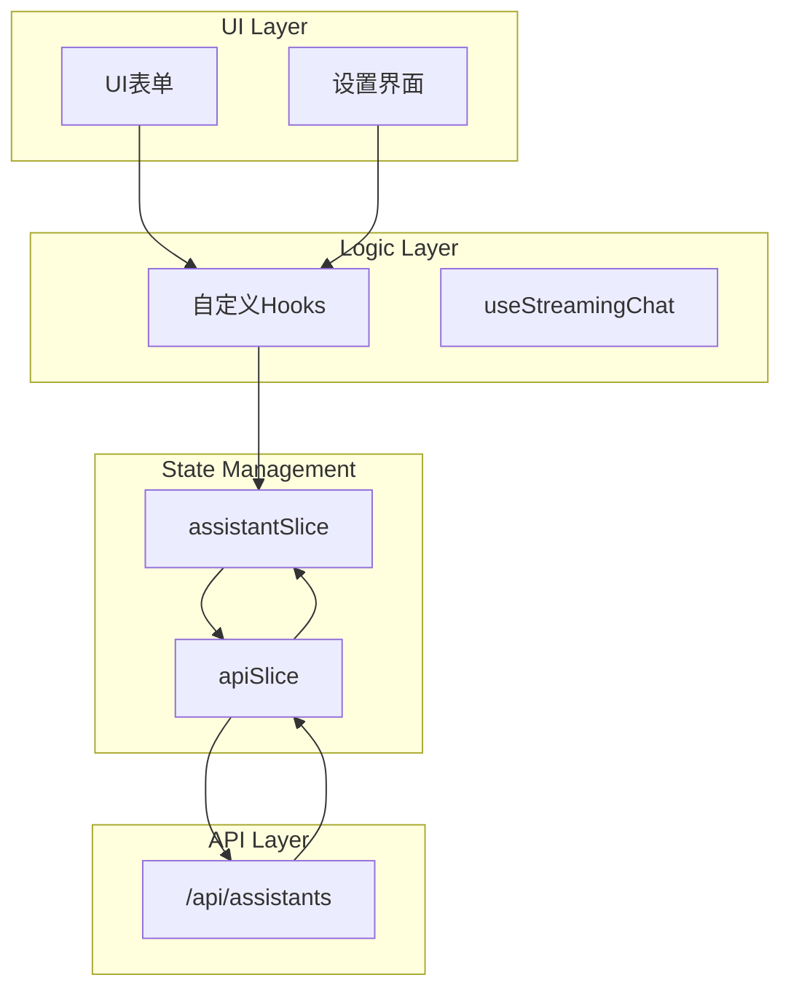
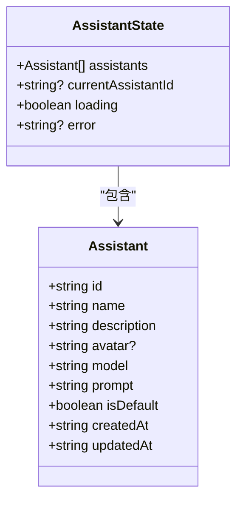
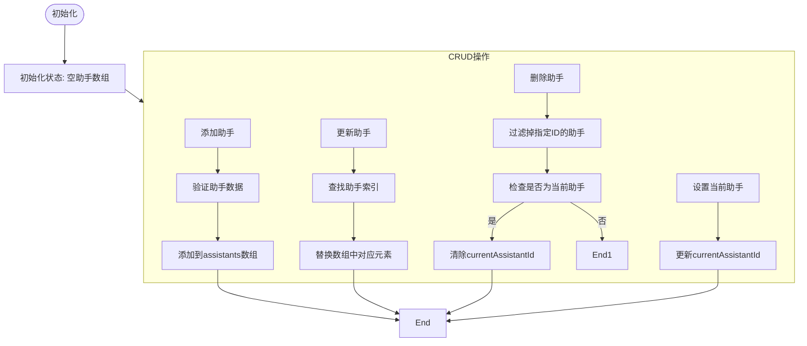
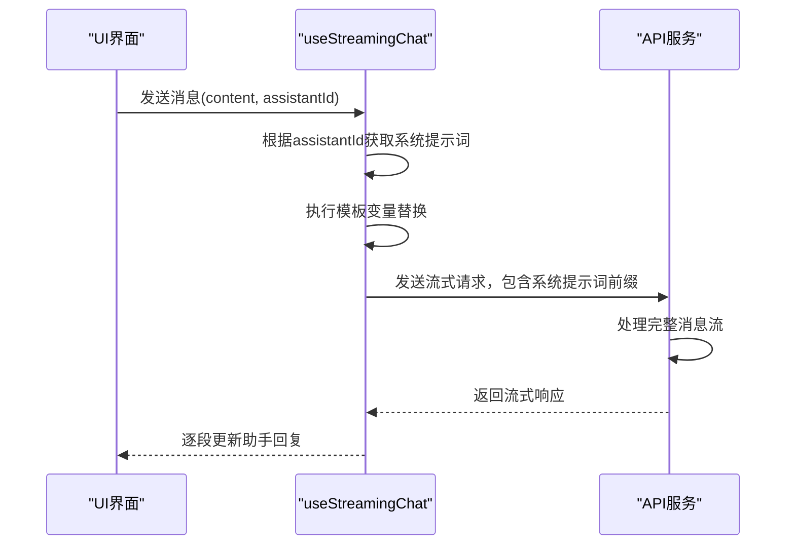
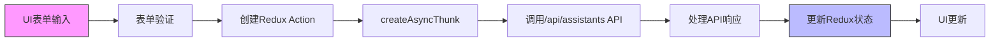
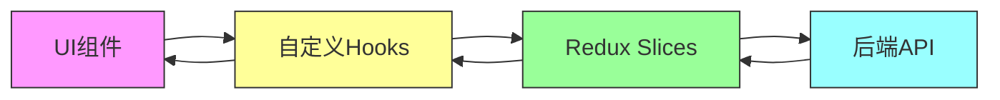

# 助手模型

<cite>
**本文档引用的文件**   
- [model.ts](file://src/types/model.ts)
- [assistantSlice.ts](file://src/store/slices/assistantSlice.ts)
- [apiSlice.ts](file://src/store/slices/apiSlice.ts)
- [useStreamingChat.ts](file://src/hooks/useStreamingChat.ts)
- [index.ts](file://src/types/index.ts)
</cite>

## 目录
1. [介绍](#介绍)
2. [项目结构](#项目结构)
3. [核心组件](#核心组件)
4. [架构概述](#架构概述)
5. [详细组件分析](#详细组件分析)
6. [依赖分析](#依赖分析)
7. [性能考虑](#性能考虑)
8. [故障排除指南](#故障排除指南)
9. [结论](#结论)

## 介绍
本文档详细阐述了AI助手数据模型的技术实现，基于`model.ts`中的`Assistant`接口展开。文档详述了助手配置字段的用途与约束条件，分析了`assistantSlice`中助手状态的管理逻辑，解释了系统提示词的注入时机和模板变量替换逻辑，并提供了从UI表单到Redux action的完整数据流示例。

## 项目结构
项目采用典型的React + Redux架构，主要目录结构包括组件、钩子、状态管理切片和类型定义。核心的助手功能相关代码分布在`src/types`、`src/store/slices`和`src/hooks`目录中。

**Diagram sources**
- [model.ts](file://src/types/model.ts)
- [assistantSlice.ts](file://src/store/slices/assistantSlice.ts)
- [apiSlice.ts](file://src/store/slices/apiSlice.ts)

**Section sources**
- [model.ts](file://src/types/model.ts)
- [assistantSlice.ts](file://src/store/slices/assistantSlice.ts)

## 核心组件
核心组件包括`Assistant`数据模型、`assistantSlice`状态管理器和相关的API交互逻辑。这些组件共同实现了助手的创建、读取、更新和删除（CRUD）操作，以及助手配置的持久化存储。

**Section sources**
- [model.ts](file://src/types/model.ts#L13-L23)
- [assistantSlice.ts](file://src/store/slices/assistantSlice.ts#L4-L14)
- [index.ts](file://src/types/index.ts#L13-L23)

## 架构概述
系统采用Redux Toolkit进行状态管理，通过`createSlice`创建`assistantSlice`来管理助手状态。API交互通过`apiSlice`中的`createApi`实现，使用RTK Query进行数据获取和变更。UI层通过自定义hooks与状态管理器交互。

**Diagram sources**
- [assistantSlice.ts](file://src/store/slices/assistantSlice.ts)
- [apiSlice.ts](file://src/store/slices/apiSlice.ts)
- [useStreamingChat.ts](file://src/hooks/useStreamingChat.ts)

## 详细组件分析

### 助手数据模型分析
`Assistant`接口定义了助手的核心属性，包括标识、名称、描述、模型配置和提示词等。

**Diagram sources**
- [model.ts](file://src/types/model.ts#L13-L23)
- [index.ts](file://src/types/index.ts#L13-L23)
- [assistantSlice.ts](file://src/store/slices/assistantSlice.ts#L4-L14)

#### 配置字段说明
`Assistant`接口中的配置字段具有特定的用途和约束条件：

- **id**: 助手的唯一标识符，字符串类型
- **name**: 助手名称，字符串类型，用于UI显示
- **description**: 助手描述，字符串类型，提供助手功能说明
- **model**: 使用的AI模型标识，字符串类型
- **prompt**: 系统提示词模板，字符串类型，在流式请求前缀中注入
- **isDefault**: 是否为默认助手，布尔类型
- **createdAt/updatedAt**: 创建和更新时间戳，ISO格式字符串

**Section sources**
- [model.ts](file://src/types/model.ts#L13-L23)
- [index.ts](file://src/types/index.ts#L13-L23)

### 助手状态管理分析
`assistantSlice`实现了助手状态的完整管理逻辑，包括增删改查和当前助手切换。

**Diagram sources**
- [assistantSlice.ts](file://src/store/slices/assistantSlice.ts#L23-L72)

#### 状态管理逻辑
`assistantSlice`定义了完整的助手状态管理逻辑：

- **初始状态**: 包含空的助手数组和未设置的当前助手ID
- **添加助手**: 将新助手推入`assistants`数组
- **更新助手**: 查找指定ID的助手并替换其数据
- **删除助手**: 从数组中过滤掉指定ID的助手，若删除的是当前助手则清除`currentAssistantId`
- **设置当前助手**: 更新`currentAssistantId`以切换激活的助手

**Section sources**
- [assistantSlice.ts](file://src/store/slices/assistantSlice.ts)

### 系统提示词处理分析
系统提示词在聊天流式请求的前缀中注入，并支持模板变量替换。

**Diagram sources**
- [useStreamingChat.ts](file://src/hooks/useStreamingChat.ts)
- [assistantSlice.ts](file://src/store/slices/assistantSlice.ts)

#### 提示词注入机制
系统提示词在流式请求时注入：

1. 当用户发送消息时，`useStreamingChat`钩子获取当前助手的`prompt`字段
2. 执行模板变量替换（如`{userName}`等变量）
3. 将处理后的系统提示词作为对话前缀发送到API
4. 后端服务将系统提示词作为上下文的一部分传递给AI模型

**Section sources**
- [useStreamingChat.ts](file://src/hooks/useStreamingChat.ts#L1-L239)
- [assistantSlice.ts](file://src/store/slices/assistantSlice.ts)

### 数据流分析
从UI表单到Redux action的完整数据流展示了助手配置的持久化处理过程。

**Diagram sources**
- [apiSlice.ts](file://src/store/slices/apiSlice.ts)
- [assistantSlice.ts](file://src/store/slices/assistantSlice.ts)

#### 完整数据流示例
从UI到持久化的完整数据流：

1. 用户在UI表单中修改助手配置
2. 表单提交触发`updateAssistant` action
3. `createAsyncThunk`处理异步逻辑，调用`updateAssistantMutation`
4. 发送PUT请求到`/api/assistants/{id}`端点
5. API成功响应后，`assistantSlice`更新本地状态
6. UI组件重新渲染，显示更新后的助手配置

**Section sources**
- [apiSlice.ts](file://src/store/slices/apiSlice.ts)
- [assistantSlice.ts](file://src/store/slices/assistantSlice.ts)

## 依赖分析
系统各组件之间存在明确的依赖关系，形成了清晰的调用链。

**Diagram sources**
- [store/index.ts](file://src/store/index.ts)
- [apiSlice.ts](file://src/store/slices/apiSlice.ts)

## 性能考虑
系统在状态管理和API交互方面进行了优化：

- 使用Redux Toolkit的`createSlice`和`createApi`减少样板代码
- RTK Query的缓存机制避免了重复的API请求
- 流式响应处理提供了更好的用户体验
- 状态规范化减少了不必要的重新渲染

## 故障排除指南
常见问题及解决方案：

- **助手列表为空**: 检查`useGetAssistantsQuery`是否成功获取数据
- **无法保存助手配置**: 确认API端点`/api/assistants/{id}`是否可访问
- **系统提示词未生效**: 检查`useStreamingChat`是否正确注入了`prompt`
- **状态更新不及时**: 验证Redux action是否正确分发

**Section sources**
- [apiSlice.ts](file://src/store/slices/apiSlice.ts)
- [useStreamingChat.ts](file://src/hooks/useStreamingChat.ts)

## 结论
本文档详细分析了助手数据模型的技术实现，涵盖了从数据结构定义到状态管理、API交互和UI集成的完整流程。系统采用现代化的React + Redux架构，通过清晰的组件分离和类型定义确保了代码的可维护性和可扩展性。