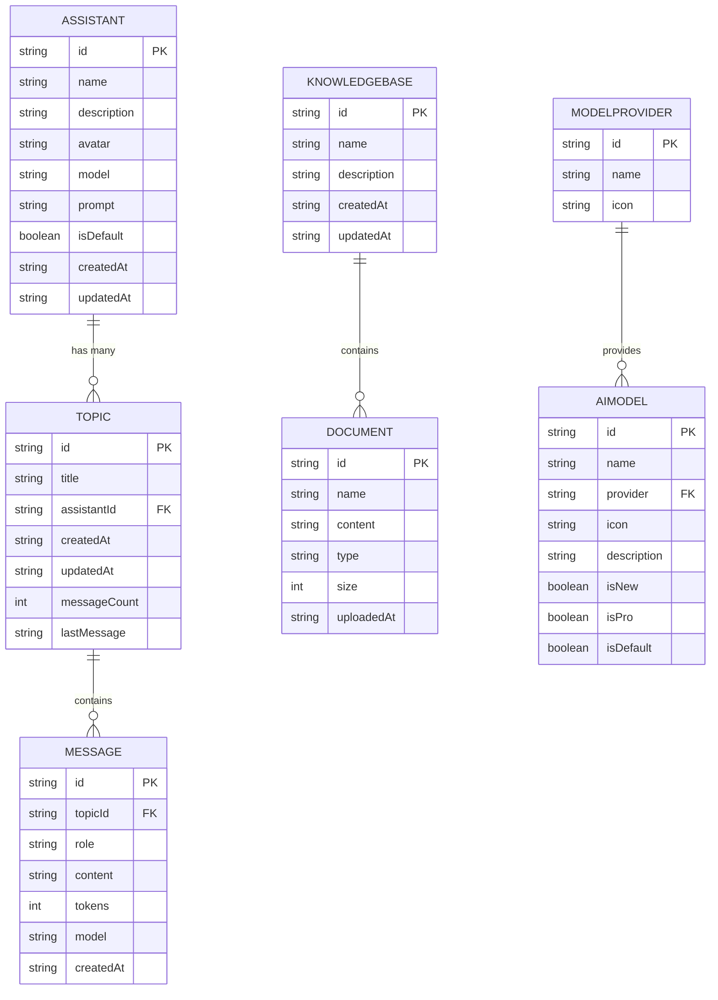

# 数据模型

<cite>
**本文档引用的文件**  
- [model.ts](file://src/types/model.ts)
- [index.ts](file://src/types/index.ts)
- [chatSlice.ts](file://src/store/slices/chatSlice.ts)
- [assistantSlice.ts](file://src/store/slices/assistantSlice.ts)
- [apiSlice.ts](file://src/store/slices/apiSlice.ts)
- [uiSlice.ts](file://src/store/slices/uiSlice.ts)
</cite>

## 目录
1. [引言](#引言)
2. [核心实体定义](#核心实体定义)
3. [实体关系图](#实体关系图)
4. [数据生命周期与操作](#数据生命周期与操作)
5. [API交互格式示例](#api交互格式示例)
6. [前端类型安全操作](#前端类型安全操作)
7. [验证规则](#验证规则)
8. [总结](#总结)

## 引言
本数据模型文档旨在全面定义AI写作前端系统中的核心数据实体及其相互关系。基于`types/model.ts`和`types/index.ts`中的TypeScript接口定义，详细说明了Message、Topic、Assistant、KnowledgeBase等关键类型的字段结构、数据类型与业务含义。同时，结合Redux状态管理（chatSlice、assistantSlice）和API接口定义，阐明了数据的生命周期、序列化格式和交互规范，为前后端协作提供清晰的数据契约。

## 核心实体定义

### 助手 (Assistant)
代表一个AI助手实例，包含其配置和元数据。

**字段结构：**
- `id`: 字符串 - 助手的唯一标识符
- `name`: 字符串 - 助手的显示名称
- `description`: 字符串 - 助手的功能描述
- `avatar`: 字符串（可选） - 助手的头像URL
- `model`: 字符串 - 关联的AI模型ID
- `prompt`: 字符串 - 助手的系统提示词（System Prompt）
- `isDefault`: 布尔值 - 是否为默认助手
- `createdAt`: 字符串 - 创建时间（ISO 8601格式）
- `updatedAt`: 字符串 - 更新时间（ISO 8601格式）

**业务含义：** 助手是用户与AI交互的核心配置单元，决定了对话的风格、能力和底层模型。

**Section sources**
- [index.ts](file://src/types/index.ts#L13-L22)
- [assistantSlice.ts](file://src/store/slices/assistantSlice.ts#L5-L14)

### 话题 (Topic)
代表一次具体的对话会话，是消息的容器。

**字段结构：**
- `id`: 字符串 - 话题的唯一标识符
- `title`: 字符串 - 话题的标题
- `assistantId`: 字符串 - 关联的助手ID
- `createdAt`: 字符串 - 创建时间（ISO 8601格式）
- `updatedAt`: 字符串 - 最后更新时间（ISO 8601格式）
- `messageCount`: 数字 - 该话题下的消息总数
- `lastMessage`: 字符串（可选） - 最后一条消息的摘要（前100个字符）

**业务含义：** 话题用于组织和管理与特定助手的多次对话，是用户进行多线程AI交互的基础。

**Section sources**
- [index.ts](file://src/types/index.ts#L24-L31)
- [chatSlice.ts](file://src/store/slices/chatSlice.ts#L17-L24)

### 消息 (Message)
代表一次具体的用户或助手的发言。

**字段结构：**
- `id`: 字符串 - 消息的唯一标识符
- `topicId`: 字符串 - 所属话题的ID
- `role`: 枚举（'user' | 'assistant'） - 消息发送者的角色
- `content`: 字符串 - 消息的文本内容
- `tokens`: 数字（可选） - 内容消耗的token数量
- `model`: 字符串（可选） - 生成此消息所使用的模型
- `createdAt`: 字符串 - 创建时间（ISO 8601格式）
- `attachments`: 附件数组（可选） - 附加的文件或图片

**业务含义：** 消息是对话的基本单元，记录了用户输入和AI响应的完整内容。

**Section sources**
- [index.ts](file://src/types/index.ts#L33-L41)
- [chatSlice.ts](file://src/store/slices/chatSlice.ts#L5-L15)

### 附件 (Attachment)
代表消息中附加的文件。

**字段结构：**
- `id`: 字符串 - 附件的唯一标识符
- `type`: 枚举（'image' | 'file' | 'document'） - 附件类型
- `name`: 字符串 - 附件的原始文件名
- `url`: 字符串 - 附件的访问URL
- `size`: 数字 - 附件大小（字节）
- `mimeType`: 字符串 - 附件的MIME类型

**业务含义：** 支持在对话中上传和引用图片、文档等文件，扩展了AI的输入能力。

**Section sources**
- [index.ts](file://src/types/index.ts#L43-L49)

### 知识库 (KnowledgeBase)
代表一个用户自定义的知识库，包含多个文档。

**字段结构：**
- `id`: 字符串 - 知识库的唯一标识符
- `name`: 字符串 - 知识库的名称
- `description`: 字符串 - 知识库的描述
- `documents`: 文档数组 - 知识库中包含的文档列表
- `createdAt`: 字符串 - 创建时间（ISO 8601格式）
- `updatedAt`: 字符串 - 更新时间（ISO 8601格式）

**业务含义：** 知识库允许用户上传私有文档，为AI提供额外的上下文信息，实现个性化和专业化的问答。

**Section sources**
- [index.ts](file://src/types/index.ts#L51-L57)

### 文档 (Document)
代表知识库中的一个具体文档。

**字段结构：**
- `id`: 字符串 - 文档的唯一标识符
- `name`: 字符串 - 文档的名称
- `content`: 字符串 - 文档的文本内容（已解析）
- `type`: 字符串 - 文档的原始类型（如pdf, docx）
- `size`: 数字 - 文档大小（字节）
- `uploadedAt`: 字符串 - 上传时间（ISO 8601格式）

**业务含义：** 文档是知识库的构成单元，存储了用户上传文件的元数据和内容。

**Section sources**
- [index.ts](file://src/types/index.ts#L59-L65)

### AI模型 (AIModel)
代表一个可用的AI大模型。

**字段结构：**
- `id`: 字符串 - 模型的唯一标识符（如claude-3-5-sonnet）
- `name`: 字符串 - 模型的显示名称
- `provider`: 字符串 - 模型提供商（如anthropic, openai）
- `icon`: 字符串（可选） - 模型图标的URL
- `capabilities`: 字符串数组（可选） - 模型的能力标签（如code, vision）
- `description`: 字符串（可选） - 模型的详细描述
- `isNew`: 布尔值（可选） - 是否为新模型
- `isPro`: 布尔值（可选） - 是否为专业版模型
- `isDefault`: 布尔值（可选） - 是否为默认选择

**业务含义：** 定义了系统支持的AI模型及其特性，供用户在创建助手时选择。

**Section sources**
- [model.ts](file://src/types/model.ts#L2-L12)

## 实体关系图



**Diagram sources**
- [index.ts](file://src/types/index.ts#L13-L71)
- [model.ts](file://src/types/model.ts#L2-L25)

## 数据生命周期与操作

### 聊天状态 (chatSlice)
`chatSlice`管理着话题和消息的嵌套关系。其状态结构如下：
- `topics`: 话题对象数组，存储所有话题的元数据。
- `messages`: 一个以`topicId`为键的对象，其值为该话题下的消息数组。这种结构实现了高效的消息查询和更新。

**嵌套关系示例：**
```typescript
{
  topics: [
    { id: "t1", title: "项目计划", assistantId: "a1", ... }
  ],
  messages: {
    "t1": [
      { id: "m1", role: "user", content: "帮我写个计划", ... },
      { id: "m2", role: "assistant", content: "好的，这是您的计划...", ... }
    ]
  },
  currentTopicId: "t1"
}
```

**Section sources**
- [chatSlice.ts](file://src/store/slices/chatSlice.ts#L26-L37)

### 助手状态 (assistantSlice)
`assistantSlice`管理助手的配置，其序列化格式为：
- `assistants`: 助手对象数组，存储所有助手的完整配置。
- `currentAssistantId`: 当前激活的助手ID。

**序列化格式示例：**
```typescript
{
  assistants: [
    {
      id: "a1",
      name: "写作助手",
      model: "claude-3-5-sonnet",
      prompt: "你是一个专业的文案写手...",
      ...
    }
  ],
  currentAssistantId: "a1"
}
```

**Section sources**
- [assistantSlice.ts](file://src/store/slices/assistantSlice.ts#L16-L23)

### 数据生命周期
1. **创建 (Create):**
   - 通过`createTopic`或`createAssistant`等API创建新实体。
   - Redux状态通过`addTopic`或`addAssistant`等reducer更新。
2. **读取 (Read):**
   - 通过`getTopics`、`getMessages`等API获取数据。
   - 数据被缓存在Redux store中，由RTK Query管理。
3. **更新 (Update):**
   - 通过`updateTopic`、`updateMessage`等API修改实体。
   - Redux状态通过`updateTopic`、`updateMessage`等reducer同步。
4. **删除 (Delete):**
   - 通过`deleteTopic`、`deleteMessage`等API移除实体。
   - Redux状态通过`deleteTopic`、`deleteMessage`等reducer清理相关数据。

**Section sources**
- [apiSlice.ts](file://src/store/slices/apiSlice.ts#L125-L270)
- [chatSlice.ts](file://src/store/slices/chatSlice.ts#L50-L140)
- [assistantSlice.ts](file://src/store/slices/assistantSlice.ts#L40-L60)

## API交互格式示例

### 创建话题请求
```json
{
  "title": "市场分析报告",
  "assistantId": "a1"
}
```
**响应：**
```json
{
  "success": true,
  "data": {
    "id": "t2",
    "title": "市场分析报告",
    "assistantId": "a1",
    "createdAt": "2023-10-01T10:00:00Z",
    "updatedAt": "2023-10-01T10:00:00Z",
    "messageCount": 0
  }
}
```

### 发送消息请求
```json
{
  "content": "请根据附件中的数据生成一份报告。",
  "attachments": [
    {
      "id": "att1",
      "type": "document",
      "name": "sales_data.xlsx",
      "url": "/uploads/sales_data.xlsx",
      "size": 10240,
      "mimeType": "application/vnd.openxmlformats-officedocument.spreadsheetml.sheet"
    }
  ]
}
```
**响应：**
```json
{
  "success": true,
  "data": {
    "id": "m3",
    "topicId": "t2",
    "role": "user",
    "content": "请根据附件中的数据生成一份报告。",
    "attachments": [...],
    "createdAt": "2023-10-01T10:05:00Z"
  }
}
```

**Section sources**
- [apiSlice.ts](file://src/store/slices/apiSlice.ts#L150-L160)
- [index.ts](file://src/types/index.ts#L91-L96)

## 前端类型安全操作

前端通过TypeScript接口和Redux Toolkit实现了类型安全的数据操作。

### 类型导入与使用
```typescript
import { Assistant, Topic, Message } from '@/types/index';

// 类型安全的函数参数
function createNewTopic(title: string, assistant: Assistant): Topic {
  return {
    id: generateId(),
    title,
    assistantId: assistant.id,
    createdAt: new Date().toISOString(),
    updatedAt: new Date().toISOString(),
    messageCount: 0,
  };
}
```

### Redux Action 类型安全
Redux Toolkit的`createSlice`会自动生成类型安全的actions和reducers。
```typescript
// chatSlice.ts 中定义的 action
addTopic: (state, action: PayloadAction<Topic>) => { ... }

// 在组件中分发时，TypeScript会强制检查 payload 类型
dispatch(addTopic(newTopic)); // newTopic 必须符合 Topic 接口
```

### API Hook 类型安全
RTK Query生成的hooks具有完整的类型推断。
```typescript
// useGetTopicsQuery 的返回值类型是 UseQueryHookResult<ApiResponse<Topic[]>, void>
const { data, error, isLoading } = useGetTopicsQuery();

if (data?.success) {
  // data.data 的类型被推断为 Topic[]
  data.data.forEach(topic => {
    console.log(topic.title); // 类型安全
  });
}
```

**Section sources**
- [index.ts](file://src/types/index.ts)
- [chatSlice.ts](file://src/store/slices/chatSlice.ts)
- [apiSlice.ts](file://src/store/slices/apiSlice.ts)

## 验证规则

### 核心实体验证
- **Assistant:**
  - `name` 和 `prompt` 不能为空。
  - `model` 必须是系统中已注册的AI模型ID。
- **Topic:**
  - `title` 不能为空。
  - `assistantId` 必须指向一个存在的助手。
- **Message:**
  - `content` 不能为空（系统消息除外）。
  - `role` 必须是 'user' 或 'assistant'。
- **KnowledgeBase:**
  - `name` 不能为空。
  - `documents` 数组中的每个文档必须有有效的 `name` 和 `content`。

### 业务逻辑验证
- **删除话题：** 删除话题时，会级联删除其下的所有消息。
- **更新消息：** 只有用户发送的消息可以被编辑或删除。
- **知识库文档：** 上传的文档大小和类型需符合后端限制。

**Section sources**
- [index.ts](file://src/types/index.ts)
- [apiSlice.ts](file://src/store/slices/apiSlice.ts)

## 总结
本文档详细定义了AI写作前端系统的核心数据模型。通过`types/index.ts`和`types/model.ts`中的TypeScript接口，确保了数据结构的类型安全。`chatSlice`和`assistantSlice`清晰地管理了话题、消息和助手的嵌套状态。RTK Query的API定义（`apiSlice.ts`）提供了类型安全的CRUD操作。整个系统通过强类型约束和清晰的实体关系，保证了数据的一致性和可维护性，为构建可靠的应用奠定了坚实的基础。