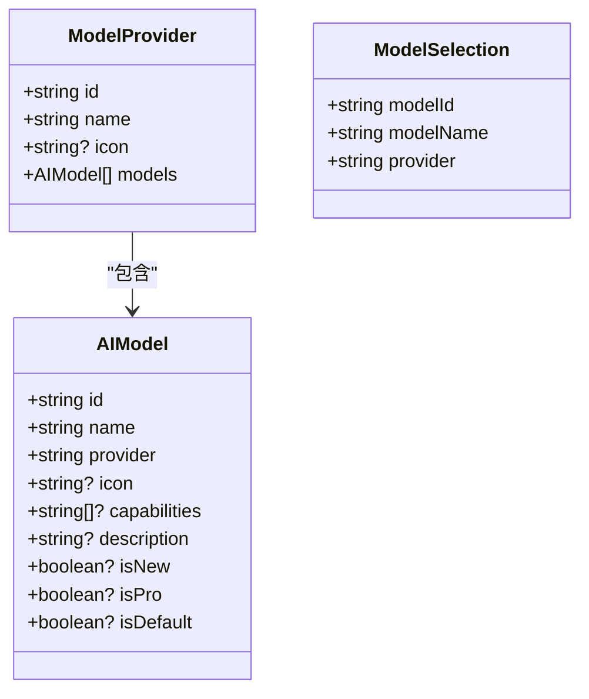
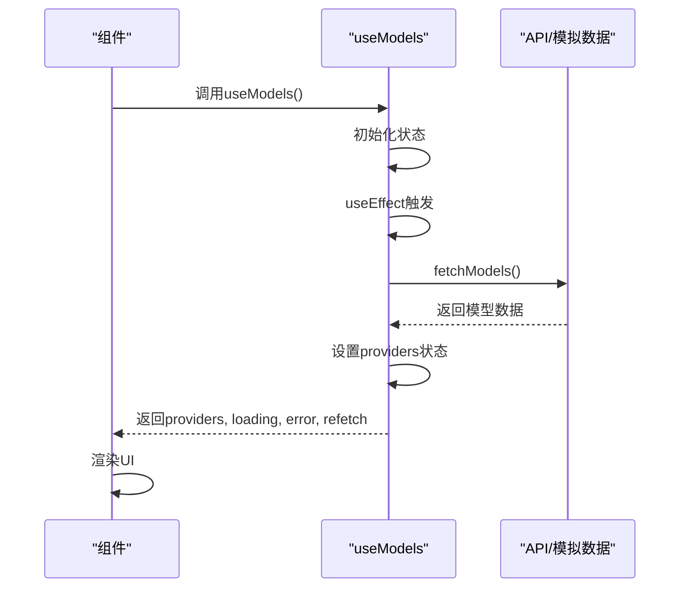
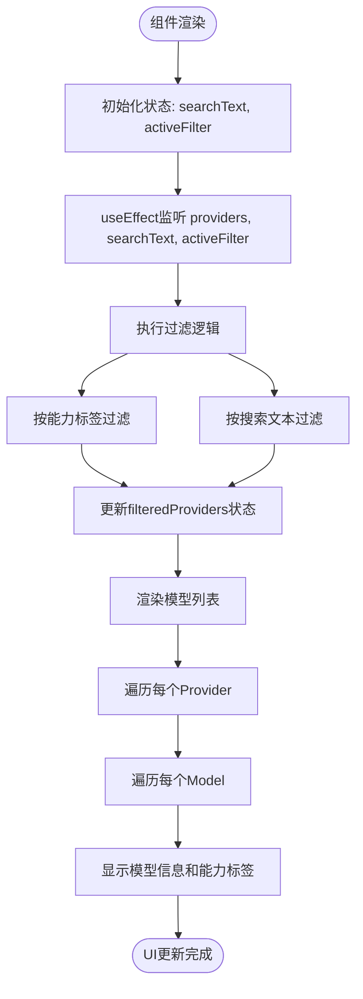
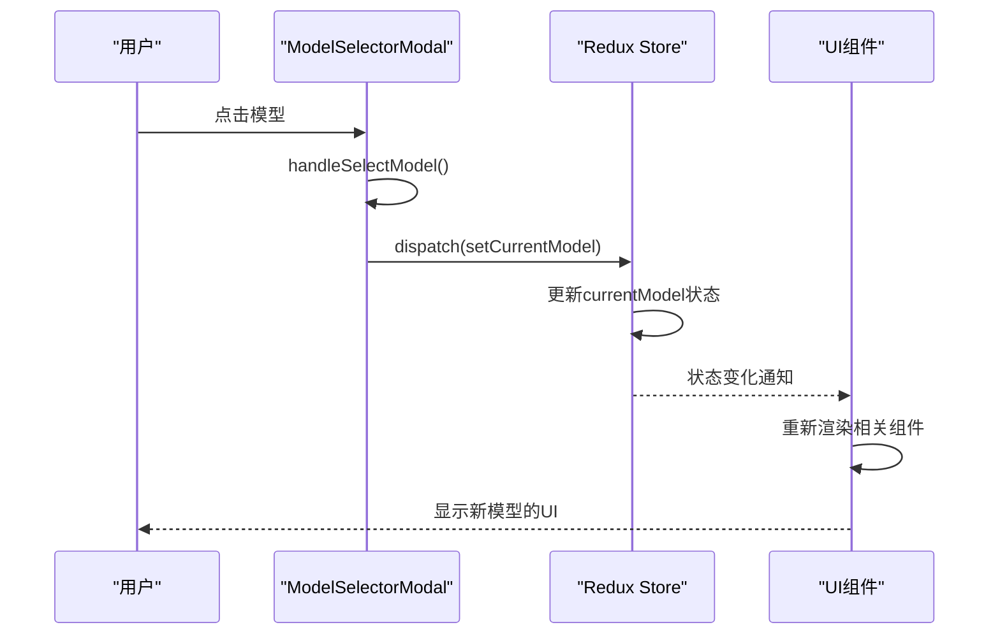

# 模型配置模型

<cite>
**本文档中引用的文件**  
- [model.ts](file://src/types/model.ts)
- [useModels.ts](file://src/hooks/useModels.ts)
- [ModelSelectorModal.tsx](file://src/components/modals/ModelSelectorModal.tsx)
- [models.ts](file://src/mock/models.ts)
- [uiSlice.ts](file://src/store/slices/uiSlice.ts)
</cite>

## 目录
1. [项目结构](#项目结构)
2. [核心数据结构分析](#核心数据结构分析)
3. [模型数据获取与缓存机制](#模型数据获取与缓存机制)
4. [模型选择器组件实现](#模型选择器组件实现)
5. [UI状态管理与模型选择](#ui状态管理与模型选择)
6. [模型不可用状态的降级处理](#模型不可可用状态的降级处理)

## 项目结构

项目采用标准的React + TypeScript + Redux架构，模型相关功能集中在特定目录中。核心模型逻辑位于`src/types/model.ts`，数据获取逻辑在`src/hooks/useModels.ts`，UI组件位于`src/components/modals/ModelSelectorModal.tsx`，状态管理通过Redux在`src/store/slices/uiSlice.ts`中实现。

**Section sources**
- [model.ts](file://src/types/model.ts)
- [useModels.ts](file://src/hooks/useModels.ts)
- [ModelSelectorModal.tsx](file://src/components/modals/ModelSelectorModal.tsx)
- [uiSlice.ts](file://src/store/slices/uiSlice.ts)

## 核心数据结构分析

### AIModel 接口设计
`AIModel`接口定义了AI模型的核心属性，每个字段都有明确的设计目的：

- `id`: 模型的唯一标识符，用于程序内部引用和状态管理
- `name`: 模型的显示名称，用于UI展示
- `provider`: 模型提供商名称，用于分组和标识来源
- `icon`: 可选的图标标识，增强视觉识别
- `capabilities`: 字符串数组，描述模型支持的功能能力
- `description`: 模型功能描述，提供给用户参考
- `isNew`: 布尔值，标记是否为新模型，用于UI突出显示
- `isPro`: 布尔值，标记是否为专业版模型，用于权限和显示控制
- `isDefault`: 布尔值，标记是否为默认模型，用于初始化选择

### ModelProvider 接口设计
`ModelProvider`接口用于组织同一提供商下的多个模型：

- `id`: 提供商的唯一标识符
- `name`: 提供商的显示名称
- `icon`: 可选的提供商图标
- `models`: 该提供商下的模型数组

### ModelSelection 接口设计
`ModelSelection`接口用于表示当前选中的模型状态：

- `modelId`: 选中模型的ID
- `modelName`: 选中模型的名称
- `provider`: 模型所属的提供商

**Diagram sources**
- [model.ts](file://src/types/model.ts#L0-L25)

**Section sources**
- [model.ts](file://src/types/model.ts#L0-L25)

## 模型数据获取与缓存机制

### useModels 钩子实现
`useModels`钩子负责从API获取模型列表并管理其状态：

- 使用`useState`管理`providers`、`loading`和`error`状态
- `fetchModels`异步函数封装数据获取逻辑
- 使用`useEffect`在组件挂载时自动调用`fetchModels`
- 返回`providers`数组、`loading`状态、`error`对象和`refetch`函数

### 模型元数据缓存策略
当前实现采用了简单的内存缓存策略：

- 通过`useState`将模型数据存储在组件状态中
- 避免了重复的API请求
- 数据在组件生命周期内保持缓存
- 提供`refetch`函数用于手动刷新数据

### 基于用户偏好的过滤机制
虽然当前`useModels`钩子本身不直接处理过滤，但它返回的数据被`ModelSelectorModal`组件用于基于用户偏好进行过滤：

- 过滤逻辑在`ModelSelectorModal`的`useEffect`中实现
- 支持按能力标签（视觉、推理、工具、联网）过滤
- 支持按搜索文本进行模糊匹配
- 过滤结果实时更新UI

**Diagram sources**
- [useModels.ts](file://src/hooks/useModels.ts#L0-L41)
- [ModelSelectorModal.tsx](file://src/components/modals/ModelSelectorModal.tsx#L184-L250)

**Section sources**
- [useModels.ts](file://src/hooks/useModels.ts#L0-L41)
- [models.ts](file://src/mock/models.ts#L0-L198)

## 模型选择器组件实现

### ModelSelectorModal 组件架构
`ModelSelectorModal`组件实现了完整的模型选择界面：

- 接收`providers`、`loading`等props
- 管理搜索文本和活动过滤器状态
- 实现复杂的过滤逻辑
- 渲染分组的模型列表

### 分组选项渲染
组件按提供商对模型进行分组显示：

- 使用`filteredProviders.map()`遍历每个提供商
- 为每个提供商创建`ProviderSection`
- 显示`ProviderTitle`包含提供商图标和名称
- 在每个分组下渲染该提供商的所有模型

### 能力标签显示
模型的能力通过标签形式直观展示：

- 检查模型的`capabilities`数组
- 为每个能力创建`Tag`组件
- 使用Ant Design的Tag组件进行样式化显示
- 不同的能力标签帮助用户快速识别模型特性

### 新增模型的UI更新机制
当新增模型时，UI会自动更新：

- `useEffect`监听`providers`、`searchText`和`activeFilter`的变化
- 当`providers`数据更新时，自动重新执行过滤逻辑
- `setFilteredProviders`更新过滤后的结果
- React的响应式机制自动重新渲染UI

**Diagram sources**
- [ModelSelectorModal.tsx](file://src/components/modals/ModelSelectorModal.tsx#L184-L250)
- [ModelSelectorModal.tsx](file://src/components/modals/ModelSelectorModal.tsx#L347-L411)

**Section sources**
- [ModelSelectorModal.tsx](file://src/components/modals/ModelSelectorModal.tsx#L0-L411)

## UI状态管理与模型选择

### Redux状态管理
模型选择状态通过Redux进行全局管理：

- 在`uiSlice.ts`中定义`currentModel`和`currentModelName`状态
- 创建`setCurrentModel` action用于更新模型选择
- 使用`createSlice`生成reducer和actions

### 模型选择流程
用户选择模型的完整流程：

- 用户点击模型项
- 触发`handleSelectModel`函数
- 调用`dispatch(setCurrentModel())`
- Redux更新全局状态
- 相关组件响应状态变化并重新渲染

### 初始模型设置
系统设置了默认的初始模型：

- 在`uiSlice`的`initialState`中预设`currentModel`
- 使用`claude-3-5-sonnet-20241022`作为默认模型ID
- 确保应用启动时有合理的默认状态

**Diagram sources**
- [uiSlice.ts](file://src/store/slices/uiSlice.ts#L0-L148)
- [ModelSelectorModal.tsx](file://src/components/modals/ModelSelectorModal.tsx#L379-L388)

**Section sources**
- [uiSlice.ts](file://src/store/slices/uiSlice.ts#L0-L148)
- [ModelSelectorModal.tsx](file://src/components/modals/ModelSelectorModal.tsx#L379-L388)

## 模型不可用状态的降级处理

### 加载状态处理
组件提供了优雅的加载状态显示：

- 显示`Spin`组件表示数据加载中
- 设置合理的加载延迟（500ms模拟）
- 防止用户在数据加载时进行无效操作

### 空状态处理
当没有匹配的模型时，提供清晰的反馈：

- 检查`filteredProviders.length === 0`
- 显示`Empty`组件提示"未找到匹配的模型"
- 帮助用户理解当前过滤条件的结果

### 错误状态处理
虽然`useModels`钩子捕获了错误，但UI层的错误处理可以进一步完善：

- `useModels`返回`error`对象
- `ModelSelectorModal`可以接收并显示错误状态
- 建议添加错误消息显示和重试机制

### 网络失败降级方案
当前实现的降级处理建议：

- 保留最后成功获取的模型数据作为缓存
- 在网络失败时显示缓存数据并提示"使用缓存数据"
- 提供手动刷新按钮让用户重试
- 对于关键功能，可以预置最小可用模型集作为最后防线

**Section sources**
- [useModels.ts](file://src/hooks/useModels.ts#L0-L41)
- [ModelSelectorModal.tsx](file://src/components/modals/ModelSelectorModal.tsx#L347-L360)