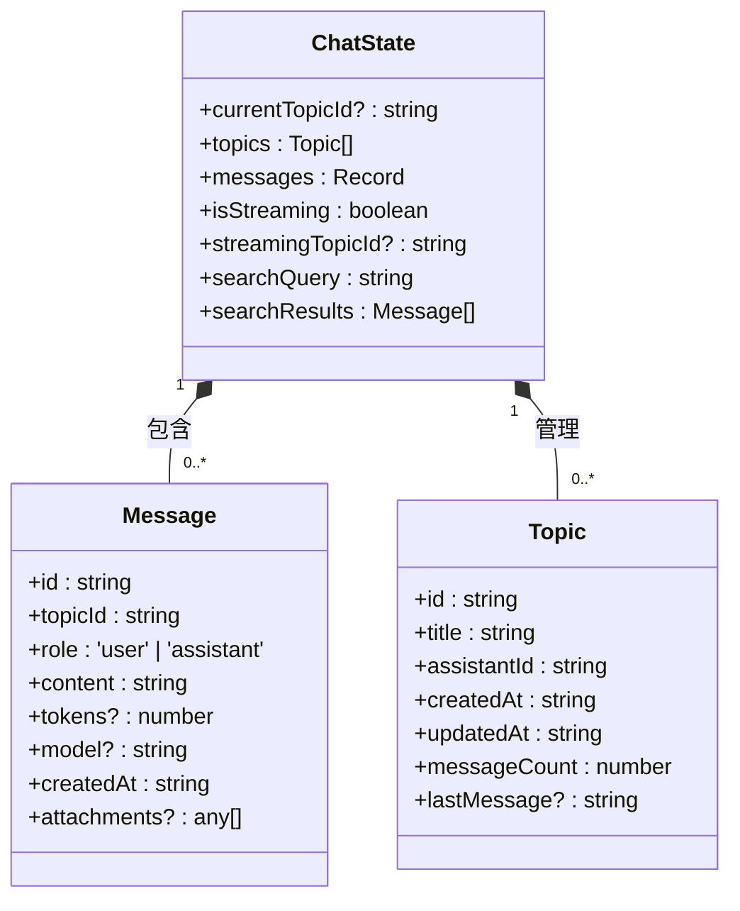
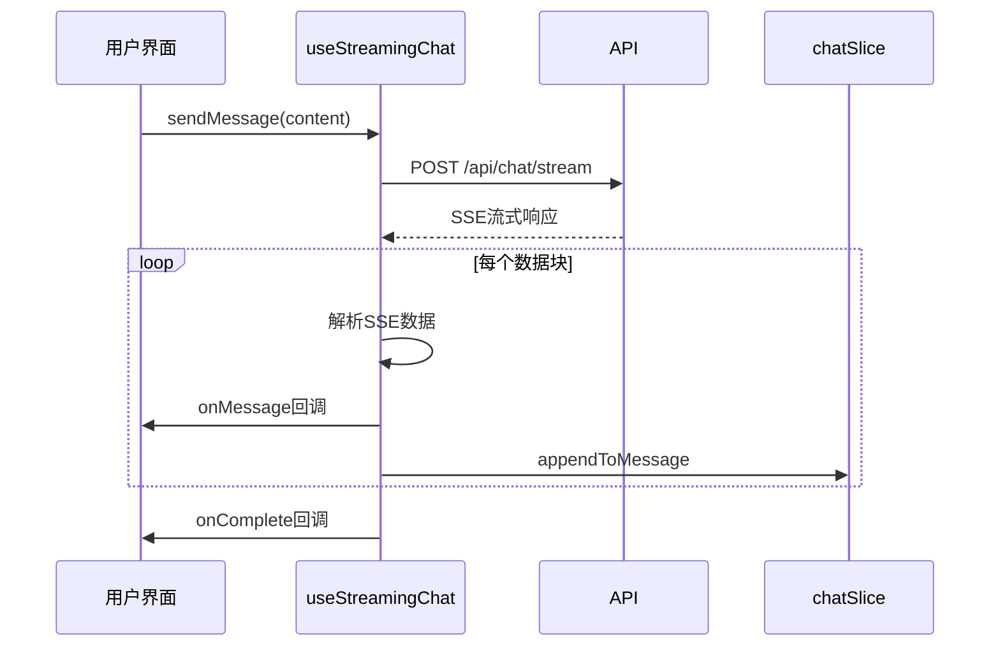

# 消息模型

<cite>
**本文档中引用的文件**   
- [model.ts](file://src/types/model.ts)
- [index.ts](file://src/types/index.ts)
- [chatSlice.ts](file://src/store/slices/chatSlice.ts)
- [useStreamingChat.ts](file://src/hooks/useStreamingChat.ts)
- [redux.ts](file://src/hooks/redux.ts)
- [apiSlice.ts](file://src/store/slices/apiSlice.ts)
</cite>

## 目录
1. [消息数据模型定义](#消息数据模型定义)
2. [字段详细说明](#字段详细说明)
3. [角色字段(role)详解](#角色字段role详解)
4. [消息状态管理](#消息状态管理)
5. [消息创建与更新模式](#消息创建与更新模式)
6. [消息选择与实时渲染](#消息选择与实时渲染)
7. [API数据交互格式](#api数据交互格式)

## 消息数据模型定义

消息模型在系统中通过 `Message` 接口定义，用于表示对话中的单条消息。该接口在多个文件中重复定义，确保类型一致性。

**Section sources**
- [index.ts](file://src/types/index.ts#L35-L44)
- [chatSlice.ts](file://src/store/slices/chatSlice.ts#L4-L13)
- [apiSlice.ts](file://src/store/slices/apiSlice.ts#L25-L34)

## 字段详细说明

消息模型包含以下核心字段：

| 字段名 | 数据类型 | 是否必填 | 业务含义 |
|-------|--------|--------|--------|
| id | string | 是 | 消息唯一标识符，通常使用时间戳或UUID生成 |
| topicId | string | 是 | 关联的话题ID，用于将消息归类到特定对话主题 |
| role | 'user' \| 'assistant' | 是 | 消息发送者角色，区分用户与AI助手 |
| content | string | 是 | 消息内容文本 |
| tokens | number | 否 | 消息内容的token数量，用于成本计算和长度控制 |
| model | string | 否 | 生成此消息所使用的AI模型标识 |
| createdAt | string | 是 | 消息创建时间，ISO 8601格式字符串 |
| attachments | Attachment[] | 否 | 附件列表，包含图片、文件等附加内容 |

**Section sources**
- [index.ts](file://src/types/index.ts#L35-L44)

## 角色字段role详解

`role` 字段采用字符串字面量联合类型 `'user' | 'assistant'`，明确限定取值范围：

- **'user'**: 表示由终端用户发送的消息，在对话流中代表用户输入
- **'assistant'**: 表示由AI助手生成的回复消息，在对话流中代表系统响应

该字段在对话流程中起到关键作用：
1. 控制消息气泡的样式和位置（用户消息右对齐，助手消息左对齐）
2. 决定消息处理逻辑的分支
3. 影响上下文构建时的消息筛选

**Section sources**
- [index.ts](file://src/types/index.ts#L35-L44)

## 消息状态管理

消息的状态管理通过 Redux Toolkit 的 `chatSlice` 实现，采用话题ID为键的记录结构进行组织。

### 状态结构



**Diagram sources **
- [chatSlice.ts](file://src/store/slices/chatSlice.ts#L0-L41)

### 核心管理机制

#### 话题关联
通过 `topicId` 字段实现消息与话题的关联，`messages` 字段采用 `Record<string, Message[]>` 结构，以话题ID为键存储对应的消息数组。

#### 流式响应增量更新
使用 `appendToMessage` reducer 实现流式响应的增量更新：
```typescript
appendToMessage: (state, action: PayloadAction<{ topicId: string; messageId: string; content: string }>) => {
  const { topicId, messageId, content } = action.payload;
  const messages = state.messages[topicId];
  if (messages) {
    const message = messages.find(msg => msg.id === messageId);
    if (message) {
      message.content += content;
    }
  }
}
```

#### 错误消息标记
虽然当前实现中未直接体现错误标记字段，但通过 Redux action 的错误处理机制，在 `useStreamingChat` 钩子中捕获并传递错误信息。

**Section sources**
- [chatSlice.ts](file://src/store/slices/chatSlice.ts#L35-L151)

## 消息创建与更新模式

### 工厂函数示例
虽然未提供显式的工厂函数，但可通过以下方式创建新消息：
```typescript
const createMessage = (topicId: string, role: 'user' | 'assistant', content: string): Message => ({
  id: Date.now().toString(),
  topicId,
  role,
  content,
  createdAt: new Date().toISOString()
});
```

### Immer不可变更新模式
`chatSlice` 利用 Immer 库实现不可变更新，开发者可直接修改状态草案：
```typescript
addMessage: (state, action: PayloadAction<Message>) => {
  const { topicId } = action.payload;
  if (!state.messages[topicId]) {
    state.messages[topicId] = [];
  }
  state.messages[topicId].push(action.payload);
}
```

**Section sources**
- [chatSlice.ts](file://src/store/slices/chatSlice.ts#L76-L77)

## 消息选择与实时渲染

### 消息选择
通过 `useAppSelector` 钩子选择特定话题下的消息列表：
```typescript
const messages = useAppSelector(state => state.chat.messages[topicId] || []);
```

### 实时渲染实现
结合 `useStreamingChat` 钩子实现流式渲染：



**Diagram sources **
- [useStreamingChat.ts](file://src/hooks/useStreamingChat.ts#L0-L239)
- [chatSlice.ts](file://src/store/slices/chatSlice.ts#L94-L108)

**Section sources**
- [useStreamingChat.ts](file://src/hooks/useStreamingChat.ts#L0-L239)
- [redux.ts](file://src/hooks/redux.ts#L0-L6)

## API数据交互格式

### 请求格式
```json
{
  "content": "用户输入内容",
  "assistantId": "assistant-123",
  "topicId": "topic-456",
  "stream": true
}
```

### 响应格式（SSE流式）
```
data: {"choices":[{"delta":{"content":"部分"}}]}
data: {"choices":[{"delta":{"content":"回复内容"}}]}
data: [DONE]
```

### API端点
- **获取消息**: `GET /topics/{topicId}/messages`
- **发送消息**: `POST /topics/{topicId}/messages`
- **删除消息**: `DELETE /topics/{topicId}/messages/{messageId}`
- **重新生成**: `POST /messages/{messageId}/regenerate`

**Section sources**
- [apiSlice.ts](file://src/store/slices/apiSlice.ts#L161-L194)