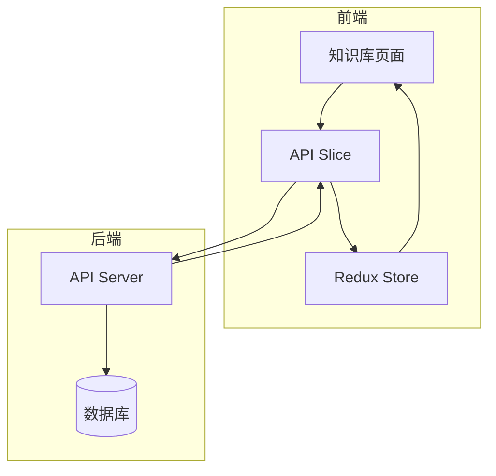
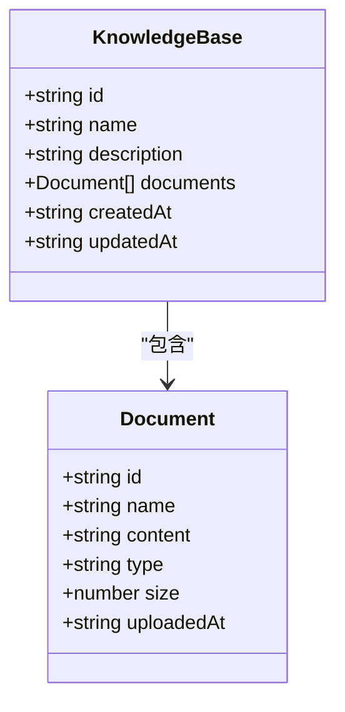
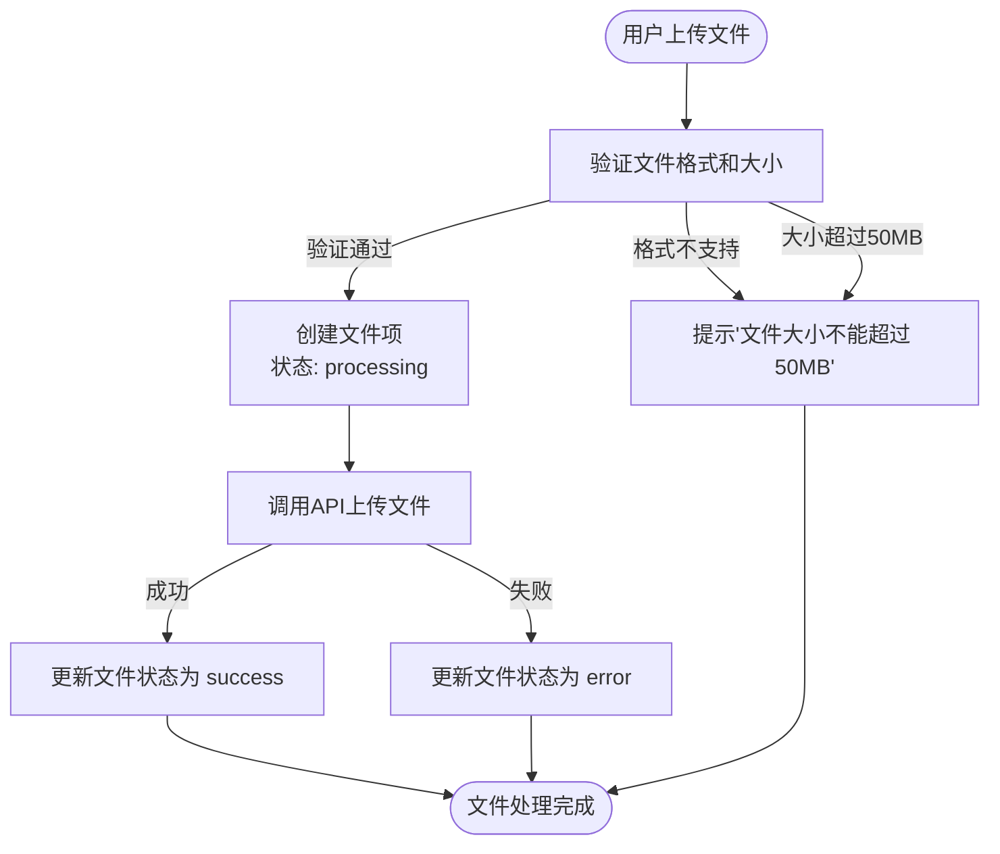
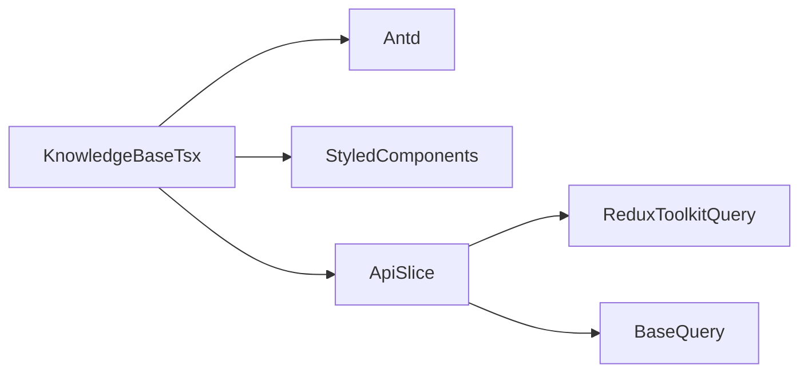

# 知识库模型

<cite>
**本文档中引用的文件**  
- [model.ts](file://src/types/model.ts)
- [index.ts](file://src/types/index.ts)
- [KnowledgeBase.tsx](file://src/components/pages/KnowledgeBase.tsx)
- [apiSlice.ts](file://src/store/slices/apiSlice.ts)
</cite>

## 目录
1. [介绍](#介绍)
2. [项目结构](#项目结构)
3. [核心组件](#核心组件)
4. [架构概述](#架构概述)
5. [详细组件分析](#详细组件分析)
6. [依赖分析](#依赖分析)
7. [性能考虑](#性能考虑)
8. [故障排除指南](#故障排除指南)
9. [结论](#结论)

## 介绍
本文档详细说明了知识库（KnowledgeBase）数据模型的设计与实现，基于前端项目中的类型定义和组件逻辑。重点阐述了知识库的核心字段语义、文件上传与处理流程、状态机转换机制、前后端数据契约以及用户交互设计。文档结合代码实现，全面解析了从文件上传到知识库可用的完整生命周期。

## 项目结构
该项目是一个基于React的前端应用，采用TypeScript进行类型定义，使用Redux Toolkit进行状态管理。项目结构清晰，按功能模块组织。核心的类型定义位于`src/types`目录下，UI组件位于`src/components`目录，状态管理逻辑位于`src/store/slices`目录。知识库功能主要由`KnowledgeBase.tsx`页面组件实现，并通过`apiSlice.ts`与后端API进行交互。

**Section sources**
- [KnowledgeBase.tsx](file://src/components/pages/KnowledgeBase.tsx#L1-L50)
- [apiSlice.ts](file://src/store/slices/apiSlice.ts#L1-L50)

## 核心组件
知识库功能的核心组件包括`KnowledgeBase`页面组件、`KnowledgeBase`和`Document`数据模型、以及`apiSlice`中的API定义。`KnowledgeBase`组件负责UI渲染和用户交互，`KnowledgeBase`接口定义了知识库的数据结构，`apiSlice`则封装了与后端通信的逻辑。

**Section sources**
- [index.ts](file://src/types/index.ts#L55-L62)
- [apiSlice.ts](file://src/store/slices/apiSlice.ts#L87-L123)

## 架构概述
系统采用前后端分离架构。前端使用React构建用户界面，通过Redux Toolkit Query与后端RESTful API进行数据交互。知识库数据模型是前后端通信的核心契约。前端通过`useGetKnowledgeBasesQuery`等Hook获取数据，并在`KnowledgeBase.tsx`组件中渲染。文件上传等操作通过`useUploadDocumentMutation`等Mutation触发。

**Diagram sources**
- [KnowledgeBase.tsx](file://src/components/pages/KnowledgeBase.tsx#L355-L678)
- [apiSlice.ts](file://src/store/slices/apiSlice.ts#L196-L227)

## 详细组件分析

### 知识库数据模型分析
`KnowledgeBase`接口定义了知识库的核心属性，包括`id`、`name`、`description`、`documents`、`createdAt`和`updatedAt`。该模型与后端保持一致，确保了数据的一致性。

**Diagram sources**
- [index.ts](file://src/types/index.ts#L55-L62)

### 文件上传与处理流程分析
文件上传流程由`KnowledgeBase.tsx`组件中的`uploadProps`配置驱动。用户拖拽文件后，前端会进行格式和大小校验，然后通过`useUploadDocumentMutation`将文件上传至后端。

#### 文件上传与状态转换流程

**Diagram sources**
- [KnowledgeBase.tsx](file://src/components/pages/KnowledgeBase.tsx#L406-L450)

### 前后端数据契约分析
前后端通过`/api/knowledge-bases`系列接口进行交互。前端使用Redux Toolkit Query自动生成的Hook来调用这些API，确保了类型安全和缓存一致性。

#### 知识库API接口契约
| 接口 | HTTP方法 | 请求路径 | 请求体/参数 | 响应 |
| :--- | :--- | :--- | :--- | :--- |
| 获取知识库列表 | GET | `/knowledge-bases` | 无 | `ApiResponse<KnowledgeBase[]>` |
| 获取单个知识库 | GET | `/knowledge-bases/{id}` | `id` (路径参数) | `ApiResponse<KnowledgeBase>` |
| 创建知识库 | POST | `/knowledge-bases` | `Partial<KnowledgeBase>` (JSON) | `ApiResponse<KnowledgeBase>` |
| 上传文件 | POST | `/knowledge-bases/{kbId}/documents` | `FormData` (含`file`) | `ApiResponse<Document>` |
| 删除文件 | DELETE | `/knowledge-bases/{kbId}/documents/{docId}` | `kbId`, `docId` (路径参数) | `ApiResponse<void>` |

**Diagram sources**
- [apiSlice.ts](file://src/store/slices/apiSlice.ts#L196-L270)

## 依赖分析
知识库功能依赖于多个核心模块。`KnowledgeBase.tsx`组件依赖`antd`进行UI构建，依赖`styled-components`进行样式定义，并通过`useGetKnowledgeBasesQuery`和`useUploadDocumentMutation`等Hook依赖`apiSlice`。`apiSlice`本身依赖`@reduxjs/toolkit/query/react`来实现API调用和状态管理。

**Diagram sources**
- [KnowledgeBase.tsx](file://src/components/pages/KnowledgeBase.tsx#L1-L20)
- [apiSlice.ts](file://src/store/slices/apiSlice.ts#L1-L50)

## 性能考虑
前端通过Redux Toolkit Query的缓存机制减少了不必要的API调用。例如，`getKnowledgeBases`查询的结果会被缓存，避免了重复获取相同数据。文件上传使用`FormData`，适合传输二进制大文件。UI上，文件列表使用`filteredFiles`进行本地过滤，避免了每次搜索都请求后端。

## 故障排除指南
当文件上传失败时，前端会根据错误类型给出相应提示。对于文件格式不支持或大小超限的情况，会直接在前端通过`message.error()`显示错误信息。对于后端处理失败的情况，文件项的状态会变为`error`，并显示红色重试图标，用户可以点击“重新处理”按钮进行重试。

**Section sources**
- [KnowledgeBase.tsx](file://src/components/pages/KnowledgeBase.tsx#L420-L430)
- [KnowledgeBase.tsx](file://src/components/pages/KnowledgeBase.tsx#L642-L678)

## 结论
本文档全面解析了知识库功能的数据模型、处理流程和前后端交互。`KnowledgeBase`数据模型设计合理，涵盖了核心业务需求。文件上传流程清晰，包含了前端校验、状态管理和错误处理。前后端通过定义良好的RESTful API进行通信，保证了系统的可维护性和扩展性。整体实现充分利用了现代前端框架和库的优势，提供了良好的用户体验。