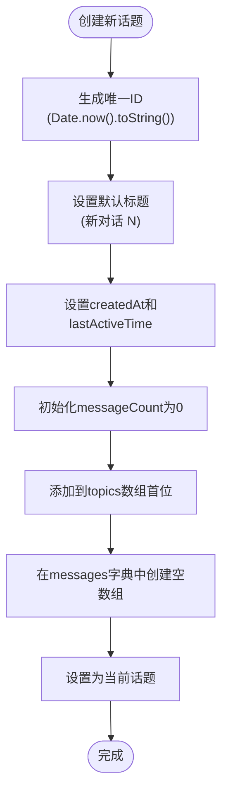
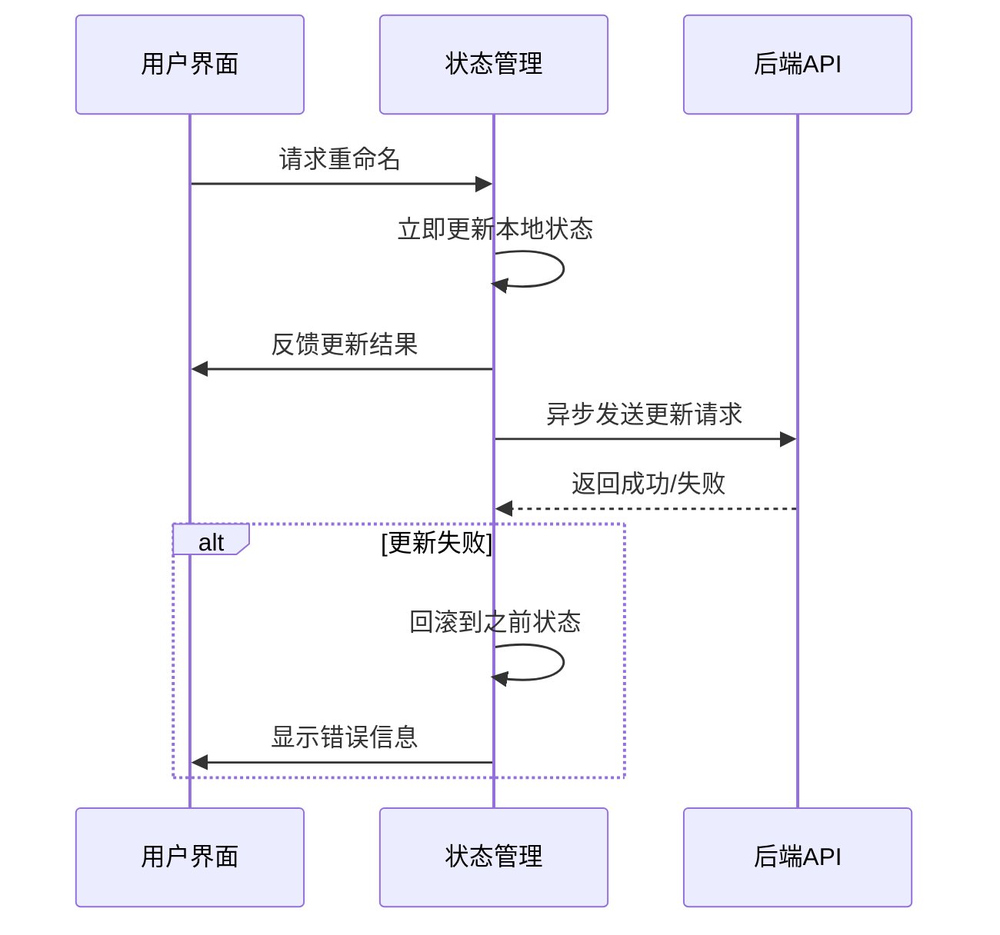
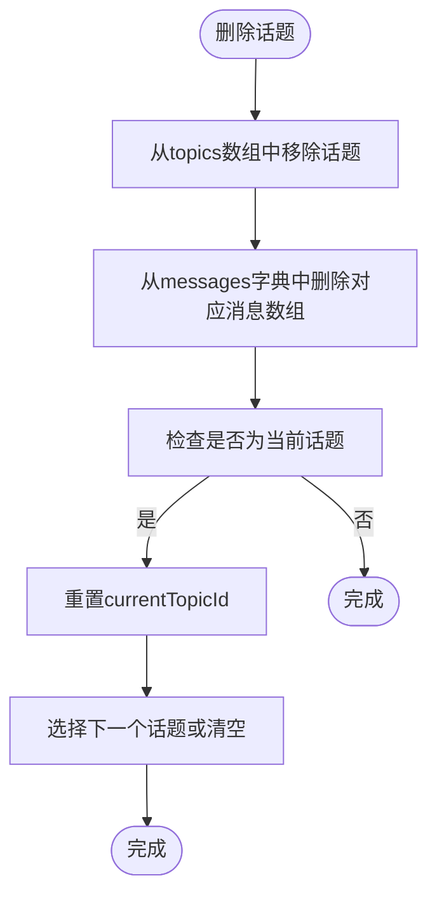
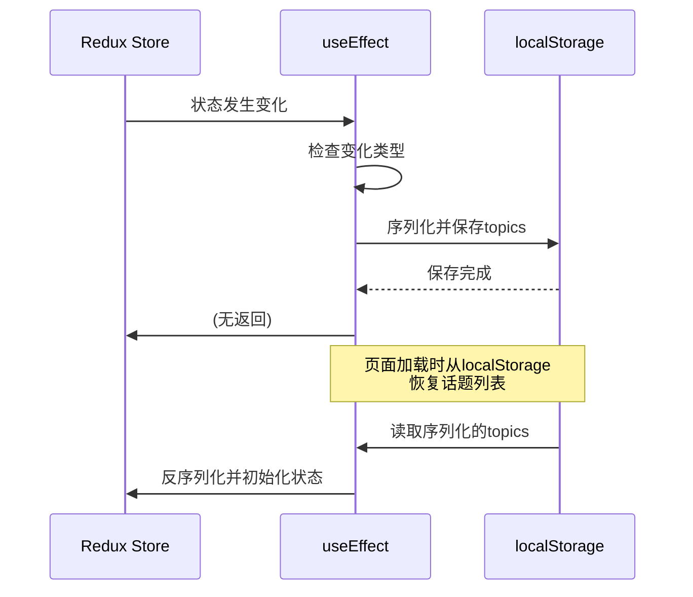

# 话题模型

<cite>
**本文档中引用的文件**
- [model.ts](file://src/types/model.ts)
- [index.ts](file://src/types/index.ts)
- [chatSlice.ts](file://src/store/slices/chatSlice.ts)
- [SidePanel.tsx](file://src/components/layout/SidePanel.tsx)
- [apiSlice.ts](file://src/store/slices/apiSlice.ts)
</cite>

## 目录
1. [介绍](#介绍)
2. [核心数据结构](#核心数据结构)
3. [话题状态管理](#话题状态管理)
4. [话题操作逻辑](#话题操作逻辑)
5. [持久化与序列化](#持久化与序列化)
6. [排序与展示](#排序与展示)

## 介绍
本项目中的"话题"（Topic）是用户与AI助手进行对话的核心容器。每个话题代表一个独立的对话会话，包含对话历史、元数据和状态信息。话题模型设计遵循Redux状态管理原则，通过chatSlice集中管理所有话题的状态，并与消息系统紧密集成。

**Section sources**
- [chatSlice.ts](file://src/store/slices/chatSlice.ts#L0-L41)

## 核心数据结构

### Topic接口定义
`Topic`接口定义了话题的核心属性，位于`src/types/index.ts`文件中：

```typescript
interface Topic {
  id: string;
  title: string;
  assistantId: string;
  createdAt: string;
  updatedAt: string;
  messageCount: number;
  lastMessage?: string;
}
```

- **id**: 话题的唯一标识符，使用时间戳生成
- **title**: 话题标题，默认为"新对话 N"
- **assistantId**: 关联的AI助手ID，建立与助手实体的关系
- **createdAt**: 创建时间，ISO格式字符串
- **updatedAt**: 最后更新时间，ISO格式字符串
- **messageCount**: 消息数量统计，用于显示和排序
- **lastMessage**: 最后一条消息的摘要，用于预览

值得注意的是，虽然文档目标中提到了`messageIds`字段，但在实际代码中并未直接存储消息ID数组。相反，通过`chatSlice`中的`messages`字典对象（`Record<string, Message[]>`）来管理话题与消息的关系，这是一种更高效的设计模式。

**Section sources**
- [index.ts](file://src/types/index.ts#L25-L33)

## 话题状态管理

### chatSlice中的话题存储
在`chatSlice.ts`中，话题状态通过`ChatState`接口进行管理：

```typescript
interface ChatState {
  currentTopicId?: string;
  topics: Topic[];
  messages: Record<string, Message[]>;
  isStreaming: boolean;
  streamingTopicId?: string;
  searchQuery: string;
  searchResults: Message[];
}
```

- **topics**: 话题数组，按更新时间倒序排列
- **messages**: 消息字典，键为话题ID，值为该话题下的消息数组
- **currentTopicId**: 当前激活的话题ID

这种设计模式的优势在于：
1. 通过`topics`数组保持话题的有序性
2. 通过`messages`字典实现O(1)复杂度的消息查找
3. 自然地实现了话题与消息的外键关联

**Section sources**
- [chatSlice.ts](file://src/store/slices/chatSlice.ts#L0-L41)

## 话题操作逻辑

### 话题创建
当创建新话题时，系统会初始化默认状态：



**Diagram sources**
- [SidePanel.tsx](file://src/components/layout/SidePanel.tsx#L851-L902)

### 乐观更新策略
在重命名话题时，采用乐观更新策略：



**Diagram sources**
- [SidePanel.tsx](file://src/components/layout/SidePanel.tsx#L851-L902)

### 级联清理机制
删除话题时执行级联清理：



**Diagram sources**
- [chatSlice.ts](file://src/store/slices/chatSlice.ts#L35-L76)

## 持久化与序列化

### localStorage持久化
系统通过useEffect监听store变化实现持久化：



**Diagram sources**
- [chatSlice.ts](file://src/store/slices/chatSlice.ts#L35-L76)
- [SidePanel.tsx](file://src/components/layout/SidePanel.tsx#L762-L797)

## 排序与展示

### 话题排序实现
话题按更新时间倒序排列，最新活动的话题显示在最上方：

```typescript
// 在SidePanel中通过数组顺序控制显示顺序
setTopics(prev => [newTopic, ...prev]); // 新话题插入首位
```

排序逻辑主要通过以下方式实现：
1. 创建新话题时插入数组首位
2. 任何消息交互都会更新话题的`updatedAt`时间
3. 系统重启时从localStorage恢复的列表已保持正确顺序

### 侧边栏展示
在`SidePanel.tsx`中，话题以列表形式展示，包含：
- 话题标题
- 最后一条消息预览
- 消息数量统计
- 创建/最后活动时间

用户可以通过点击话题切换当前会话，通过右键菜单进行重命名或删除操作。

**Section sources**
- [SidePanel.tsx](file://src/components/layout/SidePanel.tsx#L762-L1075)