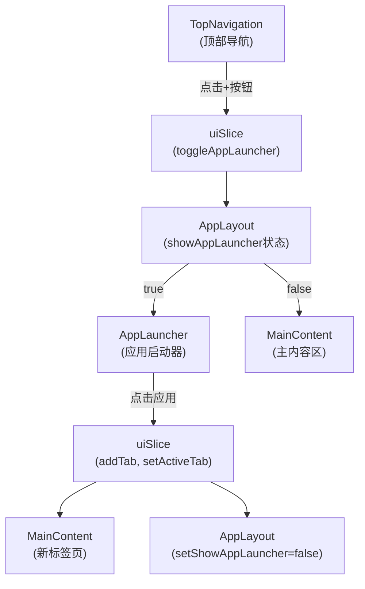
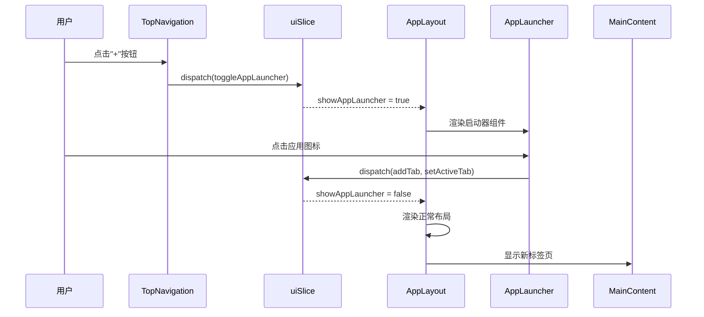
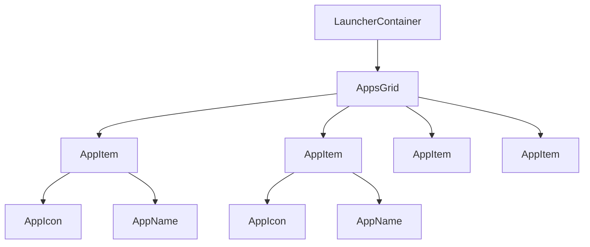
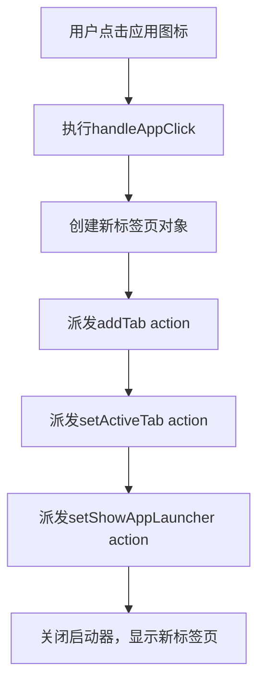
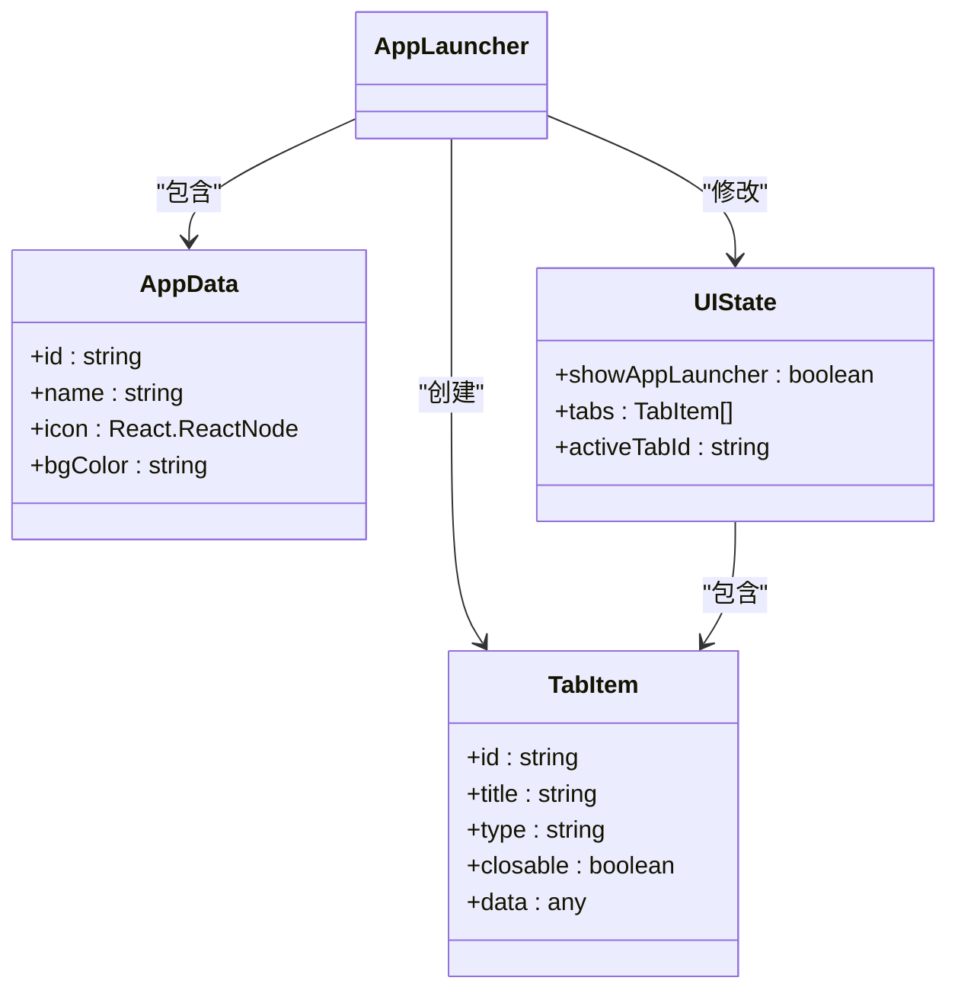
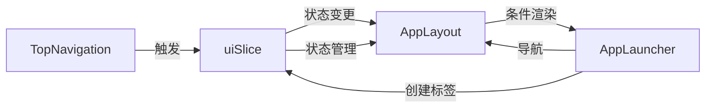

# 应用启动器

<cite>
**本文档中引用的文件**  
- [AppLauncher.tsx](file://src/components/pages/AppLauncher.tsx)
- [uiSlice.ts](file://src/store/slices/uiSlice.ts)
- [AppLayout.tsx](file://src/components/layout/AppLayout.tsx)
- [TopNavigation.tsx](file://src/components/layout/TopNavigation.tsx)
</cite>

## 目录
1. [简介](#简介)
2. [项目结构](#项目结构)
3. [核心组件](#核心组件)
4. [架构概述](#架构概述)
5. [详细组件分析](#详细组件分析)
6. [依赖分析](#依赖分析)
7. [性能考虑](#性能考虑)
8. [故障排除指南](#故障排除指南)
9. [结论](#结论)

## 简介
应用启动器（AppLauncher）是系统的新用户入口，提供功能引导和快速跳转能力，支持一键进入聊天、知识库创建等核心场景。该组件通过直观的网格布局展示多个功能入口，降低用户上手门槛，提升功能发现效率。当用户点击"+"按钮时，系统会切换到全屏的应用启动器视图，用户选择任一应用后，系统将创建新标签页并导航至相应功能模块，同时隐藏启动器回到正常布局。

## 项目结构
应用启动器位于`src/components/pages/AppLauncher.tsx`，作为独立页面组件实现。该组件通过Redux状态管理与系统其他部分交互，由`AppLayout`组件根据`showAppLauncher`状态决定是否渲染。启动器通过`TopNavigation`中的"+"按钮触发显示/隐藏，形成完整的用户工作流。



**图源**
- [AppLauncher.tsx](file://src/components/pages/AppLauncher.tsx#L1-L198)
- [uiSlice.ts](file://src/store/slices/uiSlice.ts#L1-L148)
- [AppLayout.tsx](file://src/components/layout/AppLayout.tsx#L1-L129)
- [TopNavigation.tsx](file://src/components/layout/TopNavigation.tsx#L1-L329)

**节源**
- [AppLauncher.tsx](file://src/components/pages/AppLauncher.tsx#L1-L198)
- [AppLayout.tsx](file://src/components/layout/AppLayout.tsx#L1-L129)

## 核心组件
应用启动器组件实现了新用户引导的核心功能，提供直观的视觉入口和流畅的导航体验。组件包含8个预设应用入口，涵盖小程序、知识库、绘画、智能体、翻译、文件、代码和笔记等核心功能。每个入口包含彩色渐变背景的图标和文字标签，通过悬停动画增强交互反馈。用户点击任一应用后，系统将创建新标签页并自动切换至该页面，同时关闭启动器界面。

**节源**
- [AppLauncher.tsx](file://src/components/pages/AppLauncher.tsx#L1-L198)

## 架构概述
应用启动器采用基于Redux的状态驱动架构，通过UI状态控制组件的显示与隐藏。系统通过`showAppLauncher`布尔值在正常布局和启动器全屏视图之间切换。这种架构实现了关注点分离：`TopNavigation`负责触发事件，`AppLayout`负责条件渲染，`AppLauncher`专注于入口展示，`uiSlice`管理全局状态和标签页操作。



**图源**
- [AppLauncher.tsx](file://src/components/pages/AppLauncher.tsx#L1-L198)
- [uiSlice.ts](file://src/store/slices/uiSlice.ts#L1-L148)
- [AppLayout.tsx](file://src/components/layout/AppLayout.tsx#L1-L129)
- [TopNavigation.tsx](file://src/components/layout/TopNavigation.tsx#L1-L329)

## 详细组件分析

### 应用启动器分析
应用启动器组件实现了直观的功能入口网格，通过响应式设计适配不同屏幕尺寸。在桌面端显示6列网格，在平板端显示4列，在手机端显示3列，确保在各种设备上都有良好的用户体验。

#### UI布局结构


**图源**
- [AppLauncher.tsx](file://src/components/pages/AppLauncher.tsx#L1-L198)

#### 按钮交互逻辑
应用启动器的交互逻辑围绕`handleAppClick`函数实现，该函数处理用户点击应用图标的完整流程：



**图源**
- [AppLauncher.tsx](file://src/components/pages/AppLauncher.tsx#L158-L198)

**节源**
- [AppLauncher.tsx](file://src/components/pages/AppLauncher.tsx#L1-L198)

### 路由导航实现
应用启动器不直接处理路由，而是通过Redux状态管理实现导航。当用户选择应用时，系统创建新标签页并更新激活标签，由主布局组件根据标签状态渲染相应内容。



**图源**
- [AppLauncher.tsx](file://src/components/pages/AppLauncher.tsx#L1-L198)
- [uiSlice.ts](file://src/store/slices/uiSlice.ts#L1-L148)

**节源**
- [AppLauncher.tsx](file://src/components/pages/AppLauncher.tsx#L1-L198)
- [uiSlice.ts](file://src/store/slices/uiSlice.ts#L1-L148)

## 依赖分析
应用启动器与其他组件存在明确的依赖关系，形成清晰的调用链。这些依赖关系确保了组件间的松耦合和高内聚。



**图源**
- [AppLauncher.tsx](file://src/components/pages/AppLauncher.tsx#L1-L198)
- [uiSlice.ts](file://src/store/slices/uiSlice.ts#L1-L148)
- [AppLayout.tsx](file://src/components/layout/AppLayout.tsx#L1-L129)
- [TopNavigation.tsx](file://src/components/layout/TopNavigation.tsx#L1-L329)

**节源**
- [AppLauncher.tsx](file://src/components/pages/AppLauncher.tsx#L1-L198)
- [uiSlice.ts](file://src/store/slices/uiSlice.ts#L1-L148)
- [AppLayout.tsx](file://src/components/layout/AppLayout.tsx#L1-L129)
- [TopNavigation.tsx](file://src/components/layout/TopNavigation.tsx#L1-L329)

## 性能考虑
应用启动器的设计考虑了性能优化，通过以下方式确保流畅的用户体验：
- 使用`styled-components`实现CSS-in-JS，避免全局样式冲突
- 采用响应式网格布局，适配不同屏幕尺寸
- 利用Redux状态管理，避免不必要的组件重渲染
- 实现轻量级交互动画，提升用户体验而不影响性能
- 按需加载组件，减少初始加载时间

## 故障排除指南
### 常见问题及解决方案

| 问题现象 | 可能原因 | 解决方案 |
|--------|--------|--------|
| 启动器无法显示 | `showAppLauncher`状态未正确更新 | 检查`TopNavigation`中的`toggleAppLauncher`调用 |
| 点击应用无响应 | `handleAppClick`函数未正确绑定 | 检查`AppItem`的`onClick`事件绑定 |
| 新标签页未创建 | `addTab` action未正确派发 | 检查`uiSlice`中的`addTab` reducer逻辑 |
| 导航失败 | `setActiveTab` action未正确执行 | 检查标签ID生成逻辑和状态更新 |
| 入口不明显 | 样式未正确加载 | 检查`styled-components`的CSS注入和主题变量 |

### 扩展新启动项的方法
要配置新的启动项，需在`AppLauncher.tsx`的`apps`数组中添加新的应用配置对象：

```typescript
{
  id: 'new-feature',
  name: '新功能',
  icon: <NewIcon />,
  bgColor: 'linear-gradient(135deg, #color1 0%, #color2 100%)'
}
```

其中：
- `id`：唯一标识符，将用于生成标签页ID和路由
- `name`：显示的标题文本
- `icon`：Ant Design图标组件
- `bgColor`：图标的背景渐变色

**节源**
- [AppLauncher.tsx](file://src/components/pages/AppLauncher.tsx#L104-L159)

## 结论
应用启动器作为系统的新用户入口，通过直观的视觉设计和流畅的交互流程，有效降低了用户上手门槛，提升了功能发现效率。该组件采用现代化的React+Redux架构，实现了关注点分离和松耦合设计。通过响应式布局和轻量级动画，确保了在各种设备上的良好用户体验。系统的状态驱动导航机制使得功能扩展和维护更加便捷，为未来添加新功能模块提供了清晰的实现路径。