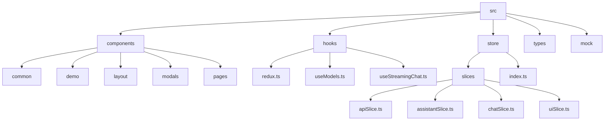
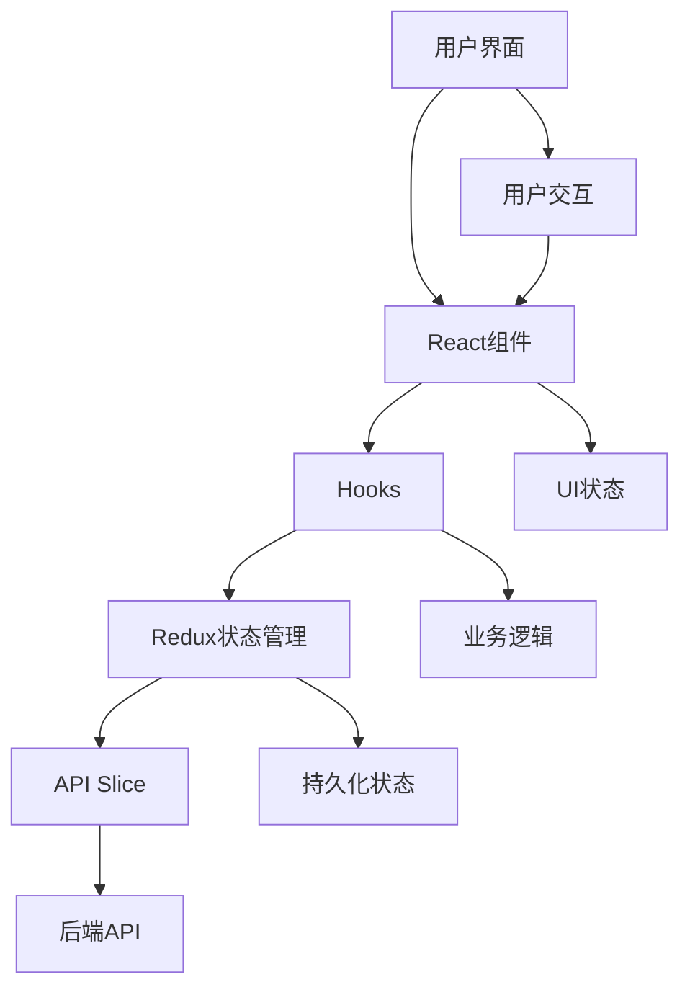
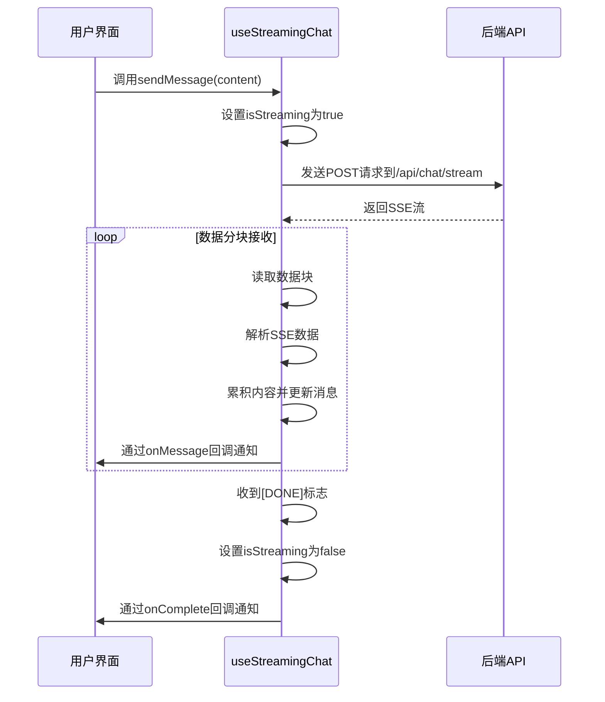
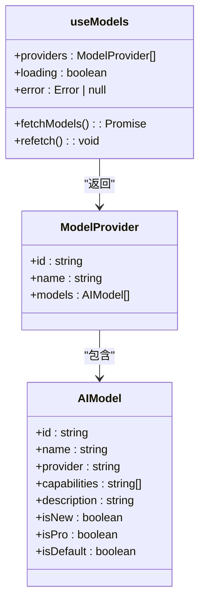
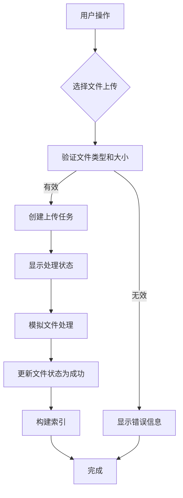
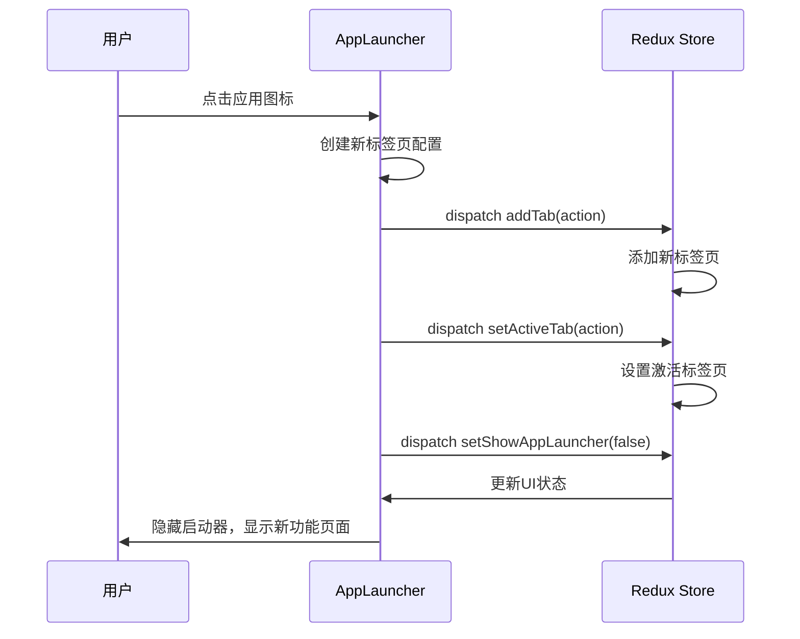
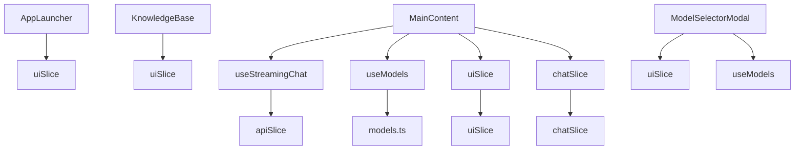

# 核心功能

<cite>
**本文档引用的文件**
- [useStreamingChat.ts](file://src/hooks/useStreamingChat.ts)
- [useModels.ts](file://src/hooks/useModels.ts)
- [KnowledgeBase.tsx](file://src/components/pages/KnowledgeBase.tsx)
- [AppLauncher.tsx](file://src/components/pages/AppLauncher.tsx)
- [ModelSelectorModal.tsx](file://src/components/modals/ModelSelectorModal.tsx)
- [uiSlice.ts](file://src/store/slices/uiSlice.ts)
- [chatSlice.ts](file://src/store/slices/chatSlice.ts)
- [apiSlice.ts](file://src/store/slices/apiSlice.ts)
- [models.ts](file://src/mock/models.ts)
- [model.ts](file://src/types/model.ts)
- [MainContent.tsx](file://src/components/layout/MainContent.tsx)
</cite>

## 目录
1. [介绍](#介绍)
2. [项目结构](#项目结构)
3. [核心组件](#核心组件)
4. [架构概述](#架构概述)
5. [详细组件分析](#详细组件分析)
6. [依赖分析](#依赖分析)
7. [性能考虑](#性能考虑)
8. [故障排除指南](#故障排除指南)
9. [结论](#结论)

## 介绍
本文档系统性地文档化了AI写作前端项目的核心功能实现。重点说明了流式聊天、模型管理、知识库和应用启动器等核心功能的实现机制和交互逻辑。

## 项目结构
本项目采用典型的React前端架构，主要包含组件、Hooks、状态管理、类型定义等模块。项目结构清晰，功能模块划分明确。

**图表来源**
- [项目结构](file://README.md)

**章节来源**
- [项目结构](file://README.md)

## 核心组件
项目的核心功能由多个关键组件构成，包括流式聊天、模型管理、知识库和应用启动器。这些组件通过Redux状态管理进行协调，实现了完整的用户工作流。

**章节来源**
- [useStreamingChat.ts](file://src/hooks/useStreamingChat.ts)
- [useModels.ts](file://src/hooks/useModels.ts)
- [KnowledgeBase.tsx](file://src/components/pages/KnowledgeBase.tsx)
- [AppLauncher.tsx](file://src/components/pages/AppLauncher.tsx)

## 架构概述
系统采用现代化的前端架构，结合React、Redux Toolkit和Ant Design等技术栈，实现了高效的状态管理和用户界面。

**图表来源**
- [store/index.ts](file://src/store/index.ts)
- [MainContent.tsx](file://src/components/layout/MainContent.tsx)

## 详细组件分析

### useStreamingChat Hook分析
`useStreamingChat` Hook负责处理与后端`/api/chat/stream`的流式通信，实现了SSE连接建立、数据分块接收和错误重连机制。

**图表来源**
- [useStreamingChat.ts](file://src/hooks/useStreamingChat.ts#L50-L200)

**章节来源**
- [useStreamingChat.ts](file://src/hooks/useStreamingChat.ts)

### useModels Hook分析
`useModels` Hook负责获取并过滤可用AI模型列表，支持按提供商和能力标签筛选。

**图表来源**
- [useModels.ts](file://src/hooks/useModels.ts#L10-L40)
- [models.ts](file://src/mock/models.ts)
- [model.ts](file://src/types/model.ts)

**章节来源**
- [useModels.ts](file://src/hooks/useModels.ts)
- [models.ts](file://src/mock/models.ts)

### KnowledgeBase页面分析
KnowledgeBase页面实现了文件上传、解析与索引构建功能。

**图表来源**
- [KnowledgeBase.tsx](file://src/components/pages/KnowledgeBase.tsx#L200-L400)

**章节来源**
- [KnowledgeBase.tsx](file://src/components/pages/KnowledgeBase.tsx)

### AppLauncher分析
AppLauncher组件引导用户快速进入不同功能场景。

**图表来源**
- [AppLauncher.tsx](file://src/components/pages/AppLauncher.tsx#L50-L100)
- [uiSlice.ts](file://src/store/slices/uiSlice.ts#L100-L120)

**章节来源**
- [AppLauncher.tsx](file://src/components/pages/AppLauncher.tsx)
- [uiSlice.ts](file://src/store/slices/uiSlice.ts)

## 依赖分析
项目各组件之间通过清晰的依赖关系进行协作，主要依赖Redux状态管理进行数据共享。

**图表来源**
- [package.json](file://package.json)
- [store/index.ts](file://src/store/index.ts)

**章节来源**
- [package.json](file://package.json)
- [store/index.ts](file://src/store/index.ts)

## 性能考虑
项目在性能方面做了多项优化，包括流式数据处理、状态管理优化和组件懒加载等。

- 流式聊天采用SSE协议，减少网络延迟
- Redux Toolkit Query用于API缓存，减少重复请求
- 组件按需加载，减少初始加载时间
- 虚拟滚动用于长列表渲染
- 防抖和节流用于频繁操作

## 故障排除指南
常见问题及解决方案：

1. **流式聊天中断**
   - 检查网络连接
   - 查看浏览器控制台错误
   - 确认后端服务正常运行

2. **模型加载失败**
   - 检查mock数据是否正确
   - 验证API端点
   - 检查网络请求状态

3. **文件上传失败**
   - 确认文件类型是否支持
   - 检查文件大小限制
   - 验证上传接口

**章节来源**
- [useStreamingChat.ts](file://src/hooks/useStreamingChat.ts#L150-L180)
- [KnowledgeBase.tsx](file://src/components/pages/KnowledgeBase.tsx#L150-L200)

## 结论
本文档详细分析了AI写作前端项目的核心功能实现。系统通过useStreamingChat Hook实现了高效的流式通信，useModels Hook提供了灵活的模型管理，KnowledgeBase页面支持完整的知识库管理功能，AppLauncher则提供了便捷的应用导航。各组件通过Redux状态管理紧密协作，形成了完整的用户工作流。