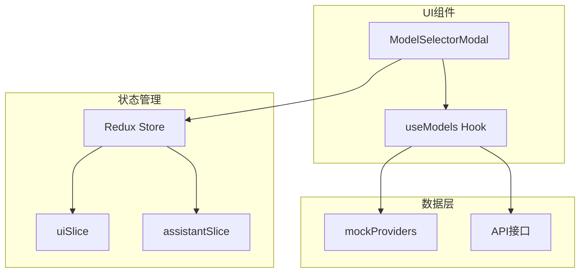
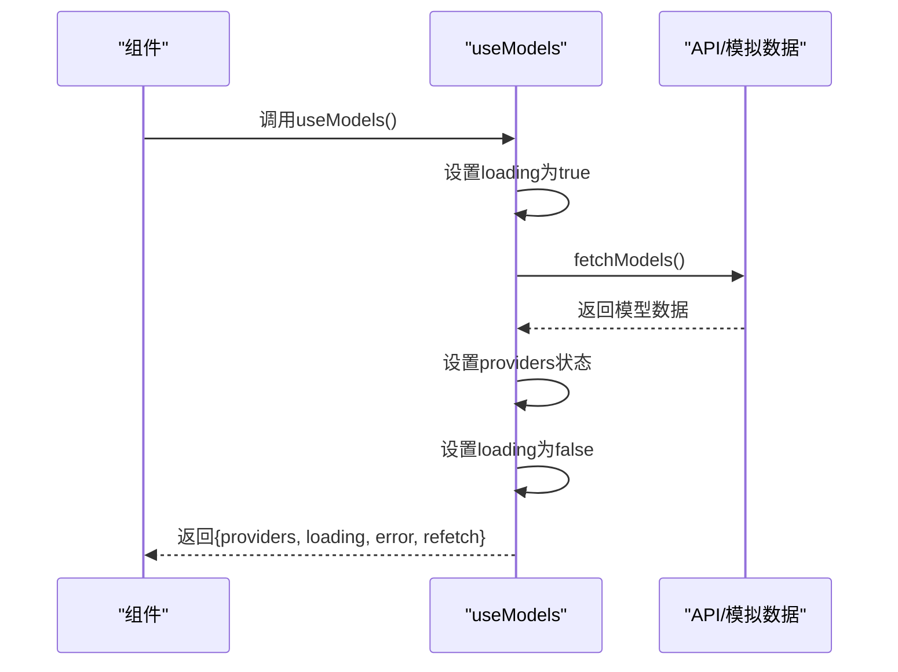
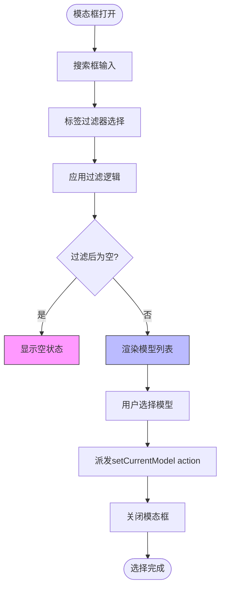
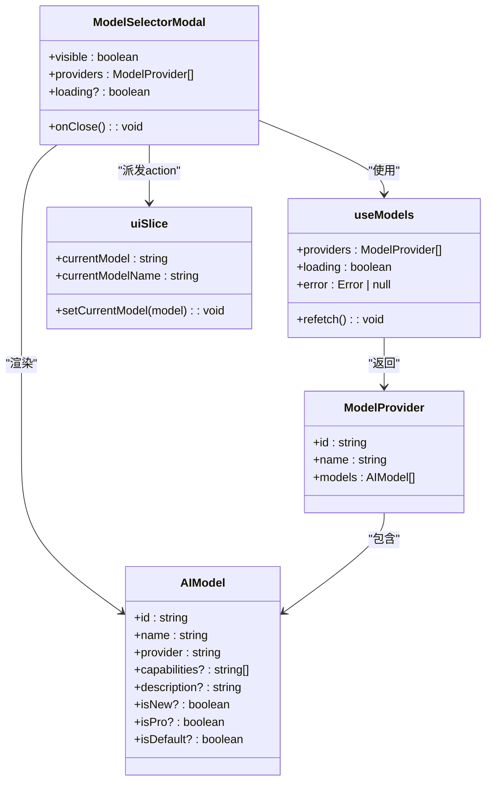

# 模型选择功能

<cite>
**本文档中引用的文件**   
- [useModels.ts](file://src/hooks/useModels.ts)
- [ModelSelectorModal.tsx](file://src/components/modals/ModelSelectorModal.tsx)
- [assistantSlice.ts](file://src/store/slices/assistantSlice.ts)
- [models.ts](file://src/mock/models.ts)
- [model.ts](file://src/types/model.ts)
</cite>

## 目录
1. [简介](#简介)
2. [核心组件](#核心组件)
3. [架构概述](#架构概述)
4. [详细组件分析](#详细组件分析)
5. [依赖分析](#依赖分析)
6. [性能考虑](#性能考虑)
7. [故障排除指南](#故障排除指南)
8. [结论](#结论)

## 简介
本文档深入阐述了AI写作前端应用中模型选择功能的实现机制。重点说明了`useModels` Hook如何从API获取可用AI模型列表，并支持按提供商（如OpenAI、Anthropic）和能力标签（如code、vision）进行过滤。详细描述了`ModelSelectorModal`组件的交互逻辑，包括模态框展示、选项筛选、选中状态同步至全局store的过程。结合`assistantSlice`说明模型配置的持久化存储方式。使用实际代码示例展示如何调用`useModels`获取特定类型模型，并解释mock数据在开发调试中的作用。最后涵盖性能优化建议，如缓存模型列表和懒加载选项。

## 核心组件

[深入分析核心组件，包括代码片段和解释]

**本节来源**
- [useModels.ts](file://src/hooks/useModels.ts#L1-L41)
- [ModelSelectorModal.tsx](file://src/components/modals/ModelSelectorModal.tsx#L1-L411)
- [models.ts](file://src/mock/models.ts#L1-L198)

## 架构概述

[系统架构的全面可视化和说明]



**图表来源**
- [useModels.ts](file://src/hooks/useModels.ts#L1-L41)
- [ModelSelectorModal.tsx](file://src/components/modals/ModelSelectorModal.tsx#L1-L411)
- [uiSlice.ts](file://src/store/slices/uiSlice.ts#L1-L148)

## 详细组件分析

[对每个关键组件的彻底分析，包括图表、代码片段路径和解释]

### useModels Hook 分析
`useModels` Hook负责管理AI模型列表的获取和状态。它使用React的`useState`和`useEffect`来管理加载状态、错误处理和数据获取。在初始化时，它会自动调用`fetchModels`函数来获取模型列表。目前使用的是mock数据，但在实际应用中会调用真实的API。



**图表来源**
- [useModels.ts](file://src/hooks/useModels.ts#L1-L41)
- [models.ts](file://src/mock/models.ts#L1-L198)

### ModelSelectorModal 组件分析
`ModelSelectorModal`组件实现了模型选择的用户界面和交互逻辑。它接收来自`useModels`的模型数据，并提供搜索、过滤和选择功能。用户可以通过搜索框查找特定模型，或使用标签过滤器按能力（如视觉、推理、工具、联网）筛选模型。



**图表来源**
- [ModelSelectorModal.tsx](file://src/components/modals/ModelSelectorModal.tsx#L1-L411)
- [useModels.ts](file://src/hooks/useModels.ts#L1-L41)

### 模型过滤逻辑分析
模型选择器实现了两级过滤机制：首先按能力标签过滤，然后按搜索文本过滤。能力标签包括"全部"、"视觉"、"推理"、"工具"和"联网"，每个标签对应特定的能力关键词。搜索过滤则同时匹配模型名称、描述和提供商名称。

```mermaid
flowchart TD
A[开始过滤] --> B{活动过滤器是否为"all"?}
B --> |否| C[按标签过滤]
C --> C1["视觉: 包含'视觉','多模态','图像'"]
C --> C2["推理: 包含'推理','思考','分析'"]
C --> C3["工具: 包含'工具','代码','函数'"]
C --> C4["联网: 包含'联网','实时','搜索'"]
B --> |是| D[跳过标签过滤]
D --> E{是否有搜索文本?}
E --> |是| F[按搜索文本过滤]
F --> F1["匹配模型名称"]
F --> F2["匹配模型描述"]
F --> F3["匹配提供商名称"]
E --> |否| G[跳过搜索过滤]
G --> H[返回过滤结果]
style C fill:#f96,stroke:#333
style F fill:#6f9,stroke:#333
```

**图表来源**
- [ModelSelectorModal.tsx](file://src/components/modals/ModelSelectorModal.tsx#L281-L345)
- [model.ts](file://src/types/model.ts#L1-L25)

## 依赖分析

[分析组件之间的依赖关系并进行可视化]



**图表来源**
- [useModels.ts](file://src/hooks/useModels.ts#L1-L41)
- [ModelSelectorModal.tsx](file://src/components/modals/ModelSelectorModal.tsx#L1-L411)
- [model.ts](file://src/types/model.ts#L1-L25)
- [uiSlice.ts](file://src/store/slices/uiSlice.ts#L89-L148)

**本节来源**
- [useModels.ts](file://src/hooks/useModels.ts#L1-L41)
- [ModelSelectorModal.tsx](file://src/components/modals/ModelSelectorModal.tsx#L1-L411)
- [model.ts](file://src/types/model.ts#L1-L25)
- [uiSlice.ts](file://src/store/slices/uiSlice.ts#L1-L148)

## 性能考虑

[一般性能讨论，不涉及特定文件分析]

### 缓存策略
- **模型列表缓存**: `useModels` Hook获取的模型列表可以缓存，避免重复请求
- **过滤结果缓存**: 对于常用的过滤组合，可以缓存过滤结果，提高响应速度
- **搜索历史缓存**: 保存用户的搜索历史，提供搜索建议

### 懒加载优化
- **分页加载**: 当模型数量较多时，可以实现分页加载，减少初始加载时间
- **虚拟滚动**: 对于长列表，使用虚拟滚动技术，只渲染可见区域的项目
- **按需加载**: 只在用户打开模型选择器时才加载模型数据

### 减少重渲染
- **记忆化计算**: 使用`useMemo`对过滤结果进行记忆化，避免不必要的重新计算
- **回调函数记忆化**: 使用`useCallback`对事件处理函数进行记忆化
- **组件拆分**: 将大型组件拆分为更小的子组件，限制状态变化的影响范围

## 故障排除指南

[错误处理代码和调试工具的分析]

### 常见问题及解决方案
- **模型列表加载失败**: 检查网络连接，确认API端点是否可用，查看控制台错误信息
- **过滤功能不工作**: 确认过滤关键词是否正确，检查模型数据中的能力标签格式
- **选择状态不同步**: 检查Redux store中的`currentModel`状态，确认action派发是否成功
- **UI显示异常**: 检查CSS变量是否正确设置，确认组件props传递是否正确

### 调试技巧
- **Redux DevTools**: 使用Redux DevTools监控state变化和action派发
- **React DevTools**: 使用React DevTools检查组件状态和props
- **console.log调试**: 在关键函数中添加日志输出，跟踪执行流程
- **网络请求监控**: 使用浏览器开发者工具监控API请求和响应

**本节来源**
- [useModels.ts](file://src/hooks/useModels.ts#L1-L41)
- [ModelSelectorModal.tsx](file://src/components/modals/ModelSelectorModal.tsx#L1-L411)
- [uiSlice.ts](file://src/store/slices/uiSlice.ts#L1-L148)

## 结论
本文档全面分析了AI写作前端应用中的模型选择功能。`useModels` Hook提供了模型数据获取的统一接口，`ModelSelectorModal`组件实现了丰富的用户交互功能，包括搜索、过滤和选择。通过Redux store的`uiSlice`，模型选择状态得以全局持久化。mock数据的使用使得开发和测试更加便捷。未来可以考虑实现真实API集成、优化性能和扩展更多过滤维度。