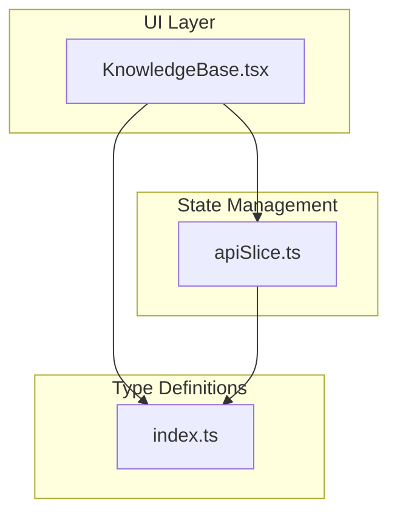
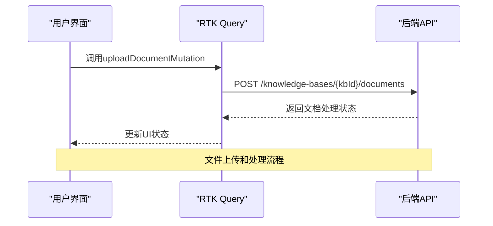
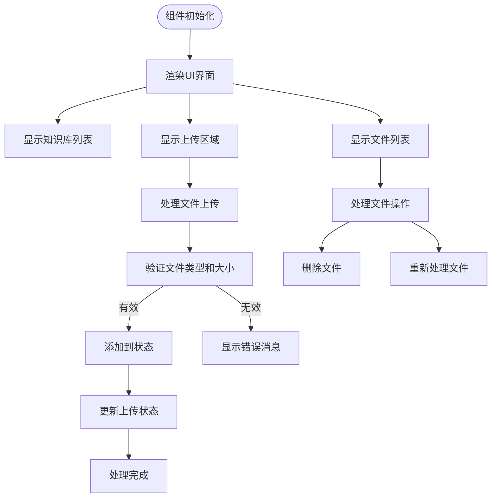
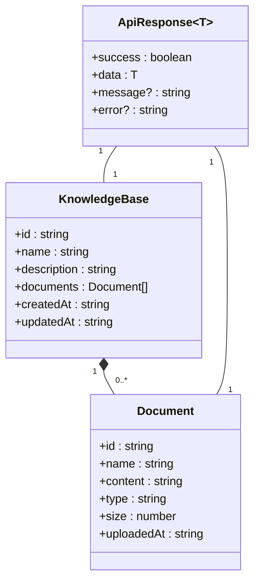
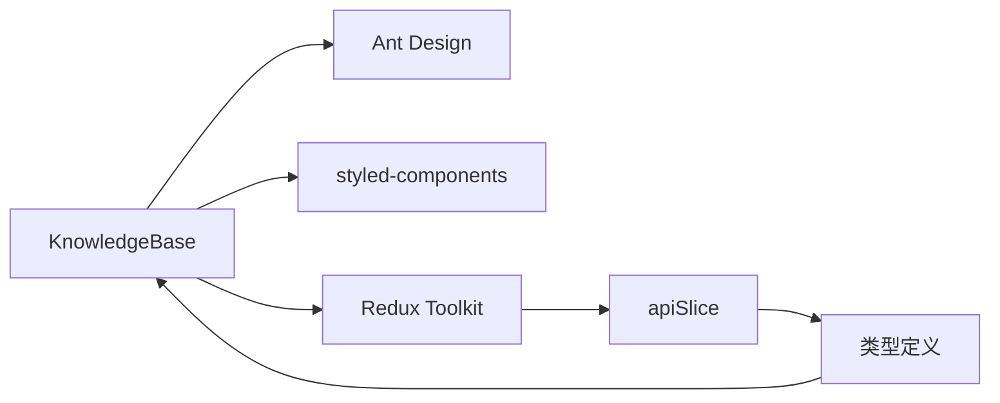

# 知识库管理功能

<cite>
**本文档引用的文件**  
- [KnowledgeBase.tsx](file://src/components/pages/KnowledgeBase.tsx)
- [apiSlice.ts](file://src/store/slices/apiSlice.ts)
- [index.ts](file://src/types/index.ts)
</cite>

## 目录
1. [简介](#简介)
2. [项目结构](#项目结构)
3. [核心组件](#核心组件)
4. [架构概述](#架构概述)
5. [详细组件分析](#详细组件分析)
6. [依赖分析](#依赖分析)
7. [性能考虑](#性能考虑)
8. [故障排除指南](#故障排除指南)
9. [结论](#结论)

## 简介
知识库管理功能是AI写作平台的核心模块之一，提供文件上传、文档解析、索引构建和知识检索能力。该功能通过React组件实现用户界面，结合Redux Toolkit Query进行状态管理和API通信，支持多种文档格式的处理和基于嵌入模型的知识表示。

## 项目结构
知识库管理功能主要由三个核心部分组成：UI组件、API服务和类型定义。UI组件位于`src/components/pages/KnowledgeBase.tsx`，负责展示知识库列表、文件上传界面和文件管理功能。API服务定义在`src/store/slices/apiSlice.ts`中，使用RTK Query实现增删改查操作。类型定义在`src/types/index.ts`中统一管理，确保前后端数据结构的一致性。

**图源**  
- [KnowledgeBase.tsx](file://src/components/pages/KnowledgeBase.tsx)
- [apiSlice.ts](file://src/store/slices/apiSlice.ts)
- [index.ts](file://src/types/index.ts)

## 核心组件
知识库管理功能的核心组件包括知识库列表、文件上传区域、文件类型标签和文件操作功能。这些组件共同构成了用户与知识库交互的主要界面，支持文件的上传、删除、重新处理等操作。

**节源**  
- [KnowledgeBase.tsx](file://src/components/pages/KnowledgeBase.tsx#L0-L678)

## 架构概述
知识库管理功能采用分层架构设计，前端UI层通过RTK Query与后端API交互，实现数据的双向同步。系统支持多种文档格式的上传和处理，通过嵌入模型将文档内容转换为向量表示，便于后续的语义搜索和知识检索。

**图源**  
- [KnowledgeBase.tsx](file://src/components/pages/KnowledgeBase.tsx#L443-L521)
- [apiSlice.ts](file://src/store/slices/apiSlice.ts#L229-L270)

## 详细组件分析

### 知识库页面分析
KnowledgeBase组件实现了完整的知识库管理功能，包括知识库选择、文件上传、文件列表展示和文件操作。

#### 对于UI组件：

**图源**  
- [KnowledgeBase.tsx](file://src/components/pages/KnowledgeBase.tsx#L355-L678)

### API服务分析
apiSlice.ts文件定义了知识库管理相关的所有API端点，使用RTK Query的createApi方法创建API服务。

#### 对于API服务组件：

**图源**  
- [apiSlice.ts](file://src/store/slices/apiSlice.ts#L0-L304)
- [index.ts](file://src/types/index.ts#L55-L71)

## 依赖分析
知识库管理功能依赖于多个核心库和组件，包括Ant Design用于UI组件，styled-components用于样式管理，Redux Toolkit用于状态管理。

**图源**  
- [KnowledgeBase.tsx](file://src/components/pages/KnowledgeBase.tsx)
- [apiSlice.ts](file://src/store/slices/apiSlice.ts)
- [index.ts](file://src/types/index.ts)

## 性能考虑
知识库管理功能在设计时考虑了多个性能因素。文件上传采用FormData格式，支持大文件的流式传输。UI更新使用React的useState钩子，确保状态变更的高效性。RTK Query的缓存机制减少了重复的API调用，提高了数据获取效率。

## 故障排除指南
以下是一些常见问题及其解决方案：

**节源**  
- [KnowledgeBase.tsx](file://src/components/pages/KnowledgeBase.tsx#L443-L521)
- [apiSlice.ts](file://src/store/slices/apiSlice.ts#L229-L270)

### 大文件上传失败
当上传超过50MB的文件时，系统会显示"文件大小不能超过 50MB"的错误消息。解决方案包括：
- 压缩文件大小
- 分割大文件为多个小文件
- 联系管理员调整上传限制

### 文件解析异常
如果文件解析失败，可能的原因包括：
- 不支持的文件格式
- 文件损坏
- 解析服务临时故障

检查上传的文件是否属于支持的格式列表（TXT, MD, HTML, PDF, DOCX, PPTX, XLSX, EPUB等），并确保文件完整性。

## 结论
知识库管理功能通过清晰的架构设计和完善的API接口，提供了强大的文档管理和知识检索能力。系统支持多种文档格式的上传和处理，通过嵌入模型实现语义级别的知识表示。未来可以考虑增加更多文件格式支持、优化大文件处理性能以及增强错误处理机制。