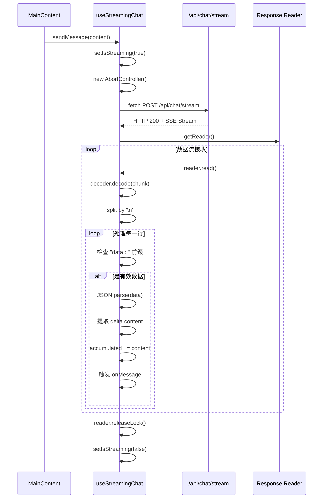
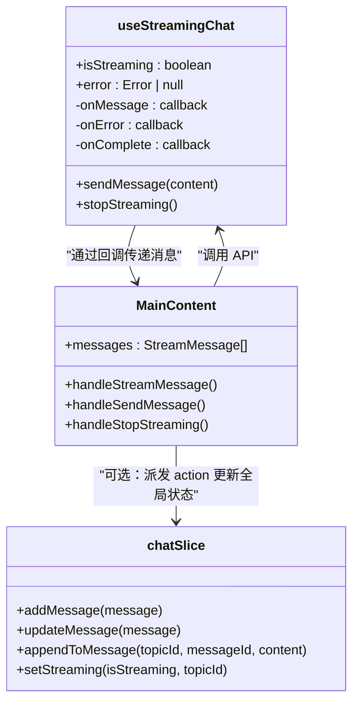
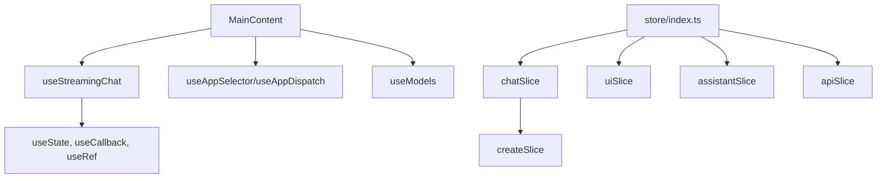

# 聊天功能

<cite>
**本文档引用的文件**  
- [useStreamingChat.ts](file://src/hooks/useStreamingChat.ts)
- [chatSlice.ts](file://src/store/slices/chatSlice.ts)
- [MainContent.tsx](file://src/components/layout/MainContent.tsx)
- [redux.ts](file://src/hooks/redux.ts)
- [index.ts](file://src/store/index.ts)
</cite>

## 目录
1. [介绍](#介绍)
2. [核心组件](#核心组件)
3. [架构概述](#架构概述)
4. [详细组件分析](#详细组件分析)
5. [依赖分析](#依赖分析)
6. [性能考虑](#性能考虑)
7. [故障排除指南](#故障排除指南)
8. [结论](#结论)

## 介绍
本文档详细说明了前端项目中聊天功能的实现机制，重点分析了 `useStreamingChat` Hook 如何通过 Server-Sent Events (SSE) 与后端 `/api/chat/stream` 接口建立流式通信。文档涵盖了连接初始化、数据分块接收、实时消息更新、错误重连策略等核心流程，并解释了其与 Redux 状态管理（`chatSlice`）的同步逻辑。同时，结合 `MainContent` 组件说明了 UI 层如何调用该 Hook 并渲染对话流，提供了典型使用场景和常见问题的解决方案。

## 核心组件

本功能的核心由三个主要组件构成：`useStreamingChat` Hook 负责与后端的流式通信，`chatSlice` 负责全局状态管理，`MainContent` 组件负责 UI 展现和用户交互。

**Section sources**
- [useStreamingChat.ts](file://src/hooks/useStreamingChat.ts#L1-L240)
- [chatSlice.ts](file://src/store/slices/chatSlice.ts#L1-L152)
- [MainContent.tsx](file://src/components/layout/MainContent.tsx#L1-L724)

## 架构概述

聊天功能的架构遵循典型的 React + Redux 模式，结合自定义 Hook 实现流式数据处理。用户在 UI 层触发操作，通过 Hook 发起网络请求，流式数据被实时处理并更新到 Redux Store，最终驱动 UI 重新渲染。

```mermaid
graph TB
subgraph "UI 层"
MainContent[MainContent 组件]
end
subgraph "逻辑层"
StreamingHook[useStreamingChat Hook]
end
subgraph "状态层"
ReduxStore[Redux Store]
ChatSlice[chatSlice]
end
subgraph "服务层"
BackendAPI[/api/chat/stream]
end
MainContent --> |调用| StreamingHook
StreamingHook --> |发送请求| BackendAPI
BackendAPI --> |SSE 流式响应| StreamingHook
StreamingHook --> |onMessage| ChatSlice
ChatSlice --> |状态更新| ReduxStore
ReduxStore --> |订阅| MainContent
```

**Diagram sources**
- [useStreamingChat.ts](file://src/hooks/useStreamingChat.ts#L1-L240)
- [chatSlice.ts](file://src/store/slices/chatSlice.ts#L1-L152)
- [MainContent.tsx](file://src/components/layout/MainContent.tsx#L1-L724)

## 详细组件分析

### useStreamingChat Hook 分析

`useStreamingChat` 是一个自定义 Hook，封装了与后端 `/api/chat/stream` 接口进行流式通信的全部逻辑。

#### 连接初始化与流式通信
当调用 `sendMessage` 函数时，Hook 会：
1.  创建 `AbortController` 用于后续的请求中断。
2.  构建包含 `content`, `assistantId`, `topicId`, `stream: true` 的请求体。
3.  使用 `fetch` API 发起 POST 请求，通过 `signal` 与 `AbortController` 关联。
4.  获取 `response.body` 的 `reader`，并使用 `TextDecoder` 解码数据流。



**Diagram sources**
- [useStreamingChat.ts](file://src/hooks/useStreamingChat.ts#L16-L239)

#### 实时消息更新机制
Hook 通过 `options.onMessage` 回调将流式数据实时传递给调用方。在 `MainContent` 中，`handleStreamMessage` 函数会：
- 如果消息 ID 已存在，则更新该消息的内容（用于流式追加）。
- 如果是新消息 ID，则将其添加到消息列表末尾。

#### 错误重连与中断策略
- **错误处理**：任何网络错误或 HTTP 非 2xx 状态码都会被捕获，通过 `options.onError` 回调通知上层，并更新 Hook 内部的 `error` 状态。
- **中断流**：`stopStreaming` 函数会调用 `abortController.abort()`，立即终止当前的 fetch 请求，实现“停止生成”功能。

**Section sources**
- [useStreamingChat.ts](file://src/hooks/useStreamingChat.ts#L1-L240)

### chatSlice 状态同步分析

`chatSlice` 是 Redux 中管理聊天状态的核心模块，`useStreamingChat` 通过回调与之同步。

#### 状态同步逻辑
`useStreamingChat` 本身不直接操作 Redux Store。它通过 `onMessage` 回调将消息传递给 `MainContent` 组件，由组件内的 `handleStreamMessage` 函数负责更新本地状态 `messages`。然而，从 `chatSlice` 的设计来看，它提供了 `addMessage`, `updateMessage`, `appendToMessage` 等 action，为将来将消息状态完全托管到 Redux Store 做好了准备。目前的实现是将消息状态保留在组件内，但结构上与 `chatSlice` 的 `messages` 字段（`Record<string, Message[]>`）保持一致。



**Diagram sources**
- [useStreamingChat.ts](file://src/hooks/useStreamingChat.ts#L1-L240)
- [chatSlice.ts](file://src/store/slices/chatSlice.ts#L1-L152)
- [MainContent.tsx](file://src/components/layout/MainContent.tsx#L1-L724)

#### 消息历史管理
`chatSlice` 通过 `messages` 字段按 `topicId` 组织消息历史。`MainContent` 组件中的 `messages` 状态模拟了这一结构。当切换话题 (`currentTopicId`) 时，`useEffect` 会清空当前的 `messages` 数组，实现了话题间消息的隔离。

**Section sources**
- [chatSlice.ts](file://src/store/slices/chatSlice.ts#L1-L152)
- [MainContent.tsx](file://src/components/layout/MainContent.tsx#L1-L724)

### MainContent 组件分析

`MainContent` 组件是聊天功能的 UI 入口，负责整合 Hook 和状态管理。

#### UI 层调用与渲染
- **Hook 调用**：组件通过 `const streamingChat = useStreamingChat({...})` 初始化 Hook，并传入 `onMessage`, `onError`, `onComplete` 回调。
- **消息渲染**：使用 `map` 函数遍历 `messages` 数组，根据 `role` (user/assistant) 渲染不同的消息气泡，并通过 `isStreaming` 状态控制助手消息的动态显示效果。
- **用户输入处理**：`TextArea` 组件捕获用户输入，`handleSendMessage` 函数在发送消息后清空输入框，并调用 `streamingChat.sendMessageMock` (开发环境) 或 `sendMessage`。
- **逐字显示**：由于 `onMessage` 在每次收到新的文本块时都会被调用，`messages` 状态持续更新，从而实现了助手回复的逐字显示效果。

#### 典型使用场景代码示例
```typescript
// 1. 发送消息
const handleSendMessage = async () => {
  if (!inputValue.trim() || streamingChat.isStreaming) return;
  // ... 创建用户消息并添加到本地状态
  await streamingChat.sendMessage(inputValue, assistantId, topicId);
};

// 2. 中断响应
const handleStopStreaming = () => {
  streamingChat.stopStreaming(); // 调用 Hook 的中断方法
};

// 3. 处理异常
const streamingChat = useStreamingChat({
  onError: (error: Error) => {
    message.error(`发送失败: ${error.message}`); // 使用 Ant Design 的 message 组件提示
  }
});
```

#### 常见问题与解决方案
- **连接超时**：在 `fetch` 请求中可以添加 `timeout` 逻辑，或在 `onError` 回调中提示用户检查网络并提供重试按钮。
- **消息乱序**：当前实现基于单个流，且按顺序处理 `SSE` 数据块，通常不会出现乱序。若后端支持多并发请求，应确保每个请求有独立的 `AbortController` 和消息处理逻辑，避免状态污染。

**Section sources**
- [MainContent.tsx](file://src/components/layout/MainContent.tsx#L1-L724)

## 依赖分析



**Diagram sources**
- [MainContent.tsx](file://src/components/layout/MainContent.tsx#L1-L724)
- [useStreamingChat.ts](file://src/hooks/useStreamingChat.ts#L1-L240)
- [chatSlice.ts](file://src/store/slices/chatSlice.ts#L1-L152)
- [index.ts](file://src/store/index.ts#L1-L27)

## 性能考虑

- **流式渲染**：逐字显示提供了良好的用户体验，但频繁的状态更新可能影响性能。应确保 `messages` 数组的更新是高效的（使用函数式更新），并且消息列表的渲染使用了 `key` 优化。
- **内存管理**：`AbortController` 的引用被妥善管理，在请求结束或中断后会被置为 `null`，避免内存泄漏。
- **解码效率**：使用 `TextDecoder` 的 `stream: true` 模式可以正确处理跨块的 UTF-8 字符，保证了数据的完整性。

## 故障排除指南

- **无法发送消息**：检查 `inputValue` 是否为空，`streamingChat.isStreaming` 是否为 `true` 导致按钮禁用。
- **消息不显示**：确认 `onMessage` 回调是否被正确调用，检查 `handleStreamMessage` 函数的逻辑。
- **停止按钮无效**：确保 `stopStreaming` 函数被正确绑定到按钮的 `onClick` 事件。
- **SSE 数据解析错误**：查看控制台警告 `Failed to parse SSE data`，这通常是由于收到了不完整的 JSON 片段，属于正常现象，代码中已通过 `try-catch` 忽略。

**Section sources**
- [useStreamingChat.ts](file://src/hooks/useStreamingChat.ts#L1-L240)
- [MainContent.tsx](file://src/components/layout/MainContent.tsx#L1-L724)

## 结论

该项目的聊天功能通过 `useStreamingChat` Hook 实现了高效的流式通信，结合 `MainContent` 组件提供了流畅的用户交互体验。虽然当前消息状态管理在组件内部，但其设计与 `chatSlice` 高度契合，为未来的状态集中化管理预留了空间。整体架构清晰，职责分离明确，是一个可维护性较高的实现方案。