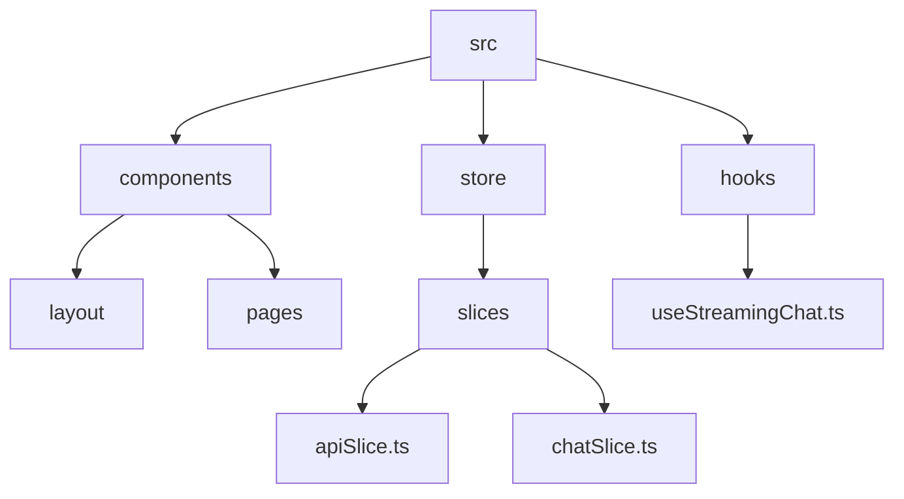
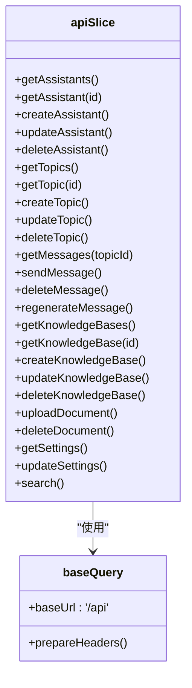
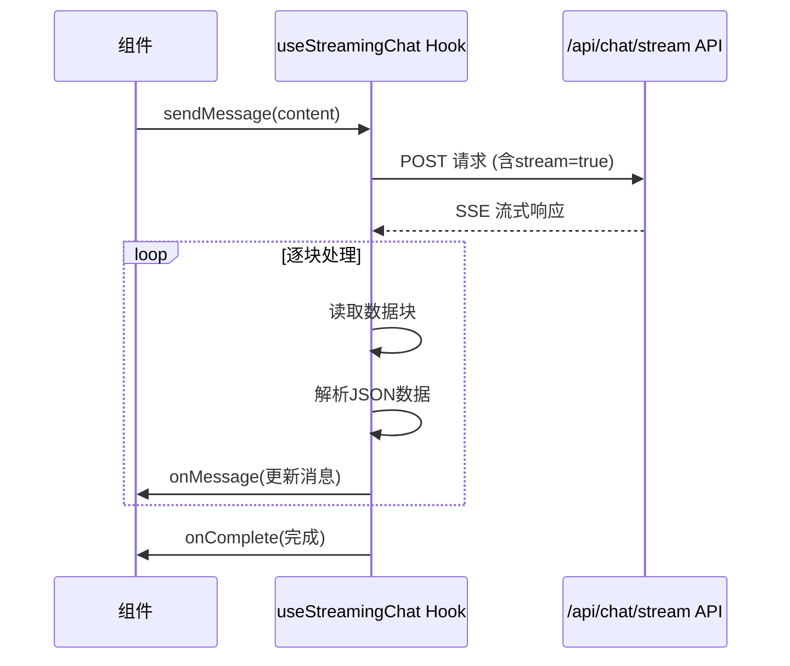
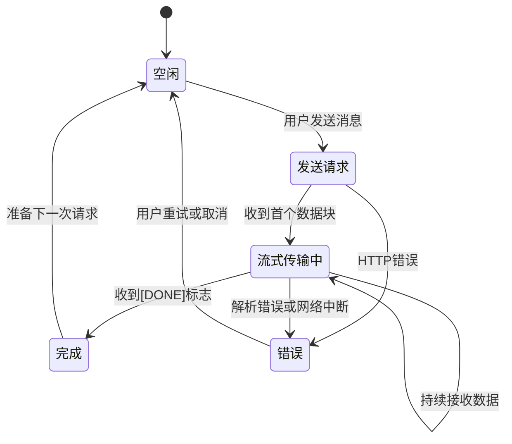
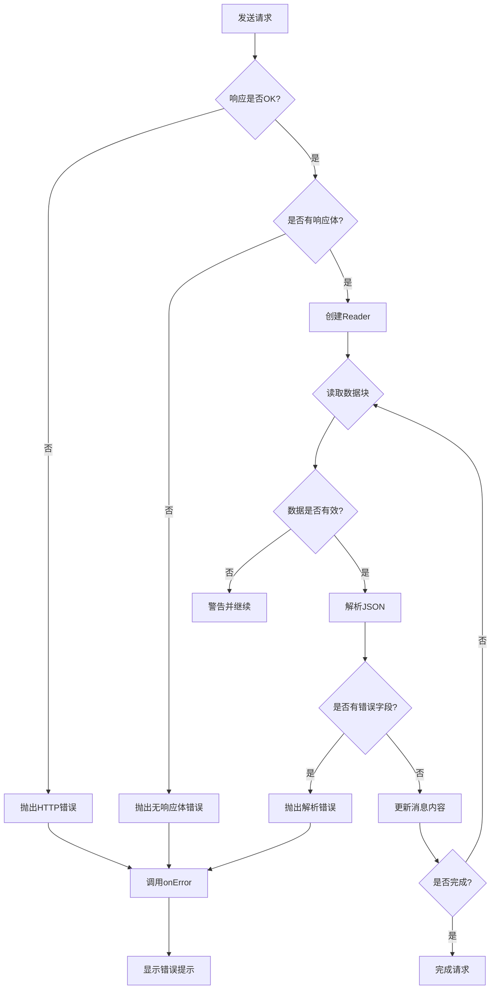
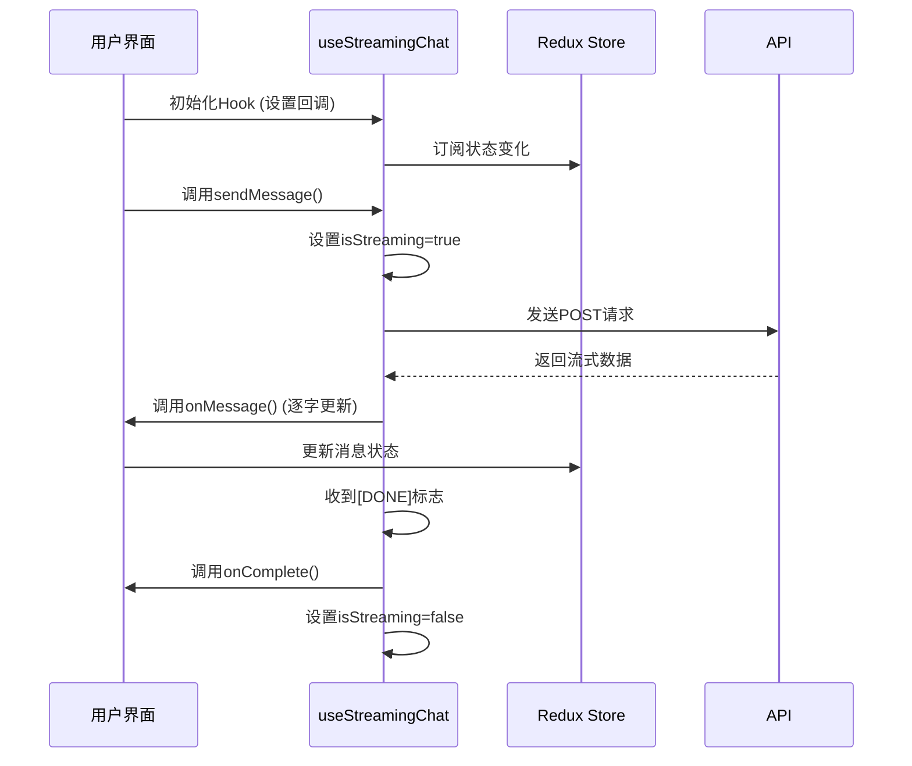
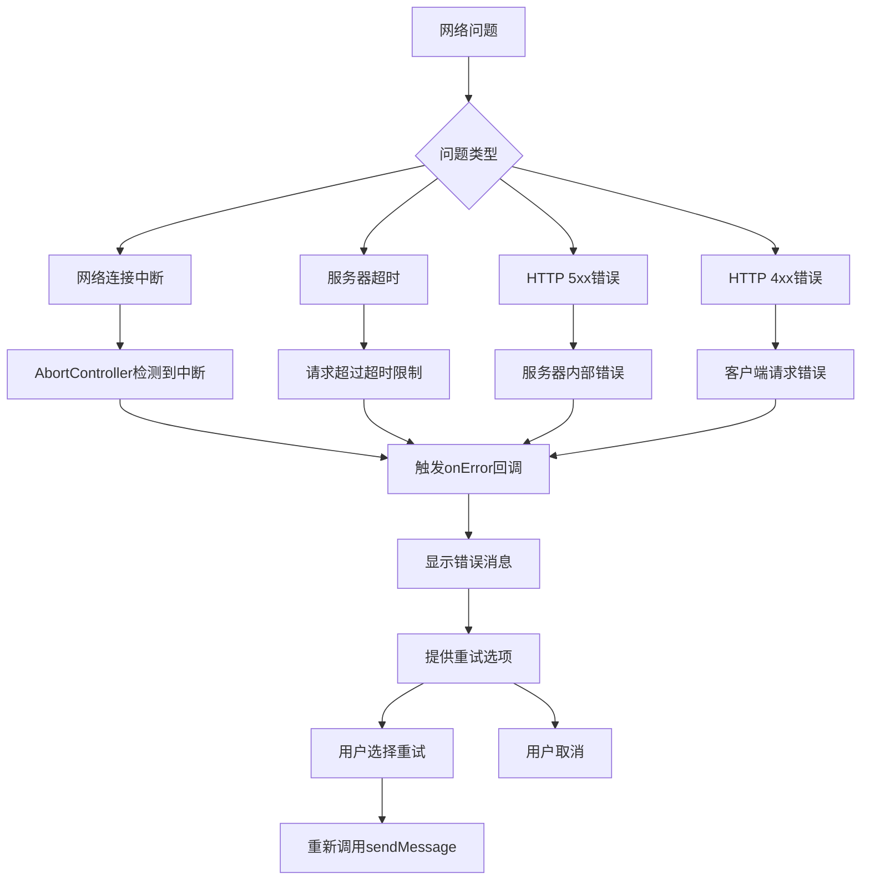

# API状态与异步操作

<cite>
**本文档中引用的文件**   
- [apiSlice.ts](file://src/store/slices/apiSlice.ts)
- [useStreamingChat.ts](file://src/hooks/useStreamingChat.ts)
- [chatSlice.ts](file://src/store/slices/chatSlice.ts)
- [MainContent.tsx](file://src/components/layout/MainContent.tsx)
</cite>

## 目录
1. [项目结构](#项目结构)
2. [核心组件](#核心组件)
3. [API请求逻辑与异步状态管理](#api请求逻辑与异步状态管理)
4. [流式请求实现细节](#流式请求实现细节)
5. [状态转换机制](#状态转换机制)
6. [组件中的状态监听](#组件中的状态监听)
7. [请求参数与认证处理](#请求参数与认证处理)
8. [错误处理与重试策略](#错误处理与重试策略)
9. [实际调用示例](#实际调用示例)
10. [常见网络问题应对](#常见网络问题应对)

## 项目结构



**图示来源**
- [apiSlice.ts](file://src/store/slices/apiSlice.ts)
- [chatSlice.ts](file://src/store/slices/chatSlice.ts)
- [useStreamingChat.ts](file://src/hooks/useStreamingChat.ts)

**本节来源**
- [apiSlice.ts](file://src/store/slices/apiSlice.ts)
- [chatSlice.ts](file://src/store/slices/chatSlice.ts)

## 核心组件

**本节来源**
- [apiSlice.ts](file://src/store/slices/apiSlice.ts#L1-L85)
- [chatSlice.ts](file://src/store/slices/chatSlice.ts#L1-L41)

## API请求逻辑与异步状态管理

系统使用Redux Toolkit Query的`createApi`和`fetchBaseQuery`来封装对`/api/chat/stream`、`/api/assistants`、`/api/topics`等端点的HTTP请求。`apiSlice`定义了多个查询和突变操作，每个操作都对应一个特定的API端点。



**图示来源**
- [apiSlice.ts](file://src/store/slices/apiSlice.ts#L87-L304)

**本节来源**
- [apiSlice.ts](file://src/store/slices/apiSlice.ts#L87-L304)

## 流式请求实现细节

对于`/api/chat/stream`端点，系统使用自定义的`useStreamingChat` Hook来处理流式响应。该Hook使用`fetch` API和`ReadableStream`来逐块处理服务器发送的事件(SSE)数据。



**图示来源**
- [useStreamingChat.ts](file://src/hooks/useStreamingChat.ts#L0-L239)
- [MainContent.tsx](file://src/components/layout/MainContent.tsx#L370-L418)

**本节来源**
- [useStreamingChat.ts](file://src/hooks/useStreamingChat.ts#L0-L239)

## 状态转换机制

API请求过程中的状态转换通过Redux Toolkit Query自动管理，包含`pending`、`fulfilled`和`rejected`三种状态。对于流式请求，还通过`chatSlice`中的`isStreaming`状态来跟踪流式传输过程。



**图示来源**
- [useStreamingChat.ts](file://src/hooks/useStreamingChat.ts#L0-L239)
- [chatSlice.ts](file://src/store/slices/chatSlice.ts#L109-L151)

**本节来源**
- [useStreamingChat.ts](file://src/hooks/useStreamingChat.ts#L0-L239)
- [chatSlice.ts](file://src/store/slices/chatSlice.ts#L109-L151)

## 组件中的状态监听

组件通过`useStreamingChat` Hook的回调函数来监听流式请求的状态变化，包括消息更新、错误发生和完成事件。`MainContent`组件使用这些回调来更新UI状态。

```mermaid
flowchart TD
A[用户发送消息] --> B[调用sendMessage]
B --> C{是否流式传输中?}
C --> |是| D[显示加载指示器]
C --> |否| E[正常发送]
D --> F[接收流式数据]
F --> G[逐字更新消息内容]
G --> H{收到[DONE]或错误?}
H --> |是| I[停止加载指示器]
H --> |否| F
I --> J[消息显示完成]
```

**图示来源**
- [MainContent.tsx](file://src/components/layout/MainContent.tsx#L370-L418)
- [useStreamingChat.ts](file://src/hooks/useStreamingChat.ts#L0-L239)

**本节来源**
- [MainContent.tsx](file://src/components/layout/MainContent.tsx#L370-L418)

## 请求参数与认证处理

请求参数通过`fetchBaseQuery`的配置进行序列化和处理。所有请求都设置`Content-Type`为`application/json`，并在请求头中包含必要的认证信息。

```mermaid
classDiagram
class RequestConfig {
+baseUrl : '/api'
+headers : {'Content-Type' : 'application/json'}
+prepareHeaders()
}
class RequestBody {
+content : string
+assistantId : string
+topicId : string
+stream : boolean
}
class ApiResponse {
+success : boolean
+data : any
+message : string
+error : string
}
RequestConfig --> RequestBody : "配置"
RequestBody --> ApiResponse : "产生"
```

**图示来源**
- [apiSlice.ts](file://src/store/slices/apiSlice.ts#L80-L85)
- [useStreamingChat.ts](file://src/hooks/useStreamingChat.ts#L0-L239)

**本节来源**
- [apiSlice.ts](file://src/store/slices/apiSlice.ts#L80-L85)

## 错误处理与重试策略

系统实现了全面的错误处理机制，包括网络错误、HTTP状态错误和数据解析错误。通过`AbortController`支持请求中断，并提供错误回调来通知用户。



**图示来源**
- [useStreamingChat.ts](file://src/hooks/useStreamingChat.ts#L0-L239)

**本节来源**
- [useStreamingChat.ts](file://src/hooks/useStreamingChat.ts#L0-L239)

## 实际调用示例



**图示来源**
- [MainContent.tsx](file://src/components/layout/MainContent.tsx#L370-L418)
- [useStreamingChat.ts](file://src/hooks/useStreamingChat.ts#L0-L239)

**本节来源**
- [MainContent.tsx](file://src/components/layout/MainContent.tsx#L370-L418)

## 常见网络问题应对

系统通过多种机制应对常见的网络问题，包括请求超时、网络中断和服务器错误。使用`AbortController`可以手动中断长时间运行的请求。



**图示来源**
- [useStreamingChat.ts](file://src/hooks/useStreamingChat.ts#L0-L239)

**本节来源**
- [useStreamingChat.ts](file://src/hooks/useStreamingChat.ts#L0-L239)