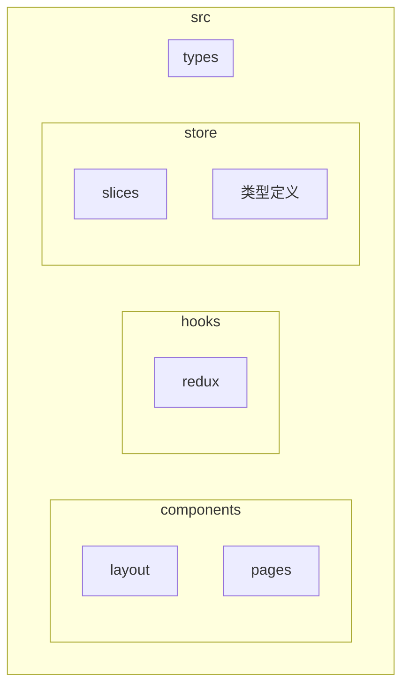
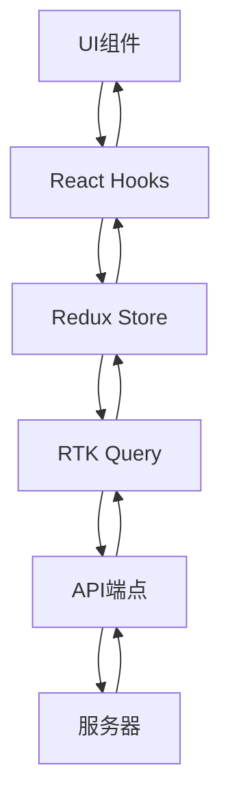
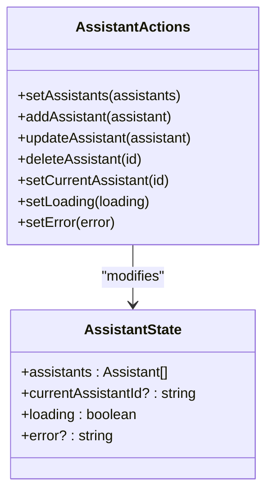
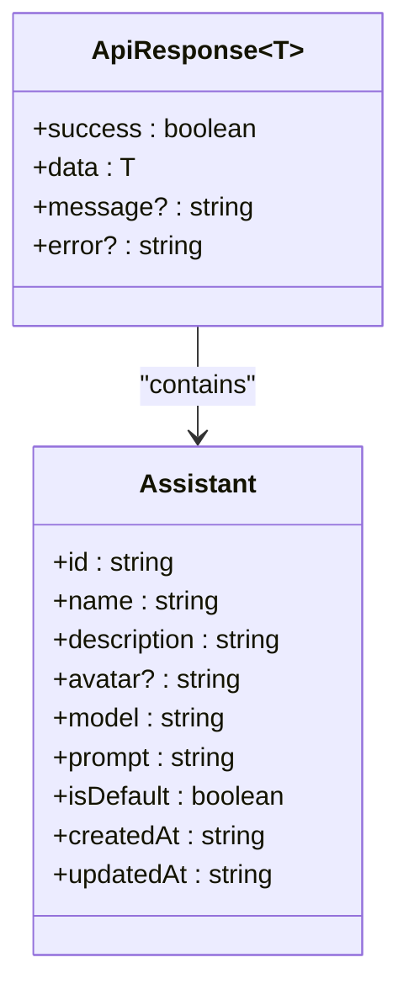
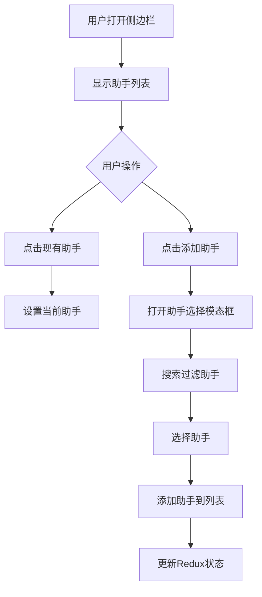
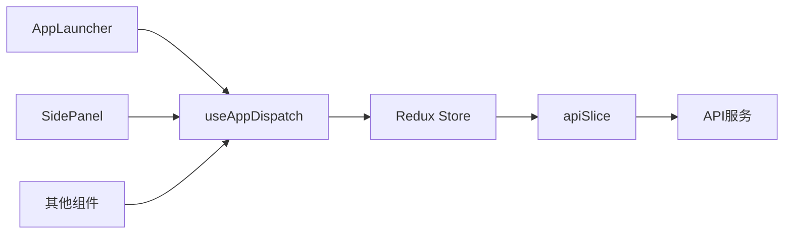

# 助手管理API

<cite>
**本文档引用文件**  
- [apiSlice.ts](file://src/store/slices/apiSlice.ts)
- [assistantSlice.ts](file://src/store/slices/assistantSlice.ts)
- [index.ts](file://src/types/index.ts)
- [SidePanel.tsx](file://src/components/layout/SidePanel.tsx)
- [AppLauncher.tsx](file://src/components/pages/AppLauncher.tsx)
</cite>

## 目录
1. [简介](#简介)
2. [项目结构](#项目结构)
3. [核心组件](#核心组件)
4. [架构概述](#架构概述)
5. [详细组件分析](#详细组件分析)
6. [依赖分析](#依赖分析)
7. [性能考虑](#性能考虑)
8. [故障排除指南](#故障排除指南)
9. [结论](#结论)

## 简介
本文档详细记录了助手管理API的实现，包括RESTful端点、异步thunk函数、Redux状态管理、缓存机制、错误处理和用户交互。重点描述了`/api/assistants`端点的GET、POST、PUT、DELETE方法实现，以及在AppLauncher页面中的实际应用。

## 项目结构
项目采用模块化架构，主要分为components、hooks、store和types四个核心目录。store目录包含Redux状态管理逻辑，其中apiSlice.ts定义了所有API端点，assistantSlice.ts管理助手相关的本地状态。



**图示来源**  
- [apiSlice.ts](file://src/store/slices/apiSlice.ts)
- [assistantSlice.ts](file://src/store/slices/assistantSlice.ts)

**章节来源**  
- [apiSlice.ts](file://src/store/slices/apiSlice.ts)
- [project_structure](file://project_structure)

## 核心组件
核心组件包括apiSlice中的异步thunk函数和assistantSlice中的状态管理逻辑。apiSlice使用Redux Toolkit Query自动生成异步thunks，而assistantSlice处理本地状态更新。

**章节来源**  
- [apiSlice.ts](file://src/store/slices/apiSlice.ts#L87-L123)
- [assistantSlice.ts](file://src/store/slices/assistantSlice.ts#L23-L72)

## 架构概述
系统采用Redux状态管理架构，结合RTK Query进行数据获取和缓存。API请求通过thunk函数异步执行，响应数据存储在Redux store中，组件通过hooks订阅状态变化。



**图示来源**  
- [apiSlice.ts](file://src/store/slices/apiSlice.ts)
- [assistantSlice.ts](file://src/store/slices/assistantSlice.ts)

## 详细组件分析

### API端点分析
#### 助手相关API端点
```mermaid
classDiagram
class GetAssistants {
+query : () => '/assistants'
+providesTags : ['Assistant']
}
class GetAssistant {
+query : (id) => `/assistants/${id}`
+providesTags : (_result, _error, id) => [{ type : 'Assistant', id }]
}
class CreateAssistant {
+query : (assistant) => { url : '/assistants', method : 'POST', body : assistant }
+invalidatesTags : ['Assistant']
}
class UpdateAssistant {
+query : ({ id, assistant }) => { url : `/assistants/${id}`, method : 'PUT', body : assistant }
+invalidatesTags : (_result, _error, { id }) => [{ type : 'Assistant', id }]
}
class DeleteAssistant {
+query : (id) => { url : `/assistants/${id}`, method : 'DELETE' }
+invalidatesTags : ['Assistant']
}
GetAssistants --> RTKQuery : "extends"
GetAssistant --> RTKQuery : "extends"
CreateAssistant --> RTKQuery : "extends"
UpdateAssistant --> RTKQuery : "extends"
DeleteAssistant --> RTKQuery : "extends"
```

**图示来源**  
- [apiSlice.ts](file://src/store/slices/apiSlice.ts#L87-L123)

**章节来源**  
- [apiSlice.ts](file://src/store/slices/apiSlice.ts#L87-L123)

### 状态管理分析
#### 助手状态切片


**图示来源**  
- [assistantSlice.ts](file://src/store/slices/assistantSlice.ts#L0-L26)

**章节来源**  
- [assistantSlice.ts](file://src/store/slices/assistantSlice.ts#L23-L72)

### 类型定义分析
#### 助手数据结构


**图示来源**  
- [index.ts](file://src/types/index.ts#L13-L23)

**章节来源**  
- [index.ts](file://src/types/index.ts#L13-L23)

### 用户界面分析
#### 侧边栏助手管理


**图示来源**  
- [SidePanel.tsx](file://src/components/layout/SidePanel.tsx)

**章节来源**  
- [SidePanel.tsx](file://src/components/layout/SidePanel.tsx#L186-L203)

## 依赖分析
系统依赖关系清晰，UI组件依赖hooks，hooks依赖Redux store，store中的apiSlice依赖底层API服务。



**图示来源**  
- [AppLauncher.tsx](file://src/components/pages/AppLauncher.tsx)
- [SidePanel.tsx](file://src/components/layout/SidePanel.tsx)

**章节来源**  
- [AppLauncher.tsx](file://src/components/pages/AppLauncher.tsx)
- [SidePanel.tsx](file://src/components/layout/SidePanel.tsx)

## 性能考虑
- **缓存机制**: RTK Query自动缓存助手列表，避免重复请求
- **节流防抖**: 在搜索功能中实现输入节流，减少不必要的API调用
- **懒加载**: 助手详情在需要时才通过getAssistant查询
- **标签失效**: 创建、更新、删除操作后自动失效缓存，触发重新获取

## 故障排除指南
### 常见错误处理
- **名称冲突**: 创建助手时检查名称唯一性，返回409状态码
- **权限不足**: 检查用户权限，返回403状态码
- **网络错误**: 捕获网络异常，显示友好提示
- **验证失败**: 检查请求体格式，返回400状态码

### 用户提示方式
- **成功提示**: 操作成功后显示绿色toast通知
- **错误提示**: 操作失败后显示红色toast通知，包含具体错误信息
- **加载状态**: 异步操作期间显示加载指示器
- **确认对话框**: 删除操作前显示确认对话框

**章节来源**  
- [assistantSlice.ts](file://src/store/slices/assistantSlice.ts#L23-L72)
- [SidePanel.tsx](file://src/components/layout/SidePanel.tsx)

## 结论
助手管理API设计合理，实现了完整的CRUD操作。通过RTK Query和Redux Toolkit的结合，实现了高效的状态管理和缓存机制。系统具有良好的可维护性和扩展性，为用户提供流畅的交互体验。