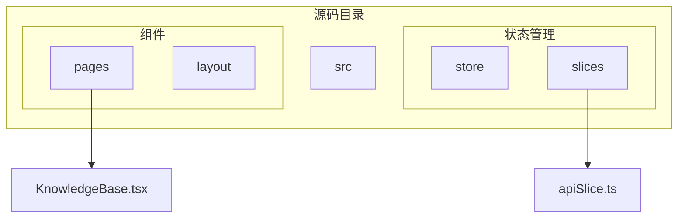
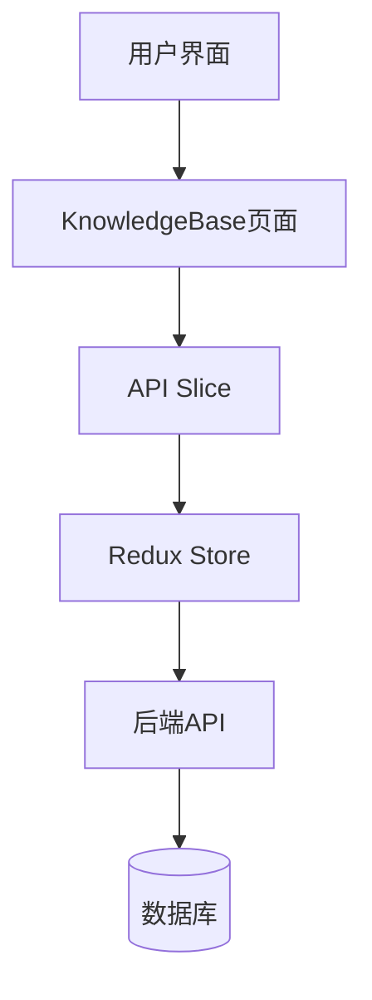
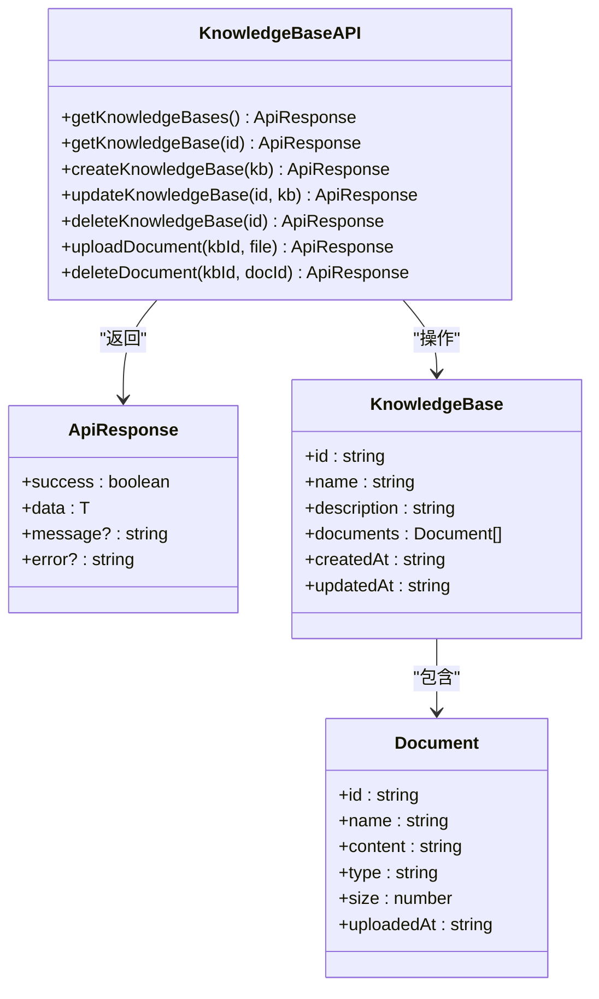
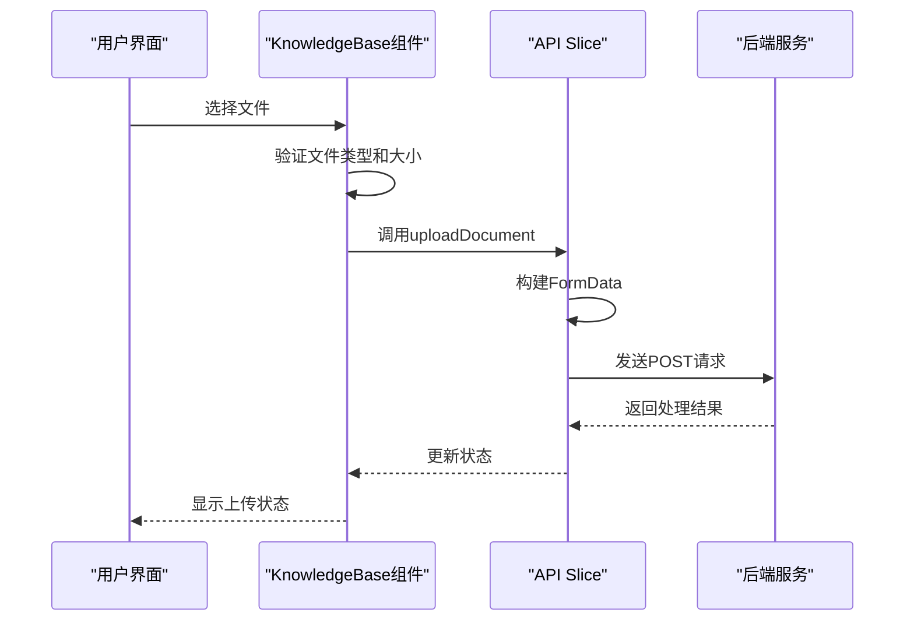
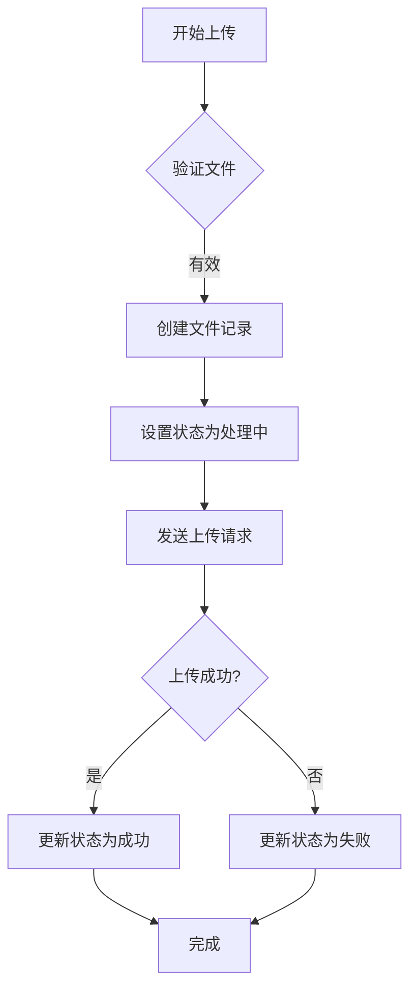
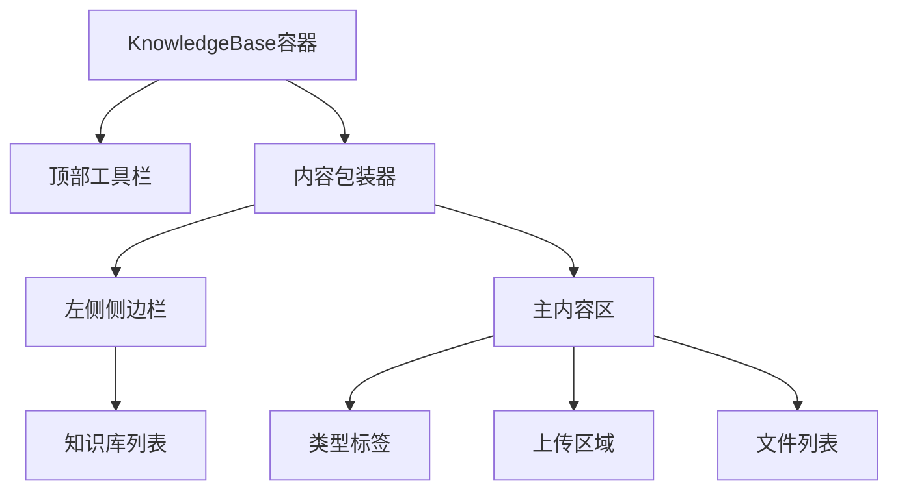
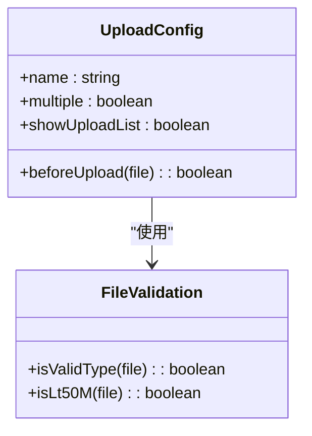
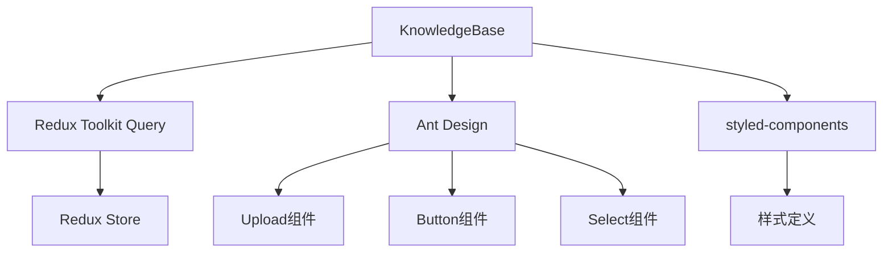

# 知识库管理API

<cite>
**本文档中引用的文件**  
- [apiSlice.ts](file://src/store/slices/apiSlice.ts)
- [KnowledgeBase.tsx](file://src/components/pages/KnowledgeBase.tsx)
</cite>

## 目录
1. [简介](#简介)
2. [项目结构](#项目结构)
3. [核心组件](#核心组件)
4. [架构概述](#架构概述)
5. [详细组件分析](#详细组件分析)
6. [依赖分析](#依赖分析)
7. [性能考虑](#性能考虑)
8. [故障排除指南](#故障排除指南)
9. [结论](#结论)

## 简介
本文档详细说明了知识库管理功能的API实现，涵盖知识库的创建、文件上传、文档处理状态轮询及删除操作。重点描述了`/api/knowledge-bases`端点的HTTP请求实现方式，多部分表单数据（multipart/form-data）的构建方法，以及前端如何通过Redux状态跟踪上传进度。同时记录了错误类型及其对应的用户提示策略。

## 项目结构
项目采用模块化结构，主要功能集中在`src`目录下。知识库管理功能的核心逻辑分布在`store/slices/apiSlice.ts`中定义的API接口和`components/pages/KnowledgeBase.tsx`中的页面组件。

**Diagram sources**  
- [KnowledgeBase.tsx](file://src/components/pages/KnowledgeBase.tsx)
- [apiSlice.ts](file://src/store/slices/apiSlice.ts)

**Section sources**  
- [KnowledgeBase.tsx](file://src/components/pages/KnowledgeBase.tsx)
- [apiSlice.ts](file://src/store/slices/apiSlice.ts)

## 核心组件
核心组件包括知识库API接口定义和知识库页面组件。API接口使用Redux Toolkit Query实现，提供了一套完整的CRUD操作。页面组件实现了用户交互界面，包括文件上传、状态显示和操作控制。

**Section sources**  
- [apiSlice.ts](file://src/store/slices/apiSlice.ts#L196-L270)
- [KnowledgeBase.tsx](file://src/components/pages/KnowledgeBase.tsx#L355-L678)

## 架构概述
系统采用前后端分离架构，前端通过Redux管理状态，使用Ant Design组件库构建用户界面。知识库管理功能通过API Slice定义RESTful接口，页面组件调用这些接口实现具体功能。

**Diagram sources**  
- [apiSlice.ts](file://src/store/slices/apiSlice.ts)
- [KnowledgeBase.tsx](file://src/components/pages/KnowledgeBase.tsx)

## 详细组件分析

### 知识库API分析
API Slice定义了完整的知识库管理接口，包括创建、读取、更新和删除操作。

#### API接口定义

**Diagram sources**  
- [apiSlice.ts](file://src/store/slices/apiSlice.ts#L196-L270)

#### 文件上传流程

**Diagram sources**  
- [apiSlice.ts](file://src/store/slices/apiSlice.ts#L229-L240)
- [KnowledgeBase.tsx](file://src/components/pages/KnowledgeBase.tsx#L407-L450)

#### 文件处理状态流程

**Diagram sources**  
- [KnowledgeBase.tsx](file://src/components/pages/KnowledgeBase.tsx#L452-L485)

**Section sources**  
- [apiSlice.ts](file://src/store/slices/apiSlice.ts)
- [KnowledgeBase.tsx](file://src/components/pages/KnowledgeBase.tsx)

### 知识库页面分析
KnowledgeBase页面组件实现了用户交互界面，包括知识库列表、文件上传区域和文件列表。

#### 页面结构

**Diagram sources**  
- [KnowledgeBase.tsx](file://src/components/pages/KnowledgeBase.tsx#L355-L678)

#### 文件上传配置

**Diagram sources**  
- [KnowledgeBase.tsx](file://src/components/pages/KnowledgeBase.tsx#L407-L450)

**Section sources**  
- [KnowledgeBase.tsx](file://src/components/pages/KnowledgeBase.tsx)

## 依赖分析
知识库管理功能依赖于多个核心模块，包括Redux状态管理、Ant Design UI组件和文件处理逻辑。

**Diagram sources**  
- [apiSlice.ts](file://src/store/slices/apiSlice.ts)
- [KnowledgeBase.tsx](file://src/components/pages/KnowledgeBase.tsx)

**Section sources**  
- [apiSlice.ts](file://src/store/slices/apiSlice.ts)
- [KnowledgeBase.tsx](file://src/components/pages/KnowledgeBase.tsx)

## 性能考虑
- 文件上传前进行客户端验证，减少无效请求
- 使用Redux Toolkit Query的缓存机制，避免重复请求
- 文件列表采用虚拟滚动，提高大列表渲染性能
- 图标使用Ant Design内置图标，减少资源加载

## 故障排除指南
常见问题及解决方案：

| 问题 | 原因 | 解决方案 |
|------|------|----------|
| 文件上传失败 | 文件类型不支持 | 检查文件扩展名是否在支持列表中 |
| 文件上传失败 | 文件大小超限 | 确保文件小于50MB |
| 知识库加载缓慢 | 网络延迟 | 检查网络连接或重试 |
| 界面无响应 | 浏览器兼容性 | 尝试使用最新版Chrome浏览器 |

**Section sources**  
- [KnowledgeBase.tsx](file://src/components/pages/KnowledgeBase.tsx#L420-L435)

## 结论
知识库管理API提供了一套完整的文件管理解决方案，通过Redux Toolkit Query实现高效的API调用和状态管理。前端组件实现了友好的用户交互体验，包括文件上传、状态显示和错误处理。系统设计考虑了性能和用户体验，为知识库功能提供了坚实的基础。