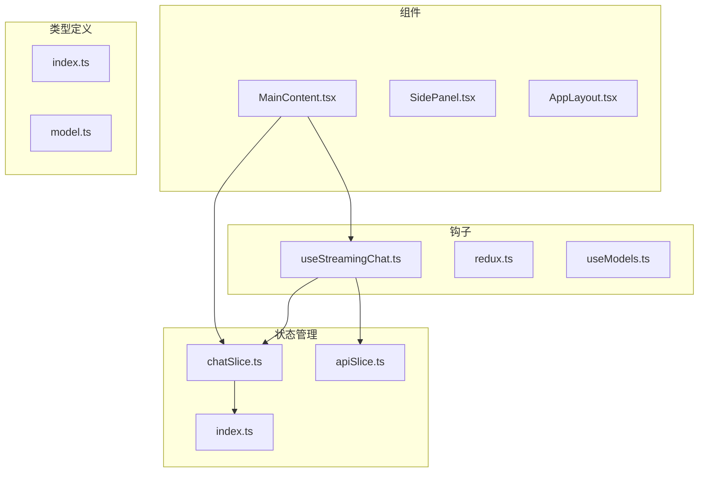
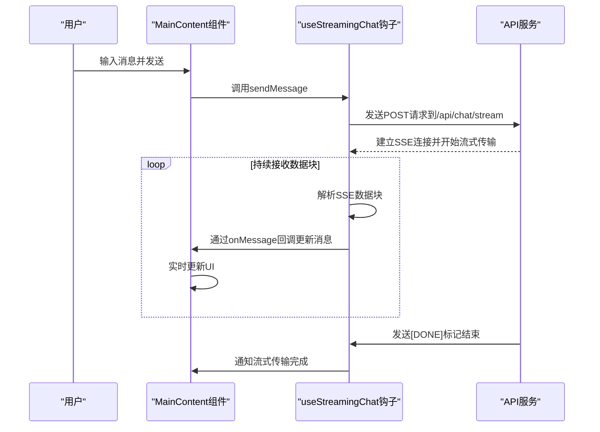
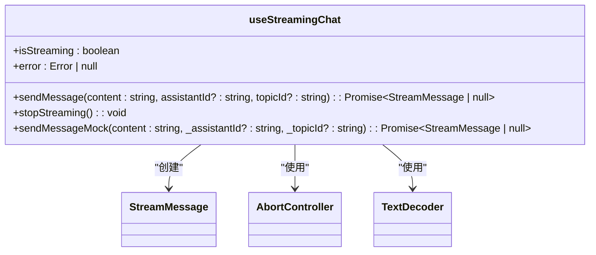
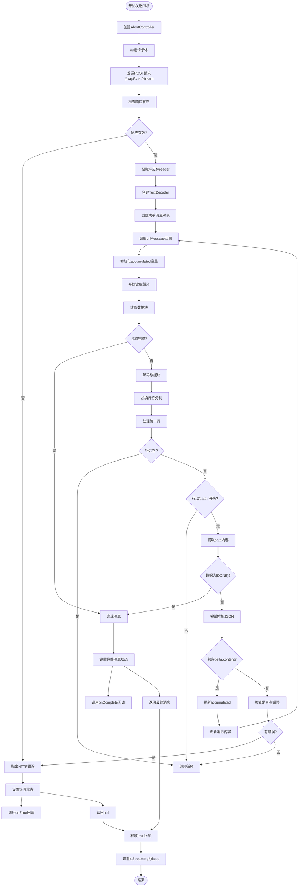
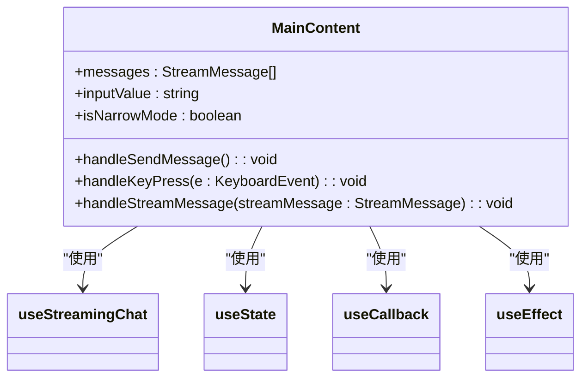
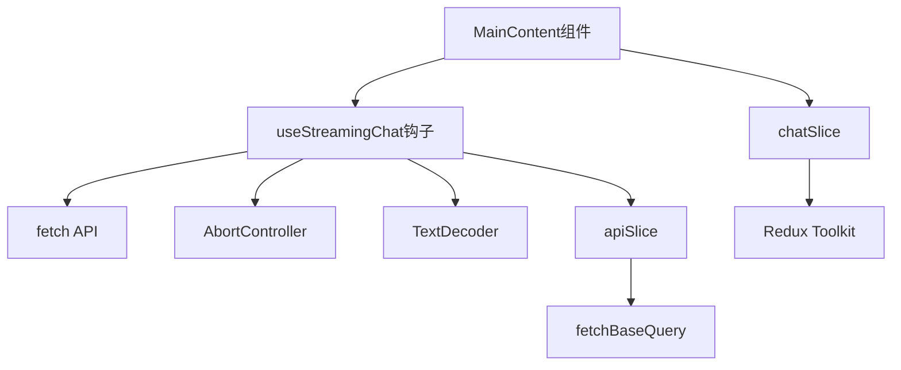
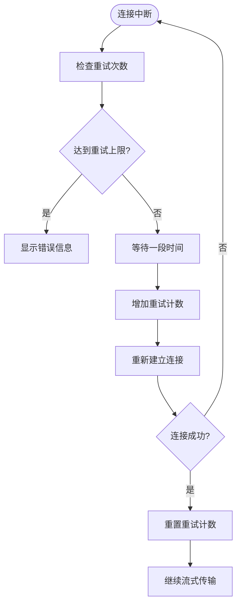
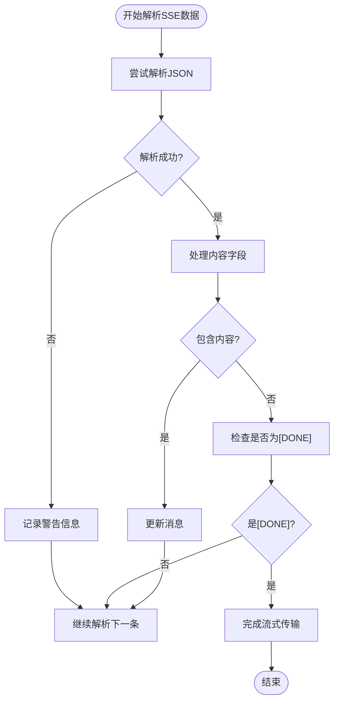

# 聊天流式API管理

<cite>
**本文档引用的文件**   
- [useStreamingChat.ts](file://src/hooks/useStreamingChat.ts)
- [chatSlice.ts](file://src/store/slices/chatSlice.ts)
- [MainContent.tsx](file://src/components/layout/MainContent.tsx)
- [apiSlice.ts](file://src/store/slices/apiSlice.ts)
- [redux.ts](file://src/hooks/redux.ts)
</cite>

## 目录
1. [简介](#简介)
2. [项目结构](#项目结构)
3. [核心组件](#核心组件)
4. [架构概述](#架构概述)
5. [详细组件分析](#详细组件分析)
6. [依赖分析](#依赖分析)
7. [性能考虑](#性能考虑)
8. [故障排除指南](#故障排除指南)
9. [结论](#结论)

## 简介
本文档详细说明了如何使用Redux Toolkit的createAsyncThunk实现流式聊天请求，涵盖SSE（Server-Sent Events）连接的建立、数据分块接收与解析机制。文档描述了请求头中认证信息的注入方式、请求参数（如模型ID、话题ID、消息历史）的序列化格式，以及在pending/fulfilled/rejected状态下的UI反馈策略。同时提供了组件中调用该API的实际代码示例，展示如何通过useSelector监听流式响应并实时更新消息列表。

## 项目结构
项目采用模块化结构，主要分为组件、钩子、状态管理、类型定义等部分。核心的流式聊天功能由useStreamingChat钩子实现，状态管理通过Redux Toolkit进行，UI组件负责展示和用户交互。

**Diagram sources**
- [MainContent.tsx](file://src/components/layout/MainContent.tsx)
- [useStreamingChat.ts](file://src/hooks/useStreamingChat.ts)
- [chatSlice.ts](file://src/store/slices/chatSlice.ts)
- [apiSlice.ts](file://src/store/slices/apiSlice.ts)

**Section sources**
- [MainContent.tsx](file://src/components/layout/MainContent.tsx)
- [useStreamingChat.ts](file://src/hooks/useStreamingChat.ts)
- [chatSlice.ts](file://src/store/slices/chatSlice.ts)

## 核心组件
核心组件包括useStreamingChat钩子、chatSlice状态管理、MainContent组件等。useStreamingChat负责处理流式聊天的逻辑，chatSlice管理聊天相关的状态，MainContent负责UI展示和用户交互。

**Section sources**
- [useStreamingChat.ts](file://src/hooks/useStreamingChat.ts)
- [chatSlice.ts](file://src/store/slices/chatSlice.ts)
- [MainContent.tsx](file://src/components/layout/MainContent.tsx)

## 架构概述
系统采用Redux Toolkit进行状态管理，通过useStreamingChat钩子实现流式聊天功能。前端通过SSE与后端进行实时通信，后端以流式方式返回数据，前端实时解析并更新UI。

**Diagram sources**
- [useStreamingChat.ts](file://src/hooks/useStreamingChat.ts)
- [MainContent.tsx](file://src/components/layout/MainContent.tsx)

## 详细组件分析

### useStreamingChat分析
useStreamingChat是一个自定义钩子，负责处理流式聊天的核心逻辑。它使用fetch API与后端建立SSE连接，并处理数据的接收和解析。

**Diagram sources**
- [useStreamingChat.ts](file://src/hooks/useStreamingChat.ts)

#### 流式请求处理流程

**Diagram sources**
- [useStreamingChat.ts](file://src/hooks/useStreamingChat.ts)

**Section sources**
- [useStreamingChat.ts](file://src/hooks/useStreamingChat.ts)

### MainContent分析
MainContent组件是聊天界面的主要容器，负责展示消息列表、输入框和工具栏。它使用useStreamingChat钩子来处理流式聊天，并通过useState管理本地状态。

**Diagram sources**
- [MainContent.tsx](file://src/components/layout/MainContent.tsx)

**Section sources**
- [MainContent.tsx](file://src/components/layout/MainContent.tsx)

## 依赖分析
系统各组件之间存在明确的依赖关系。MainContent组件依赖useStreamingChat钩子来处理聊天逻辑，useStreamingChat依赖浏览器的fetch API和相关Web API来实现流式通信。

**Diagram sources**
- [MainContent.tsx](file://src/components/layout/MainContent.tsx)
- [useStreamingChat.ts](file://src/hooks/useStreamingChat.ts)
- [chatSlice.ts](file://src/store/slices/chatSlice.ts)
- [apiSlice.ts](file://src/store/slices/apiSlice.ts)

**Section sources**
- [MainContent.tsx](file://src/components/layout/MainContent.tsx)
- [useStreamingChat.ts](file://src/hooks/useStreamingChat.ts)
- [chatSlice.ts](file://src/store/slices/chatSlice.ts)
- [apiSlice.ts](file://src/store/slices/apiSlice.ts)

## 性能考虑
在实现流式聊天时，需要考虑以下几个性能方面：

1. **流控与消息缓冲**：通过合理设置消息缓冲策略，避免UI频繁更新导致的性能问题。
2. **连接管理**：使用AbortController及时中断不需要的请求，避免资源浪费。
3. **错误处理**：完善的错误处理机制可以避免因网络问题导致的用户体验下降。
4. **内存管理**：及时释放不再使用的资源，避免内存泄漏。

## 故障排除指南
### 常见问题及解决方案

**Section sources**
- [useStreamingChat.ts](file://src/hooks/useStreamingChat.ts)
- [MainContent.tsx](file://src/components/layout/MainContent.tsx)

#### 连接中断重连
当SSE连接中断时，系统应自动尝试重连。可以通过在catch块中实现重试逻辑来实现：

#### 流式解析错误
当解析SSE数据时可能出现格式错误，应在代码中妥善处理：

## 结论
本文档详细介绍了基于Redux Toolkit的流式聊天API实现方案。通过useStreamingChat钩子封装了复杂的流式通信逻辑，使组件可以简单地调用API并处理响应。系统采用SSE技术实现服务器到客户端的实时数据传输，提供了流畅的用户体验。状态管理通过Redux Toolkit实现，确保了应用状态的一致性和可预测性。整体架构清晰，组件职责分明，便于维护和扩展。