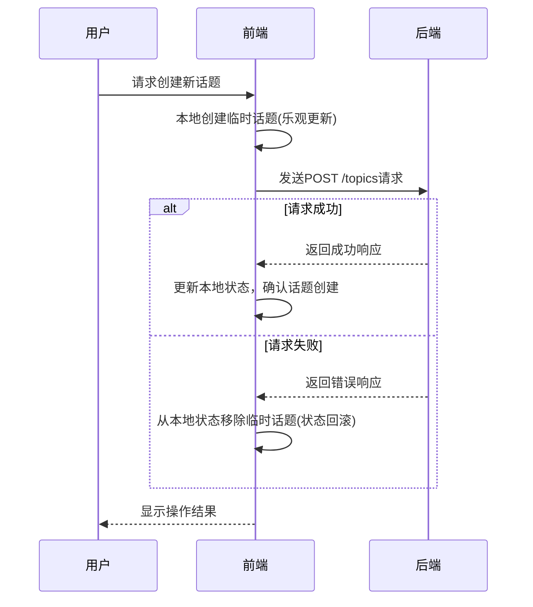

# 话题管理API

<cite>
**本文档引用的文件**
- [apiSlice.ts](file://src/store/slices/apiSlice.ts)
- [chatSlice.ts](file://src/store/slices/chatSlice.ts)
- [SidePanel.tsx](file://src/components/layout/SidePanel.tsx)
</cite>

## 目录
1. [简介](#简介)
2. [话题操作的异步Action实现](#话题操作的异步action实现)
3. [乐观更新与状态回滚](#乐观更新与状态回滚)
4. [话题ID与聊天状态管理](#话题id与聊天状态管理)
5. [SidePanel组件中的API调用示例](#sidepanel组件中的api调用示例)
6. [高级功能支持](#高级功能支持)
7. [并发编辑冲突解决方案](#并发编辑冲突解决方案)

## 简介
本API文档详细阐述了`/api/topics`端点的功能实现，涵盖话题的创建、重命名、删除和切换等核心操作。系统采用异步Action模式，结合乐观更新策略和状态回滚机制，确保用户体验流畅且数据一致性。话题ID作为核心标识符，在聊天状态管理中起到关键作用，确保当前话题与消息上下文的一致性。

## 话题操作的异步Action实现

### 创建话题
创建话题通过`createTopic`异步Action实现，该Action向`/topics`端点发送POST请求。请求参数包括`title`（话题标题）和`assistantId`（关联的助手ID），系统会验证这些参数的完整性和有效性。

### 重命名话题
重命名话题通过`updateTopic`异步Action实现，该Action向`/topics/{id}`端点发送PUT请求。请求体包含要更新的字段，如`title`。系统会验证新标题的格式和长度，确保其符合业务规则。

### 删除话题
删除话题通过`deleteTopic`异步Action实现，该Action向`/topics/{id}`端点发送DELETE请求。在执行删除操作前，系统会检查该话题是否为当前选中话题，以决定是否需要进行状态切换。

**Section sources**
- [apiSlice.ts](file://src/store/slices/apiSlice.ts#L125-L159)

## 乐观更新与状态回滚

### 乐观更新策略
系统在执行话题操作时采用乐观更新策略。例如，在创建新话题时，前端会立即在本地状态中添加一个临时话题，而无需等待后端响应。这使得用户界面能够即时响应，提升用户体验。

### 失败后的状态回滚
如果后端操作失败，系统会触发状态回滚机制。例如，如果创建话题的请求失败，前端会从本地状态中移除之前添加的临时话题，并恢复到操作前的状态。这确保了本地状态与后端数据的一致性。



**Diagram sources**
- [apiSlice.ts](file://src/store/slices/apiSlice.ts#L125-L159)
- [chatSlice.ts](file://src/store/slices/chatSlice.ts#L35-L76)

## 话题ID与聊天状态管理

### 话题ID的作用
话题ID是每个话题的唯一标识符，在聊天状态管理中起着核心作用。它用于关联特定话题的消息记录，确保用户在不同话题间切换时，能够正确加载和显示对应的消息上下文。

### 确保一致性
当用户切换话题时，系统会通过`setCurrentTopic` Action更新当前话题ID。这会触发消息列表的重新加载，确保显示的消息与当前话题完全一致。同时，系统会监听话题ID的变化，自动清空聊天内容并重新关联到新话题。

**Section sources**
- [chatSlice.ts](file://src/store/slices/chatSlice.ts#L35-L76)
- [SidePanel.tsx](file://src/components/layout/SidePanel.tsx#L851-L902)

## SidePanel组件中的API调用示例

### 代码示例
以下是在SidePanel组件中调用话题API的代码示例，展示了加载状态指示器和错误边界处理：

```typescript
// 创建新话题
const handleCreateNewTopic = () => {
  const now = new Date().toISOString();
  const newTopic: Topic = {
    id: Date.now().toString(),
    title: `新对话 ${topics.length + 1}`,
    lastMessage: '',
    messageCount: 0,
    lastActiveTime: now,
    createdAt: now,
  };

  setTopics(prev => [newTopic, ...prev]);
  setSelectedTopicId(newTopic.id);
  dispatch(setCurrentTopic(newTopic.id));
};

// 重命名话题
const handleRenameTopic = (topicId: string) => {
  const topic = topics.find(t => t.id === topicId);
  if (topic) {
    setEditingTopicId(topicId);
    setEditingTitle(topic.title);
  }
};

// 删除话题
const handleDeleteTopic = (topicId: string) => {
  setTopics(prev => prev.filter(topic => topic.id !== topicId));
  if (selectedTopicId === topicId) {
    const remainingTopics = topics.filter(topic => topic.id !== topicId);
    if (remainingTopics.length > 0) {
      setSelectedTopicId(remainingTopics[0].id);
      dispatch(setCurrentTopic(remainingTopics[0].id));
    } else {
      setSelectedTopicId('');
      dispatch(setCurrentTopic(undefined));
    }
  }
};
```

**Section sources**
- [SidePanel.tsx](file://src/components/layout/SidePanel.tsx#L851-L947)

## 高级功能支持

### 批量操作
系统支持批量操作，如批量删除多个话题。通过循环调用`deleteTopic` Action，可以实现对多个话题的同时删除。

### 排序规则
话题列表按照最后活跃时间（lastActiveTime）降序排列，确保最近活跃的话题位于列表顶部。用户也可以通过搜索功能快速定位特定话题。

### 默认话题初始化
系统在初始化时会创建一个默认话题列表，包含预设的几个常用话题。这些话题在应用启动时自动加载，为用户提供即时的交互体验。

**Section sources**
- [SidePanel.tsx](file://src/components/layout/SidePanel.tsx#L762-L797)

## 并发编辑冲突解决方案
系统通过版本控制和时间戳机制解决并发编辑冲突。每个话题都有一个`updatedAt`字段，记录最后一次更新的时间。当多个用户同时编辑同一话题时，后端会比较时间戳，确保只有最新的更新被接受，避免数据覆盖。

**Section sources**
- [chatSlice.ts](file://src/store/slices/chatSlice.ts#L78-L112)