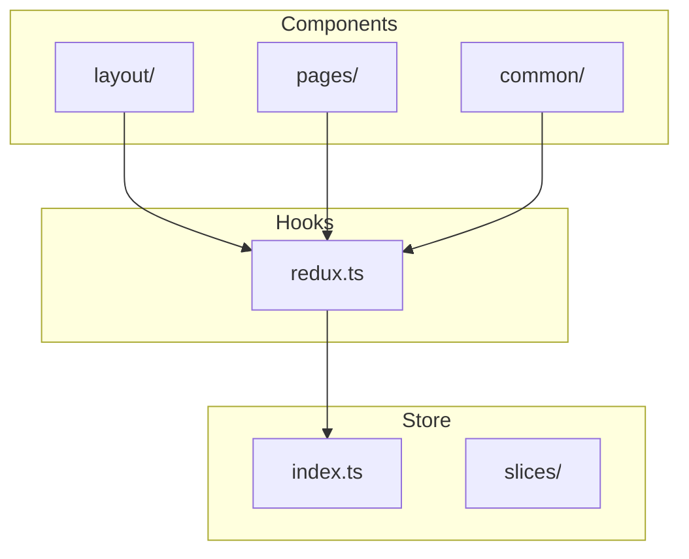
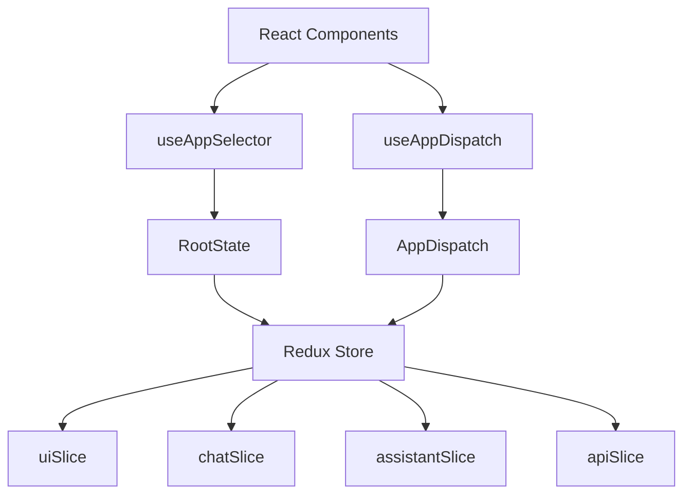
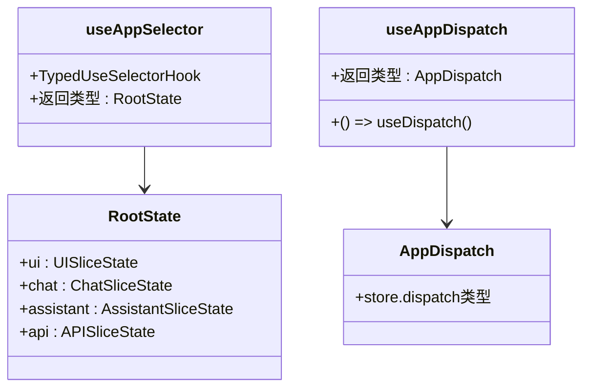
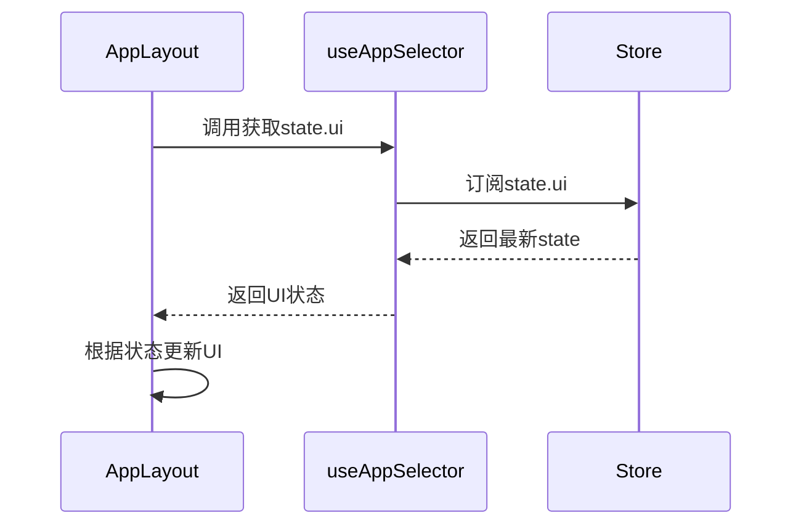
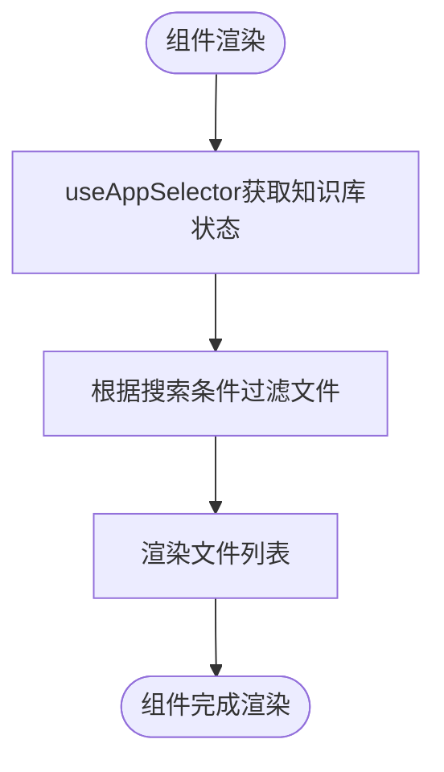
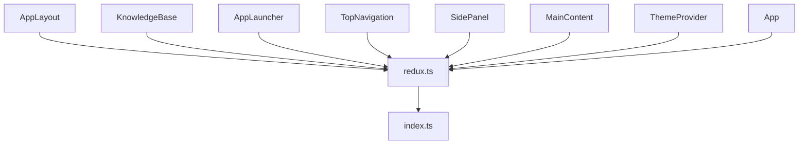

# Redux Hooks集成与使用

<cite>
**本文档引用的文件**   
- [redux.ts](file://src/hooks/redux.ts)
- [index.ts](file://src/store/index.ts)
- [AppLayout.tsx](file://src/components/layout/AppLayout.tsx)
- [KnowledgeBase.tsx](file://src/components/pages/KnowledgeBase.tsx)
- [AppLauncher.tsx](file://src/components/pages/AppLauncher.tsx)
- [TopNavigation.tsx](file://src/components/layout/TopNavigation.tsx)
- [SidePanel.tsx](file://src/components/layout/SidePanel.tsx)
- [MainContent.tsx](file://src/components/layout/MainContent.tsx)
- [ThemeProvider.tsx](file://src/components/common/ThemeProvider.tsx)
- [App.tsx](file://src/App.tsx)
</cite>

## 目录
1. [简介](#简介)
2. [项目结构](#项目结构)
3. [核心组件](#核心组件)
4. [架构概述](#架构概述)
5. [详细组件分析](#详细组件分析)
6. [依赖分析](#依赖分析)
7. [性能考虑](#性能考虑)
8. [故障排除指南](#故障排除指南)
9. [结论](#结论)

## 简介
本文档详细说明了`redux.ts`中自定义Hook的封装原理与最佳实践。重点解释`useAppSelector`和`useAppDispatch`如何基于React-Redux的`useSelector`和`useDispatch`进行类型安全的封装，以避免在组件中重复定义类型。文档展示了这些Hook在实际组件（如AppLayout、KnowledgeBase）中的调用方式，强调类型推断优势和代码简洁性。同时提供性能优化建议、常见误用场景及解决方案。

## 项目结构
项目采用标准的React+Redux架构，通过TypeScript实现类型安全。核心结构包括：
- `src/hooks/redux.ts`：自定义Redux Hooks的封装
- `src/store/index.ts`：Redux store配置和类型定义
- `src/components/`：UI组件目录
- `src/store/slices/`：Redux状态切片

**图示来源**
- [redux.ts](file://src/hooks/redux.ts)
- [index.ts](file://src/store/index.ts)

**本节来源**
- [redux.ts](file://src/hooks/redux.ts)
- [index.ts](file://src/store/index.ts)

## 核心组件
`redux.ts`文件中的`useAppSelector`和`useAppDispatch`是整个应用状态管理的核心。通过类型化封装，实现了类型安全的状态访问和分发。

**本节来源**
- [redux.ts](file://src/hooks/redux.ts#L0-L6)

## 架构概述
应用采用Redux Toolkit进行状态管理，通过自定义Hook实现类型安全的访问。整体架构清晰，组件与状态管理分离。

**图示来源**
- [redux.ts](file://src/hooks/redux.ts#L0-L6)
- [index.ts](file://src/store/index.ts#L0-L26)

## 详细组件分析
### 自定义Hook分析
`useAppSelector`和`useAppDispatch`的封装原理是基于React-Redux的原生Hook进行类型增强。

#### 类型定义

**图示来源**
- [redux.ts](file://src/hooks/redux.ts#L0-L6)
- [index.ts](file://src/store/index.ts#L0-L26)

### 实际组件调用分析
#### AppLayout组件中的使用
在`AppLayout.tsx`中，`useAppSelector`被用于获取UI状态，实现主题、侧边栏等状态的响应式更新。

**图示来源**
- [AppLayout.tsx](file://src/components/layout/AppLayout.tsx#L59)
- [redux.ts](file://src/hooks/redux.ts#L0-L6)

#### KnowledgeBase组件中的使用
`KnowledgeBase.tsx`展示了状态选择器在复杂UI组件中的应用，通过选择特定状态实现数据过滤和展示。

**图示来源**
- [KnowledgeBase.tsx](file://src/components/pages/KnowledgeBase.tsx#L59)
- [redux.ts](file://src/hooks/redux.ts#L0-L6)

**本节来源**
- [AppLayout.tsx](file://src/components/layout/AppLayout.tsx#L59)
- [KnowledgeBase.tsx](file://src/components/pages/KnowledgeBase.tsx#L59)
- [AppLauncher.tsx](file://src/components/pages/AppLauncher.tsx#L105)
- [TopNavigation.tsx](file://src/components/layout/TopNavigation.tsx#L261)
- [SidePanel.tsx](file://src/components/layout/SidePanel.tsx#L750)
- [MainContent.tsx](file://src/components/layout/MainContent.tsx#L328)
- [ThemeProvider.tsx](file://src/components/common/ThemeProvider.tsx#L10)
- [App.tsx](file://src/App.tsx#L11)

## 依赖分析
应用的依赖关系清晰，自定义Hook作为中间层，解耦了组件与Redux store的直接依赖。

**图示来源**
- [redux.ts](file://src/hooks/redux.ts)
- [index.ts](file://src/store/index.ts)

**本节来源**
- [redux.ts](file://src/hooks/redux.ts)
- [index.ts](file://src/store/index.ts)

## 性能考虑
使用自定义Hook不仅提高了类型安全性，还带来了性能优势：
- 类型推断减少了类型断言的需要
- 集中管理类型定义，避免重复代码
- 通过`useSelector`的浅比较优化渲染性能
- 避免在异步回调中使用过期state的最佳实践

## 故障排除指南
### 常见问题
- **类型错误**：确保`RootState`和`AppDispatch`类型正确导入
- **状态更新不及时**：检查`useSelector`的选择器函数是否正确
- **循环依赖**：避免在slice之间创建循环依赖

**本节来源**
- [redux.ts](file://src/hooks/redux.ts#L0-L6)
- [index.ts](file://src/store/index.ts#L0-L26)

## 结论
`useAppSelector`和`useAppDispatch`的封装是TypeScript+Redux应用的最佳实践。通过类型化Hook，实现了类型安全的状态管理，提高了代码的可维护性和开发效率。在实际组件中的广泛应用证明了这种模式的有效性。