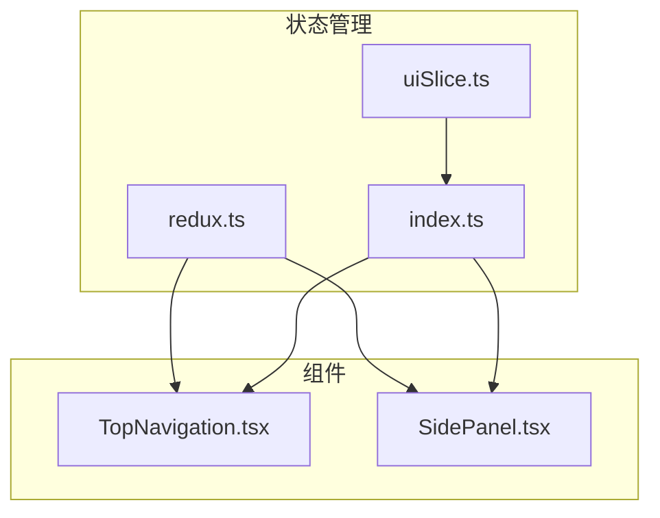
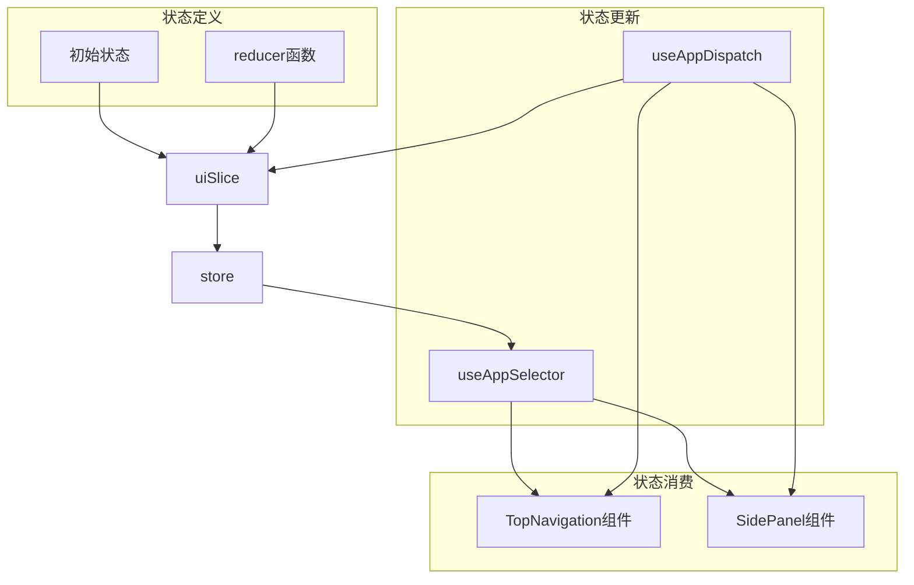
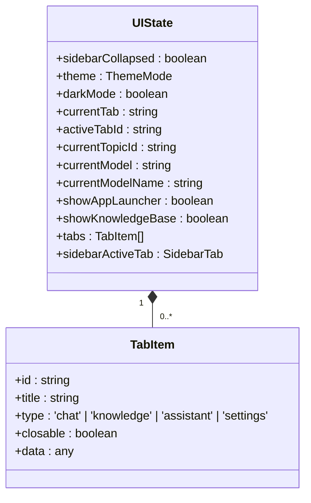
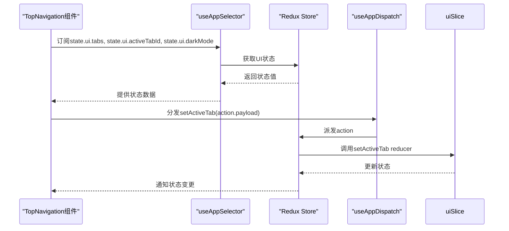
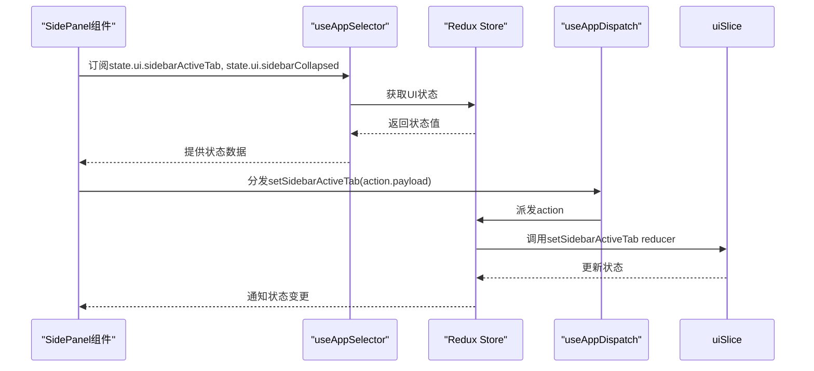
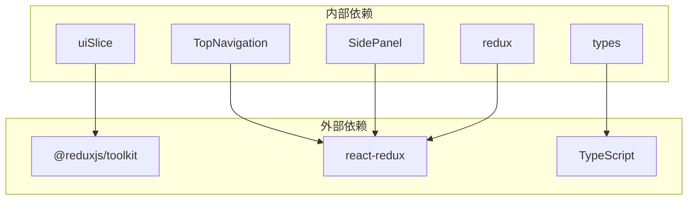
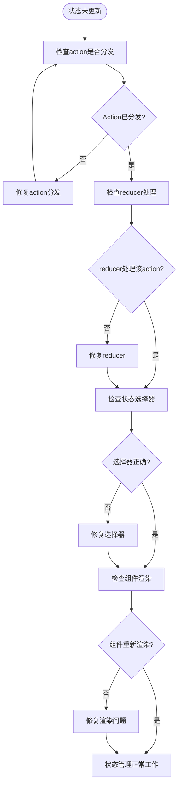

# UI状态管理

<cite>
**本文档引用的文件**
- [uiSlice.ts](file://src/store/slices/uiSlice.ts)
- [TopNavigation.tsx](file://src/components/layout/TopNavigation.tsx)
- [SidePanel.tsx](file://src/components/layout/SidePanel.tsx)
- [redux.ts](file://src/hooks/redux.ts)
- [index.ts](file://src/store/index.ts)
</cite>

## 目录
1. [简介](#简介)
2. [项目结构](#项目结构)
3. [核心组件](#核心组件)
4. [架构概述](#架构概述)
5. [详细组件分析](#详细组件分析)
6. [依赖分析](#依赖分析)
7. [性能考虑](#性能考虑)
8. [故障排除指南](#故障排除指南)
9. [结论](#结论)

## 简介
本文档详细记录了`uiSlice`中UI状态的管理机制。说明该slice如何通过Redux管理全局界面状态，包括主题模式（深色/浅色）、侧边栏开关状态、模态框可见性等。解释初始状态定义、reducer函数中处理的action类型（如toggleTheme、setSidePanelOpen），以及这些状态变更如何影响组件渲染。结合TopNavigation和SidePanel组件的实际使用场景，展示useAppSelector如何订阅UI状态，useAppDispatch如何触发状态更新。提供状态调试建议和常见问题（如状态未更新）的排查方法。

**Section sources**
- [uiSlice.ts](file://src/store/slices/uiSlice.ts#L1-L148)

## 项目结构
项目结构中，UI状态管理相关文件主要位于`src/store/slices/uiSlice.ts`，该文件定义了全局UI状态的结构和操作方法。`TopNavigation.tsx`和`SidePanel.tsx`组件位于`src/components/layout/`目录下，它们通过Redux hooks订阅和更新UI状态。`redux.ts`文件在`src/hooks/`目录下，提供了类型化的useAppSelector和useAppDispatch hooks。整个状态管理机制通过`src/store/index.ts`中的store配置进行整合。

**Diagram sources**
- [uiSlice.ts](file://src/store/slices/uiSlice.ts#L1-L148)
- [redux.ts](file://src/hooks/redux.ts#L1-L7)
- [index.ts](file://src/store/index.ts#L1-L27)
- [TopNavigation.tsx](file://src/components/layout/TopNavigation.tsx#L1-L330)
- [SidePanel.tsx](file://src/components/layout/SidePanel.tsx#L1-L800)

**Section sources**
- [uiSlice.ts](file://src/store/slices/uiSlice.ts#L1-L148)
- [TopNavigation.tsx](file://src/components/layout/TopNavigation.tsx#L1-L330)
- [SidePanel.tsx](file://src/components/layout/SidePanel.tsx#L1-L800)
- [redux.ts](file://src/hooks/redux.ts#L1-L7)
- [index.ts](file://src/store/index.ts#L1-L27)

## 核心组件
`uiSlice`是管理全局UI状态的核心组件，它定义了初始状态和一系列reducer函数来处理状态变更。`TopNavigation`和`SidePanel`组件是UI状态的主要消费者，它们通过useAppSelector订阅状态变化，并通过useAppDispatch触发状态更新。

**Section sources**
- [uiSlice.ts](file://src/store/slices/uiSlice.ts#L1-L148)
- [TopNavigation.tsx](file://src/components/layout/TopNavigation.tsx#L1-L330)
- [SidePanel.tsx](file://src/components/layout/SidePanel.tsx#L1-L800)

## 架构概述
UI状态管理采用Redux Toolkit实现，通过`createSlice`函数创建一个名为`ui`的slice。该slice包含初始状态定义和多个reducer函数，用于处理不同的UI状态变更。组件通过`useAppSelector`从Redux store中选择所需的状态，并通过`useAppDispatch`分发action来更新状态。

**Diagram sources**
- [uiSlice.ts](file://src/store/slices/uiSlice.ts#L1-L148)
- [redux.ts](file://src/hooks/redux.ts#L1-L7)
- [index.ts](file://src/store/index.ts#L1-L27)
- [TopNavigation.tsx](file://src/components/layout/TopNavigation.tsx#L1-L330)
- [SidePanel.tsx](file://src/components/layout/SidePanel.tsx#L1-L800)

## 详细组件分析

### uiSlice分析
`uiSlice`定义了全局UI状态的结构和操作方法。它包含初始状态和多个reducer函数，用于处理不同的UI状态变更。

#### 状态结构

**Diagram sources**
- [uiSlice.ts](file://src/store/slices/uiSlice.ts#L7-L18)
- [types/index.ts](file://src/types/index.ts#L74-L80)

#### Reducer函数

```mermaid
flowchart TD
Start([uiSlice reducers]) --> toggleSidebar["toggleSidebar: 切换侧边栏折叠状态"]
Start --> setSidebarCollapsed["setSidebarCollapsed: 设置侧边栏折叠状态"]
Start --> setTheme["setTheme: 设置主题模式"]
Start --> toggleDarkMode["toggleDarkMode: 切换深色模式"]
Start --> setDarkMode["setDarkMode: 设置深色模式"]
Start --> setSidebarActiveTab["setSidebarActiveTab: 设置侧边栏活动标签"]
Start --> addTab["addTab: 添加标签页"]
Start --> removeTab["removeTab: 移除标签页"]
Start --> setActiveTab["setActiveTab: 设置活动标签页"]
Start --> updateTabTitle["updateTabTitle: 更新标签页标题"]
Start --> setCurrentTopic["setCurrentTopic: 设置当前话题"]
Start --> setCurrentModel["setCurrentModel: 设置当前模型"]
Start --> setShowAppLauncher["setShowAppLauncher: 设置应用启动器显示状态"]
Start --> toggleAppLauncher["toggleAppLauncher: 切换应用启动器显示状态"]
Start --> setShowKnowledgeBase["setShowKnowledgeBase: 设置知识库显示状态"]
Start --> toggleKnowledgeBase["toggleKnowledgeBase: 切换知识库显示状态"]
```

**Diagram sources**
- [uiSlice.ts](file://src/store/slices/uiSlice.ts#L54-L148)

### TopNavigation组件分析
`TopNavigation`组件是UI状态的主要消费者之一，它订阅了标签页、活动标签和深色模式状态，并提供了更新这些状态的交互。

#### 状态订阅与更新流程

**Diagram sources**
- [TopNavigation.tsx](file://src/components/layout/TopNavigation.tsx#L252-L329)
- [uiSlice.ts](file://src/store/slices/uiSlice.ts#L110-L113)

### SidePanel组件分析
`SidePanel`组件订阅了侧边栏活动标签和折叠状态，并提供了更新这些状态的交互。

#### 状态订阅与更新流程

**Diagram sources**
- [SidePanel.tsx](file://src/components/layout/SidePanel.tsx#L751-L752)
- [uiSlice.ts](file://src/store/slices/uiSlice.ts#L68-L70)

## 依赖分析
UI状态管理机制依赖于Redux Toolkit、React Redux以及项目中的类型定义。`uiSlice`依赖于`@reduxjs/toolkit`来创建slice，`TopNavigation`和`SidePanel`组件依赖于`react-redux`的hooks来连接Redux store。

**Diagram sources**
- [uiSlice.ts](file://src/store/slices/uiSlice.ts#L1-L3)
- [TopNavigation.tsx](file://src/components/layout/TopNavigation.tsx#L1-L10)
- [SidePanel.tsx](file://src/components/layout/SidePanel.tsx#L1-L10)
- [redux.ts](file://src/hooks/redux.ts#L1-L3)
- [types/index.ts](file://src/types/index.ts#L1-L10)

**Section sources**
- [uiSlice.ts](file://src/store/slices/uiSlice.ts#L1-L148)
- [TopNavigation.tsx](file://src/components/layout/TopNavigation.tsx#L1-L330)
- [SidePanel.tsx](file://src/components/layout/SidePanel.tsx#L1-L800)
- [redux.ts](file://src/hooks/redux.ts#L1-L7)
- [index.ts](file://src/store/index.ts#L1-L27)

## 性能考虑
UI状态管理机制在性能方面有以下考虑：
- 使用Redux Toolkit的`createSlice`函数，它基于immer库实现了不可变状态更新，避免了手动创建新对象的开销
- `useAppSelector` hook会自动进行浅比较，避免不必要的组件重新渲染
- 状态订阅是精确的，组件只订阅所需的状态字段，减少不必要的更新
- action分发是同步的，确保状态更新的可预测性

## 故障排除指南
### 状态未更新问题排查
当UI状态未按预期更新时，可按以下步骤排查：

1. **检查action是否正确分发**
   - 确认`useAppDispatch` hook已正确导入
   - 确认action creator已正确导入
   - 在开发者工具中检查Redux DevTools，查看action是否被分发

2. **检查reducer是否正确处理action**
   - 确认action type与reducer中的case匹配
   - 确认reducer函数正确更新了状态

3. **检查组件是否正确订阅状态**
   - 确认`useAppSelector`正确选择了状态字段
   - 确认选择器函数返回了正确的状态值

4. **检查组件是否重新渲染**
   - 确认状态变更后组件是否重新渲染
   - 使用React DevTools检查组件的props和state变化

**Diagram sources**
- [uiSlice.ts](file://src/store/slices/uiSlice.ts#L54-L148)
- [TopNavigation.tsx](file://src/components/layout/TopNavigation.tsx#L252-L329)
- [SidePanel.tsx](file://src/components/layout/SidePanel.tsx#L751-L752)
- [redux.ts](file://src/hooks/redux.ts#L1-L7)

**Section sources**
- [uiSlice.ts](file://src/store/slices/uiSlice.ts#L1-L148)
- [TopNavigation.tsx](file://src/components/layout/TopNavigation.tsx#L1-L330)
- [SidePanel.tsx](file://src/components/layout/SidePanel.tsx#L1-L800)
- [redux.ts](file://src/hooks/redux.ts#L1-L7)

## 结论
`uiSlice`通过Redux Toolkit实现了全局UI状态的有效管理。它定义了清晰的状态结构和操作方法，使得UI状态的变更可预测且易于调试。`TopNavigation`和`SidePanel`等组件通过`useAppSelector`和`useAppDispatch` hooks与Redux store进行交互，实现了状态的订阅和更新。这种架构模式提高了代码的可维护性和可测试性，为应用的UI状态管理提供了坚实的基础。