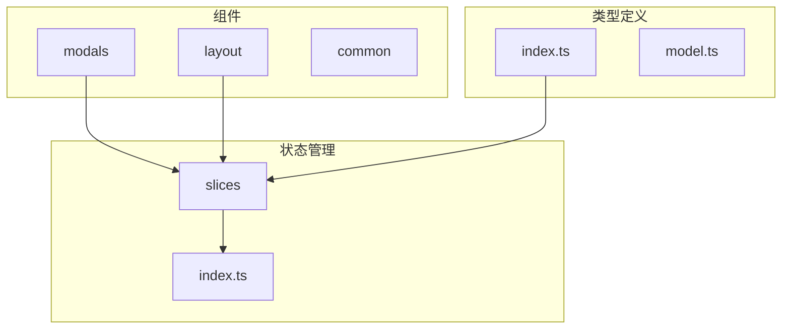
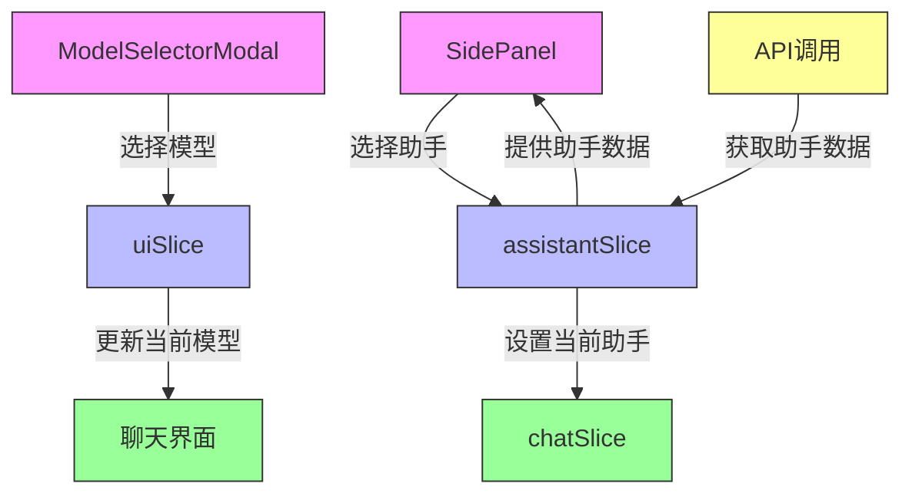
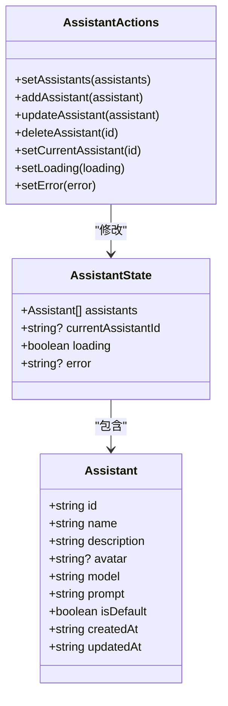
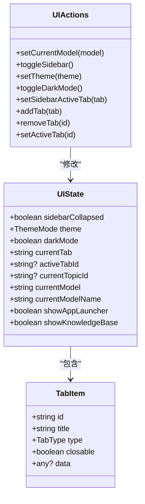
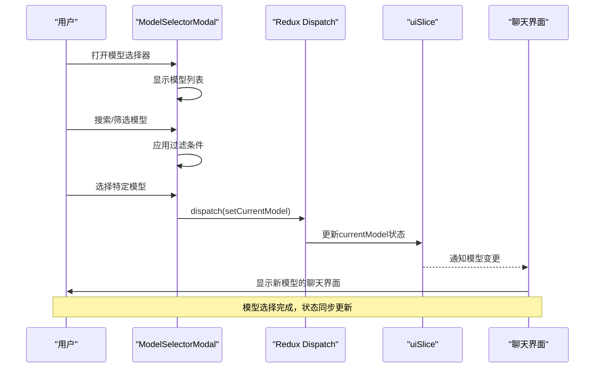
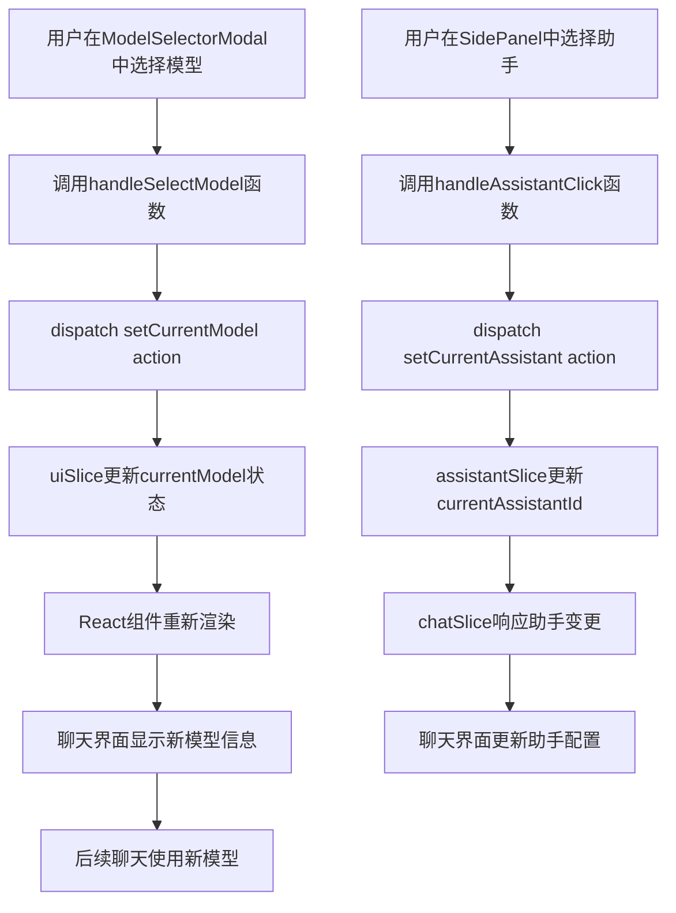
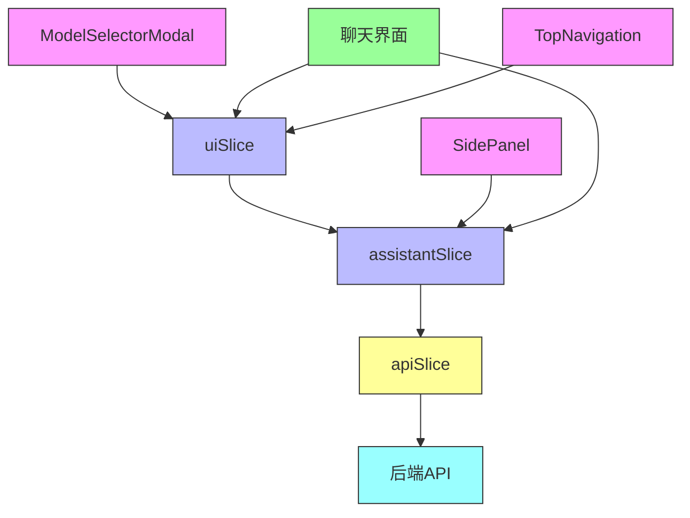

# 助手状态管理

<cite>
**本文档引用文件**  
- [assistantSlice.ts](file://src/store/slices/assistantSlice.ts)
- [uiSlice.ts](file://src/store/slices/uiSlice.ts)
- [ModelSelectorModal.tsx](file://src/components/modals/ModelSelectorModal.tsx)
- [chatSlice.ts](file://src/store/slices/chatSlice.ts)
- [SidePanel.tsx](file://src/components/layout/SidePanel.tsx)
- [apiSlice.ts](file://src/store/slices/apiSlice.ts)
</cite>

## 目录
1. [简介](#简介)
2. [项目结构](#项目结构)
3. [核心组件](#核心组件)
4. [架构概述](#架构概述)
5. [详细组件分析](#详细组件分析)
6. [依赖分析](#依赖分析)
7. [性能考虑](#性能考虑)
8. [故障排除指南](#故障排除指南)
9. [结论](#结论)

## 简介
本文档全面阐述了`assistantSlice`对AI助手配置的管理方式，说明该slice如何存储和更新当前选中的AI模型、助手参数（温度、最大token数）、默认助手设置等信息。解释模型选择逻辑如何通过dispatch action触发状态变更，并同步到聊天界面。结合`ModelSelectorModal`组件的交互流程，展示状态更新与UI响应的联动机制。文档包含默认值设置、状态持久化考虑因素及与其他slice（如chatSlice）的协作关系。

## 项目结构

**图示来源**  
- [assistantSlice.ts](file://src/store/slices/assistantSlice.ts)
- [uiSlice.ts](file://src/store/slices/uiSlice.ts)
- [ModelSelectorModal.tsx](file://src/components/modals/ModelSelectorModal.tsx)

**本节来源**  
- [assistantSlice.ts](file://src/store/slices/assistantSlice.ts)
- [uiSlice.ts](file://src/store/slices/uiSlice.ts)

## 核心组件

`assistantSlice`负责管理AI助手的核心配置信息，包括助手列表、当前选中的助手、加载状态和错误信息。`uiSlice`则管理用户界面相关的状态，如当前模型、主题模式等。`ModelSelectorModal`组件提供用户选择模型的交互界面。

**本节来源**  
- [assistantSlice.ts](file://src/store/slices/assistantSlice.ts#L1-L72)
- [uiSlice.ts](file://src/store/slices/uiSlice.ts#L1-L148)
- [ModelSelectorModal.tsx](file://src/components/modals/ModelSelectorModal.tsx#L1-L411)

## 架构概述

**图示来源**  
- [assistantSlice.ts](file://src/store/slices/assistantSlice.ts)
- [uiSlice.ts](file://src/store/slices/uiSlice.ts)
- [ModelSelectorModal.tsx](file://src/components/modals/ModelSelectorModal.tsx)
- [SidePanel.tsx](file://src/components/layout/SidePanel.tsx)

## 详细组件分析

### assistantSlice分析

`assistantSlice`使用Redux Toolkit创建，管理AI助手的核心状态。它定义了助手数据结构和状态管理逻辑。

**图示来源**  
- [assistantSlice.ts](file://src/store/slices/assistantSlice.ts#L1-L72)

**本节来源**  
- [assistantSlice.ts](file://src/store/slices/assistantSlice.ts#L1-L72)

### uiSlice分析

`uiSlice`管理用户界面状态，包括当前选中的模型、主题模式、侧边栏状态等。其中`currentModel`和`currentModelName`字段专门用于存储AI模型选择信息。

**图示来源**  
- [uiSlice.ts](file://src/store/slices/uiSlice.ts#L1-L148)

**本节来源**  
- [uiSlice.ts](file://src/store/slices/uiSlice.ts#L1-L148)

### ModelSelectorModal交互流程

`ModelSelectorModal`组件实现了模型选择的完整交互流程，从用户选择到状态更新的全过程。

**图示来源**  
- [ModelSelectorModal.tsx](file://src/components/modals/ModelSelectorModal.tsx#L1-L411)
- [uiSlice.ts](file://src/store/slices/uiSlice.ts#L1-L148)

**本节来源**  
- [ModelSelectorModal.tsx](file://src/components/modals/ModelSelectorModal.tsx#L1-L411)
- [uiSlice.ts](file://src/store/slices/uiSlice.ts#L1-L148)

### 状态管理与UI联动

分析状态更新如何驱动UI变化的完整流程。

**图示来源**  
- [ModelSelectorModal.tsx](file://src/components/modals/ModelSelectorModal.tsx#L1-L411)
- [SidePanel.tsx](file://src/components/layout/SidePanel.tsx#L1-L1658)
- [assistantSlice.ts](file://src/store/slices/assistantSlice.ts#L1-L72)
- [chatSlice.ts](file://src/store/slices/chatSlice.ts#L1-L151)

**本节来源**  
- [ModelSelectorModal.tsx](file://src/components/modals/ModelSelectorModal.tsx#L1-L411)
- [SidePanel.tsx](file://src/components/layout/SidePanel.tsx#L1-L1658)

## 依赖分析

**图示来源**  
- [assistantSlice.ts](file://src/store/slices/assistantSlice.ts)
- [uiSlice.ts](file://src/store/slices/uiSlice.ts)
- [ModelSelectorModal.tsx](file://src/components/modals/ModelSelectorModal.tsx)
- [SidePanel.tsx](file://src/components/layout/SidePanel.tsx)
- [apiSlice.ts](file://src/store/slices/apiSlice.ts)

**本节来源**  
- [assistantSlice.ts](file://src/store/slices/assistantSlice.ts)
- [uiSlice.ts](file://src/store/slices/uiSlice.ts)
- [apiSlice.ts](file://src/store/slices/apiSlice.ts)

## 性能考虑
状态管理采用Redux Toolkit优化，确保状态更新的高效性。模型选择器实现了搜索和筛选的防抖处理，避免频繁重新渲染。组件使用React.memo进行性能优化，减少不必要的重渲染。

## 故障排除指南

当遇到模型选择不生效或助手配置未更新的问题时，可检查以下方面：

**本节来源**  
- [assistantSlice.ts](file://src/store/slices/assistantSlice.ts#L1-L72)
- [uiSlice.ts](file://src/store/slices/uiSlice.ts#L1-L148)
- [ModelSelectorModal.tsx](file://src/components/modals/ModelSelectorModal.tsx#L1-L411)

## 结论
`assistantSlice`通过Redux状态管理机制，有效地管理了AI助手的配置信息。结合`uiSlice`和`ModelSelectorModal`组件，实现了完整的模型选择和配置更新流程。系统设计考虑了状态持久化、性能优化和组件协作，为用户提供流畅的AI助手配置体验。