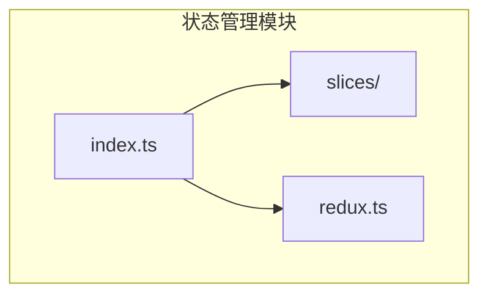
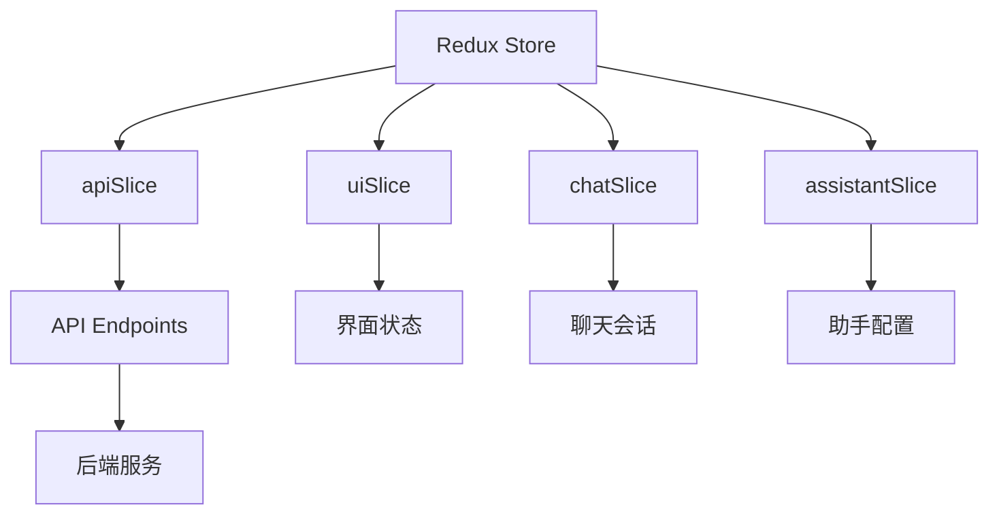
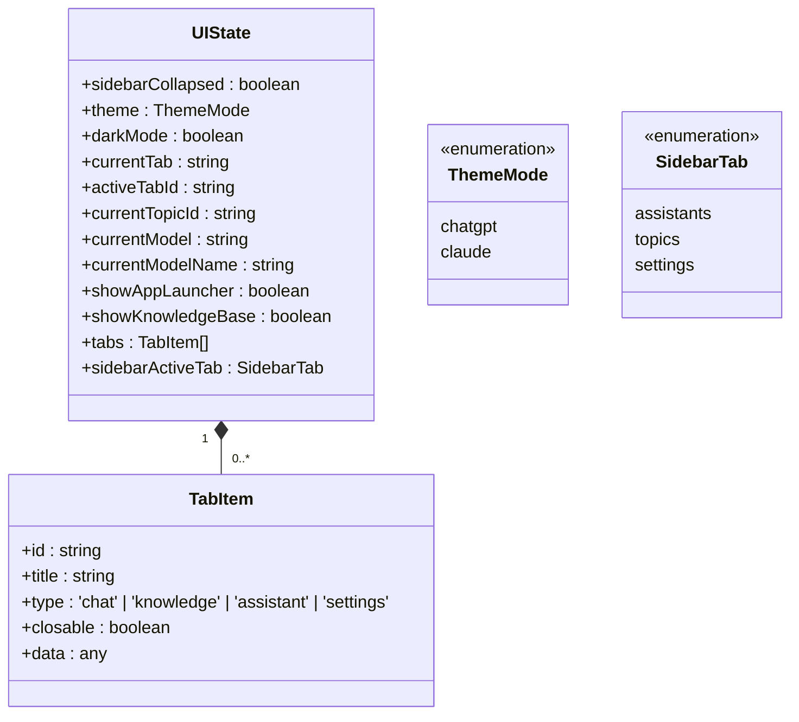
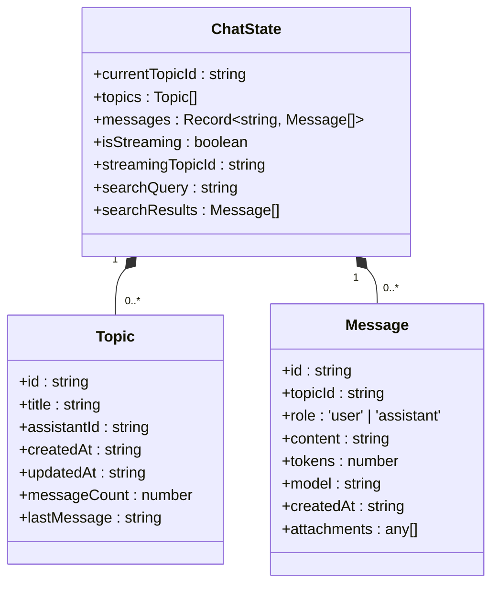
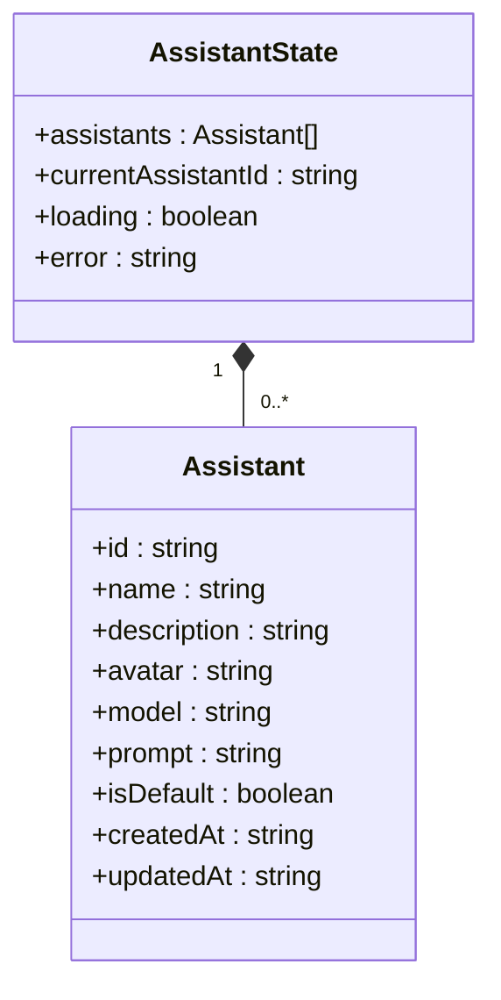
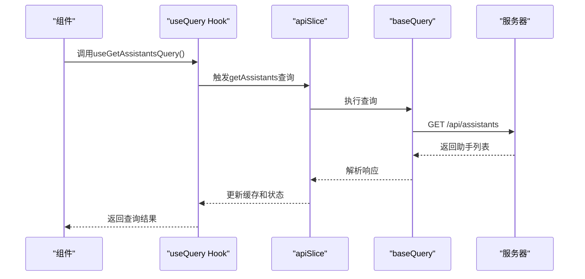
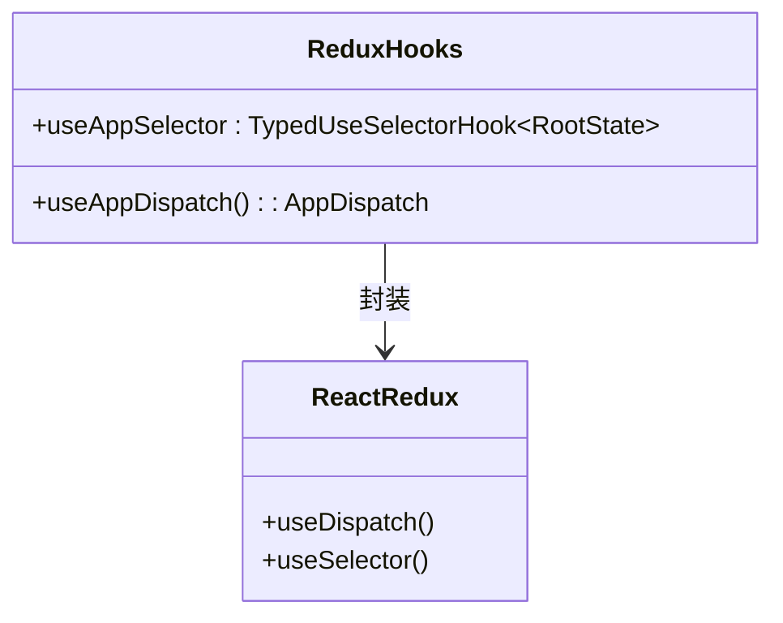
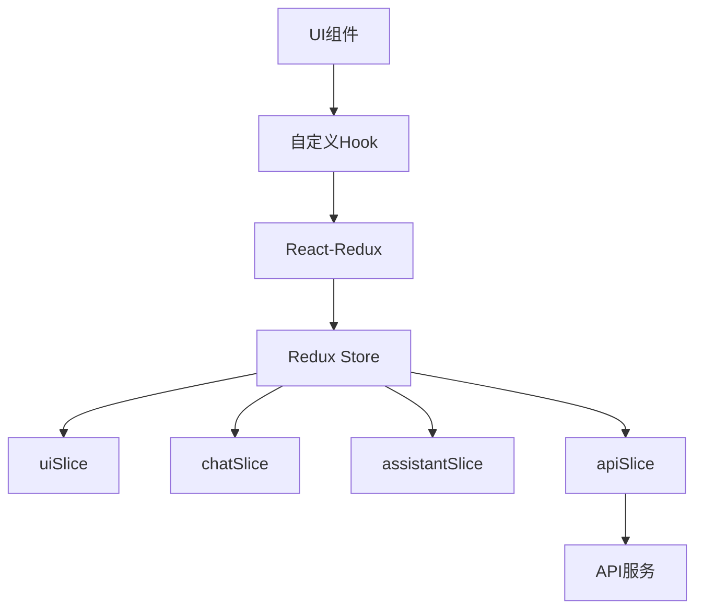

# 状态管理

<cite>
**本文档中引用的文件**   
- [index.ts](file://src/store/index.ts)
- [redux.ts](file://src/hooks/redux.ts)
- [uiSlice.ts](file://src/store/slices/uiSlice.ts)
- [chatSlice.ts](file://src/store/slices/chatSlice.ts)
- [assistantSlice.ts](file://src/store/slices/assistantSlice.ts)
- [apiSlice.ts](file://src/store/slices/apiSlice.ts)
</cite>

## 目录
1. [简介](#简介)
2. [项目结构](#项目结构)
3. [核心组件](#核心组件)
4. [架构概述](#架构概述)
5. [详细组件分析](#详细组件分析)
6. [依赖分析](#依赖分析)
7. [性能考虑](#性能考虑)
8. [故障排除指南](#故障排除指南)
9. [结论](#结论)

## 简介
本文档全面记录了Redux状态管理系统的实现细节，涵盖store的创建过程、各slice的职责划分、自定义Hook的封装方式以及异步操作的实现机制。

## 项目结构
项目的状态管理模块位于`src/store`目录下，采用Redux Toolkit进行状态管理。该模块包含一个核心的store配置文件和多个功能独立的slice文件，通过模块化设计实现了关注点分离。

**图示来源**
- [index.ts](file://src/store/index.ts#L1-L26)
- [slices](file://src/store/slices/)

**节来源**
- [index.ts](file://src/store/index.ts#L1-L26)

## 核心组件
核心组件包括Redux store的配置、四个主要的slice（uiSlice、chatSlice、assistantSlice、apiSlice）以及自定义的Redux Hook。

**节来源**
- [index.ts](file://src/store/index.ts#L1-L26)
- [uiSlice.ts](file://src/store/slices/uiSlice.ts#L1-L148)
- [chatSlice.ts](file://src/store/slices/chatSlice.ts#L1-L151)
- [assistantSlice.ts](file://src/store/slices/assistantSlice.ts#L1-L72)
- [apiSlice.ts](file://src/store/slices/apiSlice.ts#L1-L304)

## 架构概述
系统采用Redux Toolkit作为状态管理解决方案，通过createSlice创建多个功能独立的reducer，并通过configureStore整合为单一store。apiSlice使用RTK Query处理异步数据获取，实现了自动缓存和请求去重。

**图示来源**
- [index.ts](file://src/store/index.ts#L1-L26)
- [apiSlice.ts](file://src/store/slices/apiSlice.ts#L1-L304)

## 详细组件分析

### store创建过程
store通过configureStore函数创建，整合了四个主要的reducer。配置中包含了RTK Query的middleware和listeners，同时设置了开发工具和序列化检查的忽略项。

**节来源**
- [index.ts](file://src/store/index.ts#L1-L26)

### uiSlice分析
uiSlice负责管理用户界面的各种状态，包括侧边栏展开状态、主题模式、当前激活的标签页等。

#### 界面状态管理

**图示来源**
- [uiSlice.ts](file://src/store/slices/uiSlice.ts#L1-L148)

**节来源**
- [uiSlice.ts](file://src/store/slices/uiSlice.ts#L1-L148)

### chatSlice分析
chatSlice负责维护聊天会话相关的所有数据，包括话题列表、消息历史和流式传输状态。

#### 聊天会话数据结构

**图示来源**
- [chatSlice.ts](file://src/store/slices/chatSlice.ts#L1-L151)

**节来源**
- [chatSlice.ts](file://src/store/slices/chatSlice.ts#L1-L151)

### assistantSlice分析
assistantSlice处理AI助手的配置信息，包括助手列表、当前选中的助手以及加载状态。

#### 助手配置管理

**图示来源**
- [assistantSlice.ts](file://src/store/slices/assistantSlice.ts#L1-L72)

**节来源**
- [assistantSlice.ts](file://src/store/slices/assistantSlice.ts#L1-L72)

### apiSlice分析
apiSlice使用RTK Query定义了所有API请求逻辑，通过createApi创建了一个包含多个端点的API slice。

#### API请求流程

**图示来源**
- [apiSlice.ts](file://src/store/slices/apiSlice.ts#L1-L304)

**节来源**
- [apiSlice.ts](file://src/store/slices/apiSlice.ts#L1-L304)

### 自定义Hook分析
自定义Hook封装了React-Redux的基本Hook，提供了类型安全的dispatch和selector功能。

#### 自定义Hook实现

**图示来源**
- [redux.ts](file://src/hooks/redux.ts#L1-L6)

**节来源**
- [redux.ts](file://src/hooks/redux.ts#L1-L6)

## 依赖分析
状态管理模块依赖于Redux Toolkit和React-Redux，通过模块化设计降低了组件间的耦合度。

**图示来源**
- [index.ts](file://src/store/index.ts#L1-L26)
- [redux.ts](file://src/hooks/redux.ts#L1-L6)

**节来源**
- [index.ts](file://src/store/index.ts#L1-L26)
- [redux.ts](file://src/hooks/redux.ts#L1-L6)

## 性能考虑
- 使用RTK Query的自动缓存机制减少重复请求
- 通过createSlice自动生成reducer和action，减少样板代码
- 在开发环境中启用Redux DevTools进行状态调试
- 配置序列化检查忽略特定action以提高性能

## 故障排除指南
- 状态更新不生效：检查reducer是否正确处理action
- API请求失败：检查baseQuery的配置和网络连接
- 类型错误：确保RootState和AppDispatch类型正确导出
- 内存泄漏：确保在组件卸载时取消正在进行的请求

## 结论
本状态管理系统通过Redux Toolkit提供了类型安全、可预测的状态管理方案。模块化的slice设计使得代码易于维护和扩展，RTK Query的集成简化了异步数据获取的复杂性，自定义Hook的封装提高了开发效率和类型安全性。