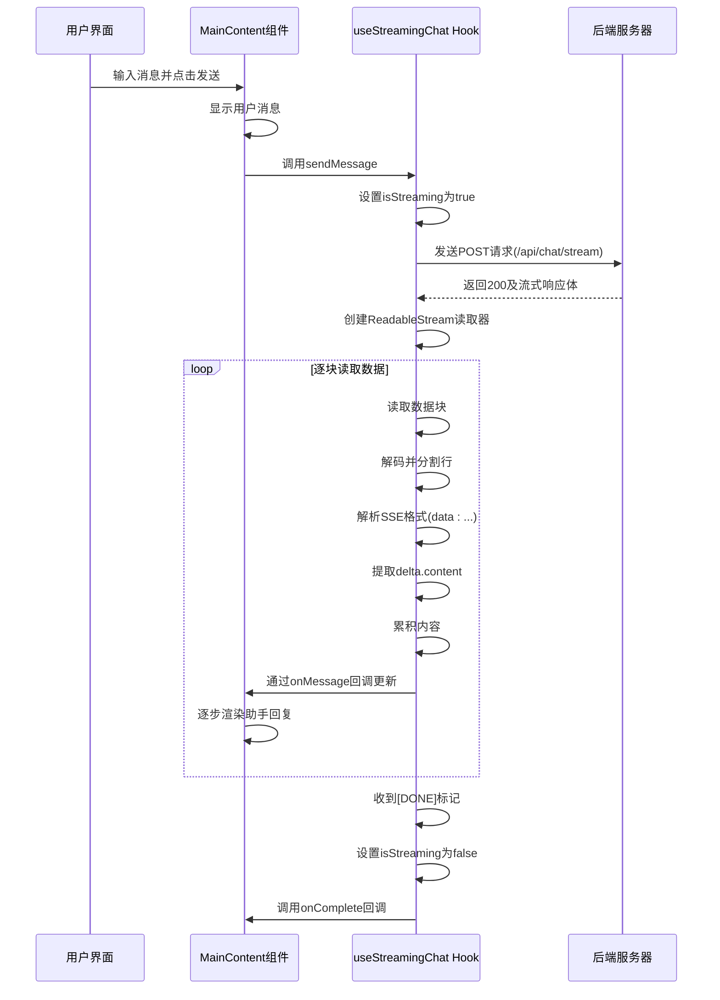
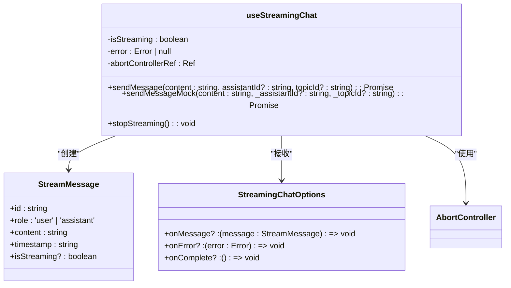
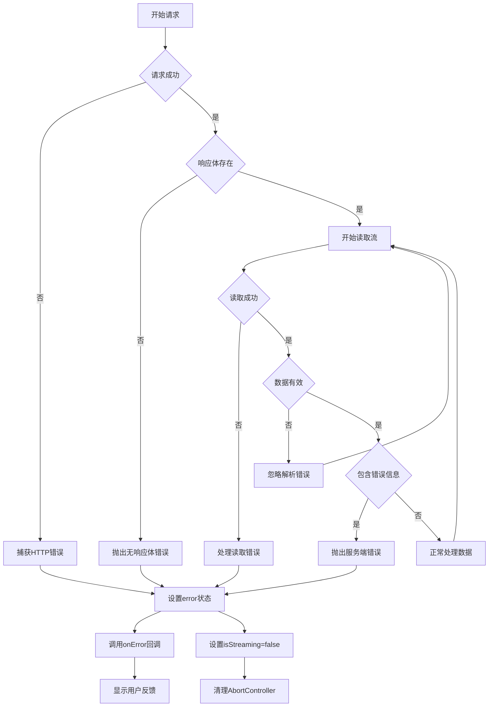
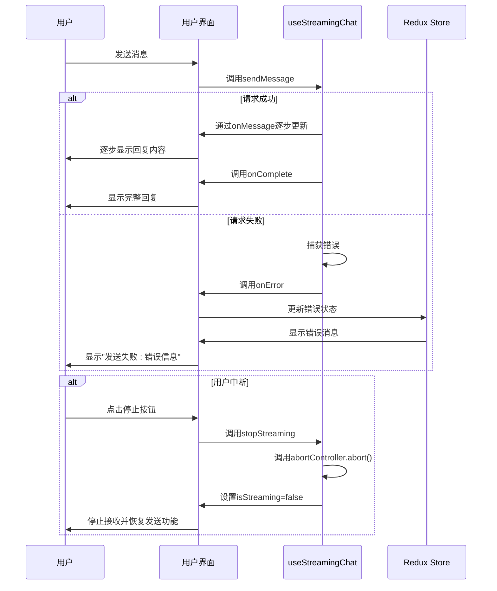
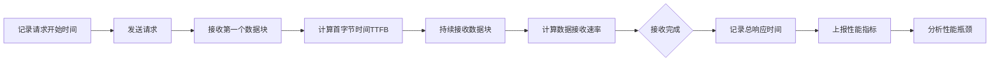

# 流式交互流程

<cite>
**本文档引用文件**   
- [useStreamingChat.ts](file://src/hooks/useStreamingChat.ts)
- [chatSlice.ts](file://src/store/slices/chatSlice.ts)
- [MainContent.tsx](file://src/components/layout/MainContent.tsx)
- [apiSlice.ts](file://src/store/slices/apiSlice.ts)
- [index.ts](file://src/store/index.ts)
</cite>

## 目录
1. [介绍](#介绍)
2. [核心组件分析](#核心组件分析)
3. [流式交互流程](#流式交互流程)
4. [状态管理机制](#状态管理机制)
5. [错误处理与用户反馈](#错误处理与用户反馈)
6. [输入框状态同步](#输入框状态同步)
7. [性能监控与优化建议](#性能监控与优化建议)
8. [结论](#结论)

## 介绍
本文档全面解析从用户发送消息到接收流式响应的完整交互流程。重点说明useStreamingChat自定义Hook如何处理流式通信，描述流式数据分块接收机制、文本逐步渲染策略及加载状态管理。结合代码实例展示AbortController在请求中断中的应用，以及网络异常、服务超时等情况下的错误捕获与用户反馈。

## 核心组件分析

### useStreamingChat Hook分析
```mermaid
flowchart TD
A[初始化Hook] --> B[创建状态变量]
B --> C[定义sendMessage函数]
C --> D[设置AbortController]
D --> E[发送fetch请求]
E --> F[创建ReadableStream读取器]
F --> G[逐块处理SSE数据]
G --> H[解析JSON数据]
H --> I[更新累积内容]
I --> J[通过onMessage回调通知]
J --> K[检测[DONE]标记]
K --> L[完成流式传输]
M[stopStreaming] --> N[调用AbortController.abort]
N --> O[清理状态]
```

**Diagram sources**
- [useStreamingChat.ts](file://src/hooks/useStreamingChat.ts#L1-L240)

**Section sources**
- [useStreamingChat.ts](file://src/hooks/useStreamingChat.ts#L1-L240)

### 流式消息处理流程


**Diagram sources**
- [useStreamingChat.ts](file://src/hooks/useStreamingChat.ts#L1-L240)
- [MainContent.tsx](file://src/components/layout/MainContent.tsx#L1-L723)

**Section sources**
- [useStreamingChat.ts](file://src/hooks/useStreamingChat.ts#L1-L240)
- [MainContent.tsx](file://src/components/layout/MainContent.tsx#L1-L723)

## 流式交互流程

### 消息发送与接收流程
```mermaid
flowchart TD
A[用户输入消息] --> B{输入是否为空}
B --> |是| C[禁用发送按钮]
B --> |否| D[点击发送按钮]
D --> E[创建用户消息对象]
E --> F[添加到消息列表]
F --> G[清空输入框]
G --> H[调用sendMessage]
H --> I[创建AbortController]
I --> J[发送流式请求]
J --> K{响应是否成功}
K --> |否| L[抛出HTTP错误]
K --> |是| M[获取响应体读取器]
M --> N[逐块读取数据]
N --> O{数据块是否为空}
O --> |是| P[结束流式传输]
O --> |否| Q[解码数据块]
Q --> R[按行分割]
R --> S{是否为SSE格式}
S --> |否| T[跳过空行]
S --> |是| U[提取data内容]
U --> V{是否为[DONE]}
V --> |是| W[完成流式传输]
V --> |否| X[解析JSON数据]
X --> Y{是否包含delta.content}
Y --> |否| Z[检查错误信息]
Y --> |是| AA[累积内容]
AA --> AB[更新助手消息]
AB --> AC[通过onMessage回调]
AC --> AD[UI逐步渲染]
AD --> N
```

**Diagram sources**
- [useStreamingChat.ts](file://src/hooks/useStreamingChat.ts#L1-L240)
- [MainContent.tsx](file://src/components/layout/MainContent.tsx#L1-L723)

**Section sources**
- [useStreamingChat.ts](file://src/hooks/useStreamingChat.ts#L1-L240)
- [MainContent.tsx](file://src/components/layout/MainContent.tsx#L1-L723)

### 流式数据分块接收机制
useStreamingChat Hook通过Fetch API的ReadableStream特性实现流式数据分块接收：

1. **创建读取器**: 使用`response.body.getReader()`创建ReadableStreamDefaultReader
2. **持续读取**: 通过`reader.read()`方法持续读取数据块，直到`done: true`
3. **解码处理**: 使用TextDecoder对二进制数据进行解码
4. **行分割**: 将解码后的文本按换行符分割成多行
5. **SSE解析**: 识别以`data: `开头的Server-Sent Events格式数据
6. **JSON解析**: 对SSE数据进行JSON解析，提取`choices[0].delta.content`字段
7. **内容累积**: 将增量内容累加到完整回复中



**Diagram sources**
- [useStreamingChat.ts](file://src/hooks/useStreamingChat.ts#L1-L240)

**Section sources**
- [useStreamingChat.ts](file://src/hooks/useStreamingChat.ts#L1-L240)

## 状态管理机制

### 加载状态管理
系统通过多个层面的状态管理确保用户体验流畅：

1. **Hook内部状态**: useStreamingChat维护`isStreaming`状态，控制发送按钮的禁用状态
2. **UI组件状态**: MainContent组件使用`useState`管理消息列表和输入框内容
3. **Redux全局状态**: chatSlice中的`isStreaming`和`streamingTopicId`字段提供全局流式状态

```mermaid
flowchart LR
A[用户点击发送] --> B[设置isStreaming=true]
B --> C[禁用发送按钮]
C --> D[显示停止按钮]
D --> E[开始流式接收]
E --> F[逐步更新消息内容]
F --> G{收到[DONE]或异常}
G --> |完成| H[设置isStreaming=false]
G --> |异常| H
H --> I[恢复发送按钮]
I --> J[隐藏停止按钮]
```

**Diagram sources**
- [useStreamingChat.ts](file://src/hooks/useStreamingChat.ts#L1-L240)
- [MainContent.tsx](file://src/components/layout/MainContent.tsx#L1-L723)

**Section sources**
- [useStreamingChat.ts](file://src/hooks/useStreamingChat.ts#L1-L240)
- [MainContent.tsx](file://src/components/layout/MainContent.tsx#L1-L723)

## 错误处理与用户反馈

### 错误捕获机制
系统实现了多层次的错误捕获与处理：

1. **网络请求错误**: 检查`response.ok`状态码
2. **响应体错误**: 验证`response.body`是否存在
3. **JSON解析错误**: 使用try-catch捕获parseError
4. **服务端错误**: 检查SSE数据中的error字段
5. **中断错误**: 通过AbortController.signal.aborted检测请求中断



**Diagram sources**
- [useStreamingChat.ts](file://src/hooks/useStreamingChat.ts#L1-L240)

**Section sources**
- [useStreamingChat.ts](file://src/hooks/useStreamingChat.ts#L1-L240)

### 用户反馈策略


**Diagram sources**
- [useStreamingChat.ts](file://src/hooks/useStreamingChat.ts#L1-L240)
- [MainContent.tsx](file://src/components/layout/MainContent.tsx#L1-L723)

**Section sources**
- [useStreamingChat.ts](file://src/hooks/useStreamingChat.ts#L1-L240)
- [MainContent.tsx](file://src/components/layout/MainContent.tsx#L1-L723)

## 输入框状态同步

### 输入框重置时机
输入框内容在以下时机进行重置：

1. **消息发送后**: 调用`setInputValue('')`立即清空
2. **流式传输开始**: 确保用户不能在流式响应期间发送新消息
3. **错误发生后**: 即使请求失败，输入框也保持清空状态

```mermaid
flowchart TD
A[用户输入内容] --> B[输入框显示内容]
B --> C{点击发送}
C --> |是| D[验证输入不为空]
D --> E[添加用户消息到列表]
E --> F[调用setInputValue('')]
F --> G[输入框清空]
G --> H[调用sendMessage]
H --> I[开始流式接收]
I --> J{流式完成或出错}
J --> K[保持清空状态]
K --> L[等待用户新输入]
```

**Diagram sources**
- [MainContent.tsx](file://src/components/layout/MainContent.tsx#L1-L723)

**Section sources**
- [MainContent.tsx](file://src/components/layout/MainContent.tsx#L1-L723)

## 性能监控与优化建议

### 性能监控点


**Diagram sources**
- [useStreamingChat.ts](file://src/hooks/useStreamingChat.ts#L1-L240)

**Section sources**
- [useStreamingChat.ts](file://src/hooks/useStreamingChat.ts#L1-L240)

### 优化建议
1. **连接复用**: 使用HTTP/2或WebSocket保持长连接，减少握手开销
2. **响应延迟测量**: 监控TTFB（Time To First Byte）和完整响应时间
3. **流式压缩**: 启用Gzip压缩减少传输数据量
4. **缓存策略**: 对常见问题的回复进行本地缓存
5. **预连接**: 在用户输入时预建立连接，减少等待时间
6. **分块大小优化**: 调整服务端输出的chunk大小，平衡延迟和吞吐量
7. **错误重试机制**: 实现指数退避重试策略处理临时性错误
8. **资源预加载**: 预加载常用模型和资源，减少首次响应时间

## 结论
本文档详细解析了从用户发送消息到接收流式响应的完整交互流程。系统通过useStreamingChat自定义Hook实现了高效的流式通信机制，利用Fetch API的ReadableStream特性实现数据分块接收和逐步渲染。通过AbortController实现了请求的灵活中断，结合多层次的错误处理机制确保了系统的健壮性。状态管理方面，结合局部状态和Redux全局状态，实现了流畅的用户体验。未来可通过连接复用、性能监控等优化措施进一步提升系统性能。