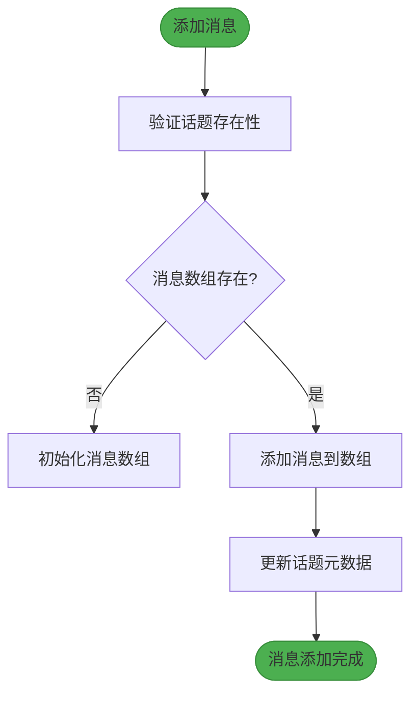
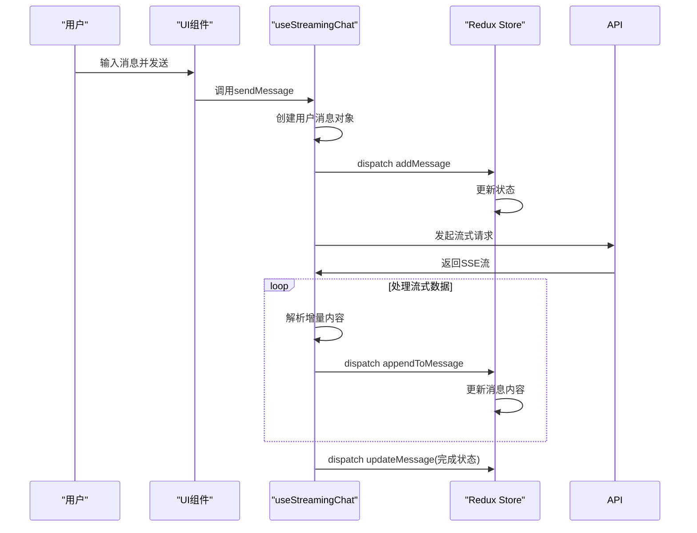

# 消息管理

<cite>
**本文档中引用的文件**   
- [chatSlice.ts](file://src/store/slices/chatSlice.ts)
- [index.ts](file://src/types/index.ts)
- [useStreamingChat.ts](file://src/hooks/useStreamingChat.ts)
- [MainContent.tsx](file://src/components/layout/MainContent.tsx)
- [redux.ts](file://src/hooks/redux.ts)
- [index.ts](file://src/store/index.ts)
</cite>

## 目录
1. [消息状态结构设计](#消息状态结构设计)
2. [消息管理操作机制](#消息管理操作机制)
3. [消息创建与持久化流程](#消息创建与持久化流程)
4. [消息ID生成与去重机制](#消息id生成与去重机制)
5. [消息列表读取最佳实践](#消息列表读取最佳实践)
6. [常见问题排查指南](#常见问题排查指南)

## 消息状态结构设计

消息管理状态在 `chatSlice` 中通过 `ChatState` 接口定义，采用话题隔离的存储策略。消息列表以 `Record<string, Message[]>` 类型存储，以话题ID为键组织消息数组，确保不同会话间的消息隔离。

消息对象结构设计包含以下核心属性：
- **id**: 消息唯一标识符，用于精确识别和操作特定消息
- **topicId**: 所属话题ID，建立消息与会话的关联关系
- **role**: 角色标识，区分用户消息('user')和助手消息('assistant')
- **content**: 消息内容主体，存储实际的文本信息
- **createdAt**: 创建时间戳，采用ISO字符串格式记录消息生成时间
- **tokens**: 可选属性，记录消息消耗的token数量
- **model**: 可选属性，标识生成消息所使用的AI模型
- **attachments**: 可选附件数组，支持文件、图片等多媒体内容

话题对象同步维护消息统计信息，包括 `messageCount` 消息总数和 `lastMessage` 最后一条消息摘要，实现高效的话题概览展示。

**Section sources**
- [chatSlice.ts](file://src/store/slices/chatSlice.ts#L4-L13)
- [index.ts](file://src/types/index.ts#L35-L44)

## 消息管理操作机制

### 消息添加
`addMessage` reducer负责添加新消息，执行以下逻辑：
1. 验证目标话题的消息数组是否存在，若不存在则初始化
2. 将新消息推入对应话题的消息数组
3. 更新话题元数据，包括最后消息内容、消息计数和更新时间

### 消息更新
提供三种更新方式：
- **updateMessage**: 完整替换指定消息
- **appendToMessage**: 增量追加内容到现有消息，适用于流式响应场景
- **deleteMessage**: 从消息数组中移除指定消息

### 历史记录管理
- **setMessages**: 批量设置特定话题的全部消息，用于会话恢复
- **clearSearch**: 清除搜索状态，重置搜索查询和结果



**Diagram sources**
- [chatSlice.ts](file://src/store/slices/chatSlice.ts#L65-L76)

**Section sources**
- [chatSlice.ts](file://src/store/slices/chatSlice.ts#L65-L108)

## 消息创建与持久化流程

消息创建流程始于用户输入，通过 `useStreamingChat` hook 发起请求。用户消息创建时，ID采用 `Date.now().toString()` 生成，确保时间唯一性。

流式响应场景下，助手消息创建流程如下：
1. 创建初始消息对象，ID基于时间戳生成
2. 通过SSE接收增量内容
3. 使用 `appendToMessage` reducer逐步更新消息内容
4. 接收完成标志后，标记消息为非流式状态

持久化策略采用Redux状态管理，结合话题ID的分组存储机制。每个话题的消息独立存储，支持会话级别的数据隔离和管理。消息数据在应用生命周期内保持在内存中，通过话题切换机制实现按需加载。



**Diagram sources**
- [useStreamingChat.ts](file://src/hooks/useStreamingChat.ts#L16-L239)
- [MainContent.tsx](file://src/components/layout/MainContent.tsx#L16-L723)

**Section sources**
- [useStreamingChat.ts](file://src/hooks/useStreamingChat.ts#L16-L239)
- [MainContent.tsx](file://src/components/layout/MainContent.tsx#L16-L723)

## 消息ID生成与去重机制

消息ID生成采用双重策略：
- **客户端生成**: 使用 `Date.now().toString()` 确保时间维度的唯一性
- **服务端生成**: 真实API响应中由服务端生成更可靠的唯一ID

去重机制通过ID精确匹配实现：
- 添加消息前不进行重复检查，依赖唯一ID保证
- 更新操作通过ID查找定位目标消息
- 删除操作基于ID进行精确移除

性能优化措施包括：
- 使用对象键值对存储消息数组，实现O(1)访问复杂度
- 消息数组采用尾部追加策略，避免昂贵的数组重组
- 话题元数据的增量更新，避免全量计算

**Section sources**
- [chatSlice.ts](file://src/store/slices/chatSlice.ts#L65-L108)
- [useStreamingChat.ts](file://src/hooks/useStreamingChat.ts#L16-L239)

## 消息列表读取最佳实践

使用 `useAppSelector` 从Redux store读取消息列表的最佳实践如下：

```typescript
const currentMessages = useAppSelector(state => {
  const topicId = state.chat.currentTopicId;
  return topicId ? state.chat.messages[topicId] || [] : [];
});
```

关键优化策略：
- **选择器精确化**: 直接选择所需话题的消息数组，避免全量状态订阅
- **空值防御**: 提供默认空数组，防止undefined访问错误
- **依赖隔离**: 选择器仅依赖必要状态，减少不必要的重渲染

结合React.memo对消息项组件进行优化，确保只有相关消息变化时才触发重渲染。通过ID作为key属性，保证列表渲染的稳定性和性能。

**Section sources**
- [redux.ts](file://src/hooks/redux.ts#L0-L6)
- [MainContent.tsx](file://src/components/layout/MainContent.tsx#L16-L723)

## 常见问题排查指南

### 消息丢失问题
**可能原因**:
- 话题ID未正确设置
- 页面刷新导致状态丢失
- 消息ID冲突

**排查步骤**:
1. 检查 `currentTopicId` 是否正确设置
2. 验证消息的 `topicId` 与当前话题匹配
3. 确认消息ID的唯一性

### 消息顺序错乱
**可能原因**:
- 异步操作未正确处理
- 消息ID时间戳冲突

**解决方案**:
- 确保消息按顺序添加到数组
- 使用更精确的ID生成策略
- 避免并发修改同一话题消息

### 流式响应中断
**检查点**:
- 网络连接状态
- SSE连接是否正常关闭
- 中断控制器是否正确处理

**Section sources**
- [chatSlice.ts](file://src/store/slices/chatSlice.ts#L65-L108)
- [useStreamingChat.ts](file://src/hooks/useStreamingChat.ts#L16-L239)
- [MainContent.tsx](file://src/components/layout/MainContent.tsx#L16-L723)