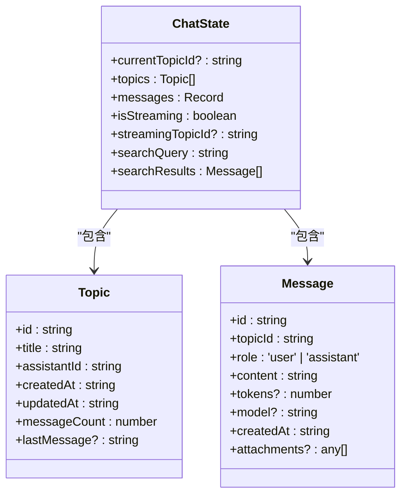
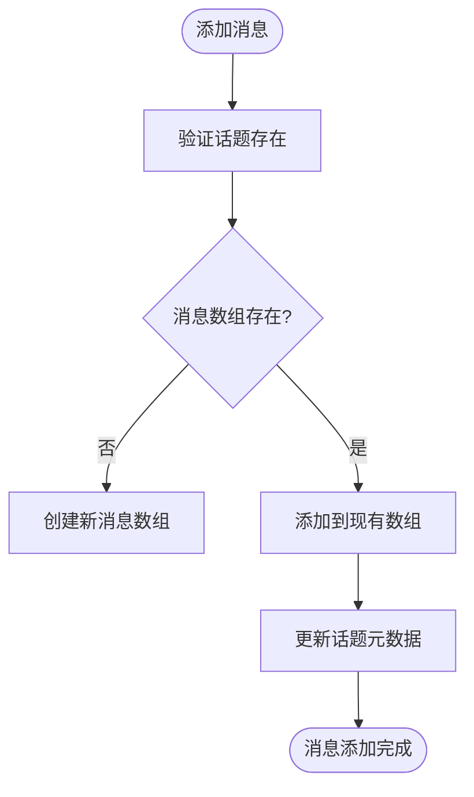
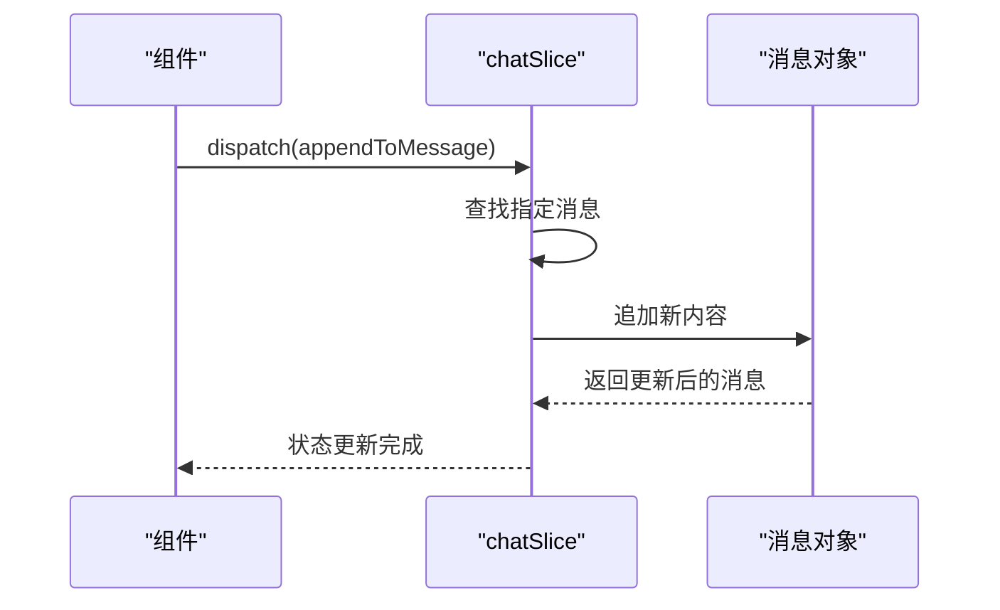
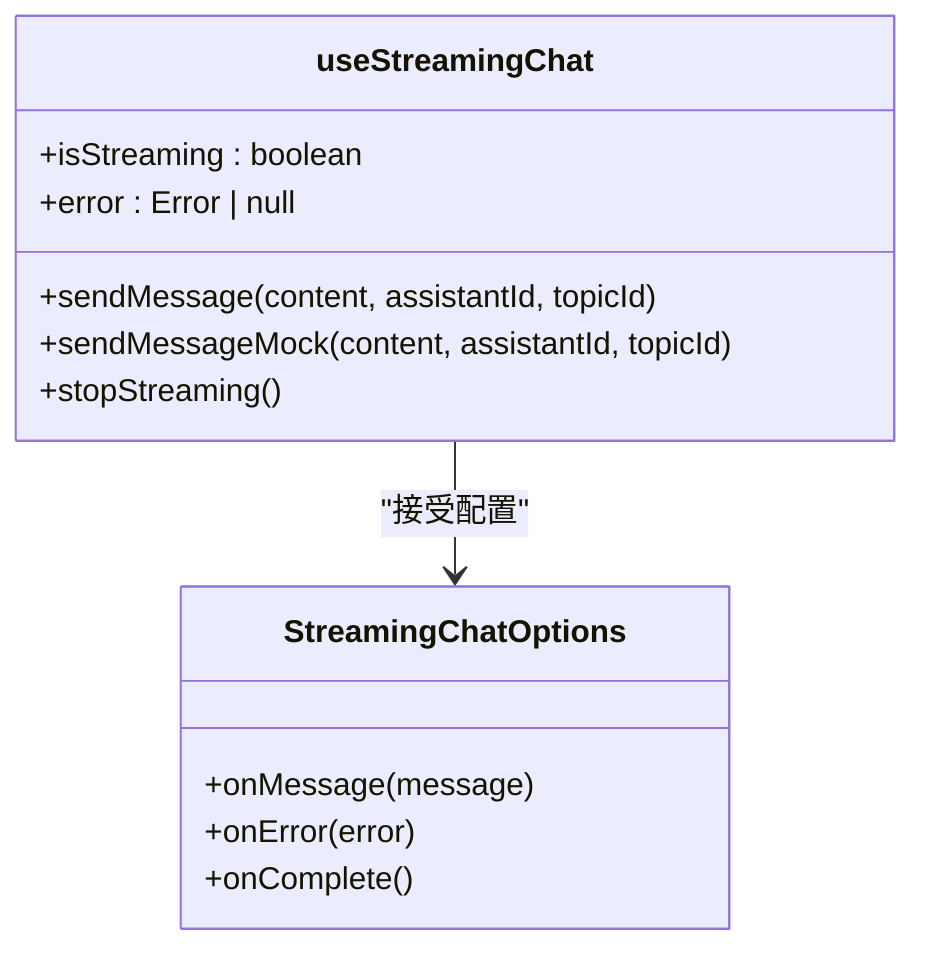
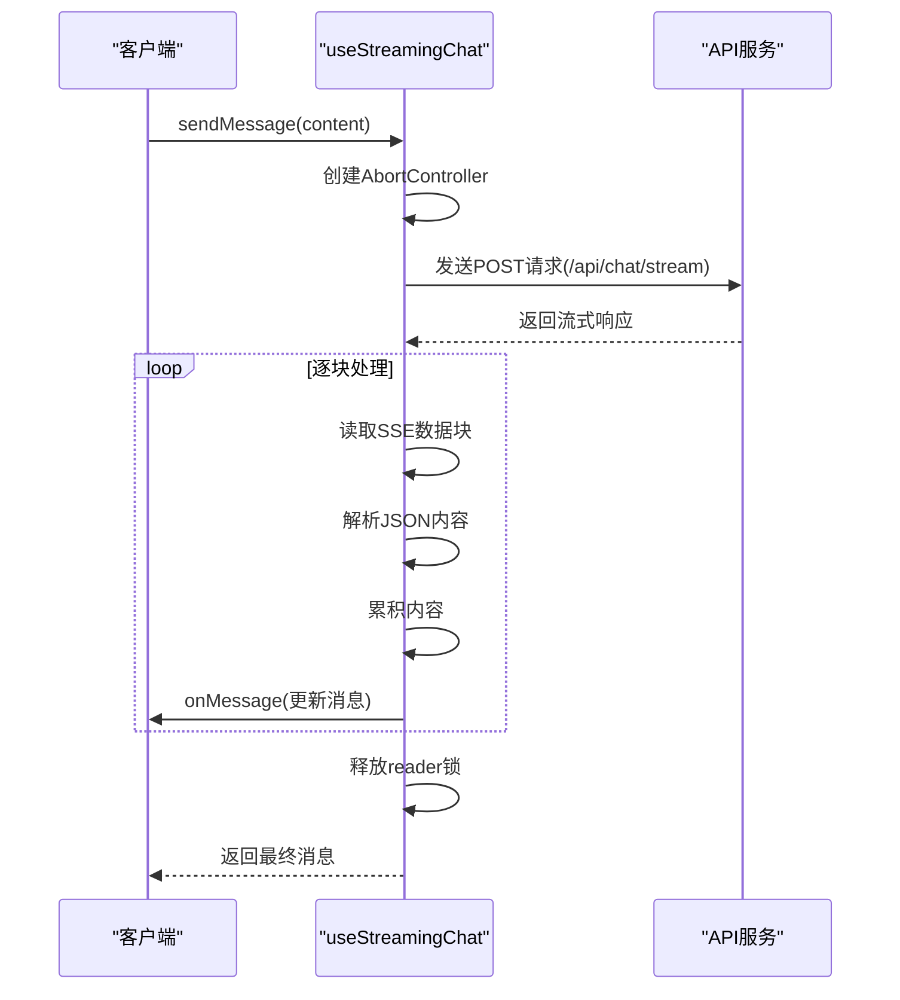
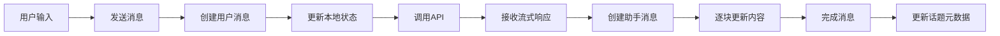
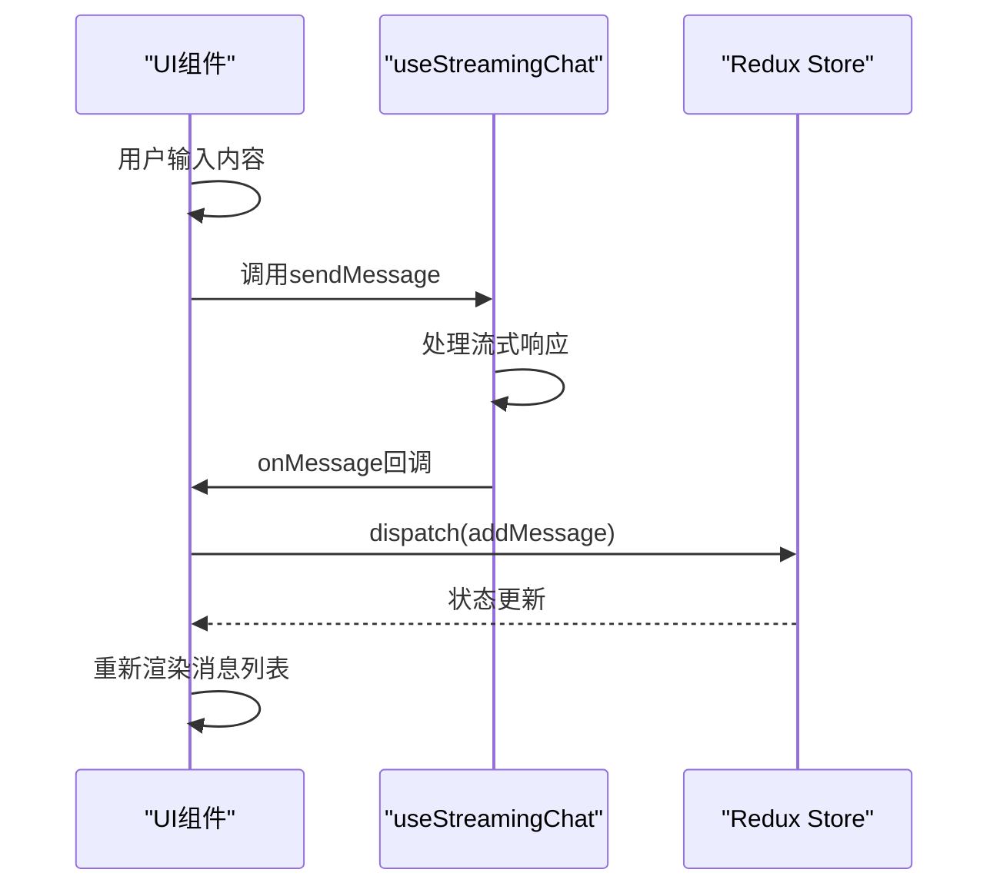
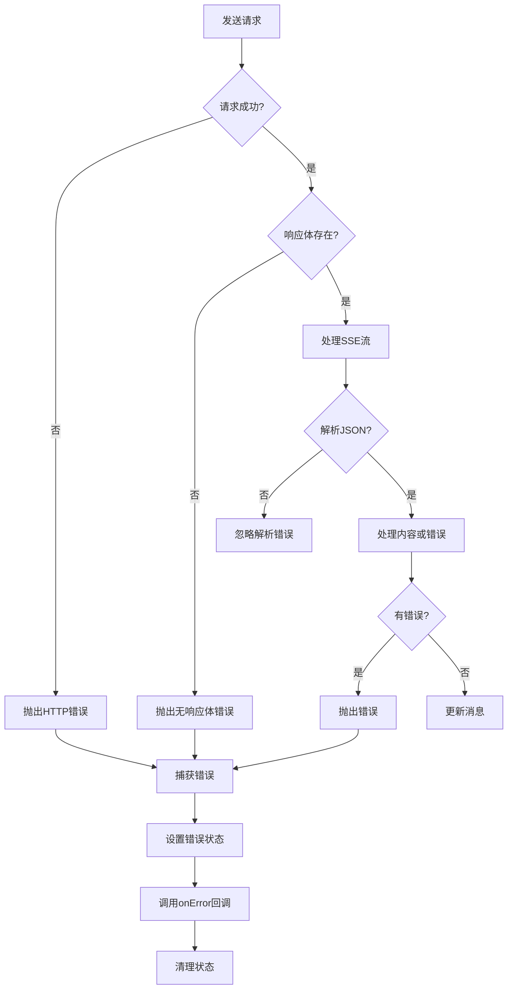
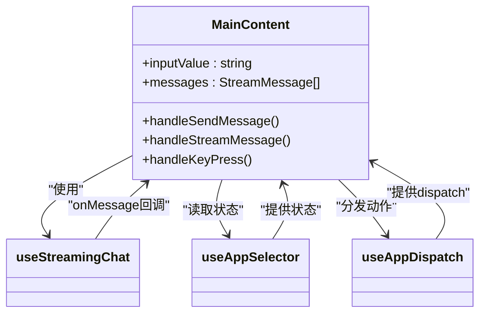

# 聊天状态管理

<cite>
**本文档中引用的文件**   
- [chatSlice.ts](file://src/store/slices/chatSlice.ts)
- [useStreamingChat.ts](file://src/hooks/useStreamingChat.ts)
- [index.ts](file://src/types/index.ts)
- [MainContent.tsx](file://src/components/layout/MainContent.tsx)
- [store.ts](file://src/store/index.ts)
- [redux.ts](file://src/hooks/redux.ts)
</cite>

## 目录
1. [简介](#简介)
2. [核心状态结构](#核心状态结构)
3. [消息管理机制](#消息管理机制)
4. [话题管理机制](#话题管理机制)
5. [流式聊天Hook](#流式聊天Hook)
6. [数据流分析](#数据流分析)
7. [错误处理策略](#错误处理策略)
8. [组件中状态读写](#组件中状态读写)
9. [结论](#结论)

## 简介
本文档深入解析`chatSlice`对聊天会话数据的管理逻辑。详细描述该slice如何维护消息历史、当前话题ID、输入框内容等核心状态，并说明`createAsyncThunk`在异步消息发送中的应用。结合`useStreamingChat`自定义Hook，展示从用户输入到调用API、接收流式响应、更新消息列表的完整数据流。提供消息对象的结构定义（sender、content、timestamp）、话题切换时的状态同步机制，以及错误处理策略。通过实际代码片段说明如何在组件中安全地读取和更新聊天状态。

## 核心状态结构

`chatSlice`定义了聊天功能的核心状态结构，通过Redux Toolkit的`createSlice`实现状态管理。状态包含话题列表、消息历史、流式状态等关键信息。



**图示来源**
- [chatSlice.ts](file://src/store/slices/chatSlice.ts#L0-L41)

**本节来源**
- [chatSlice.ts](file://src/store/slices/chatSlice.ts#L0-L41)

## 消息管理机制

`chatSlice`提供了完整的消息管理功能，包括添加、更新、追加和删除消息等操作。消息按话题ID进行组织，确保数据隔离和高效访问。

### 消息添加与更新
通过`addMessage` reducer实现消息添加，自动创建话题消息数组（如果不存在），并将消息推入对应话题的消息列表。同时更新话题的最后消息摘要、消息计数和更新时间。



**图示来源**
- [chatSlice.ts](file://src/store/slices/chatSlice.ts#L76-L78)

### 消息追加机制
`appendToMessage` reducer支持流式响应的消息追加，允许逐步更新助手消息内容。这种机制特别适用于流式API响应，能够实时显示AI生成的内容。



**图示来源**
- [chatSlice.ts](file://src/store/slices/chatSlice.ts#L100-L105)

**本节来源**
- [chatSlice.ts](file://src/store/slices/chatSlice.ts#L76-L112)

## 话题管理机制

话题管理是聊天功能的核心，`chatSlice`提供了完整的话题生命周期管理，包括创建、更新、删除和切换话题。

### 话题操作流程
```mermaid
flowchart TD
A[创建话题] --> B[添加到话题列表开头]
B --> C[设置为当前话题]
C --> D[初始化消息数组]
E[删除话题] --> F[从列表中移除]
F --> G[删除对应消息]
G --> H[清除当前话题(如果是当前话题)]
I[切换话题] --> J[更新currentTopicId]
J --> K[加载对应消息历史]
```

**图示来源**
- [chatSlice.ts](file://src/store/slices/chatSlice.ts#L35-L76)

### 话题状态同步
当话题被删除时，系统会自动清理相关资源，包括从`topics`数组中移除话题、从`messages`对象中删除对应的消息数组，以及在当前话题被删除时将`currentTopicId`设置为`undefined`。

**本节来源**
- [chatSlice.ts](file://src/store/slices/chatSlice.ts#L35-L76)

## 流式聊天Hook

`useStreamingChat`自定义Hook封装了流式聊天的核心逻辑，提供简洁的API供组件使用。

### Hook核心功能


**图示来源**
- [useStreamingChat.ts](file://src/hooks/useStreamingChat.ts#L0-L53)

### 流式通信流程


**图示来源**
- [useStreamingChat.ts](file://src/hooks/useStreamingChat.ts#L51-L91)

**本节来源**
- [useStreamingChat.ts](file://src/hooks/useStreamingChat.ts#L0-L53)

## 数据流分析

从用户输入到消息显示的完整数据流涉及多个组件和状态的协同工作。

### 完整数据流


### 组件间数据流


**图示来源**
- [MainContent.tsx](file://src/components/layout/MainContent.tsx#L370-L418)

**本节来源**
- [useStreamingChat.ts](file://src/hooks/useStreamingChat.ts#L0-L239)
- [MainContent.tsx](file://src/components/layout/MainContent.tsx#L370-L418)

## 错误处理策略

系统实现了多层次的错误处理机制，确保用户体验的稳定性。

### 错误处理流程


**本节来源**
- [useStreamingChat.ts](file://src/hooks/useStreamingChat.ts#L132-L184)

## 组件中状态读写

在React组件中安全地读取和更新聊天状态需要使用Redux的hooks。

### 状态读取
通过`useAppSelector`从Redux store中选择所需的状态片段：

```typescript
const messages = useAppSelector(state => state.chat.messages[currentTopicId] || []);
const currentTopicId = useAppSelector(state => state.chat.currentTopicId);
const isStreaming = useAppSelector(state => state.chat.isStreaming);
```

### 状态更新
通过`useAppDispatch`获取dispatch函数来更新状态：

```typescript
const dispatch = useAppDispatch();
dispatch(setCurrentTopic(topicId));
dispatch(addMessage(message));
dispatch(setStreaming({ isStreaming: true, topicId }));
```

### 完整组件示例


**图示来源**
- [MainContent.tsx](file://src/components/layout/MainContent.tsx#L370-L418)

**本节来源**
- [redux.ts](file://src/hooks/redux.ts#L0-L6)
- [MainContent.tsx](file://src/components/layout/MainContent.tsx#L370-L418)

## 结论
`chatSlice`通过精心设计的状态结构和reducer函数，实现了高效的聊天会话管理。结合`useStreamingChat`自定义Hook，系统能够处理流式API响应，提供实时的聊天体验。状态管理遵循Redux最佳实践，确保数据的一致性和可预测性。通过类型化的hooks和清晰的数据流，组件能够安全地读取和更新状态，构建稳定可靠的聊天界面。