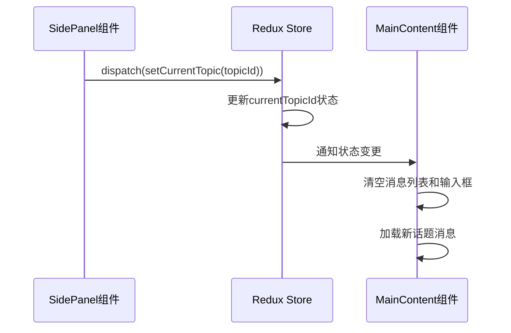
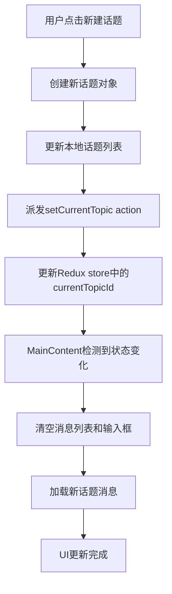
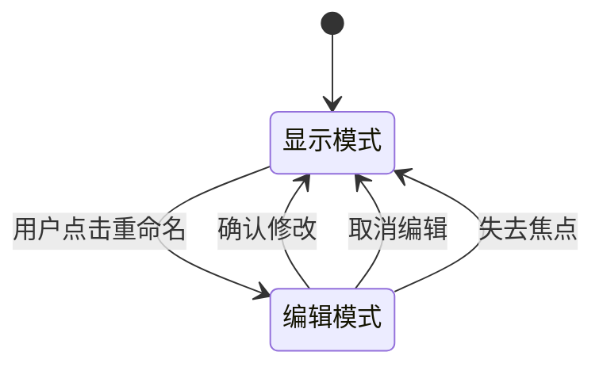
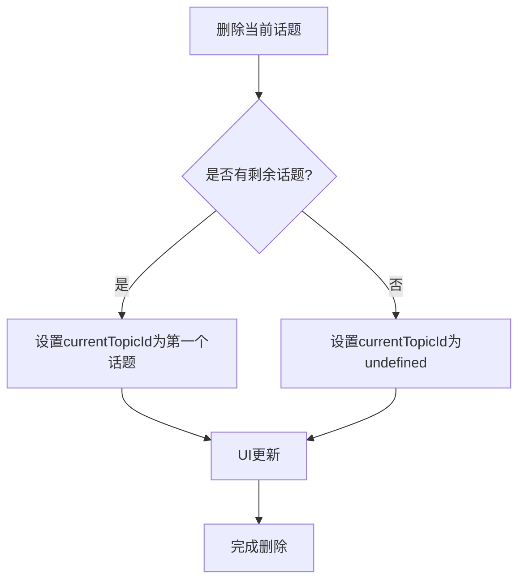

# 话题状态同步

<cite>
**本文档引用的文件**
- [chatSlice.ts](file://src/store/slices/chatSlice.ts)
- [uiSlice.ts](file://src/store/slices/uiSlice.ts)
- [SidePanel.tsx](file://src/components/layout/SidePanel.tsx)
- [MainContent.tsx](file://src/components/layout/MainContent.tsx)
- [redux.ts](file://src/hooks/redux.ts)
</cite>

## 目录
1. [话题状态管理机制](#话题状态管理机制)
2. [多组件协同工作流程](#多组件协同工作流程)
3. [setActiveTopic动作触发流程](#setactivetopic动作触发流程)
4. [话题未保存状态标记与提示](#话题未保存状态标记与提示)
5. [状态同步完整链条分析](#状态同步完整链条分析)
6. [边界情况处理与错误恢复](#边界情况处理与错误恢复)
7. [话题状态异常调试方法](#话题状态异常调试方法)

## 话题状态管理机制

`chatSlice`中的`currentTopicId`状态是管理当前活跃话题的核心字段。该状态通过Redux Toolkit的`createSlice`创建，作为`ChatState`接口的一部分，其类型定义为可选字符串（`string | undefined`），表示当前选中的话题ID。

在`chatSlice.ts`中，`currentTopicId`的初始值为`undefined`，通过`setCurrentTopic` reducer进行更新。当用户创建新话题时，`addTopic` reducer不仅将新话题添加到话题列表的开头，还会自动将`currentTopicId`设置为新创建话题的ID，并初始化该话题对应的消息数组。

话题状态的管理遵循单向数据流原则：SidePanel组件中的用户交互触发action，通过Redux store更新`currentTopicId`，然后MainContent组件监听该状态变化并相应地更新UI和消息列表。

**Section sources**
- [chatSlice.ts](file://src/store/slices/chatSlice.ts#L26-L35)
- [chatSlice.ts](file://src/store/slices/chatSlice.ts#L48-L52)

## 多组件协同工作流程

`currentTopicId`状态在SidePanel和MainContent组件之间实现了高效的协同工作。SidePanel作为话题选择的控制中心，负责管理话题列表的展示和用户交互，而MainContent作为消息展示区域，负责根据当前话题ID加载和显示对应的消息内容。

当用户在SidePanel中点击某个话题时，`handleTopicClick`函数被触发，该函数首先更新本地组件状态`selectedTopicId`，然后通过`dispatch(setCurrentTopic(topicId))`派发action到Redux store。这一操作会更新全局的`currentTopicId`状态。

MainContent组件通过`useAppSelector` Hook订阅`currentTopicId`状态的变化。当该状态发生变化时，组件内的`useEffect`监听器会检测到变化，并执行相应的逻辑：清空当前消息列表和输入框内容，确保UI与新话题的上下文保持一致。

这种设计实现了组件间的松耦合，SidePanel无需直接操作MainContent的内部状态，而是通过共享的Redux store进行通信，提高了代码的可维护性和可测试性。

**Diagram sources**
- [SidePanel.tsx](file://src/components/layout/SidePanel.tsx#L870-L873)
- [MainContent.tsx](file://src/components/layout/MainContent.tsx#L348-L355)

**Section sources**
- [SidePanel.tsx](file://src/components/layout/SidePanel.tsx#L870-L873)
- [MainContent.tsx](file://src/components/layout/MainContent.tsx#L348-L355)

## setActiveTopic动作触发流程

`setActiveTopic`动作的触发流程始于用户在SidePanel中的交互操作。该流程涉及多个组件和状态管理机制的协同工作，确保话题切换的平滑和一致性。

当用户点击"新建话题"按钮时，`handleCreateNewTopic`函数被调用。该函数首先创建一个新的话题对象，包含唯一的ID、标题和时间戳等信息。然后，通过`setTopics`更新本地话题列表状态，将新话题插入到列表的开头。

紧接着，`dispatch(setCurrentTopic(newTopic.id))`被调用，派发`setCurrentTopic` action到Redux store。这一步骤是整个流程的关键，它不仅更新了`chatSlice`中的`currentTopicId`，还触发了UI的重新渲染。

在MainContent组件中，`useEffect` Hook监听`currentTopicId`的变化。一旦检测到变化，组件会立即清空现有的消息列表和输入框内容，确保用户不会看到前一个话题的残留信息。同时，组件会根据新的`currentTopicId`从`messages`对象中加载对应的话题消息。

**Diagram sources**
- [SidePanel.tsx](file://src/components/layout/SidePanel.tsx#L880-L890)
- [MainContent.tsx](file://src/components/layout/MainContent.tsx#L348-L355)

**Section sources**
- [SidePanel.tsx](file://src/components/layout/SidePanel.tsx#L880-L890)
- [MainContent.tsx](file://src/components/layout/MainContent.tsx#L348-L355)

## 话题未保存状态标记与提示

系统通过组件内部状态和UI反馈机制来处理话题的未保存状态。当用户开始编辑一个话题的标题时，SidePanel组件进入"编辑模式"，通过`editingTopicId`和`editingTitle`两个本地状态来跟踪当前正在编辑的话题。

在编辑模式下，话题项的UI会从显示模式切换到输入框模式，允许用户修改标题。此时，系统通过`handleConfirmRename`函数处理确认操作，只有当用户按下Enter键或失去焦点时，才会将新的标题保存到话题列表中。

如果用户在编辑过程中取消操作或点击其他区域，`handleCancelRename`函数会被调用，清除编辑状态并恢复原始标题。这种设计确保了未完成的编辑不会意外保存，保护了用户的数据完整性。

虽然当前代码中没有显式的"未保存"视觉标记（如星号或特殊颜色），但通过输入框的焦点状态和编辑模式的UI变化，用户可以直观地感知到当前话题处于可编辑状态。这种隐式的提示机制简洁而有效，避免了界面的过度复杂化。

**Diagram sources**
- [SidePanel.tsx](file://src/components/layout/SidePanel.tsx#L920-L947)
- [SidePanel.tsx](file://src/components/layout/SidePanel.tsx#L1028-L1075)

**Section sources**
- [SidePanel.tsx](file://src/components/layout/SidePanel.tsx#L920-L947)
- [SidePanel.tsx](file://src/components/layout/SidePanel.tsx#L1028-L1075)

## 状态同步完整链条分析

话题变更时的状态同步链条是一个典型的Redux数据流，涉及从用户交互到UI更新的完整过程。这个链条确保了应用状态的一致性和可预测性。

当用户在SidePanel中选择一个新话题时，事件处理函数`handleTopicClick`首先更新组件的本地状态`selectedTopicId`，然后通过`dispatch(setCurrentTopic(topicId))`派发action。这个action被Redux store接收，并由`chatSlice`中的`setCurrentTopic` reducer处理，更新`currentTopicId`状态。

同时，`uiSlice`中的`setCurrentTopic` reducer也会被调用，更新UI相关的`currentTopicId`状态。这种双重更新确保了聊天相关的状态和UI状态保持同步。

在MainContent组件中，`useSelector` Hook订阅了`currentTopicId`状态。当状态发生变化时，`useEffect` Hook的依赖数组检测到变化，触发回调函数执行。该函数比较新的`currentTopicId`与组件内部的`currentTopicIdRef`，如果不同，则清空消息列表和输入框，并更新引用。

这种设计模式有效地避免了不必要的重复渲染，只有当真正的话题切换发生时才会重置UI状态。同时，通过使用本地引用`currentTopicIdRef`，组件能够准确地区分是话题切换还是其他状态变化导致的重新渲染。

```mermaid
flowchart LR
A[用户选择话题] --> B[更新本地selectedTopicId]
B --> C[派发setCurrentTopic action]
C --> D[chatSlice更新currentTopicId]
D --> E[uiSlice更新currentTopicId]
E --> F[MainContent检测到变化]
F --> G[比较currentTopicId与引用]
G --> H[清空消息列表和输入框]
H --> I[更新currentTopicIdRef]
I --> J[UI完成更新]
```

**Diagram sources**
- [SidePanel.tsx](file://src/components/layout/SidePanel.tsx#L870-L873)
- [MainContent.tsx](file://src/components/layout/MainContent.tsx#L348-L355)
- [uiSlice.ts](file://src/store/slices/uiSlice.ts#L108-L110)

**Section sources**
- [SidePanel.tsx](file://src/components/layout/SidePanel.tsx#L870-L873)
- [MainContent.tsx](file://src/components/layout/MainContent.tsx#L348-L355)
- [uiSlice.ts](file://src/store/slices/uiSlice.ts#L108-L110)

## 边界情况处理与错误恢复

系统在设计时考虑了多种边界情况和潜在的错误场景，通过合理的状态管理和错误恢复策略确保应用的健壮性。

当用户删除当前选中的话题时，`handleDeleteTopic`函数会检查被删除的话题是否是当前选中的话题。如果是，系统会尝试将`currentTopicId`设置为剩余话题列表中的第一个话题ID。如果话题列表为空，则将`currentTopicId`设置为`undefined`，表示没有选中任何话题。

在话题切换过程中，系统通过`useEffect` Hook的依赖数组精确控制状态更新的时机。当`sidebarActiveTab`发生变化时，组件会检查是否切换到了"topics"标签页且没有选中话题，如果是，则将`currentTopicIdRef`设置为`undefined`，确保UI状态与导航状态一致。

对于无效的话题ID，系统通过TypeScript的类型系统和运行时检查提供了一定的保护。虽然当前代码中没有显式的ID验证逻辑，但通过使用强类型和可选值（`string | undefined`），系统能够安全地处理缺失或无效的ID，避免了潜在的运行时错误。

**Diagram sources**
- [SidePanel.tsx](file://src/components/layout/SidePanel.tsx#L930-L947)
- [MainContent.tsx](file://src/components/layout/MainContent.tsx#L360-L368)

**Section sources**
- [SidePanel.tsx](file://src/components/layout/SidePanel.tsx#L930-L947)
- [MainContent.tsx](file://src/components/layout/MainContent.tsx#L360-L368)

## 话题状态异常调试方法

调试话题状态异常时，可以采用多种方法来定位和解决问题。首先，可以通过Redux DevTools检查`currentTopicId`状态的变化历史，观察action的派发顺序和状态更新是否符合预期。

在代码层面，可以在关键的`useEffect` Hook中添加console.log语句，输出`currentTopicId`、`currentTopicIdRef`和`sidebarActiveTab`等状态的值，帮助理解状态同步的时机和逻辑。

对于话题切换后消息未清空的问题，应检查`MainContent`组件中的`useEffect`依赖数组是否正确包含了`currentTopicId`和`currentTopicIdRef`。同时，验证`setCurrentTopic` action是否被正确派发，以及reducer是否正确更新了状态。

如果遇到话题删除后UI状态不一致的问题，应检查`handleDeleteTopic`函数中的逻辑，确保在删除当前话题时正确处理了`currentTopicId`的更新。可以通过在函数执行前后打印相关状态来验证逻辑的正确性。

最后，建议在关键的用户交互点（如话题选择、创建、删除）添加详细的日志记录，这有助于在生产环境中追踪和复现问题，提高调试效率。

**Section sources**
- [MainContent.tsx](file://src/components/layout/MainContent.tsx#L348-L355)
- [SidePanel.tsx](file://src/components/layout/SidePanel.tsx#L930-L947)