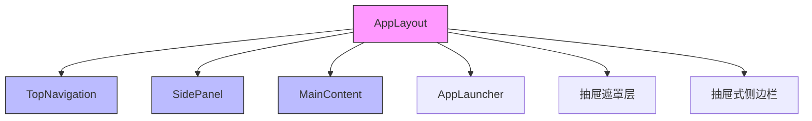
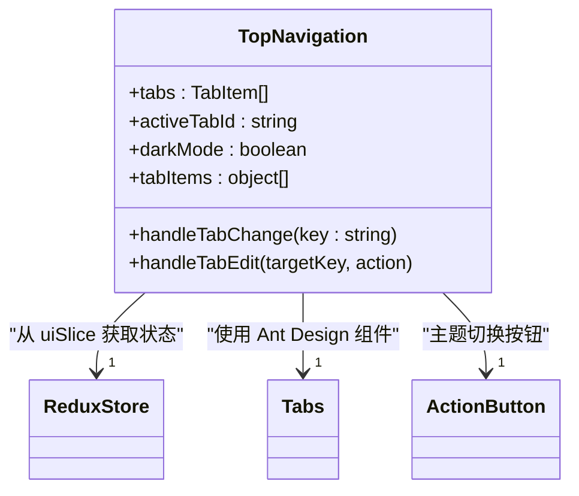
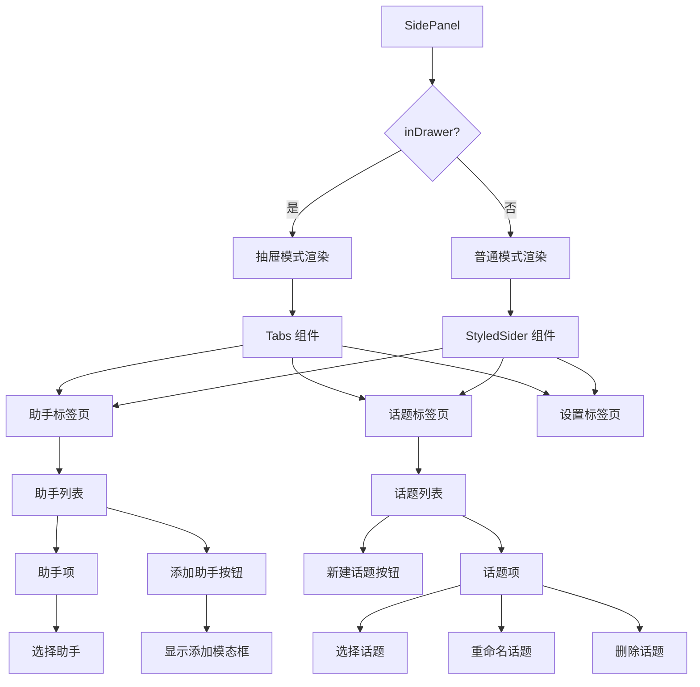
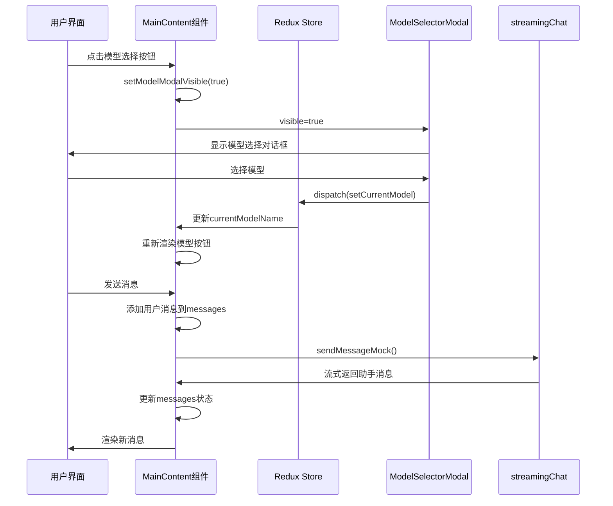

# 布局组件

<cite>
**本文档引用的文件**   
- [AppLayout.tsx](file://src/components/layout/AppLayout.tsx)
- [TopNavigation.tsx](file://src/components/layout/TopNavigation.tsx)
- [SidePanel.tsx](file://src/components/layout/SidePanel.tsx)
- [MainContent.tsx](file://src/components/layout/MainContent.tsx)
- [uiSlice.ts](file://src/store/slices/uiSlice.ts)
- [ModelSelectorModal.tsx](file://src/components/modals/ModelSelectorModal.tsx)
</cite>

## 目录
1. [布局组件概述](#布局组件概述)
2. [根布局容器 AppLayout](#根布局容器-applayout)
3. [顶部导航 TopNavigation](#顶部导航-topnavigation)
4. [侧边栏 SidePanel](#侧边栏-sidepanel)
5. [内容区域 MainContent](#内容区域-maincontent)
6. [组件间协作关系](#组件间协作关系)
7. [响应式布局实现](#响应式布局实现)

## 布局组件概述

本项目采用模块化布局设计，通过 AppLayout 作为根布局容器，集成 TopNavigation（顶部导航）、SidePanel（侧边栏）和 MainContent（主内容区）三个核心组件，构建了完整的用户界面架构。该布局系统支持主题切换、侧边栏展开/收起、多标签页管理等交互功能，并通过 Redux 状态管理实现组件间的状态同步。

**Section sources**
- [AppLayout.tsx](file://src/components/layout/AppLayout.tsx#L1-L129)

## 根布局容器 AppLayout

AppLayout 组件作为应用的根布局容器，负责协调和集成其他布局组件。它使用 Ant Design 的 Layout 组件构建基础结构，并通过 styled-components 进行样式定制。

AppLayout 的主要职责包括：
- 渲染顶部导航栏 TopNavigation
- 根据应用状态条件渲染侧边栏 SidePanel 或应用启动器 AppLauncher
- 管理抽屉式侧边栏的显示状态
- 处理 ESC 键关闭抽屉的交互

组件通过 useAppSelector 钩子从 Redux store 中获取 UI 状态，包括主题模式、侧边栏折叠状态、标签页信息等。当侧边栏处于折叠状态且需要显示侧边栏时，AppLayout 会渲染一个固定定位的抽屉式侧边栏，提供更好的移动端体验。



**Diagram sources**
- [AppLayout.tsx](file://src/components/layout/AppLayout.tsx#L1-L129)

**Section sources**
- [AppLayout.tsx](file://src/components/layout/AppLayout.tsx#L1-L129)

## 顶部导航 TopNavigation

TopNavigation 组件实现顶部导航栏功能，包含标签页管理、主题切换和设置入口等核心功能。

### 标签页管理
TopNavigation 使用 Ant Design 的 Tabs 组件实现标签页功能，支持标签的添加、删除和切换。标签页数据来源于 Redux store 中的 tabs 状态，每个标签包含 id、标题、类型和可关闭性等属性。首页标签（id: 'home'）固定显示，其他标签可动态增删。

### 主题切换功能
组件包含一个主题切换按钮，通过 ActionButton 组件实现。按钮根据当前 darkMode 状态显示太阳或月亮图标，点击后通过 dispatch(toggleDarkMode()) 派发动作，切换深色/浅色模式。

### 模型选择入口
虽然模型选择按钮实际位于 MainContent 组件中，但 TopNavigation 的 "+" 按钮点击后会触发 toggleAppLauncher 动作，显示应用启动器，间接提供了模型选择的入口。



**Diagram sources**
- [TopNavigation.tsx](file://src/components/layout/TopNavigation.tsx#L1-L329)

**Section sources**
- [TopNavigation.tsx](file://src/components/layout/TopNavigation.tsx#L1-L329)

## 侧边栏 SidePanel

SidePanel 组件负责展示话题列表与助手管理区域，支持侧边栏的展开/收起交互。

### 助手管理
SidePanel 维护一个助手列表状态，展示可用的 AI 助手（如 Claude、写作助手、编程助手等）。用户可以通过点击助手项来选择当前使用的助手。组件还提供"添加助手"按钮，点击后弹出模态框，允许用户从可用助手池中选择并添加新的助手。

### 话题管理
话题管理功能允许用户创建、重命名和删除对话话题。每个话题包含标题、最后消息、消息数量和最后活动时间等信息。用户可以通过点击话题来切换当前对话，系统会自动保存和恢复每个话题的聊天记录。

### 设置面板
SidePanel 包含一个完整的设置面板，分为助手设置、消息设置、数学公式设置、代码块设置和输入设置等多个分组。每个设置项都通过 Redux 状态进行管理，确保设置的持久化。



**Diagram sources**
- [SidePanel.tsx](file://src/components/layout/SidePanel.tsx#L1-L1658)

**Section sources**
- [SidePanel.tsx](file://src/components/layout/SidePanel.tsx#L1-L1658)

## 内容区域 MainContent

MainContent 组件作为内容展示区，承载多标签对话界面或其他页面内容。

### 对话界面
MainContent 的核心功能是展示聊天对话。它维护一个消息列表状态，包含用户和助手的消息。每条消息显示发送者头像、内容和时间戳。对于助手消息，还提供"复制"和"重新生成"操作按钮。

### 输入区域
底部输入区域包含一个文本输入框和发送按钮。输入框支持自动高度调整（1-6行），并支持 Shift+Enter 换行、Enter 发送的快捷键操作。当流式响应正在进行时，发送按钮会变为"停止"按钮。

### 工具栏
顶部工具栏包含侧边栏切换按钮、模型选择按钮、搜索按钮和宽度切换按钮。模型选择按钮点击后会打开 ModelSelectorModal 对话框，允许用户选择不同的 AI 模型。

### 特殊页面处理
MainContent 还负责处理特殊页面的渲染。当当前标签页为知识库（knowledge）或智能体（assistant）类型时，会渲染对应的页面组件而非对话界面。



**Diagram sources**
- [MainContent.tsx](file://src/components/layout/MainContent.tsx#L1-L723)

**Section sources**
- [MainContent.tsx](file://src/components/layout/MainContent.tsx#L1-L723)

## 组件间协作关系

布局组件之间通过 props 和 Redux store 进行状态传递和事件处理，形成了紧密的协作关系。

### 状态管理
所有布局相关的状态（如侧边栏折叠状态、当前主题、标签页信息等）都集中存储在 Redux store 的 uiSlice 中。各组件通过 useAppSelector 钩子订阅所需状态，并通过 useAppDispatch 钩子派发动作来修改状态。

### 事件传递
组件间通过 props 传递事件处理函数。例如，AppLayout 将 onDrawerOpen 函数作为 prop 传递给 MainContent，当用户点击抽屉打开按钮时，MainContent 调用此函数通知 AppLayout 显示抽屉式侧边栏。

### 条件渲染
AppLayout 根据应用状态决定渲染内容。当 showAppLauncher 为 true 时，渲染全屏的应用启动器；否则渲染正常的布局（侧边栏 + 主内容）。这种条件渲染机制使得应用可以在不同模式间无缝切换。

```mermaid
erDiagram
uiSlice ||--o{ AppLayout : "提供状态"
uiSlice ||--o{ TopNavigation : "提供状态"
uiSlice ||--o{ SidePanel : "提供状态"
uiSlice ||--o{ MainContent : "提供状态"
AppLayout }|--|| MainContent : "传递 onDrawerOpen"
MainContent }|--|| ModelSelectorModal : "控制显示/隐藏"
class uiSlice {
sidebarCollapsed: boolean
theme: string
darkMode: boolean
tabs: TabItem[]
activeTabId: string
currentTopicId: string
currentModel: string
currentModelName: string
showAppLauncher: boolean
}
```

**Diagram sources**
- [uiSlice.ts](file://src/store/slices/uiSlice.ts#L1-L148)
- [AppLayout.tsx](file://src/components/layout/AppLayout.tsx#L1-L129)

**Section sources**
- [uiSlice.ts](file://src/store/slices/uiSlice.ts#L1-L148)

## 响应式布局实现

本项目的响应式布局通过多种技术手段实现，确保在不同设备上都有良好的用户体验。

### CSS 变量与主题
项目使用 CSS 自定义属性（CSS Variables）定义主题颜色，如 --bg-primary、--text-primary、--accent-color 等。这些变量在不同主题模式下有不同的值，通过在根元素上切换 data-theme 属性来实现主题切换。

### Flexbox 布局
主要布局采用 Flexbox 技术，通过 display: flex 和相关属性实现灵活的布局结构。例如，AppLayout 使用 flex-direction: column 将顶部导航和主要内容区域垂直排列，MainContent 使用 flex: 1 让消息区域占据剩余空间。

### 媒体查询与条件样式
虽然代码中未直接使用媒体查询，但通过状态控制实现了响应式效果。例如，MainContent 组件的 isNarrowMode 状态控制内容区域的最大宽度（80vw 或 100%），实现内容宽度的响应式调整。

### 移动端优化
针对移动端进行了专门优化：
- 侧边栏在折叠状态下以抽屉形式呈现
- 抽屉遮罩层提供点击关闭功能
- ESC 键支持关闭抽屉
- 触摸友好的按钮尺寸和间距

这些技术共同作用，使得布局组件能够在桌面端和移动端都提供优秀的用户体验。

**Section sources**
- [AppLayout.tsx](file://src/components/layout/AppLayout.tsx#L1-L129)
- [TopNavigation.tsx](file://src/components/layout/TopNavigation.tsx#L1-L329)
- [SidePanel.tsx](file://src/components/layout/SidePanel.tsx#L1-L1658)
- [MainContent.tsx](file://src/components/layout/MainContent.tsx#L1-L723)