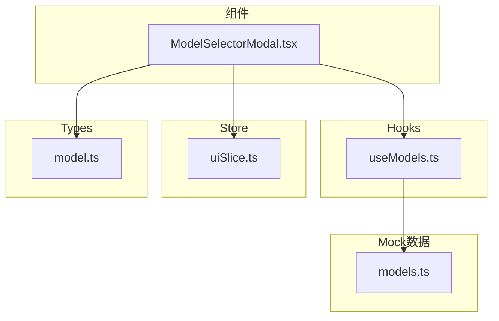
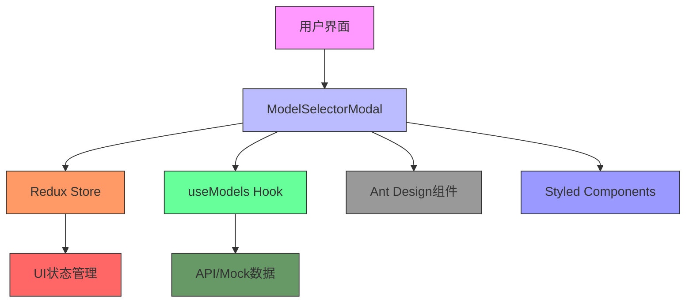
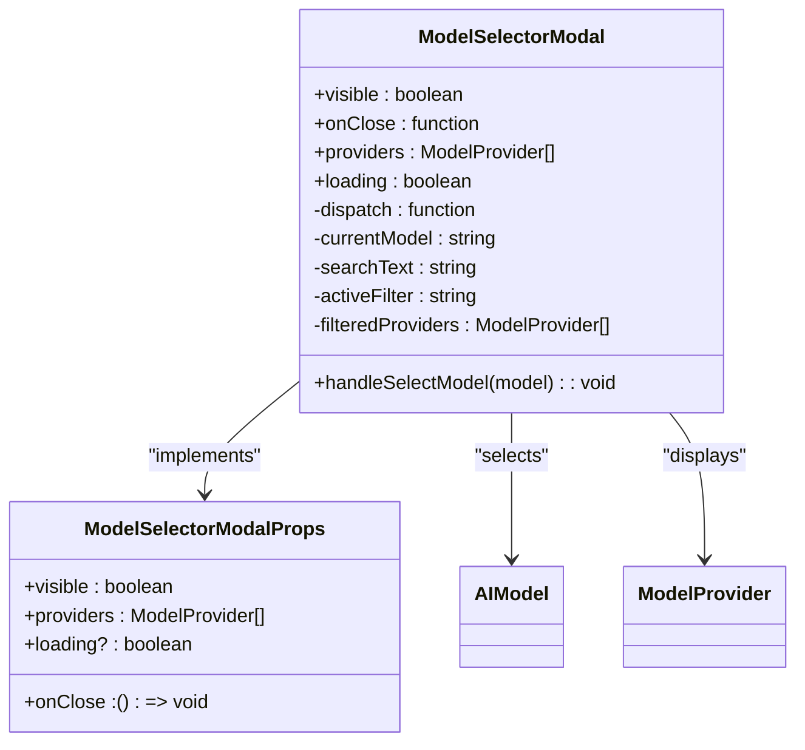
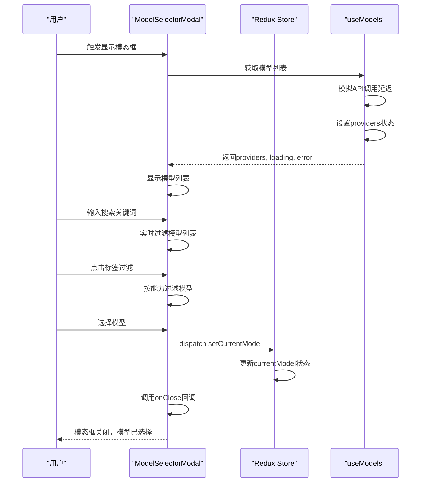
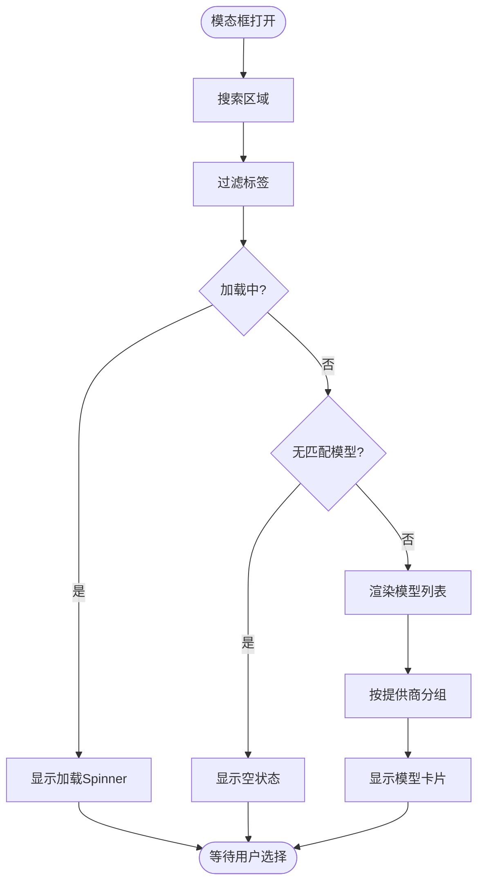
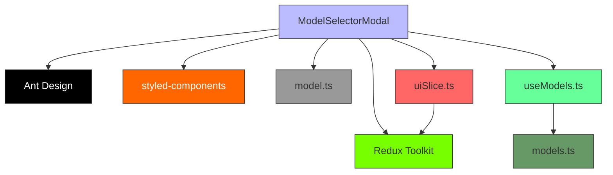
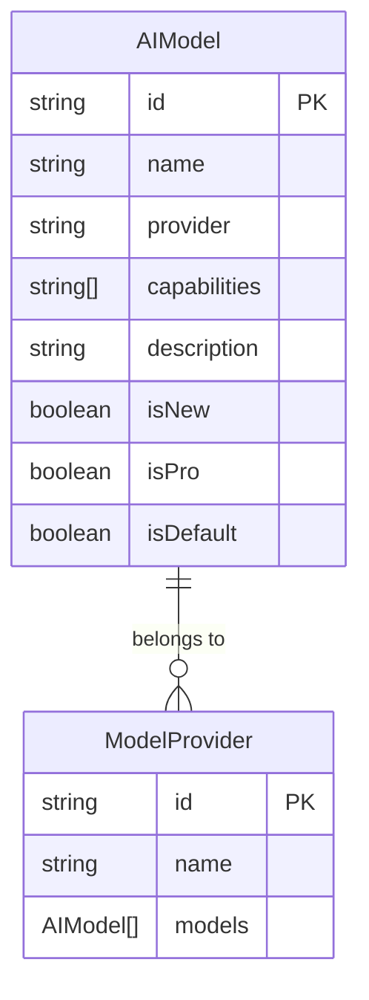

# 模态框组件

<cite>
**本文档引用的文件**
- [ModelSelectorModal.tsx](file://src/components/modals/ModelSelectorModal.tsx)
- [useModels.ts](file://src/hooks/useModels.ts)
- [uiSlice.ts](file://src/store/slices/uiSlice.ts)
- [model.ts](file://src/types/model.ts)
- [models.ts](file://src/mock/models.ts)
</cite>

## 目录
1. [简介](#简介)
2. [项目结构](#项目结构)
3. [核心组件](#核心组件)
4. [架构概述](#架构概述)
5. [详细组件分析](#详细组件分析)
6. [依赖分析](#依赖分析)
7. [性能考虑](#性能考虑)
8. [故障排除指南](#故障排除指南)
9. [结论](#结论)
10. [附录](#附录)（如有必要）

## 简介
本文档全面文档化ModelSelectorModal模态框组件的UI设计与交互逻辑，说明其在用户选择AI模型时的触发条件、显示内容结构及确认/取消行为处理流程。分析该组件如何通过Redux状态控制显示/隐藏，以及如何与useModels自定义Hook集成获取可用模型列表。详细描述其内部Tabs布局、模型卡片展示方式、搜索过滤功能和提供商标签筛选机制。提供该模态框在不同场景下的调用方式示例，并说明其可复用性设计原则。

## 项目结构
该模态框组件位于`src/components/modals/`目录下，作为独立的UI组件存在。组件通过Redux状态管理进行控制，从`src/hooks/useModels.ts`获取模型数据，其状态存储在`src/store/slices/uiSlice.ts`中。类型定义位于`src/types/model.ts`，而模拟数据则在`src/mock/models.ts`中定义。



**Diagram sources**
- [ModelSelectorModal.tsx](file://src/components/modals/ModelSelectorModal.tsx)
- [useModels.ts](file://src/hooks/useModels.ts)
- [uiSlice.ts](file://src/store/slices/uiSlice.ts)
- [model.ts](file://src/types/model.ts)
- [models.ts](file://src/mock/models.ts)

**Section sources**
- [ModelSelectorModal.tsx](file://src/components/modals/ModelSelectorModal.tsx)
- [useModels.ts](file://src/hooks/useModels.ts)
- [uiSlice.ts](file://src/store/slices/uiSlice.ts)
- [model.ts](file://src/types/model.ts)
- [models.ts](file://src/mock/models.ts)

## 核心组件
ModelSelectorModal是一个功能完整的模态框组件，用于让用户选择AI模型。它通过props接收可见性状态和关闭回调函数，从Redux store中获取当前选中的模型，并通过useModels Hook获取所有可用的模型列表。组件实现了搜索、标签过滤、加载状态和空状态处理等完整功能。

**Section sources**
- [ModelSelectorModal.tsx](file://src/components/modals/ModelSelectorModal.tsx)
- [useModels.ts](file://src/hooks/useModels.ts)

## 架构概述
该组件采用React函数式组件结合TypeScript和styled-components的现代前端架构。状态管理通过Redux Toolkit实现，组件间通信通过props和Redux actions完成。数据获取通过自定义Hook useModels实现，该Hook封装了API调用逻辑（当前使用模拟数据）。



**Diagram sources**
- [ModelSelectorModal.tsx](file://src/components/modals/ModelSelectorModal.tsx)
- [useModels.ts](file://src/hooks/useModels.ts)
- [uiSlice.ts](file://src/store/slices/uiSlice.ts)

## 详细组件分析
### ModelSelectorModal分析
该组件实现了完整的模型选择功能，包括搜索、过滤、列表展示和选择逻辑。

#### 组件结构


**Diagram sources**
- [ModelSelectorModal.tsx](file://src/components/modals/ModelSelectorModal.tsx)
- [model.ts](file://src/types/model.ts)

#### 交互流程


**Diagram sources**
- [ModelSelectorModal.tsx](file://src/components/modals/ModelSelectorModal.tsx)
- [useModels.ts](file://src/hooks/useModels.ts)
- [uiSlice.ts](file://src/store/slices/uiSlice.ts)

#### UI布局流程


**Diagram sources**
- [ModelSelectorModal.tsx](file://src/components/modals/ModelSelectorModal.tsx)

**Section sources**
- [ModelSelectorModal.tsx](file://src/components/modals/ModelSelectorModal.tsx)

## 依赖分析
该组件依赖多个系统组件和外部库，形成了清晰的依赖关系。



**Diagram sources**
- [ModelSelectorModal.tsx](file://src/components/modals/ModelSelectorModal.tsx)
- [useModels.ts](file://src/hooks/useModels.ts)
- [uiSlice.ts](file://src/store/slices/uiSlice.ts)
- [model.ts](file://src/types/model.ts)
- [models.ts](file://src/mock/models.ts)

**Section sources**
- [ModelSelectorModal.tsx](file://src/components/modals/ModelSelectorModal.tsx)
- [useModels.ts](file://src/hooks/useModels.ts)
- [uiSlice.ts](file://src/store/slices/uiSlice.ts)

## 性能考虑
组件在性能方面有以下考虑：
- 使用useEffect的依赖数组优化，避免不必要的重新渲染
- 搜索和过滤操作在本地进行，无需频繁API调用
- 虚拟滚动通过CSS实现，提高长列表性能
- 使用memoized values减少计算开销
- 模态框在隐藏时销毁，释放内存资源

虽然当前使用模拟数据，但在实际应用中应考虑分页加载或虚拟滚动来处理大量模型数据。

## 故障排除指南
### 常见问题
1. **模态框无法显示**：检查visible prop是否正确传递，确保父组件状态管理正常。
2. **模型列表为空**：确认useModels Hook正确返回数据，检查网络请求（实际应用中）。
3. **搜索功能无效**：验证搜索文本状态是否正确更新，检查过滤逻辑。
4. **选择模型无反应**：确保onClose回调函数已正确传递，检查Redux dispatch是否成功。

### 调试方法
- 使用Redux DevTools检查UI状态中的currentModel值
- 在组件中添加console.log调试信息
- 检查浏览器控制台是否有错误信息
- 验证props传递是否正确

**Section sources**
- [ModelSelectorModal.tsx](file://src/components/modals/ModelSelectorModal.tsx)
- [uiSlice.ts](file://src/store/slices/uiSlice.ts)

## 结论
ModelSelectorModal组件是一个设计良好、功能完整的模态框组件，实现了AI模型选择的核心功能。组件通过清晰的状态管理、合理的UI布局和完整的交互逻辑，为用户提供直观的模型选择体验。其模块化设计使其易于复用和维护，通过props和Redux状态的结合，实现了灵活的集成方式。建议在实际应用中替换模拟数据为真实API调用，并根据需要添加更多过滤选项和排序功能。

## 附录
### 模型数据结构


**Diagram sources**
- [model.ts](file://src/types/model.ts)

### 调用示例
```typescript
// 父组件中调用ModelSelectorModal的示例
const ParentComponent = () => {
  const [modalVisible, setModalVisible] = useState(false);
  const { providers, loading } = useModels();
  
  return (
    <>
      <Button onClick={() => setModalVisible(true)}>
        选择模型
      </Button>
      <ModelSelectorModal
        visible={modalVisible}
        onClose={() => setModalVisible(false)}
        providers={providers}
        loading={loading}
      />
    </>
  );
};
```

**Section sources**
- [ModelSelectorModal.tsx](file://src/components/modals/ModelSelectorModal.tsx)
- [useModels.ts](file://src/hooks/useModels.ts)