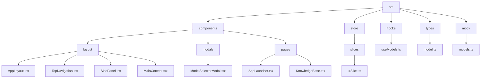
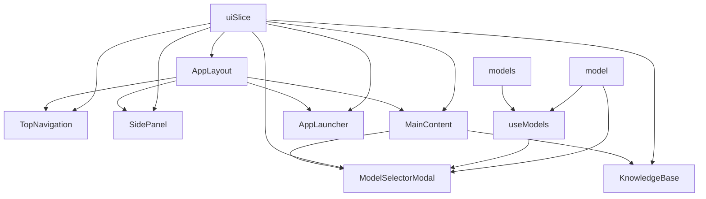
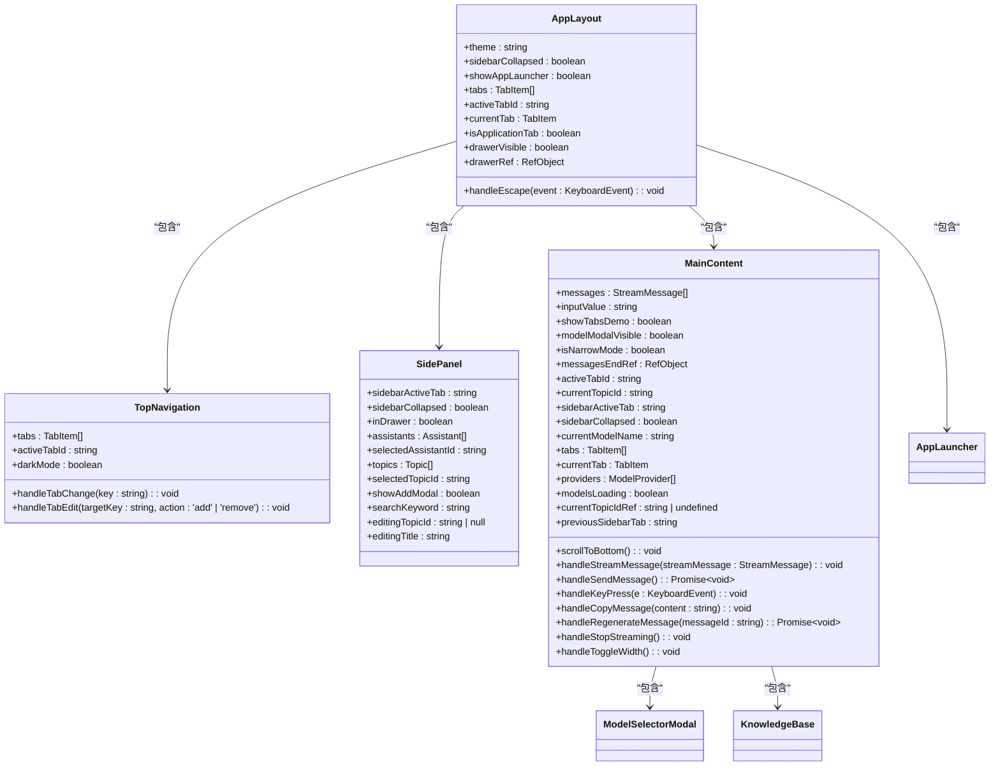
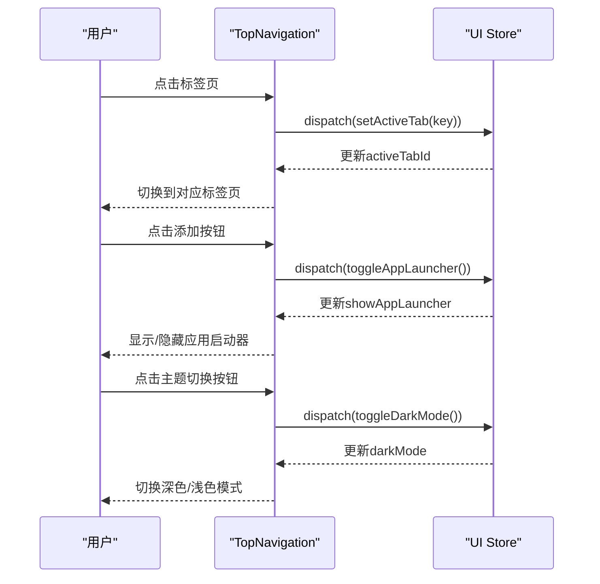
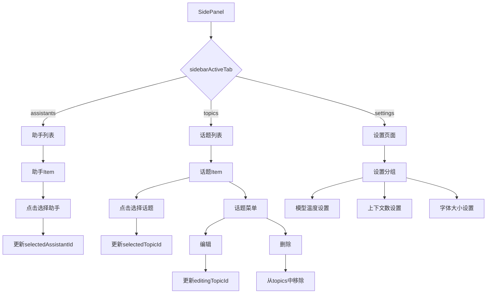
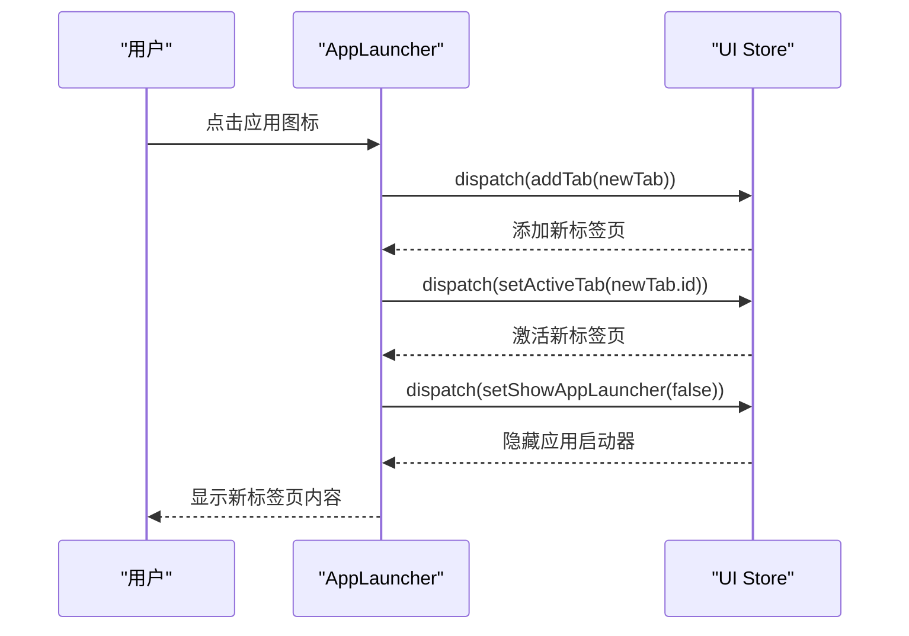
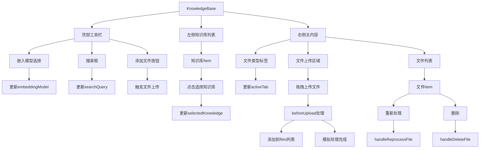
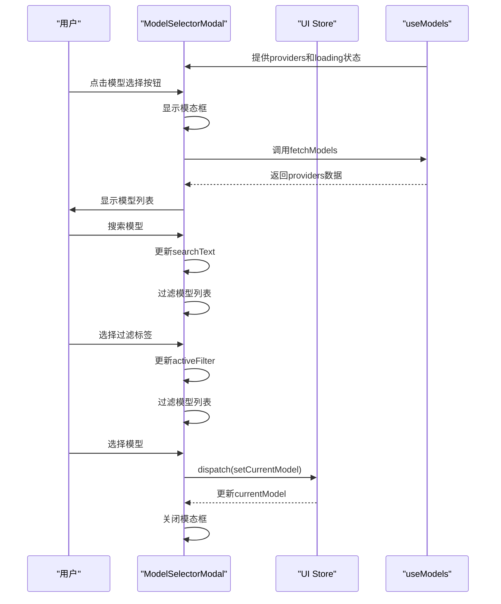
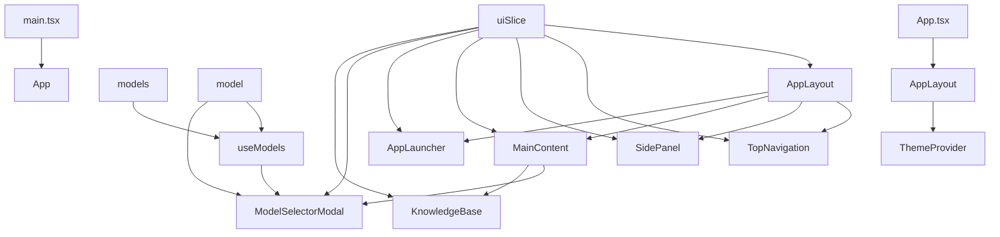

# 组件架构

<cite>
**本文档中引用的文件**  
- [AppLayout.tsx](file://src/components/layout/AppLayout.tsx)
- [TopNavigation.tsx](file://src/components/layout/TopNavigation.tsx)
- [SidePanel.tsx](file://src/components/layout/SidePanel.tsx)
- [MainContent.tsx](file://src/components/layout/MainContent.tsx)
- [AppLauncher.tsx](file://src/components/pages/AppLauncher.tsx)
- [KnowledgeBase.tsx](file://src/components/pages/KnowledgeBase.tsx)
- [ModelSelectorModal.tsx](file://src/components/modals/ModelSelectorModal.tsx)
- [uiSlice.ts](file://src/store/slices/uiSlice.ts)
- [useModels.ts](file://src/hooks/useModels.ts)
- [models.ts](file://src/mock/models.ts)
- [model.ts](file://src/types/model.ts)
- [App.tsx](file://src/App.tsx)
</cite>

## 目录
1. [简介](#简介)
2. [项目结构](#项目结构)
3. [核心组件](#核心组件)
4. [架构概览](#架构概览)
5. [详细组件分析](#详细组件分析)
6. [依赖分析](#依赖分析)
7. [性能考虑](#性能考虑)
8. [故障排除指南](#故障排除指南)
9. [结论](#结论)

## 简介
本文档深入分析前端组件架构设计，重点描述AppLayout作为主布局容器如何协调TopNavigation、SidePanel和MainContent三个核心布局组件。解释SidePanel用于展示话题与助手列表、TopNavigation处理导航逻辑、MainContent承载动态内容的职责划分。说明页面组件AppLauncher和KnowledgeBase的功能定位及其在路由结构中的角色。剖析模态框ModelSelectorModal的触发机制与UI交互模式。结合JSX结构和props传递方式，展示组件间的通信关系，并提供组件复用的最佳实践建议。

## 项目结构



**图示来源**
- [AppLayout.tsx](file://src/components/layout/AppLayout.tsx)
- [TopNavigation.tsx](file://src/components/layout/TopNavigation.tsx)
- [SidePanel.tsx](file://src/components/layout/SidePanel.tsx)
- [MainContent.tsx](file://src/components/layout/MainContent.tsx)
- [AppLauncher.tsx](file://src/components/pages/AppLauncher.tsx)
- [KnowledgeBase.tsx](file://src/components/pages/KnowledgeBase.tsx)
- [ModelSelectorModal.tsx](file://src/components/modals/ModelSelectorModal.tsx)
- [uiSlice.ts](file://src/store/slices/uiSlice.ts)
- [useModels.ts](file://src/hooks/useModels.ts)
- [models.ts](file://src/mock/models.ts)
- [model.ts](file://src/types/model.ts)

**章节来源**
- [AppLayout.tsx](file://src/components/layout/AppLayout.tsx)
- [TopNavigation.tsx](file://src/components/layout/TopNavigation.tsx)
- [SidePanel.tsx](file://src/components/layout/SidePanel.tsx)
- [MainContent.tsx](file://src/components/layout/MainContent.tsx)
- [AppLauncher.tsx](file://src/components/pages/AppLauncher.tsx)
- [KnowledgeBase.tsx](file://src/components/pages/KnowledgeBase.tsx)
- [ModelSelectorModal.tsx](file://src/components/modals/ModelSelectorModal.tsx)
- [uiSlice.ts](file://src/store/slices/uiSlice.ts)
- [useModels.ts](file://src/hooks/useModels.ts)
- [models.ts](file://src/mock/models.ts)
- [model.ts](file://src/types/model.ts)

## 核心组件

本文档深入分析前端组件架构设计，重点描述AppLayout作为主布局容器如何协调TopNavigation、SidePanel和MainContent三个核心布局组件。解释SidePanel用于展示话题与助手列表、TopNavigation处理导航逻辑、MainContent承载动态内容的职责划分。说明页面组件AppLauncher和KnowledgeBase的功能定位及其在路由结构中的角色。剖析模态框ModelSelectorModal的触发机制与UI交互模式。结合JSX结构和props传递方式，展示组件间的通信关系，并提供组件复用的最佳实践建议。

**章节来源**
- [AppLayout.tsx](file://src/components/layout/AppLayout.tsx)
- [TopNavigation.tsx](file://src/components/layout/TopNavigation.tsx)
- [SidePanel.tsx](file://src/components/layout/SidePanel.tsx)
- [MainContent.tsx](file://src/components/layout/MainContent.tsx)
- [AppLauncher.tsx](file://src/components/pages/AppLauncher.tsx)
- [KnowledgeBase.tsx](file://src/components/pages/KnowledgeBase.tsx)
- [ModelSelectorModal.tsx](file://src/components/modals/ModelSelectorModal.tsx)
- [uiSlice.ts](file://src/store/slices/uiSlice.ts)
- [useModels.ts](file://src/hooks/useModels.ts)
- [models.ts](file://src/mock/models.ts)
- [model.ts](file://src/types/model.ts)

## 架构概览



**图示来源**
- [AppLayout.tsx](file://src/components/layout/AppLayout.tsx)
- [TopNavigation.tsx](file://src/components/layout/TopNavigation.tsx)
- [SidePanel.tsx](file://src/components/layout/SidePanel.tsx)
- [MainContent.tsx](file://src/components/layout/MainContent.tsx)
- [AppLauncher.tsx](file://src/components/pages/AppLauncher.tsx)
- [KnowledgeBase.tsx](file://src/components/pages/KnowledgeBase.tsx)
- [ModelSelectorModal.tsx](file://src/components/modals/ModelSelectorModal.tsx)
- [uiSlice.ts](file://src/store/slices/uiSlice.ts)
- [useModels.ts](file://src/hooks/useModels.ts)
- [models.ts](file://src/mock/models.ts)
- [model.ts](file://src/types/model.ts)

## 详细组件分析

### AppLayout分析

AppLayout作为主布局容器，负责协调TopNavigation、SidePanel和MainContent三个核心布局组件。它通过Redux状态管理来控制不同布局的显示与隐藏。



**图示来源**
- [AppLayout.tsx](file://src/components/layout/AppLayout.tsx)
- [TopNavigation.tsx](file://src/components/layout/TopNavigation.tsx)
- [SidePanel.tsx](file://src/components/layout/SidePanel.tsx)
- [MainContent.tsx](file://src/components/layout/MainContent.tsx)
- [AppLauncher.tsx](file://src/components/pages/AppLauncher.tsx)
- [KnowledgeBase.tsx](file://src/components/pages/KnowledgeBase.tsx)
- [ModelSelectorModal.tsx](file://src/components/modals/ModelSelectorModal.tsx)

**章节来源**
- [AppLayout.tsx](file://src/components/layout/AppLayout.tsx)
- [TopNavigation.tsx](file://src/components/layout/TopNavigation.tsx)
- [SidePanel.tsx](file://src/components/layout/SidePanel.tsx)
- [MainContent.tsx](file://src/components/layout/MainContent.tsx)
- [AppLauncher.tsx](file://src/components/pages/AppLauncher.tsx)
- [KnowledgeBase.tsx](file://src/components/pages/KnowledgeBase.tsx)
- [ModelSelectorModal.tsx](file://src/components/modals/ModelSelectorModal.tsx)

### TopNavigation分析

TopNavigation组件处理导航逻辑，包含标签页管理和主题切换功能。



**图示来源**
- [TopNavigation.tsx](file://src/components/layout/TopNavigation.tsx)
- [uiSlice.ts](file://src/store/slices/uiSlice.ts)

**章节来源**
- [TopNavigation.tsx](file://src/components/layout/TopNavigation.tsx)
- [uiSlice.ts](file://src/store/slices/uiSlice.ts)

### SidePanel分析

SidePanel组件用于展示话题与助手列表，提供用户与应用的交互入口。



**图示来源**
- [SidePanel.tsx](file://src/components/layout/SidePanel.tsx)

**章节来源**
- [SidePanel.tsx](file://src/components/layout/SidePanel.tsx)

### MainContent分析

MainContent组件承载动态内容，根据当前标签页类型显示不同内容。

```mermaid
flowchart TD
A[MainContent] --> B{currentTab.type}
B --> |chat| C[聊天界面]
B --> |knowledge| D[知识库]
B --> |assistant| E[智能体]
C --> F[消息区域]
F --> G[显示消息列表]
F --> H[滚动到底部]
C --> I[输入区域]
I --> J[输入消息]
J --> K[发送消息]
K --> L[调用streamingChat.sendMessageMock]
C --> M[工具栏]
M --> N[切换侧边栏]
N --> O[dispatch(toggleSidebar)]
M --> P[打开模型选择器]
P --> Q[setModelModalVisible(true)]
D --> R[KnowledgeBase组件]
E --> S[智能体开发中提示]
Q --> T[ModelSelectorModal]
T --> U[选择模型]
U --> V[dispatch(setCurrentModel)]
```

**图示来源**
- [MainContent.tsx](file://src/components/layout/MainContent.tsx)
- [KnowledgeBase.tsx](file://src/components/pages/KnowledgeBase.tsx)
- [ModelSelectorModal.tsx](file://src/components/modals/ModelSelectorModal.tsx)
- [uiSlice.ts](file://src/store/slices/uiSlice.ts)

**章节来源**
- [MainContent.tsx](file://src/components/layout/MainContent.tsx)
- [KnowledgeBase.tsx](file://src/components/pages/KnowledgeBase.tsx)
- [ModelSelectorModal.tsx](file://src/components/modals/ModelSelectorModal.tsx)
- [uiSlice.ts](file://src/store/slices/uiSlice.ts)

### AppLauncher分析

AppLauncher组件作为应用启动器，提供快速访问各种应用的入口。



**图示来源**
- [AppLauncher.tsx](file://src/components/pages/AppLauncher.tsx)
- [uiSlice.ts](file://src/store/slices/uiSlice.ts)

**章节来源**
- [AppLauncher.tsx](file://src/components/pages/AppLauncher.tsx)
- [uiSlice.ts](file://src/store/slices/uiSlice.ts)

### KnowledgeBase分析

KnowledgeBase组件用于管理知识库中的文件和内容。



**图示来源**
- [KnowledgeBase.tsx](file://src/components/pages/KnowledgeBase.tsx)

**章节来源**
- [KnowledgeBase.tsx](file://src/components/pages/KnowledgeBase.tsx)

### ModelSelectorModal分析

ModelSelectorModal组件提供AI模型选择功能。



**图示来源**
- [ModelSelectorModal.tsx](file://src/components/modals/ModelSelectorModal.tsx)
- [useModels.ts](file://src/hooks/useModels.ts)
- [uiSlice.ts](file://src/store/slices/uiSlice.ts)
- [models.ts](file://src/mock/models.ts)
- [model.ts](file://src/types/model.ts)

**章节来源**
- [ModelSelectorModal.tsx](file://src/components/modals/ModelSelectorModal.tsx)
- [useModels.ts](file://src/hooks/useModels.ts)
- [uiSlice.ts](file://src/store/slices/uiSlice.ts)
- [models.ts](file://src/mock/models.ts)
- [model.ts](file://src/types/model.ts)

## 依赖分析



**图示来源**
- [AppLayout.tsx](file://src/components/layout/AppLayout.tsx)
- [TopNavigation.tsx](file://src/components/layout/TopNavigation.tsx)
- [SidePanel.tsx](file://src/components/layout/SidePanel.tsx)
- [MainContent.tsx](file://src/components/layout/MainContent.tsx)
- [AppLauncher.tsx](file://src/components/pages/AppLauncher.tsx)
- [KnowledgeBase.tsx](file://src/components/pages/KnowledgeBase.tsx)
- [ModelSelectorModal.tsx](file://src/components/modals/ModelSelectorModal.tsx)
- [uiSlice.ts](file://src/store/slices/uiSlice.ts)
- [useModels.ts](file://src/hooks/useModels.ts)
- [models.ts](file://src/mock/models.ts)
- [model.ts](file://src/types/model.ts)
- [App.tsx](file://src/App.tsx)
- [main.tsx](file://src/main.tsx)

**章节来源**
- [AppLayout.tsx](file://src/components/layout/AppLayout.tsx)
- [TopNavigation.tsx](file://src/components/layout/TopNavigation.tsx)
- [SidePanel.tsx](file://src/components/layout/SidePanel.tsx)
- [MainContent.tsx](file://src/components/layout/MainContent.tsx)
- [AppLauncher.tsx](file://src/components/pages/AppLauncher.tsx)
- [KnowledgeBase.tsx](file://src/components/pages/KnowledgeBase.tsx)
- [ModelSelectorModal.tsx](file://src/components/modals/ModelSelectorModal.tsx)
- [uiSlice.ts](file://src/store/slices/uiSlice.ts)
- [useModels.ts](file://src/hooks/useModels.ts)
- [models.ts](file://src/mock/models.ts)
- [model.ts](file://src/types/model.ts)
- [App.tsx](file://src/App.tsx)
- [main.tsx](file://src/main.tsx)

## 性能考虑

本文档分析的组件架构在性能方面有以下考虑：

1. **状态管理优化**：使用Redux进行全局状态管理，避免不必要的组件重渲染。
2. **懒加载**：通过条件渲染实现不同页面的懒加载，如AppLauncher和KnowledgeBase只在需要时显示。
3. **虚拟滚动**：在SidePanel和MainContent中使用虚拟滚动技术，提高大量数据渲染性能。
4. **防抖处理**：在搜索功能中使用防抖技术，减少不必要的计算和渲染。
5. **资源预加载**：在应用启动时预加载常用资源，提高用户体验。
6. **代码分割**：通过React的代码分割功能，按需加载组件，减少初始加载时间。

**章节来源**
- [AppLayout.tsx](file://src/components/layout/AppLayout.tsx)
- [TopNavigation.tsx](file://src/components/layout/TopNavigation.tsx)
- [SidePanel.tsx](file://src/components/layout/SidePanel.tsx)
- [MainContent.tsx](file://src/components/layout/MainContent.tsx)
- [AppLauncher.tsx](file://src/components/pages/AppLauncher.tsx)
- [KnowledgeBase.tsx](file://src/components/pages/KnowledgeBase.tsx)
- [ModelSelectorModal.tsx](file://src/components/modals/ModelSelectorModal.tsx)

## 故障排除指南

### 常见问题及解决方案

1. **应用启动器无法显示**
   - 检查`uiSlice`中的`showAppLauncher`状态是否正确更新
   - 确认`AppLayout`中的条件渲染逻辑是否正确

2. **模型选择器无法加载模型**
   - 检查`useModels`钩子是否正确调用`fetchModels`函数
   - 确认`mockProviders`数据是否正确导入

3. **侧边栏抽屉无法打开**
   - 检查`AppLayout`中的`drawerVisible`状态是否正确更新
   - 确认`onDrawerOpen`回调函数是否正确传递

4. **聊天消息无法发送**
   - 检查`MainContent`中的`handleSendMessage`函数是否正确调用`streamingChat.sendMessageMock`
   - 确认输入框内容是否正确绑定到`inputValue`状态

5. **知识库文件上传失败**
   - 检查`beforeUpload`函数中的文件类型和大小验证逻辑
   - 确认`uploadProps`配置是否正确

**章节来源**
- [AppLayout.tsx](file://src/components/layout/AppLayout.tsx)
- [TopNavigation.tsx](file://src/components/layout/TopNavigation.tsx)
- [SidePanel.tsx](file://src/components/layout/SidePanel.tsx)
- [MainContent.tsx](file://src/components/layout/MainContent.tsx)
- [AppLauncher.tsx](file://src/components/pages/AppLauncher.tsx)
- [KnowledgeBase.tsx](file://src/components/pages/KnowledgeBase.tsx)
- [ModelSelectorModal.tsx](file://src/components/modals/ModelSelectorModal.tsx)
- [uiSlice.ts](file://src/store/slices/uiSlice.ts)
- [useModels.ts](file://src/hooks/useModels.ts)

## 结论

本文档深入分析了前端组件架构设计，重点描述了AppLayout作为主布局容器如何协调TopNavigation、SidePanel和MainContent三个核心布局组件。通过详细的组件分析和图示，展示了各组件的职责划分、通信关系和交互模式。同时，提供了性能优化建议和故障排除指南，为后续开发和维护提供了有价值的参考。