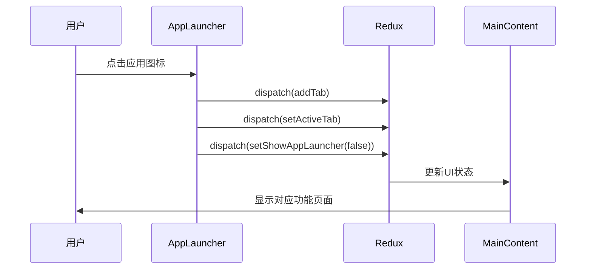
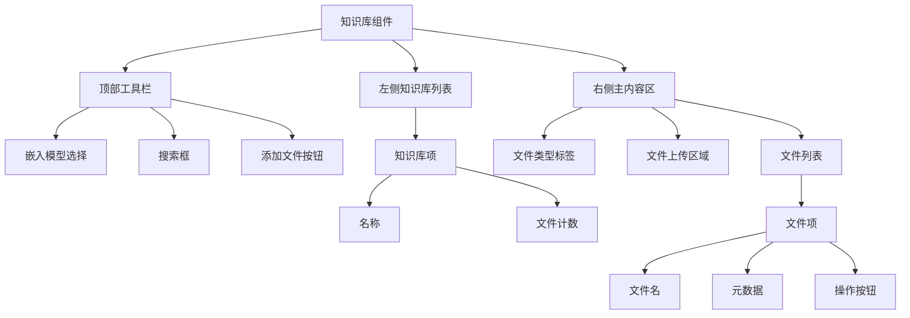
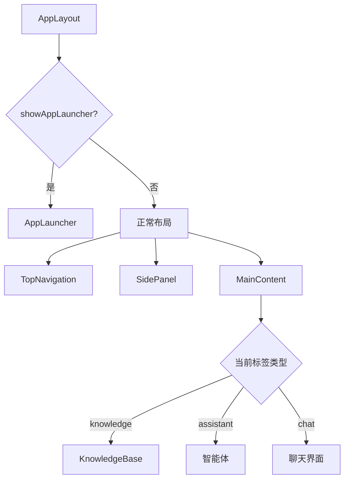
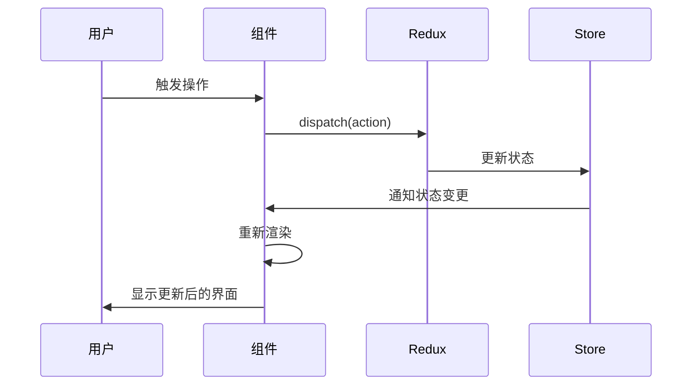

# 页面组件

<cite>
**本文档引用的文件**
- [AppLauncher.tsx](file://src/components/pages/AppLauncher.tsx)
- [KnowledgeBase.tsx](file://src/components/pages/KnowledgeBase.tsx)
- [AppLayout.tsx](file://src/components/layout/AppLayout.tsx)
- [MainContent.tsx](file://src/components/layout/MainContent.tsx)
- [uiSlice.ts](file://src/store/slices/uiSlice.ts)
- [redux.ts](file://src/hooks/redux.ts)
- [index.ts](file://src/store/index.ts)
</cite>

## 目录
1. [AppLauncher 组件分析](#applauncher-组件分析)
2. [KnowledgeBase 组件分析](#knowledgebase-组件分析)
3. [路由与布局关系](#路由与布局关系)
4. [状态管理与数据流](#状态管理与数据流)
5. [生命周期与用户交互](#生命周期与用户交互)
6. [最佳实践建议](#最佳实践建议)

## AppLauncher 组件分析

AppLauncher 组件作为应用的启动入口，提供了一个全屏的应用选择界面，引导用户快速开始使用核心功能。该组件通过网格布局展示多个应用图标，包括知识库、小程序、绘画、智能体、翻译、文件、代码和笔记等。

当用户点击某个应用时，组件会创建一个新的标签页并将其添加到标签页集合中，同时激活该标签页。在完成这些操作后，应用启动器会被隐藏，用户将被引导到正常的应用布局界面。这种设计模式提供了一个直观的导航入口，使新用户能够快速了解和访问系统的主要功能。

**图表来源**
- [AppLauncher.tsx](file://src/components/pages/AppLauncher.tsx#L158-L198)
- [uiSlice.ts](file://src/store/slices/uiSlice.ts#L110-L128)
- [MainContent.tsx](file://src/components/layout/MainContent.tsx#L280-L300)

**本节来源**
- [AppLauncher.tsx](file://src/components/pages/AppLauncher.tsx#L104-L159)
- [uiSlice.ts](file://src/store/slices/uiSlice.ts#L89-L148)

## KnowledgeBase 组件分析

KnowledgeBase 组件实现了完整的知识库管理功能，包括文件上传、文档列表展示和操作交互。该组件采用左右分栏布局，左侧显示知识库列表，右侧显示当前选中知识库的文件内容。

组件支持多种文件类型（文件、笔记、目录、网址、网站）的分类管理，用户可以通过标签页在不同类型间切换。文件上传功能支持拖拽操作，并对文件格式和大小进行验证。每个文件条目都提供了重新处理、状态显示和删除等操作按钮，实现了完整的文件管理生命周期。

**图表来源**
- [KnowledgeBase.tsx](file://src/components/pages/KnowledgeBase.tsx#L355-L405)
- [KnowledgeBase.tsx](file://src/components/pages/KnowledgeBase.tsx#L569-L611)

**本节来源**
- [KnowledgeBase.tsx](file://src/components/pages/KnowledgeBase.tsx#L355-L405)
- [KnowledgeBase.tsx](file://src/components/pages/KnowledgeBase.tsx#L642-L678)

## 路由与布局关系

页面组件在路由系统中的定位通过AppLayout组件实现。AppLayout作为应用的根布局组件，根据Redux状态中的showAppLauncher标志来决定渲染应用启动器还是正常布局。

当showAppLauncher为true时，显示全屏的AppLauncher组件；否则显示包含侧边栏和主内容区的正常布局。MainContent组件根据当前活动标签页的类型来决定渲染哪个页面组件，实现了基于标签页类型的动态路由功能。

**图表来源**
- [AppLayout.tsx](file://src/components/layout/AppLayout.tsx#L84-L129)
- [MainContent.tsx](file://src/components/layout/MainContent.tsx#L280-L300)

**本节来源**
- [AppLayout.tsx](file://src/components/layout/AppLayout.tsx#L58-L87)
- [MainContent.tsx](file://src/components/layout/MainContent.tsx#L280-L300)

## 状态管理与数据流

页面组件通过Redux进行状态管理，使用useAppSelector和useAppDispatch钩子从全局状态获取数据和派发动作。AppLauncher和KnowledgeBase组件都依赖于uiSlice中的状态，如标签页集合、活动标签ID和应用启动器显示状态。

数据流遵循单向数据流原则：用户操作触发事件处理函数，处理函数派发Redux动作，Redux更新状态，组件重新渲染。这种模式确保了状态的一致性和可预测性，便于调试和测试。

**图表来源**
- [redux.ts](file://src/hooks/redux.ts#L5-L6)
- [uiSlice.ts](file://src/store/slices/uiSlice.ts#L0-L52)
- [index.ts](file://src/store/index.ts#L1-L26)

**本节来源**
- [AppLauncher.tsx](file://src/components/pages/AppLauncher.tsx#L158-L198)
- [MainContent.tsx](file://src/components/layout/MainContent.tsx#L280-L300)

## 生命周期与用户交互

页面组件的生命周期管理通过React的useState和useEffect钩子实现。AppLauncher组件在用户点击应用时触发标签页创建和切换的完整流程，而KnowledgeBase组件则管理文件上传、处理和删除的完整生命周期。

用户交互响应机制包括点击事件、键盘事件和拖拽事件的处理。例如，KnowledgeBase组件中的文件上传支持拖拽操作，而AppLauncher组件中的应用图标支持点击和悬停效果。这些交互设计提升了用户体验，使操作更加直观和高效。

**本节来源**
- [AppLauncher.tsx](file://src/components/pages/AppLauncher.tsx#L158-L198)
- [KnowledgeBase.tsx](file://src/components/pages/KnowledgeBase.tsx#L355-L405)

## 最佳实践建议

1. **状态管理**: 将共享状态提升到Redux，避免组件间直接传递复杂状态
2. **组件拆分**: 将复杂组件拆分为更小的、可复用的子组件，提高可维护性
3. **性能优化**: 使用React.memo和useCallback避免不必要的重新渲染
4. **错误处理**: 在异步操作中添加适当的错误处理和用户反馈
5. **可访问性**: 确保所有交互元素都有适当的键盘支持和ARIA标签
6. **响应式设计**: 使用媒体查询和弹性布局确保在不同设备上的良好体验
7. **代码组织**: 按功能组织文件结构，保持相关代码的紧密性
8. **类型安全**: 充分利用TypeScript的类型系统，减少运行时错误

**本节来源**
- [AppLauncher.tsx](file://src/components/pages/AppLauncher.tsx#L0-L198)
- [KnowledgeBase.tsx](file://src/components/pages/KnowledgeBase.tsx#L0-L678)
- [MainContent.tsx](file://src/components/layout/MainContent.tsx#L0-L723)