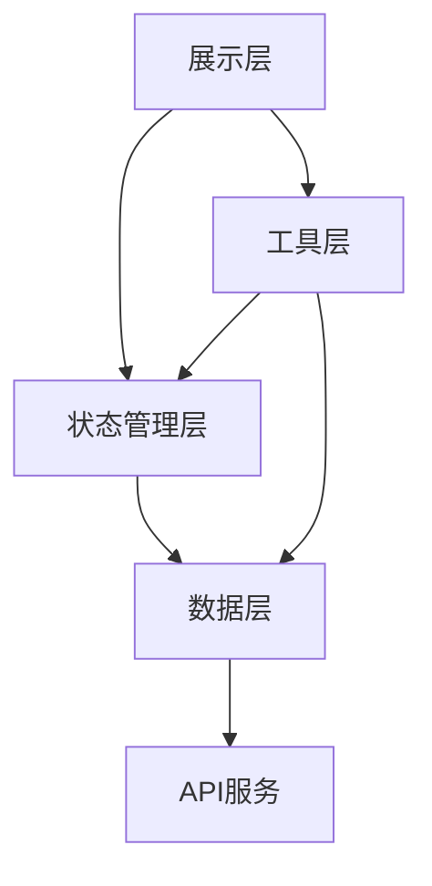
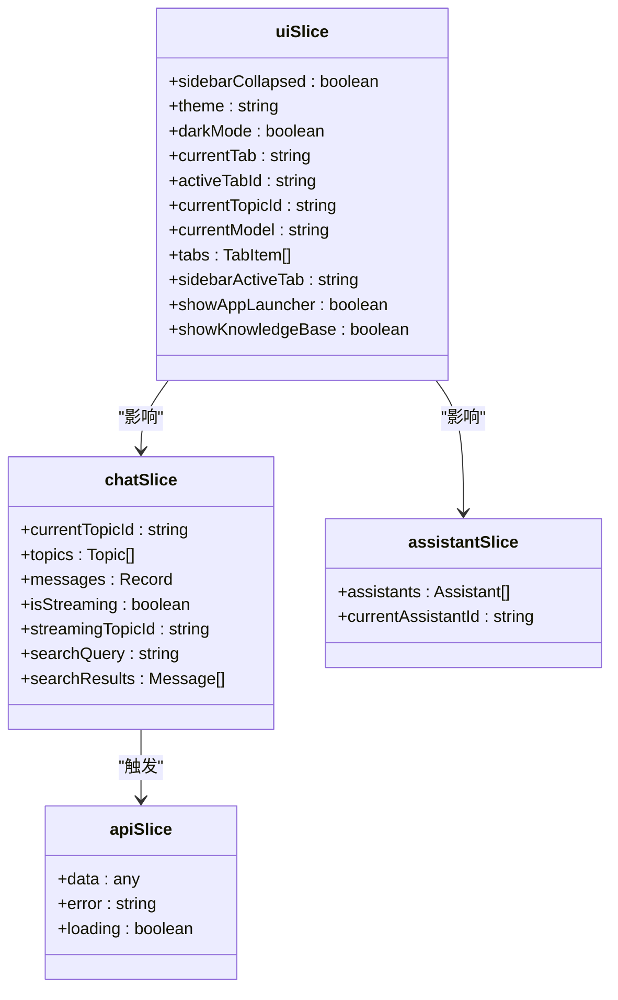
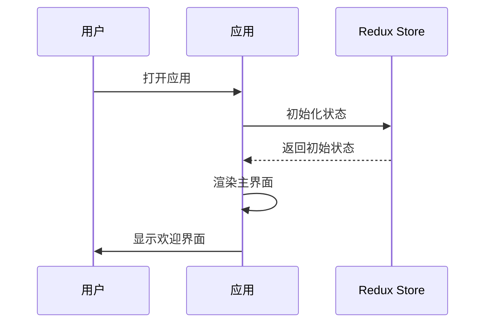
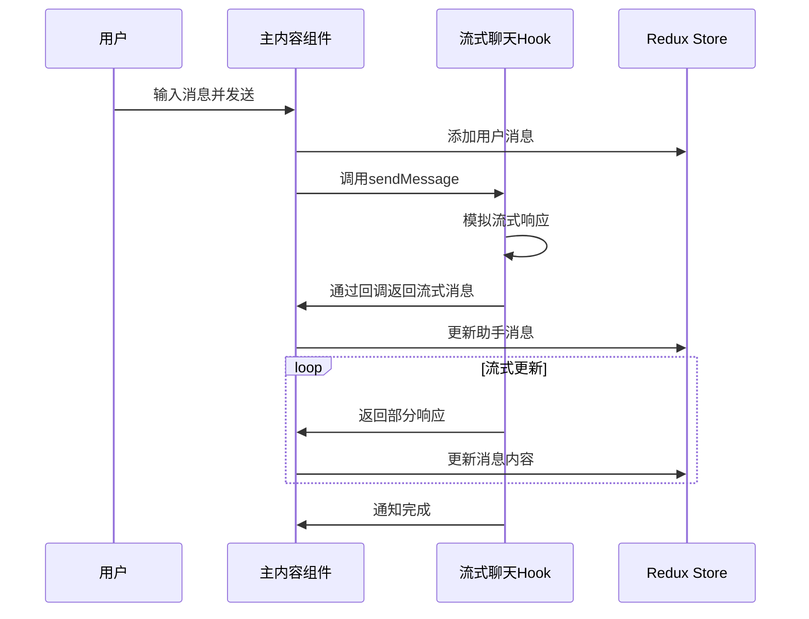
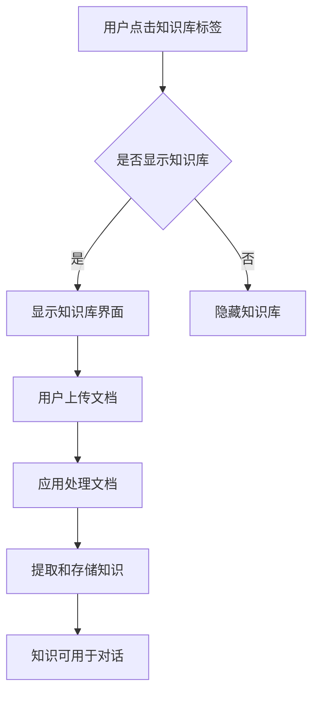
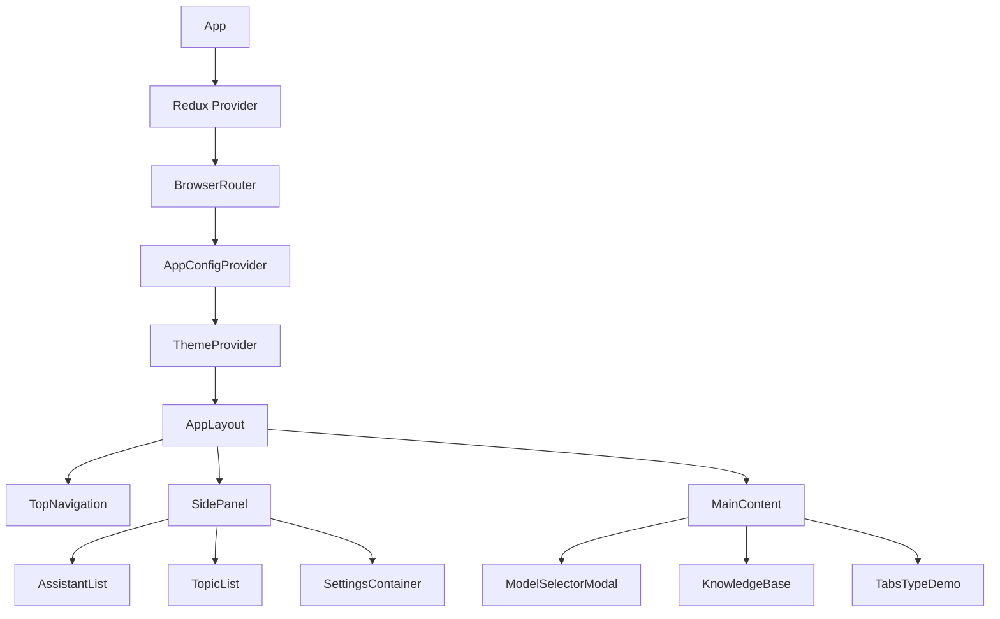

# 项目概述

<cite>
**本文档引用的文件**  
- [README.md](file://README.md)
- [package.json](file://package.json)
- [main.tsx](file://src/main.tsx)
- [App.tsx](file://src/App.tsx)
- [AppLayout.tsx](file://src/components/layout/AppLayout.tsx)
- [TopNavigation.tsx](file://src/components/layout/TopNavigation.tsx)
- [SidePanel.tsx](file://src/components/layout/SidePanel.tsx)
- [MainContent.tsx](file://src/components/layout/MainContent.tsx)
- [ModelSelectorModal.tsx](file://src/components/modals/ModelSelectorModal.tsx)
- [uiSlice.ts](file://src/store/slices/uiSlice.ts)
- [chatSlice.ts](file://src/store/slices/chatSlice.ts)
- [useModels.ts](file://src/hooks/useModels.ts)
- [models.ts](file://src/mock/models.ts)
</cite>

## 目录
1. [简介](#简介)
2. [项目结构](#项目结构)
3. [核心功能](#核心功能)
4. [技术架构](#技术架构)
5. [状态管理](#状态管理)
6. [关键工作流程](#关键工作流程)
7. [组件关系](#组件关系)
8. [结论](#结论)

## 简介
ai-writer-frontend 是一个基于 React 19 的 AI 写作助手前端应用，旨在为用户提供强大的多模型对话、知识管理与个性化设置功能。该项目采用现代化的前端技术栈，包括 Redux Toolkit 进行状态管理、Tailwind CSS 实现响应式设计、Vite 作为构建工具。应用支持多标签对话、模型选择、知识库管理、话题管理与界面设置等核心功能，为用户提供灵活的 AI 交互体验。

**Section sources**
- [README.md](file://README.md)
- [package.json](file://package.json)

## 项目结构
项目采用模块化设计，主要目录结构如下：
- `src/components`：存放所有 UI 组件，按功能分为 common（通用组件）、layout（布局组件）、modals（模态框）、pages（页面组件）
- `src/hooks`：自定义 React Hooks，包括 Redux 状态钩子和业务逻辑钩子
- `src/store`：Redux 状态管理，包含多个 slice 来管理不同领域的状态
- `src/types`：类型定义文件
- `src/mock`：模拟数据，用于开发和测试

**Section sources**
- [project_structure](file://project_structure)

## 核心功能
### 多标签对话
应用支持多标签页对话管理，用户可以在不同标签间切换，每个标签代表一个独立的对话会话。通过顶部导航栏的标签页组件实现，支持标签的添加、关闭和重命名。

### 模型选择
用户可以通过模型选择器模态框切换不同的 AI 模型。支持按提供商（Anthropic、通义千问、DeepSeek 等）和能力（视觉、推理、工具、联网）进行过滤，提供直观的模型选择体验。

### 知识库管理
应用提供知识库管理功能，用户可以在专门的知识库标签页中管理和查看知识内容。该功能通过路由和条件渲染实现，当用户选择知识库标签时显示相应的知识库界面。

### 话题管理
用户可以创建、重命名和删除对话话题，每个话题关联一组对话消息。话题管理功能集成在侧边栏中，支持通过右键菜单进行操作。

### 界面设置
应用提供丰富的界面设置选项，包括助手设置、消息设置、数学公式设置、代码块设置和输入设置，允许用户根据个人偏好定制使用体验。

**Section sources**
- [uiSlice.ts](file://src/store/slices/uiSlice.ts)
- [SidePanel.tsx](file://src/components/layout/SidePanel.tsx)
- [ModelSelectorModal.tsx](file://src/components/modals/ModelSelectorModal.tsx)
- [MainContent.tsx](file://src/components/layout/MainContent.tsx)

## 技术架构
### 技术选型
- **React 19**：作为核心 UI 库，利用其最新的特性提供高性能的用户界面
- **Redux Toolkit**：用于全局状态管理，简化 Redux 的使用，提供更好的开发体验
- **Tailwind CSS**：实用优先的 CSS 框架，实现快速、响应式的界面开发
- **Vite**：现代化的前端构建工具，提供快速的开发服务器和高效的生产构建
- **Ant Design**：企业级 UI 组件库，提供丰富的组件和主题定制能力
- **styled-components**：CSS-in-JS 解决方案，实现组件样式的封装和动态化

### 架构设计
应用采用分层架构设计：
1. **展示层**：由 React 组件构成，负责 UI 的渲染和用户交互
2. **状态管理层**：由 Redux Toolkit 实现，管理应用的全局状态
3. **数据层**：包括 API 调用和本地数据管理
4. **工具层**：包含自定义 Hooks 和工具函数

**Diagram sources**
- [package.json](file://package.json)
- [App.tsx](file://src/App.tsx)

## 状态管理
### 状态切片设计
应用使用 Redux Toolkit 的 slice 概念将状态划分为多个领域：

**Diagram sources**
- [uiSlice.ts](file://src/store/slices/uiSlice.ts)
- [chatSlice.ts](file://src/store/slices/chatSlice.ts)

### 状态关系
- `uiSlice` 管理用户界面状态，如侧边栏展开状态、当前主题、活动标签页等
- `chatSlice` 管理聊天相关状态，包括话题、消息、流式传输状态等
- `assistantSlice` 管理助手相关状态
- `apiSlice` 管理 API 调用状态

这些状态切片通过 Redux store 进行整合，组件通过 useSelector 钩子订阅所需的状态，通过 useDispatch 钩子派发动作来更新状态。

**Section sources**
- [store/index.ts](file://src/store/index.ts)
- [uiSlice.ts](file://src/store/slices/uiSlice.ts)
- [chatSlice.ts](file://src/store/slices/chatSlice.ts)

## 关键工作流程
### 新用户启动流程
1. 应用启动，渲染根组件
2. 显示默认的首页标签页
3. 加载默认模型（Claude 3.5 Sonnet）
4. 显示欢迎消息和功能介绍

**Diagram sources**
- [main.tsx](file://src/main.tsx)
- [App.tsx](file://src/App.tsx)
- [uiSlice.ts](file://src/store/slices/uiSlice.ts)

### 聊天交互流程
1. 用户在输入框输入消息
2. 点击发送按钮或按 Enter 键
3. 应用创建用户消息并添加到消息列表
4. 调用流式聊天 Hook 发送消息
5. 接收流式响应并逐段更新消息内容
6. 完成响应后，消息标记为完成状态

**Diagram sources**
- [MainContent.tsx](file://src/components/layout/MainContent.tsx)
- [useStreamingChat.ts](file://src/hooks/useStreamingChat.ts)

### 知识库构建流程
1. 用户点击知识库标签
2. 应用显示知识库页面
3. 用户上传文档或输入知识内容
4. 应用处理并存储知识内容
5. 知识内容可用于后续的对话中

**Diagram sources**
- [AppLayout.tsx](file://src/components/layout/AppLayout.tsx)
- [KnowledgeBase.tsx](file://src/components/pages/KnowledgeBase.tsx)

## 组件关系
### 主要组件结构

**Diagram sources**
- [App.tsx](file://src/App.tsx)
- [AppLayout.tsx](file://src/components/layout/AppLayout.tsx)

### 组件交互
- **App**：根组件，负责应用的整体结构和依赖注入
- **AppLayout**：主布局组件，协调顶部导航、侧边栏和主内容的布局
- **TopNavigation**：顶部导航组件，管理标签页和全局操作
- **SidePanel**：侧边栏组件，提供助手、话题和设置功能
- **MainContent**：主内容区域，显示聊天界面或特定页面
- **ModelSelectorModal**：模型选择模态框，允许用户切换 AI 模型

这些组件通过 Redux 状态进行通信，UI 状态的变化通过 action 派发到 store，其他组件通过 selector 订阅状态变化并重新渲染。

**Section sources**
- [App.tsx](file://src/App.tsx)
- [AppLayout.tsx](file://src/components/layout/AppLayout.tsx)
- [TopNavigation.tsx](file://src/components/layout/TopNavigation.tsx)
- [SidePanel.tsx](file://src/components/layout/SidePanel.tsx)
- [MainContent.tsx](file://src/components/layout/MainContent.tsx)

## 结论
ai-writer-frontend 项目是一个功能丰富、架构清晰的 AI 写作助手前端应用。通过采用现代化的前端技术栈和合理的架构设计，项目实现了高性能、可维护和可扩展的代码结构。应用的核心功能围绕多模型对话、知识管理和个性化设置展开，为用户提供强大的 AI 交互体验。状态管理采用 Redux Toolkit 的 slice 模式，使状态逻辑清晰分离。组件设计遵循单一职责原则，通过 Redux 进行状态共享和通信。整体架构既满足了当前的功能需求，也为未来的功能扩展提供了良好的基础。