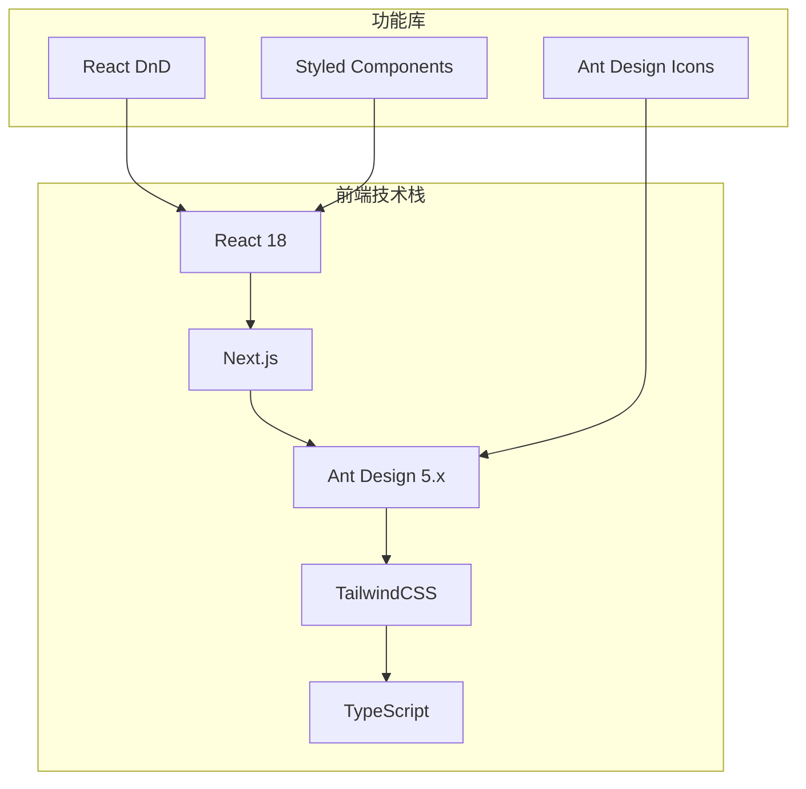
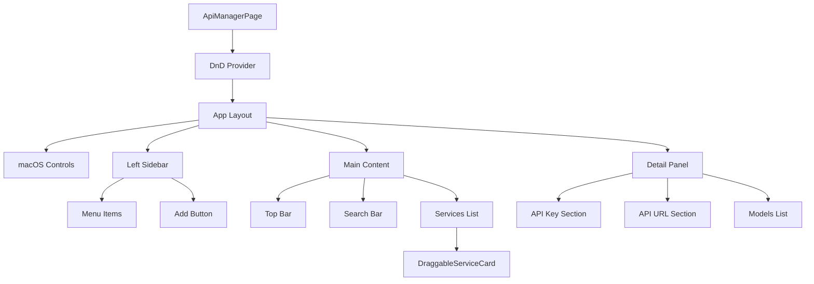
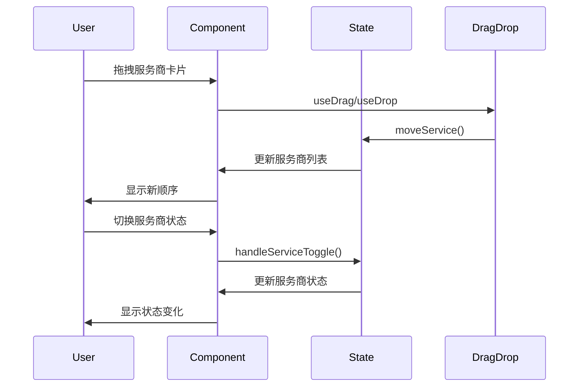

# API 密钥管理界面

一个基于 React 18、Ant Design、TailwindCSS 和 Next.js 构建的企业级 API 密钥管理界面。

## 🚀 功能特性

### 🎨 界面设计
- **深色主题**：采用 #1a1a1a 主背景色的专业深色主题
- **macOS 风格**：顶部红黄绿窗口控制按钮，符合 macOS 设计语言
- **左右布局**：240px 左侧边栏 + 主内容区 + 右侧详情面板

### 🗂️ 左侧边栏功能
- **15个菜单项**：模型服务、默认模型、常规设置等完整功能菜单
- **图标+文字**：每个菜单项都有对应的 Ant Design 图标
- **添加按钮**：底部添加按钮支持扩展功能

### 🔧 API 服务商管理
- **拖拽排序**：支持鼠标拖拽改变服务商顺序
- **状态切换**：绿色开关控制服务商启用/禁用状态
- **实时搜索**：顶部搜索栏支持实时筛选服务商
- **详细信息**：显示每个服务商的模型数量和状态

### 📋 右侧详情面板
- **API 密钥管理**：密码输入框、获取链接、检测功能
- **API 地址配置**：自定义端点地址设置
- **模型列表**：展示和管理各服务商的AI模型
- **操作按钮**：输入、设置、删除等模型操作

### 💼 顶部功能区
- **用户信息**：用户头像和身份显示
- **快捷操作**：余额充值、费用账单按钮

## 🛠️ 技术架构

### 核心技术栈


### 组件架构


### 状态管理设计


## 📦 文件结构

```
src/
├── pages/
│   └── api-manager.tsx          # 主页面组件
├── components/
│   └── api-manager/
│       └── DraggableServiceCard.tsx  # 可拖拽服务商卡片
└── styles/
    └── globals.css              # 全局样式
```

## 🎮 交互功能

### 拖拽排序
- **拖拽手柄**：悬停时显示拖拽图标
- **视觉反馈**：拖拽时卡片半透明+旋转
- **排序逻辑**：基于 React DnD 的专业拖拽实现

### 状态管理
- **React Hooks**：使用 useState、useCallback 管理状态
- **实时更新**：所有操作立即反映在界面上
- **数据持久化**：支持扩展到后端 API

### 响应式设计
- **自适应布局**：flex 布局适配不同屏幕
- **悬停效果**：卡片和按钮的精美过渡动画
- **主题一致性**：统一的深色主题配色方案

## 🚦 使用方法

### 启动应用
```bash
# 访问页面
http://localhost:3000/api-manager
```

### 基本操作
1. **选择服务商**：点击服务商卡片查看详情
2. **拖拽排序**：鼠标拖拽服务商卡片调整顺序
3. **切换状态**：使用开关控制服务商启用状态
4. **配置API**：在右侧面板设置密钥和地址
5. **搜索过滤**：使用顶部搜索框筛选服务商

### 高级功能
- **API 检测**：验证 API 密钥有效性
- **模型管理**：添加、删除、配置AI模型
- **批量操作**：支持多选和批量处理（可扩展）

## 🎨 设计系统

### 颜色规范
```css
--primary: #1a1a1a     /* 主背景 */
--secondary: #2a2a2a   /* 卡片背景 */
--tertiary: #3a3a3a    /* 输入框背景 */
--accent: #6366f1      /* 主题色 */
--success: #10b981     /* 成功色 */
--text-primary: #ffffff    /* 主要文字 */
--text-secondary: #888888  /* 次要文字 */
--text-muted: #666666     /* 辅助文字 */
--border: #404040      /* 边框色 */
```

### 动画规范
- **过渡时间**：0.2s 标准过渡
- **缓动函数**：ease-out 自然缓动
- **悬停效果**：translateY(-2px) 轻微上移
- **拖拽反馈**：opacity + transform 组合

## 🔧 扩展指南

### 添加新服务商
```typescript
const newService: ApiService = {
  id: 'new-provider',
  name: '新服务商',
  logo: 'NEW',
  enabled: false,
  models: []
};
```

### 自定义主题
```typescript
const customTheme = {
  colors: {
    primary: '#your-color',
    // ... 其他颜色
  }
};
```

### 集成后端 API
```typescript
const handleApiKeyDetect = async () => {
  const response = await fetch('/api/validate-key', {
    method: 'POST',
    body: JSON.stringify({ apiKey, provider: selectedService.id })
  });
  // 处理响应
};
```

## 📈 性能优化

- **React.memo**：优化组件重渲染
- **useCallback**：缓存事件处理函数
- **懒加载**：支持大量服务商的虚拟滚动
- **防抖搜索**：搜索输入优化

## 🎯 下一步计划

- [ ] 添加批量操作功能
- [ ] 实现 API 使用统计
- [ ] 集成实际的 API 验证
- [ ] 添加导入/导出配置
- [ ] 支持自定义主题切换
- [ ] 移动端适配优化

---

这是一个完整的企业级 API 密钥管理界面，具备现代化的设计和完善的交互功能。