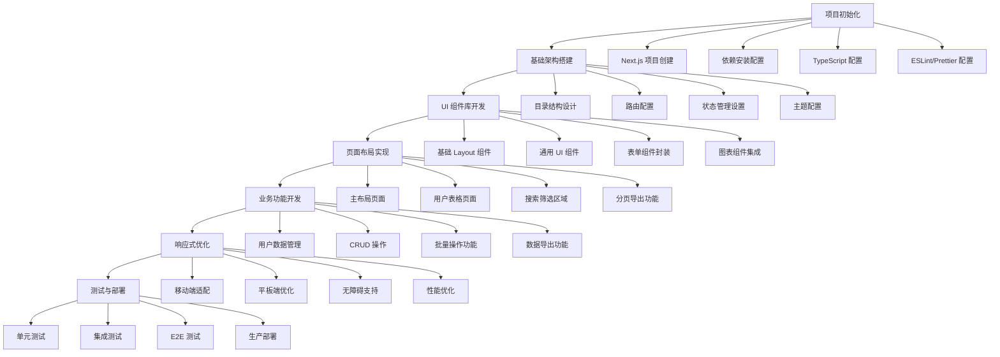
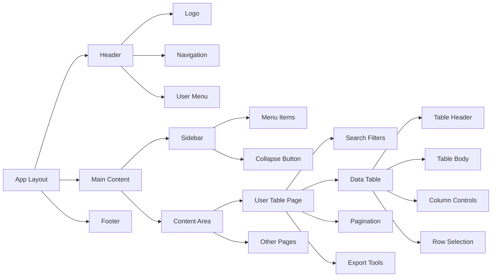
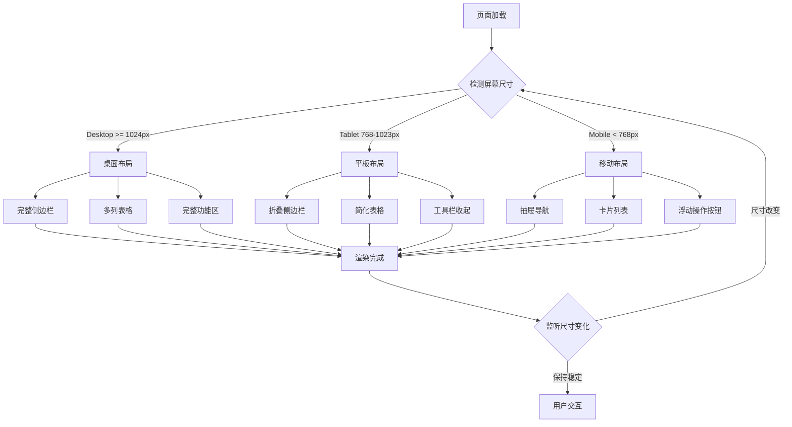
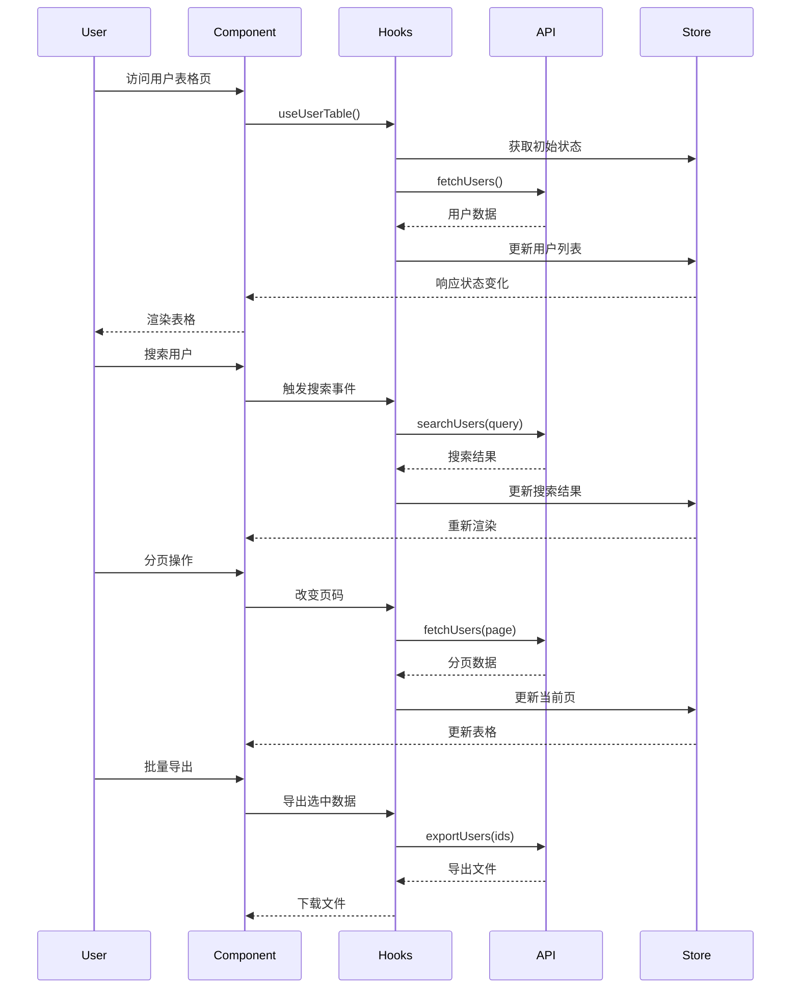
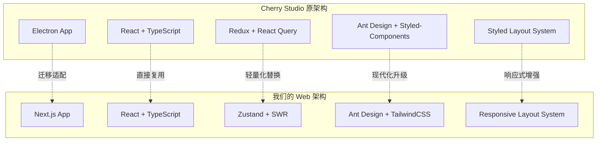

# AI Writer Frontend 开发流程图

## 🔄 总体开发流程

## 🏗️ 架构组件关系图

## 📱 响应式布局流程

## 🔄 用户表格页面数据流

## 🎨 Cherry Studio 架构参考适配

## 📊 关键性能指标

| 指标 | 目标值 | 检测方式 |
|------|--------|----------|
| 首屏加载 | < 2s | Lighthouse |
| 页面切换 | < 200ms | 用户体验测试 |
| 表格渲染 | < 500ms | Performance API |
| 移动端适配 | 100% | 响应式测试 |
| 无障碍 | WCAG AA | axe-core |