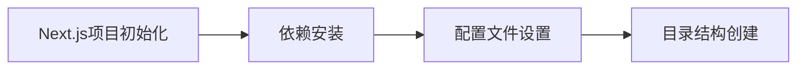
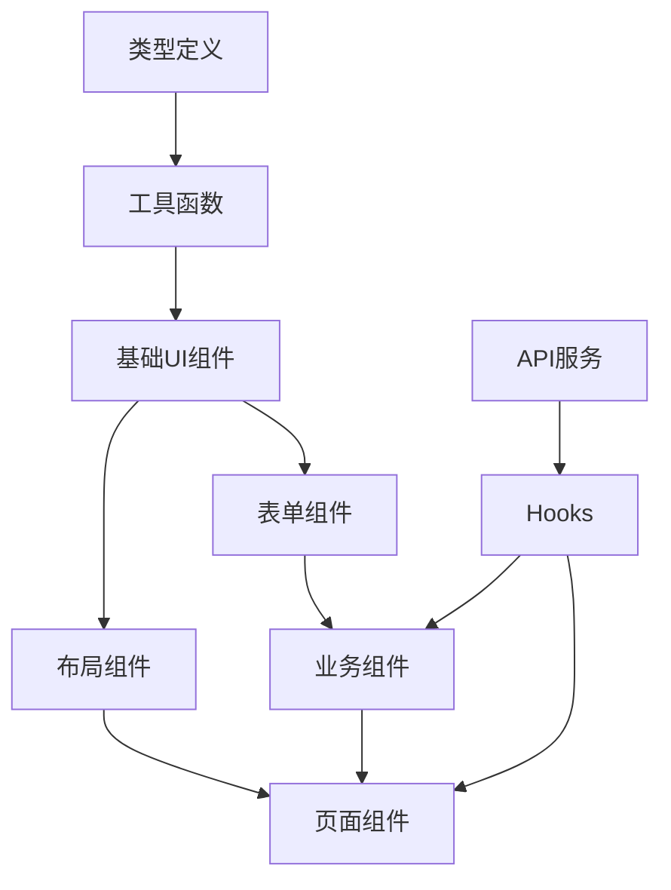

# AI Writer Frontend 开发计划表

## 📋 开发阶段划分（按依赖顺序）

### 🏗️ 第一阶段：基础设施搭建 (Day 1-2)

#### 1.1 项目初始化 (优先级: ⭐⭐⭐⭐⭐)


**任务清单:**
- [ ] 创建 Next.js 项目 `npx create-next-app@latest`
- [ ] 安装核心依赖包
- [ ] 配置 TypeScript、ESLint、Prettier
- [ ] 设置 TailwindCSS + Ant Design 5
- [ ] 创建基础目录结构

**文件依赖顺序:**
1. `package.json` - 依赖管理
2. `next.config.js` - Next.js配置
3. `tailwind.config.js` - 样式配置
4. `tsconfig.json` - TypeScript配置
5. `.eslintrc.json` - 代码检查配置

#### 1.2 类型定义层 (优先级: ⭐⭐⭐⭐⭐)
**原因:** 所有组件和服务都依赖类型定义

**实现顺序:**
1. `src/types/common.ts` - 基础通用类型
2. `src/types/api.ts` - API通用类型
3. `src/types/user.ts` - 用户业务类型
4. `src/types/table.ts` - 表格组件类型
5. `src/types/index.ts` - 类型统一导出

```typescript
// src/types/common.ts - 示例
export interface BaseResponse<T> {
  code: number;
  message: string;
  data: T;
}

export interface PaginationParams {
  page: number;
  pageSize: number;
  total?: number;
}
```

#### 1.3 工具函数层 (优先级: ⭐⭐⭐⭐)
**原因:** 组件层依赖工具函数

**实现顺序:**
1. `src/utils/cn.ts` - className 合并工具
2. `src/utils/constants.ts` - 常量定义
3. `src/utils/format.ts` - 格式化工具
4. `src/utils/validation.ts` - 验证工具
5. `src/utils/date.ts` - 日期工具

### 🎨 第二阶段：UI组件层 (Day 3-5)

#### 2.1 基础UI组件 (优先级: ⭐⭐⭐⭐⭐)
**原因:** 所有复合组件都依赖基础UI组件

**实现顺序:**
1. `src/components/ui/Loading.tsx` - 加载组件
2. `src/components/ui/Empty.tsx` - 空状态组件
3. `src/components/ui/Button.tsx` - 按钮组件
4. `src/components/ui/Input.tsx` - 输入框组件
5. `src/components/ui/Modal.tsx` - 模态框组件
6. `src/components/ui/Table.tsx` - 表格组件
7. `src/components/ui/Pagination.tsx` - 分页组件

```typescript
// src/components/ui/Button.tsx - 示例
interface ButtonProps {
  variant?: 'primary' | 'secondary' | 'danger';
  size?: 'small' | 'medium' | 'large';
  loading?: boolean;
  disabled?: boolean;
  children: React.ReactNode;
  onClick?: () => void;
}

export const Button: React.FC<ButtonProps> = ({ ... }) => {
  // 复用 Ant Design Button，扩展自定义样式
}
```

#### 2.2 布局组件层 (优先级: ⭐⭐⭐⭐)
**原因:** 页面组件依赖布局组件

**实现顺序:**
1. `src/components/layout/Header.tsx` - 顶部导航栏
2. `src/components/layout/Sidebar.tsx` - 侧边栏
3. `src/components/layout/Footer.tsx` - 底部栏
4. `src/components/layout/MobileNav.tsx` - 移动端导航
5. `src/components/layout/AppLayout.tsx` - 主布局组件

### 🔄 第三阶段：服务与状态层 (Day 6-8)

#### 3.1 API服务层 (优先级: ⭐⭐⭐⭐)
**原因:** Hook和状态管理依赖API服务

**实现顺序:**
1. `src/services/api.ts` - API基础配置
2. `src/services/userService.ts` - 用户服务
3. `src/services/exportService.ts` - 导出服务
4. `src/app/api/users/route.ts` - 用户API路由
5. `src/app/api/users/export/route.ts` - 导出API路由

```typescript
// src/services/api.ts - 示例
import axios from 'axios';

export const apiClient = axios.create({
  baseURL: process.env.NEXT_PUBLIC_API_URL,
  timeout: 10000,
});

// 请求拦截器
apiClient.interceptors.request.use(config => {
  // 添加认证token等
  return config;
});
```

#### 3.2 自定义Hooks层 (优先级: ⭐⭐⭐⭐)
**原因:** 业务组件依赖自定义Hooks

**实现顺序:**
1. `src/hooks/useDebounce.ts` - 防抖Hook
2. `src/hooks/useLocalStorage.ts` - 本地存储Hook
3. `src/hooks/useResponsive.ts` - 响应式Hook
4. `src/hooks/usePagination.ts` - 分页Hook
5. `src/hooks/useSearch.ts` - 搜索Hook
6. `src/hooks/useFilters.ts` - 筛选Hook
7. `src/hooks/useUsers.ts` - 用户数据Hook
8. `src/hooks/useTable.ts` - 表格状态Hook

#### 3.3 状态管理层 (优先级: ⭐⭐⭐)
**原因:** 复杂组件需要全局状态

**实现顺序:**
1. `src/stores/uiStore.ts` - UI状态存储
2. `src/stores/userStore.ts` - 用户状态存储
3. `src/stores/index.ts` - 状态存储统一导出

### 🧩 第四阶段：业务组件层 (Day 9-12)

#### 4.1 表单组件 (优先级: ⭐⭐⭐⭐)
**原因:** 业务页面依赖表单组件

**实现顺序:**
1. `src/components/forms/SearchForm.tsx` - 搜索表单
2. `src/components/forms/FilterForm.tsx` - 筛选表单
3. `src/components/forms/UserForm.tsx` - 用户表单
4. `src/components/forms/ExportForm.tsx` - 导出表单

#### 4.2 业务组件 (优先级: ⭐⭐⭐⭐)
**原因:** 页面组件的核心组成部分

**实现顺序:**
1. `src/components/business/UserSearch.tsx` - 用户搜索
2. `src/components/business/UserFilters.tsx` - 用户筛选器
3. `src/components/business/ColumnSettings.tsx` - 列设置
4. `src/components/business/BatchOperations.tsx` - 批量操作
5. `src/components/business/ExportTools.tsx` - 导出工具
6. `src/components/business/UserCard.tsx` - 用户卡片(移动端)
7. `src/components/business/UserTable.tsx` - 用户表格(核心组件)

### 📄 第五阶段：页面层 (Day 13-15)

#### 5.1 应用框架页面 (优先级: ⭐⭐⭐⭐⭐)
**原因:** 所有页面的基础框架

**实现顺序:**
1. `src/app/layout.tsx` - 根布局
2. `src/app/loading.tsx` - 全局加载页
3. `src/app/error.tsx` - 全局错误页
4. `src/app/not-found.tsx` - 404页面

#### 5.2 业务页面 (优先级: ⭐⭐⭐⭐)
**实现顺序:**
1. `src/app/page.tsx` - 首页(重定向到用户页面)
2. `src/app/users/loading.tsx` - 用户页面加载状态
3. `src/app/users/page.tsx` - 用户列表页(核心页面)
4. `src/app/users/[id]/page.tsx` - 用户详情页

### 🎯 第六阶段：响应式优化 (Day 16-18)

#### 6.1 移动端适配 (优先级: ⭐⭐⭐)
**任务清单:**
- [ ] 表格 → 卡片布局切换
- [ ] 侧边栏 → 抽屉导航
- [ ] 批量操作 → 浮动按钮
- [ ] 筛选器 → 底部弹窗

#### 6.2 性能优化 (优先级: ⭐⭐⭐)
**任务清单:**
- [ ] 组件懒加载
- [ ] 虚拟滚动(大数据表格)
- [ ] 图片优化
- [ ] 代码分割

### 🧪 第七阶段：测试与完善 (Day 19-21)

#### 7.1 单元测试 (优先级: ⭐⭐⭐)
**实现顺序:**
1. `tests/utils/format.test.ts` - 工具函数测试
2. `tests/hooks/useUsers.test.ts` - Hook测试
3. `tests/components/UserTable.test.tsx` - 组件测试

#### 7.2 集成测试 (优先级: ⭐⭐)
**实现顺序:**
1. API 集成测试
2. 页面交互测试
3. 响应式测试

## 📅 详细时间安排

### Week 1: 基础建设
| Day | 任务 | 预期产出 |
|-----|------|----------|
| 1 | 项目初始化 + 类型定义 | 可运行的Next.js项目 |
| 2 | 工具函数 + 基础UI组件 | 组件库雏形 |
| 3-4 | 布局组件 + API服务 | 应用框架搭建完成 |
| 5 | Hooks + 状态管理 | 数据流建立 |

### Week 2: 核心功能
| Day | 任务 | 预期产出 |
|-----|------|----------|
| 6-7 | 表单组件 | 用户输入处理完成 |
| 8-9 | 业务组件(搜索、筛选) | 查询功能完成 |
| 10 | 用户表格核心组件 | 表格展示完成 |

### Week 3: 完善优化
| Day | 任务 | 预期产出 |
|-----|------|----------|
| 11-12 | 页面组件 + 导出功能 | 核心功能完成 |
| 13-14 | 响应式适配 | 移动端支持 |
| 15 | 测试 + 部署 | 生产就绪 |

## 🎯 关键里程碑

1. **Day 5**: ✅ 基础架构完成，可以开始开发业务组件
2. **Day 10**: ✅ 用户表格核心功能完成
3. **Day 12**: ✅ 所有页面功能完成
4. **Day 15**: ✅ 项目完整交付

## 🚨 风险与依赖

### 高风险项
- **UserTable.tsx**: 核心组件，依赖所有前置组件
- **响应式适配**: 需要大量测试验证
- **性能优化**: 可能需要架构调整

### 依赖关系图


这个开发计划严格按照依赖关系排序，确保每个阶段的产出都能支撑下一阶段的开发，避免返工和阻塞。