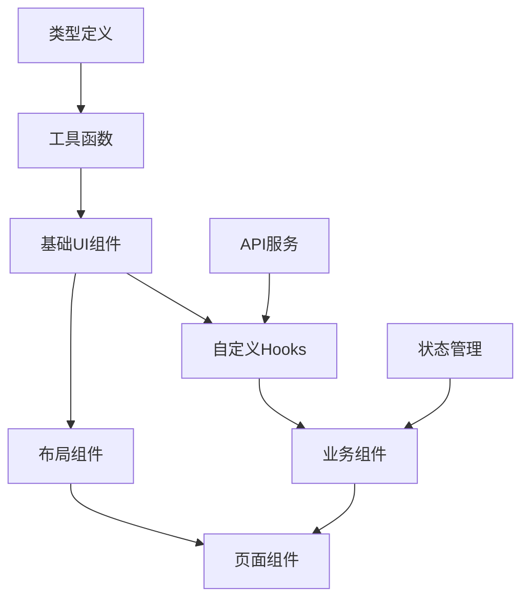

# 文件详细作用说明

## 🎯 每个文件的具体功能与职责

### 📁 配置文件层

#### `package.json`
- **作用**: 项目依赖管理和脚本配置
- **关键依赖**: Next.js 14+, React 18, TypeScript, Ant Design 5, TailwindCSS
- **脚本命令**: dev, build, start, lint, test
- **依赖关系**: 项目根基，所有代码的基础

#### `next.config.js`
```javascript
// 配置示例
/** @type {import('next').NextConfig} */
const nextConfig = {
  experimental: {
    appDir: true, // App Router 启用
  },
  images: {
    domains: ['example.com'], // 图片域名白名单
  },
  // TailwindCSS + Ant Design 样式优化
}
```

#### `tailwind.config.js`
- **作用**: TailwindCSS 配置，与 Ant Design 主题集成
- **关键配置**: 响应式断点、颜色变量、组件样式覆盖
- **集成策略**: 保持 Ant Design 组件样式，扩展工具类

### 📁 类型定义层 (src/types/)

#### `src/types/user.ts`
```typescript
// 用户业务类型定义
export interface User {
  id: string;
  name: string;
  email: string;
  role: 'admin' | 'user' | 'guest';
  status: 'active' | 'inactive' | 'pending';
  avatar?: string;
  createdAt: string;
  updatedAt: string;
}

export interface UserFilters {
  name?: string;
  email?: string;
  role?: User['role'];
  status?: User['status'];
}

export interface UserSearchParams {
  query?: string;
  filters?: UserFilters;
  pagination: PaginationParams;
  sorting?: SortConfig;
}
```

#### `src/types/table.ts`
```typescript
// 表格组件类型
export interface TableColumn<T> {
  key: string;
  title: string;
  dataIndex: keyof T;
  width?: number;
  sortable?: boolean;
  filterable?: boolean;
  render?: (value: any, record: T) => React.ReactNode;
  responsive?: ('xs' | 'sm' | 'md' | 'lg' | 'xl')[];
}

export interface TableProps<T> {
  data: T[];
  columns: TableColumn<T>[];
  loading?: boolean;
  pagination?: PaginationConfig;
  rowSelection?: RowSelectionConfig<T>;
  onRow?: (record: T) => any;
}
```

### 📁 工具函数层 (src/utils/)

#### `src/utils/cn.ts`
```typescript
// className 合并工具 (基于 clsx + tailwind-merge)
import { clsx, type ClassValue } from 'clsx';
import { twMerge } from 'tailwind-merge';

export function cn(...inputs: ClassValue[]) {
  return twMerge(clsx(inputs));
}

// 使用示例:
// cn('px-4 py-2', 'bg-blue-500', { 'text-white': isActive })
```

#### `src/utils/format.ts`
```typescript
// 格式化工具函数
export const formatDate = (date: string | Date) => {
  return new Intl.DateTimeFormat('zh-CN').format(new Date(date));
};

export const formatUserRole = (role: User['role']) => {
  const roleMap = {
    admin: '管理员',
    user: '普通用户',
    guest: '访客'
  };
  return roleMap[role];
};

export const formatFileSize = (bytes: number) => {
  const sizes = ['B', 'KB', 'MB', 'GB'];
  if (bytes === 0) return '0 B';
  const i = Math.floor(Math.log(bytes) / Math.log(1024));
  return Math.round(bytes / Math.pow(1024, i) * 100) / 100 + ' ' + sizes[i];
};
```

### 📁 基础UI组件层 (src/components/ui/)

#### `src/components/ui/Button.tsx`
```typescript
// 扩展 Ant Design Button
import { Button as AntButton, ButtonProps as AntButtonProps } from 'antd';
import { cn } from '@/utils/cn';

interface ButtonProps extends Omit<AntButtonProps, 'type'> {
  variant?: 'primary' | 'secondary' | 'danger' | 'ghost';
  size?: 'small' | 'medium' | 'large';
}

export const Button: React.FC<ButtonProps> = ({
  variant = 'primary',
  size = 'medium',
  className,
  children,
  ...props
}) => {
  const getAntType = () => {
    switch (variant) {
      case 'primary': return 'primary';
      case 'danger': return 'primary';
      case 'ghost': return 'text';
      default: return 'default';
    }
  };

  return (
    <AntButton
      type={getAntType()}
      size={size}
      danger={variant === 'danger'}
      className={cn(
        // TailwindCSS 自定义样式
        variant === 'secondary' && 'border-gray-300 text-gray-700',
        className
      )}
      {...props}
    >
      {children}
    </AntButton>
  );
};
```

#### `src/components/ui/Table.tsx`
```typescript
// 响应式表格组件
import { Table as AntTable, TableProps as AntTableProps } from 'antd';
import { useResponsive } from '@/hooks/useResponsive';

interface TableProps<T> extends AntTableProps<T> {
  responsiveColumns?: TableColumn<T>[];
  mobileCardRender?: (record: T) => React.ReactNode;
}

export const Table = <T extends Record<string, any>>({
  responsiveColumns,
  mobileCardRender,
  ...props
}: TableProps<T>) => {
  const { isMobile } = useResponsive();

  if (isMobile && mobileCardRender) {
    // 移动端卡片模式
    return (
      <div className="space-y-3">
        {props.dataSource?.map((record, index) => (
          <div key={index} className="bg-white p-4 rounded-lg shadow">
            {mobileCardRender(record)}
          </div>
        ))}
      </div>
    );
  }

  return (
    <AntTable
      {...props}
      columns={responsiveColumns || props.columns}
      scroll={{ x: 'max-content' }}
    />
  );
};
```

### 📁 布局组件层 (src/components/layout/)

#### `src/components/layout/AppLayout.tsx`
```typescript
// 主应用布局 - 参考 Cherry Studio 设计
import { Layout } from 'antd';
import { Header } from './Header';
import { Sidebar } from './Sidebar';
import { useResponsive } from '@/hooks/useResponsive';

const { Content } = Layout;

interface AppLayoutProps {
  children: React.ReactNode;
}

export const AppLayout: React.FC<AppLayoutProps> = ({ children }) => {
  const { isMobile } = useResponsive();
  const [sidebarCollapsed, setSidebarCollapsed] = useState(false);

  return (
    <Layout className="min-h-screen">
      <Header
        onMenuClick={() => setSidebarCollapsed(!sidebarCollapsed)}
        showMenuButton={isMobile}
      />

      <Layout>
        {!isMobile && (
          <Sidebar collapsed={sidebarCollapsed} />
        )}

        <Content className="p-6 bg-gray-50">
          <div className="max-w-7xl mx-auto">
            {children}
          </div>
        </Content>
      </Layout>

      {/* 移动端抽屉导航 */}
      {isMobile && (
        <MobileNav
          open={sidebarCollapsed}
          onClose={() => setSidebarCollapsed(false)}
        />
      )}
    </Layout>
  );
};
```

### 📁 自定义Hooks层 (src/hooks/)

#### `src/hooks/useUsers.ts`
```typescript
// 用户数据管理Hook
import { useState, useEffect } from 'react';
import { userService } from '@/services/userService';
import { useDebounce } from './useDebounce';

export const useUsers = () => {
  const [users, setUsers] = useState<User[]>([]);
  const [loading, setLoading] = useState(false);
  const [searchQuery, setSearchQuery] = useState('');
  const [filters, setFilters] = useState<UserFilters>({});
  const [pagination, setPagination] = useState({
    current: 1,
    pageSize: 10,
    total: 0
  });

  const debouncedSearchQuery = useDebounce(searchQuery, 300);

  const fetchUsers = async () => {
    setLoading(true);
    try {
      const response = await userService.getUsers({
        query: debouncedSearchQuery,
        filters,
        pagination: {
          page: pagination.current,
          pageSize: pagination.pageSize
        }
      });

      setUsers(response.data);
      setPagination(prev => ({
        ...prev,
        total: response.total
      }));
    } catch (error) {
      console.error('获取用户失败:', error);
    } finally {
      setLoading(false);
    }
  };

  useEffect(() => {
    fetchUsers();
  }, [debouncedSearchQuery, filters, pagination.current, pagination.pageSize]);

  return {
    users,
    loading,
    searchQuery,
    setSearchQuery,
    filters,
    setFilters,
    pagination,
    setPagination,
    refetch: fetchUsers
  };
};
```

#### `src/hooks/useResponsive.ts`
```typescript
// 响应式Hook
import { useState, useEffect } from 'react';

export const useResponsive = () => {
  const [screenSize, setScreenSize] = useState({
    width: 0,
    height: 0
  });

  useEffect(() => {
    const updateSize = () => {
      setScreenSize({
        width: window.innerWidth,
        height: window.innerHeight
      });
    };

    updateSize();
    window.addEventListener('resize', updateSize);
    return () => window.removeEventListener('resize', updateSize);
  }, []);

  return {
    ...screenSize,
    isMobile: screenSize.width < 768,
    isTablet: screenSize.width >= 768 && screenSize.width < 1024,
    isDesktop: screenSize.width >= 1024,
    breakpoint: screenSize.width < 768 ? 'mobile' :
                screenSize.width < 1024 ? 'tablet' : 'desktop'
  };
};
```

### 📁 业务组件层 (src/components/business/)

#### `src/components/business/UserTable.tsx`
```typescript
// 核心用户表格组件
export const UserTable: React.FC = () => {
  const {
    users,
    loading,
    searchQuery,
    setSearchQuery,
    filters,
    setFilters,
    pagination,
    setPagination
  } = useUsers();

  const { selectedRows, setSelectedRows } = useTable<User>();
  const { exportUsers } = useExport();

  const columns: TableColumn<User>[] = [
    {
      key: 'name',
      title: '姓名',
      dataIndex: 'name',
      sortable: true,
      responsive: ['sm', 'md', 'lg', 'xl']
    },
    {
      key: 'email',
      title: '邮箱',
      dataIndex: 'email',
      responsive: ['md', 'lg', 'xl']
    },
    // ... 更多列定义
  ];

  const mobileCardRender = (user: User) => (
    <div>
      <div className="font-medium">{user.name}</div>
      <div className="text-gray-500 text-sm">{user.email}</div>
      <div className="mt-2">
        <span className={cn(
          'px-2 py-1 rounded-full text-xs',
          user.status === 'active' ? 'bg-green-100 text-green-800' : 'bg-gray-100 text-gray-800'
        )}>
          {formatUserStatus(user.status)}
        </span>
      </div>
    </div>
  );

  return (
    <div className="space-y-4">
      {/* 搜索和筛选区域 */}
      <UserSearch value={searchQuery} onChange={setSearchQuery} />
      <UserFilters filters={filters} onChange={setFilters} />

      {/* 批量操作工具栏 */}
      {selectedRows.length > 0 && (
        <BatchOperations
          selectedCount={selectedRows.length}
          onExport={() => exportUsers(selectedRows)}
          onDelete={() => {/* 删除逻辑 */}}
        />
      )}

      {/* 主表格 */}
      <Table
        data={users}
        columns={columns}
        loading={loading}
        pagination={pagination}
        onPaginationChange={setPagination}
        rowSelection={{
          selectedRowKeys: selectedRows.map(r => r.id),
          onChange: setSelectedRows
        }}
        mobileCardRender={mobileCardRender}
      />
    </div>
  );
};
```

### 📁 页面层 (src/app/)

#### `src/app/layout.tsx`
```typescript
// 根布局组件
import { AntdRegistry } from '@ant-design/nextjs-registry';
import { ConfigProvider } from 'antd';
import zhCN from 'antd/locale/zh_CN';
import './globals.css';

export default function RootLayout({
  children,
}: {
  children: React.ReactNode;
}) {
  return (
    <html lang="zh-CN">
      <body>
        <AntdRegistry>
          <ConfigProvider
            locale={zhCN}
            theme={{
              token: {
                colorPrimary: '#1677ff',
                borderRadius: 6,
              },
            }}
          >
            <QueryProvider>
              <ThemeProvider>
                {children}
              </ThemeProvider>
            </QueryProvider>
          </ConfigProvider>
        </AntdRegistry>
      </body>
    </html>
  );
}
```

#### `src/app/users/page.tsx`
```typescript
// 用户列表页面
import { AppLayout } from '@/components/layout/AppLayout';
import { UserTable } from '@/components/business/UserTable';
import { PageHeader } from '@/components/ui/PageHeader';

export default function UsersPage() {
  return (
    <AppLayout>
      <PageHeader
        title="用户管理"
        subtitle="管理系统用户信息"
        actions={[
          <Button key="add" variant="primary">
            添加用户
          </Button>
        ]}
      />

      <div className="mt-6">
        <UserTable />
      </div>
    </AppLayout>
  );
}

// 页面元数据
export const metadata = {
  title: '用户管理 - AI Writer',
  description: '管理系统用户信息，支持搜索、筛选、批量操作',
};
```

## 🔄 组件间依赖关系



每个文件都有明确的职责边界，遵循单一职责原则，确保代码的可维护性和可测试性。